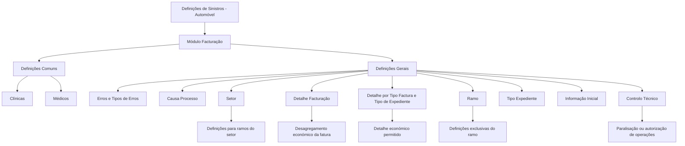

# Documentação de Definição de Sinistros (Automóvel) — Módulo Facturação

## 1. Metadados do Documento
- **Arquivo de Origem:** `Não informado`
- **Tipo de Documento:** `Especificação Funcional`
- **Domínio / Sistema:** `Definição de Sinistros (Automóvel) — Módulo Facturação`
- **Público-Alvo:** `Analistas funcionais, operação e equipas responsáveis pela configuração de faturação`
- **Data/Versão Identificada:** `Não identificada`

---

## 2. Resumo Executivo & Contexto de Negócio

O documento descreve definições funcionais necessárias para o módulo de faturação associado a sinistros de automóvel. O conteúdo organiza configurações que suportam a definição de peritagens e o tratamento de expedientes de faturação.

A camada **Comum** contém definições que não são exclusivas do módulo de sinistros, mas são necessárias para o processo de definição de peritagens. Nessa camada, o documento cita o registo de clínicas e médicos da companhia.

A camada **Geral** concentra definições que afetam todos os possíveis expedientes de faturação, incluindo a definição de erros e tipos de erros. O documento também apresenta conceitos aplicáveis ao setor e ao ramo, tais como causa de processo, detalhe de faturação, tipo de expediente, informação inicial e controlo técnico.

O objetivo funcional é permitir que a faturação seja configurada conforme critérios de negócio, incluindo despesas não amparadas, tipos de danos, desagregação económica das faturas, valores iniciais de atributos e condições para paralisação ou autorização obrigatória de operações de faturação.

> *Nota de Análise: O texto extraído apresenta tópicos funcionais e descrições resumidas. Não detalha interfaces, métodos HTTP, contratos JSON, persistência de dados, tecnologias de implementação ou responsabilidades por equipa.*

---

## 3. Arquitetura, Componentes & Tecnologias Envolvidas

O documento não descreve arquitetura técnica, integrações, servidores, tecnologias, APIs ou componentes de software implementados. A estrutura apresentada é funcional e organizada por níveis de definição aplicáveis ao módulo de faturação.

### Componentes e conceitos funcionais identificados

| Componente / Conceito | Descrição sustentada pelo documento |
| :--- | :--- |
| Módulo Facturação | Módulo associado à definição de sinistros de automóvel. |
| Definições Comuns | Definições não exclusivas do módulo de sinistros e necessárias para a definição de peritagens. |
| Clínicas | Registo de todas as clínicas da companhia. |
| Médicos | Registo de todos os médicos da companhia. |
| Definições Gerais | Definições que afetam todos os possíveis expedientes de faturação. |
| Erros e tipos de erros | Definição de erros e respetivos tipos, no nível geral. |
| Causa Processo | Catalogação de causas de gastos não amparados. |
| Setor | Definições exclusivas para todos os ramos do setor que está a ser definido. |
| Detalhe Facturação | Definição do desagregamento económico e detalhe da fatura. |
| Detalhe por Tipo Factura e Tipo de Expediente | Definição do detalhe económico permitido por tipo de fatura, tipo de expediente e atividade. |
| Ramo | Definições exclusivas do ramo em configuração. |
| Tipo Expediente | Definição dos tipos de danos utilizáveis pelo módulo de faturação. |
| Informação Inicial | Definição de valores iniciais para atributos da fatura. |
| Controlo Técnico | Definição das condições para paralisação de operações de faturação ou exigência de autorização. |



---

## 4. Regras de Negócio, Especificações Funcionais & Processos

### 4.1. Definições Comuns

1. As definições comuns não são exclusivas do módulo de sinistros.
2. As definições comuns são necessárias para realizar a definição de peritagens.
3. O documento menciona o registo de todas as clínicas da companhia.
4. O documento menciona o registo de todos os médicos da companhia.

### 4.2. Definições Gerais para Expedientes de Faturação

1. O nível geral contém definições que afetam todos os possíveis expedientes de faturação.
2. O nível geral contempla a definição de erros e de tipos de erros.

### 4.3. Causa Processo

1. A definição **Causa Processo** permite catalogar causas de gastos não amparados.
2. O documento também indica que estas causas são utilizadas para realizar operações para cada ramo.
3. Os gastos associados às causas de processo são descritos como gastos que não são cobertos.

### 4.4. Setor e Ramo

1. As definições de **Setor** são exclusivas para todos os ramos do setor que está a ser definido.
2. As definições de **Ramo** são exclusivas do ramo que está a ser definido.
3. O documento não especifica quais são os setores, ramos ou valores configuráveis.

### 4.5. Detalhe de Faturação

1. O **Detalhe Facturação** determina o desagregamento económico e o detalhe da fatura.
2. O documento apresenta como exemplos de detalhe de fatura: medicamentos, ressonância e honorários de anestesista.
3. O documento não define uma lista completa de detalhes, códigos, campos obrigatórios ou critérios de cálculo.

### 4.6. Detalhe por Tipo de Fatura, Tipo de Expediente e Atividade

1. A definição é condicionada por tipo de fatura, tipo de expediente e atividade.
2. Essa definição determina o desagregamento económico permitido e o detalhe permitido para a fatura.
3. Os exemplos apresentados são medicamentos, ressonância e honorários de anestesista.
4. O documento não enumera os tipos de fatura, tipos de expediente, atividades ou regras de compatibilidade.

### 4.7. Tipo de Expediente

1. O **Tipo Expediente** permite definir os tipos de danos que podem ser utilizados pelo módulo de faturação.
2. O documento não apresenta a lista de tipos de danos.

### 4.8. Informação Inicial

1. A **Informação Inicial** permite definir valores iniciais para atributos da fatura.
2. O documento não identifica quais atributos existem, quais valores iniciais são permitidos ou se os valores podem ser alterados posteriormente.

### 4.9. Controlo Técnico

1. O **Controlo Técnico** define as condições nas quais as operações de faturação podem ser paralisadas.
2. O **Controlo Técnico** também define as condições nas quais uma operação de faturação tem de ser autorizada.
3. O documento não especifica os critérios concretos, os perfis autorizadores, os estados operacionais ou o fluxo de aprovação.

---

## 5. Tabelas de Parâmetros, Ambientes e Estruturas de Dados

| Item / Parâmetro | Descrição / Função | Tipo / Valores / Formato | Ambiente / Observações |
| :--- | :--- | :--- | :--- |
| Clínicas | Permite registar todas as clínicas da companhia. | Não especificado. | Definição comum; necessária para definição de peritagens. |
| Médicos | Permite registar todos os médicos da companhia. | Não especificado. | Definição comum; necessária para definição de peritagens. |
| Erros | Permite a definição de erros. | Não especificado. | Aplicável a todos os possíveis expedientes de faturação. |
| Tipos de erros | Permite a definição de tipos de erros. | Não especificado. | Aplicável a todos os possíveis expedientes de faturação. |
| Causa Processo | Cataloga causas de gastos não amparados. | Não especificado. | Associada a operações por ramo; os gastos não são cobertos. |
| Setor | Agrupa definições exclusivas para todos os ramos do setor em definição. | Não especificado. | O documento não lista setores ou ramos. |
| Detalhe Facturação | Determina o desagregamento económico e o detalhe da fatura. | Exemplos: medicamentos, ressonância, honorários de anestesista. | O documento não define códigos, estrutura ou obrigatoriedade. |
| Tipo Factura | Participa na determinação do detalhe económico permitido. | Não especificado. | Utilizado com tipo de expediente e atividade. |
| Tipo Expediente | Define tipos de danos utilizáveis pelo módulo de faturação. | Não especificado. | Também participa na determinação do detalhe económico permitido. |
| Atividade | Participa na determinação do detalhe económico permitido. | Não especificado. | Não são fornecidos valores possíveis. |
| Detalhe por Tipo Factura e Tipo de Expediente | Determina o detalhe económico permitido para a fatura. | Exemplos: medicamentos, ressonância, honorários de anestesista. | Condicionado por tipo de fatura, tipo de expediente e atividade. |
| Ramo | Contém definições exclusivas do ramo em definição. | Não especificado. | Inclui referência a causa de processo. |
| Informação Inicial | Define valores iniciais para atributos da fatura. | Não especificado. | Atributos não identificados no texto. |
| Controlo Técnico | Define condições para paralisação ou autorização obrigatória de operações de faturação. | Não especificado. | Critérios e aprovadores não detalhados. |

---

## 6. Bateria de Perguntas & Respostas para RAG (FAQ Sintético)

### P1: Qual é a finalidade das definições comuns no módulo de faturação?
**R:** As definições comuns são configurações que não são exclusivas do módulo de sinistros, mas são necessárias para realizar a definição de peritagens. O documento cita como exemplos o registo de clínicas e de médicos da companhia.

### P2: O que deve ser registado nas definições comuns?
**R:** O documento indica que devem ser registadas todas as clínicas da companhia e todos os médicos da companhia. Não são apresentados campos, identificadores, formatos ou regras de validação para esses registos.

### P3: Quais definições afetam todos os possíveis expedientes de faturação?
**R:** O nível geral contém definições que afetam todos os possíveis expedientes de faturação. Entre os elementos explicitamente citados estão a definição de erros e tipos de erros.

### P4: Para que serve a configuração Causa Processo?
**R:** A configuração Causa Processo permite catalogar as causas de gastos não amparados. O texto também associa essas causas à realização de operações para cada ramo e esclarece que são gastos não cobertos.

### P5: Qual é a diferença entre Setor e Ramo no documento?
**R:** As definições de Setor são exclusivas para todos os ramos do setor que está a ser definido. As definições de Ramo são exclusivas do ramo que está a ser definido. O documento não informa quais setores ou ramos existem nem como são relacionados.

### P6: O que é determinado pelo Detalhe Facturação?
**R:** O Detalhe Facturação determina o desagregamento económico e o detalhe da fatura. O documento apresenta como exemplos medicamentos, ressonância e honorários de anestesista.

### P7: Como é definido o detalhe económico permitido de uma fatura?
**R:** O detalhe económico permitido é determinado pela combinação de tipo de fatura, tipo de expediente e atividade. Essa definição estabelece o desagregamento económico permitido e o detalhe da fatura, com exemplos como medicamentos, ressonância e honorários de anestesista.

### P8: Qual é a finalidade do Tipo Expediente?
**R:** O Tipo Expediente permite definir os tipos de danos que podem ser utilizados pelo módulo de faturação. O documento não apresenta a lista dos tipos de danos configuráveis.

### P9: O que pode ser configurado em Informação Inicial?
**R:** A Informação Inicial permite definir valores iniciais para atributos da fatura. O texto não identifica os atributos existentes, os valores permitidos ou regras para alteração dos valores iniciais.

### P10: Em que casos uma operação de faturação pode ser paralisada?
**R:** Uma operação de faturação pode ser paralisada nas condições definidas no Controlo Técnico. O documento não descreve quais condições específicas causam a paralisação.

### P11: Quando uma operação de faturação exige autorização?
**R:** Uma operação de faturação exige autorização nas condições definidas no Controlo Técnico. O documento não informa os critérios de autorização, os perfis responsáveis ou as etapas do fluxo de aprovação.

### P12: O documento especifica tecnologias, APIs ou contratos de integração do módulo de faturação?
**R:** Não. O conteúdo fornecido descreve definições funcionais do módulo de faturação, mas não especifica tecnologias, APIs, métodos HTTP, contratos JSON, bases de dados, URLs, ambientes ou integrações técnicas.

---

## 7. Glossário de Termos, Siglas & Conceitos-Chave

- **Causa Processo:** Configuração para catalogar causas de gastos não amparados ou não cobertos.
- **Controlo Técnico:** Definição das condições para paralisação de operações de faturação ou exigência de autorização.
- **Definições Comuns:** Definições não exclusivas do módulo de sinistros, necessárias para a definição de peritagens.
- **Detalhe Facturação:** Definição do desagregamento económico e do detalhe da fatura.
- **Expediente:** Termo utilizado pelo documento para referir contextos ou processos de faturação; não possui definição adicional no texto.
- **Faturação:** Módulo e processo relacionado com faturas, respetivos atributos, detalhe económico, controlo e autorização.
- **Informação Inicial:** Definição de valores iniciais para atributos da fatura.
- **Peritagens:** Processo mencionado como dependente das definições comuns; sem detalhamento adicional no texto.
- **Ramo:** Nível com definições exclusivas do ramo que está a ser definido.
- **Setor:** Nível com definições exclusivas aplicáveis a todos os ramos do setor em definição.
- **Tipo Expediente:** Configuração que define os tipos de danos utilizáveis pelo módulo de faturação.

---

## 8. Notas Críticas, Riscos & Limitações

- O documento não identifica arquivo de origem, autor, data, versão, organização responsável ou histórico de alterações.
- O conteúdo não apresenta arquitetura técnica, integrações, APIs, tecnologias, bancos de dados, servidores, URLs, ambientes ou mecanismos de autenticação.
- Não são descritos os campos, formatos, regras de obrigatoriedade ou validações para clínicas, médicos, faturas, tipos de erro, setores, ramos ou tipos de expediente.
- O documento cita gastos não amparados, mas não define regras de elegibilidade, cobertura, cálculo, aprovação ou tratamento contabilístico.
- O Controlo Técnico é citado sem critérios operacionais, perfis autorizadores, estados de processo ou fluxo de escalonamento.
- Os exemplos de detalhe de fatura — medicamentos, ressonância e honorários de anestesista — não constituem uma lista exaustiva segundo o texto.
- A extração contém fragmentos com quebra de continuidade entre páginas, incluindo a descrição de **Causa Processo** no nível de ramo.

---

## 9. Conteúdo Bruto Estruturado (Referência Fiel)

```text
--- [PÁGINA 1 DE 3] ---

DOCUMENTACIÓN de DEFINICIÓN de
SINIESTROS (Automóvil)
DEFINICIONES - Módulo Facturación
DEFINICIONES
COMÚN
En este nivel se encuentran definiciones que NO son exclusivas del
módulo de siniestros, pero son necesarias para poder realizar la
definición de peritaciones. En otros se encuentran:
CLÍNICAS
Registrar todas los clínicas de la compañía
MÉDICOS
Registrar todos los médicos de la compañía
CONTROL TÉCNICO
 /
 CF
Home Solutions APIs Documentation Zeus
EN


--- [PÁGINA 2 DE 3] ---

Definición de errores, tipos de Errores
GENERAL
En este nivel se encuentran definiciones que afectarán a todos los
posibles expedientes de facturación
CAUSA PROCESO
Permite catalogar los causas de los gastos no amparados
SECTOR
Son exclusivas para todos los ramos del sector que se está definiendo
DETALLE FACTURACIÓN
Determinar el desglose económico, el detalle
de la factura . Por ejemplo medicinas,
resonancia, honorarios anestesista...
DETALLE POR TIPO FACTURA Y TIPO DE
EXPEDIENTE
Determina por tipo de factura, tipo de
expediente y actividad, el desglose
económico permitido, el detalle de la factura .
Por ejemplo medicinas, resonancia,
honorarios anestesista...
RAMO
Son exclusivas del ramo que se está definiendo
CAUSA PROCESO
Permite catalogar las causas de gastos no
amparados por los que se quiere realizar las
TIPO EXPEDIENTE
Permite definir los Tipos de Daños que va a
poder utilizar el módulo de facturación


--- [PÁGINA 3 DE 3] ---

operaciones para cada ramo. Estos son
gastos que no se cubren
INFORMACIÓN INICIAL
Permite definir valores iniciales para atributos
de la factura
CONTROL TÉCNICO
Definir en qué condiciones se puede paralizar
las operaciones de facturación u obligación de
ser autorizada
```
