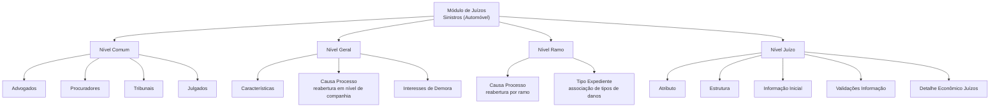

# Definições do Módulo de Juízos — Sinistros (Automóvel)

## 1. Metadados do Documento
- **Arquivo de Origem:** `Não identificado no conteúdo fornecido`
- **Tipo de Documento:** `Especificação Funcional`
- **Domínio / Sistema:** `Sinistros (Automóvel) — Módulo Juízos`
- **Público-Alvo:** `Analistas funcionais, configuradores, operação e equipes de sinistros`
- **Data/Versão Identificada:** `Não identificada`

---

## 2. Resumo Executivo & Contexto de Negócio

O documento descreve as definições necessárias para configurar o módulo de juízos no contexto de sinistros de automóvel. As definições são organizadas por níveis de aplicação: comum, geral, ramo e juízo. Essa organização separa cadastros compartilhados, regras válidas para todos os expedientes com juízos, configurações específicas por ramo e definições próprias do processo judicial.

No nível comum, o módulo requer a definição dos participantes e entidades externas que trabalharão com a companhia: advogados, procuradores, tribunais e julgados. Esses cadastros não são exclusivos do módulo de sinistros, mas são pré-requisitos para realizar a definição de juízos.

No nível geral, o documento indica configurações que afetam todos os expedientes com juízos. Essas configurações incluem características gerais do módulo, causas de processo para reabertura de juízos no âmbito da companhia e tipos de juros de mora aplicáveis aos juízos.

No nível de ramo, as definições são exclusivas do ramo configurado. O documento prevê causas de processo para reabertura de um juízo por ramo e tipos de expediente para associar tipos de danos a um juízo. No nível de juízo, são definidos atributos, estruturas de informação, dados iniciais padrão, validações da informação principal e o detalhamento econômico dos juízos.

---

## 3. Arquitetura, Componentes & Tecnologias Envolvidas

O conteúdo descreve uma estrutura funcional de configuração do módulo de juízos, composta por quatro níveis: **Comum**, **Geral**, **Ramo** e **Juízo**. Não há tecnologias, protocolos, APIs, bases de dados, URLs, ambientes, servidores ou contratos de integração detalhados no documento.



**Nota de Análise:** O documento menciona a navegação “Home Solutions APIs Documentation Zeus EN”, mas não fornece detalhamento que permita caracterizar esse item como sistema integrante, API, tecnologia ou dependência do módulo de juízos.

---

## 4. Regras de Negócio, Especificações Funcionais & Processos

### 4.1. Definições comuns

As definições comuns não são exclusivas do módulo de sinistros, mas são necessárias para realizar a definição do módulo de juízos.

1. **Advogados**
   - Devem ser definidos os advogados que trabalharão com a companhia.

2. **Procuradores**
   - Devem ser definidos os procuradores que trabalharão com a companhia.

3. **Tribunais**
   - Devem ser definidos os tribunais que trabalharão com a companhia.

4. **Julgados**
   - Devem ser definidos os julgados que trabalharão com a companhia.

### 4.2. Definições gerais

As definições gerais afetam todos os expedientes com juízos.

1. **Características**
   - Configuram as características gerais do módulo de sinistros.
   - Determinam comportamentos do módulo de juízos.
   - O documento apresenta como exemplo a definição sobre permitir mais de um sinistro em um juízo.

2. **Causa Processo — nível de companhia**
   - Permite catalogar os motivos pelos quais se deseja reabrir um juízo no nível da companhia.

3. **Interesses de Demora**
   - Permite definir os distintos tipos de juros de mora para os juízos.

### 4.3. Definições por ramo

As definições de ramo são exclusivas do ramo que está sendo configurado.

1. **Causa Processo — nível de ramo**
   - Permite catalogar os motivos pelos quais se deseja realizar a reabertura de um juízo para cada ramo.

2. **Tipo Expediente**
   - Permite definir os tipos de danos aos quais será associado um juízo.

### 4.4. Definições do juízo

1. **Atributo**
   - Permite definir a informação adicional necessária em cada instalação de juízos.

2. **Estrutura**
   - Define informação adicional do juízo composta por atributos.
   - Define se a solicitação de cada informação é obrigatória ou não.
   - Define a ordem em que as informações serão solicitadas.

3. **Informação Inicial**
   - Permite registrar informação padrão e inicial referente às informações de núcleo das operações de juízo.
   - O objetivo indicado é evitar a necessidade de introduzir posteriormente essa informação.

4. **Validações Informação**
   - Permite definir comportamentos e validações sobre a informação principal dos juízos.

5. **Detalhe Econômico Juízos**
   - Determina o detalhamento econômico dos juízos.
   - O documento cita como exemplos consignações judiciais e honorários de advogado.

---

## 5. Tabelas de Parâmetros, Ambientes e Estruturas de Dados

| Item / Parâmetro | Descrição / Função | Tipo / Valores / Formato | Ambiente / Observações |
| :--- | :--- | :--- | :--- |
| Advogados | Define os advogados que trabalharão com a companhia. | Cadastro de entidade. | Definição comum; não exclusiva do módulo de sinistros. |
| Procuradores | Define os procuradores que trabalharão com a companhia. | Cadastro de entidade. | Definição comum; não exclusiva do módulo de sinistros. |
| Tribunais | Define os tribunais que trabalharão com a companhia. | Cadastro de entidade. | Definição comum; não exclusiva do módulo de sinistros. |
| Julgados | Define os julgados que trabalharão com a companhia. | Cadastro de entidade. | Definição comum; não exclusiva do módulo de sinistros. |
| Características | Determina comportamentos gerais do módulo de juízos. | Características gerais do módulo. | Afeta todos os expedientes com juízos. |
| Mais de um sinistro em um juízo | Exemplo de comportamento controlado por características gerais. | Permissão ou restrição; formato não detalhado. | O documento não informa o valor padrão nem a regra completa de validação. |
| Causa Processo — companhia | Cataloga motivos para reabertura de um juízo em nível de companhia. | Catálogo de motivos. | Definição geral; afeta todos os expedientes com juízos. |
| Interesses de Demora | Define distintos tipos de juros de mora para juízos. | Tipos de juros de mora. | Definição geral. |
| Causa Processo — ramo | Cataloga motivos para reabertura de um juízo para cada ramo. | Catálogo de motivos. | Exclusivo do ramo configurado. |
| Tipo Expediente | Define tipos de danos que serão associados a um juízo. | Tipos de danos. | Exclusivo do ramo configurado. |
| Atributo | Define informação adicional necessária em cada instalação de juízos. | Atributo configurável. | Definição de juízo. |
| Estrutura | Organiza atributos, obrigatoriedade e ordem de solicitação das informações. | Estrutura composta por atributos. | Definição de juízo. |
| Informação Inicial | Registra informação padrão e inicial das operações de juízo. | Informação de núcleo; formato não detalhado. | Evita introdução posterior de informação. |
| Validações Informação | Define comportamentos e validações da informação de núcleo dos juízos. | Regras de validação; formato não detalhado. | Definição de juízo. |
| Detalhe Econômico Juízos | Determina o desdobramento econômico dos juízos. | Componentes econômicos. | Exemplos: consignações judiciais e honorários de advogado. |

---

## 6. Bateria de Perguntas & Respostas para RAG (FAQ Sintético)

### P1: Quais níveis de definição compõem a configuração do módulo de juízos de sinistros?
**R:** O módulo de juízos é organizado nos níveis Comum, Geral, Ramo e Juízo. O nível Comum contém cadastros necessários e não exclusivos do módulo de sinistros; o nível Geral afeta todos os expedientes com juízos; o nível Ramo contém definições exclusivas de cada ramo; e o nível Juízo concentra atributos, estrutura de informações, informação inicial, validações e detalhamento econômico.

### P2: Quais entidades devem ser definidas no nível comum do módulo de juízos?
**R:** O nível comum prevê a definição de advogados, procuradores, tribunais e julgados que trabalharão com a companhia. O documento informa que essas definições não são exclusivas do módulo de sinistros, mas são necessárias para configurar os juízos.

### P3: O que as características gerais controlam no módulo de juízos?
**R:** As características gerais determinam comportamentos do módulo de juízos dentro do módulo de sinistros. O documento cita como exemplo a possibilidade de permitir mais de um sinistro em um juízo, mas não detalha os valores configuráveis, o valor padrão ou critérios adicionais.

### P4: Qual é a diferença entre Causa Processo no nível de companhia e no nível de ramo?
**R:** A Causa Processo no nível de companhia cataloga motivos para reabrir um juízo em âmbito corporativo. A Causa Processo no nível de ramo cataloga os motivos para realizar a reabertura de um juízo especificamente para cada ramo configurado.

### P5: Para que servem os Interesses de Demora?
**R:** Interesses de Demora permitem definir os distintos tipos de juros de mora aplicáveis aos juízos. O documento não detalha fórmulas de cálculo, percentuais, períodos, regras de incidência ou fontes de taxa.

### P6: Como um tipo de dano é associado a um juízo?
**R:** A associação é definida por meio do Tipo Expediente, uma configuração exclusiva do ramo que está sendo definido. O Tipo Expediente permite definir os tipos de danos aos quais será associado um juízo.

### P7: O que é um atributo na configuração de juízos?
**R:** Um atributo permite definir informação adicional necessária em cada instalação de juízos. O documento não especifica quais atributos existem, seus tipos de dados ou valores possíveis.

### P8: O que a estrutura de um juízo controla?
**R:** A estrutura controla a informação adicional do juízo composta por atributos, determina se cada informação deve ser obrigatoriamente solicitada e estabelece a ordem em que as informações serão solicitadas.

### P9: Qual é a finalidade da Informação Inicial?
**R:** A Informação Inicial permite registrar previamente informação padrão e inicial referente às informações de núcleo das operações de juízo. A finalidade é evitar que essa informação tenha de ser introduzida posteriormente.

### P10: O que deve ser configurado em Validações Informação?
**R:** Validações Informação permite definir comportamentos e validações sobre a informação de núcleo dos juízos. O documento não descreve regras de validação específicas, mensagens de erro, campos validados ou condições de aprovação e reprovação.

### P11: O que compõe o Detalhe Econômico de Juízos?
**R:** O Detalhe Econômico de Juízos determina o desdobramento econômico dos juízos. O documento fornece como exemplos consignações judiciais e honorários de advogado, sem apresentar uma lista completa de componentes econômicos.

---

## 7. Glossário de Termos, Siglas & Conceitos-Chave

- **Causa Processo:** Catálogo de motivos para reabrir um juízo, configurável em nível de companhia ou por ramo.
- **Características:** Configurações gerais que determinam comportamentos do módulo de juízos.
- **Detalhe Econômico Juízos:** Desdobramento econômico aplicável aos juízos, incluindo exemplos como consignações judiciais e honorários de advogado.
- **Expediente:** Termo utilizado para os registros afetados por configurações gerais de juízos; o documento não fornece definição adicional.
- **Informação Inicial:** Informação padrão e inicial das operações de juízo, registrada para evitar preenchimento posterior.
- **Interesses de Demora:** Tipos de juros de mora definidos para os juízos.
- **Juízo:** Objeto ou módulo para o qual são configurados atributos, informações, validações e detalhamento econômico; o documento não fornece definição adicional.
- **Ramo:** Escopo de configuração cujas definições são exclusivas do ramo definido.
- **Tipo Expediente:** Definição que associa tipos de danos a um juízo.

---

## 8. Notas Críticas, Riscos & Limitações

- O documento não identifica arquivo de origem, data, versão, autoria, ambiente, sistema proprietário ou responsável funcional/técnico.
- Não há especificação de campos, tipos de dados, formatos, valores permitidos, obrigatoriedades concretas, permissões de acesso ou telas de configuração.
- O documento não informa APIs, contratos JSON, métodos HTTP, integrações, URLs, servidores, portas, repositórios, logs ou procedimentos de operação.
- A regra citada sobre permitir mais de um sinistro em um juízo é apresentada somente como exemplo de comportamento; não há definição da regra efetiva, valor padrão ou impacto operacional.
- Não há fórmulas, critérios de cálculo, periodicidade ou regras de incidência para os interesses de demora.
- Não há lista completa dos componentes do detalhe econômico; consignações judiciais e honorários de advogado são apenas exemplos.
- **Nota de Análise:** O documento lista os elementos funcionais do módulo de juízos, mas não detalha os métodos, contratos, fluxos de aprovação, mecanismos de persistência ou validações concretas associados a esses elementos.

---

## 9. Conteúdo Bruto Estruturado (Referência Fiel)

```text
--- [PÁGINA 1 DE 3] ---

DOCUMENTACIÓN de DEFINICIÓN de
SINIESTROS (Automóvil)
DEFINICIONES - MÓDULO JUICIOS
COMÚN
En este nivel se encuentran definiciones que NO son exclusivas del
módulo de siniestros, pero son necesarias para poder realizar la
definición. Entre otras definiciones se encuentra:
ABOGADOS
Definir los abogados que van a trabajar con la
compañía
PROCURADORES
Definir los procuradores que van a trabajar
con la compañía
TRIBUNALES
 JUZGADO
 / 
 CF
Home Solutions APIs Documentation Zeus
EN


--- [PÁGINA 2 DE 3] ---

Definir los tribunales que van a trabajar con la
compañía
Definir los juzgados que van a trabajar con la
compañía
GENERAL
En este nivel se encuentran definiciones que afectarán a todos los
expedientes con juicios.
CARACTERÍSTICAS 
Características Generales del módulo de
siniestros, determina comportamientos del
módulo de juicios por ejemplo si se permite
más de un siniestro en un juicio
CAUSA PROCESO 
Permite catalogar los motivos por los que se
quiere re-aperturar un juicio a nivel de
compañía
INTERESES DE DEMORA
Permite definir los Tipos distintos tipos de
interés de demora para los juicios
RAMO
Son exclusivas del ramo que se está definiendo.
CAUSA PROCESO 
Permite catalogar los motivos por los que se
quiere realizar la reapertura de un juicio para
cada ramo
TIPO EXPEDIENTE 
Permite definir los Tipos de Daños a los que
se le va a asociar un juicio
JUICIO
Definiciones de juicios


--- [PÁGINA 3 DE 3] ---

ATRIBUTO
Permite definir la información adicional que se
necesite en cada instalación de los juicios.
ESTRUCTURA
Información adicional del juicio compuesta por
atributos, obligatoriedad o no de pedir
información, orden en el que se va a pedir
INFORMACIÓN INICIAL 
Permite registrar información por defecto,
inicial de la información de core de las
operaciones de juicio, para no tener que
introducirla posteriormente
VALIDACIONES INFORMACIÓN 
Definir comportamientos y validaciones de la
información de core, de juicios
DETALLE ECONÓMICO JUICIOS
Determinar el desglose económico de los
juicios. Por ejemplo consignaciones judiciales
u honorarios abogado...
```
