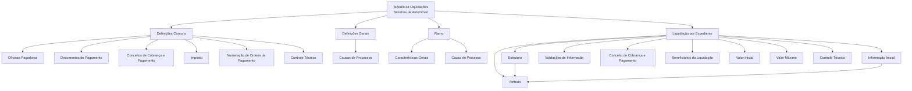

# Definições do Módulo de Liquidações de Sinistros de Automóvel

## 1. Metadados do Documento
- **Arquivo de Origem:** Não identificado; conteúdo bruto fornecido na solicitação.
- **Tipo de Documento:** Especificação Funcional.
- **Domínio / Sistema:** Sinistros de Automóvel — módulo de Liquidações.
- **Público-Alvo:** Analistas funcionais, desenvolvedores, arquitetos e equipes de operação.
- **Data/Versão Identificada:** Não identificada.

---

## 2. Resumo Executivo & Contexto de Negócio

O documento descreve definições funcionais para o módulo de **Liquidações** no contexto de **Sinistros de Automóvel**. O conteúdo organiza os elementos de parametrização necessários para registrar, controlar, validar e executar operações de liquidação vinculadas a expedientes de sinistro.

A estrutura apresentada separa definições comuns, aplicáveis além do módulo de sinistros, de definições gerais, por ramo e específicas de cada liquidação. Essa organização indica que o módulo depende de cadastros transversais, como oficinas pagadoras, documentos de pagamento, conceitos de cobrança e pagamento, impostos, numeração de ordens de pagamento e controle técnico.

No nível de liquidação, o documento define mecanismos para capturar informações adicionais por atributos e estruturas, pré-preencher dados por valores iniciais e validar informações solicitadas durante as operações. Um exemplo explícito de validação impede que o fornecedor de uma fatura seja o tomador ou o segurado quando o documento for classificado como Real.

O material também estabelece controles financeiros para conceitos de reserva e conceitos variados de cobrança e pagamento, incluindo valores iniciais, valores máximos e detalhamento econômico. Não há detalhamento de interfaces, serviços, métodos HTTP, persistência de dados, contratos JSON, URLs, tecnologias de implementação ou procedimentos operacionais executáveis.

---

## 3. Arquitetura, Componentes & Tecnologias Envolvidas

O documento apresenta uma arquitetura funcional e hierárquica de parametrizações do módulo de Liquidações. Não são citadas tecnologias, microsserviços, bancos de dados, APIs, ambientes, servidores ou ferramentas de implantação.

### Componentes funcionais identificados

| Componente | Escopo | Função descrita |
| :--- | :--- | :--- |
| Definições Comuns | Transversal ao módulo de sinistros | Reúne definições não exclusivas de sinistros, mas necessárias para realizar definições de liquidações. |
| Oficinas Pagadoras | Definições Comuns | Registra oficinas que podem realizar pagamentos. |
| Documentos de Pagamento | Definições Comuns | Registra documentos que podem ser pagos ou cobrados, como fatura e nota de crédito. |
| Conceitos de Cobrança e Pagamento | Definições Comuns / Liquidação | Define o detalhamento econômico associado a ordens de pagamento e liquidações. |
| Imposto | Definições Comuns | Define tipos de obrigações tributárias, características e formas de cálculo. |
| Numeração de Ordens de Pagamento | Definições Comuns | Define o conjunto ou “saco” de ordens de pagamento. |
| Controle Técnico | Definições Comuns / Liquidação | Define erros, tipos de erros e condições de paralisação ou autorização de operações. |
| Definições Gerais | Geral | Reúne definições que afetam todas as liquidações. |
| Causas de Processos | Geral | Cataloga motivos para realizar uma operação de liquidações. |
| Ramo | Ramo | Reúne definições que afetam liquidações do ramo. |
| Características Gerais | Ramo | Determina comportamentos do módulo de liquidações, como registrar ou não faturas de sinistros. |
| Causa de Processo | Ramo | Cataloga motivos de operação, por exemplo, anulação de uma liquidação. |
| Liquidação | Expediente de sinistro | Agrupa definições aplicáveis a cada possível liquidação de um expediente. |
| Atributo | Liquidação | Define informação adicional da liquidação, como dados de quitação. |
| Estrutura | Liquidação | Organiza informações adicionais compostas por atributos, obrigatoriedade e ordem de solicitação. |
| Informação Inicial | Liquidação | Registra valores prévios para atributos, evitando inserção posterior. |
| Validações de Informação | Liquidação | Define comportamentos e validações para informações core solicitadas nas operações. |
| Beneficiários da Liquidação | Liquidação | Determina pessoas físicas e jurídicas que podem receber ou pagar uma liquidação. |
| Valor Inicial | Liquidação | Define o valor para liquidar conceito de reserva e conceito variado de cobrança e pagamento. |
| Valor Máximo | Liquidação | Define o importe máximo para liquidar cobertura, conceito de reserva ou conceito variado de cobrança e pagamento. |



> **Nota de Análise:** O diagrama representa a hierarquia funcional explicitamente apresentada no conteúdo. O documento não detalha integrações técnicas, protocolos, interfaces ou fluxo transacional entre componentes.

---

## 4. Regras de Negócio, Especificações Funcionais & Processos

### 4.1 Definições comuns

As definições comuns não são exclusivas do módulo de sinistros, mas são necessárias para efetuar a definição de liquidações.

1. **Oficinas Pagadoras**
   - Devem ser registradas as oficinas habilitadas a realizar pagamentos.

2. **Documentos de Pagamento**
   - Devem ser registrados os documentos que podem ser pagos ou cobrados.
   - O documento cita como exemplos uma **fatura** e uma **nota de crédito**.

3. **Conceitos de Cobrança e Pagamento**
   - Devem definir o detalhamento econômico transportado pelas ordens de pagamento para detalhar o gasto.
   - No nível de liquidação, o conceito de cobrança e pagamento determina o detalhamento econômico das liquidações.

4. **Imposto**
   - Devem ser definidos os tipos de obrigações tributárias a considerar.
   - Cada obrigação tributária deve incluir suas características e formas de cálculo.
   - O documento não especifica tipos de imposto, fórmulas, alíquotas ou regras tributárias concretas.

5. **Numeração de Ordens de Pagamento**
   - Deve ser definido o “saco” ou conjunto de ordens de pagamento.
   - O documento não descreve formato, sequência, prefixos, reinicialização ou mecanismo de geração da numeração.

6. **Controle Técnico**
   - Deve definir erros e tipos de erros.
   - Também deve estabelecer condições em que operações de liquidação podem ser paralisadas ou exigem autorização.

### 4.2 Definições gerais aplicáveis a todas as liquidações

1. **Causas de Processos**
   - Devem catalogar os motivos pelos quais se deseja realizar uma operação de liquidações.

2. **Características Gerais do módulo de sinistros**
   - Determinam comportamentos do módulo de liquidações.
   - O documento cita como exemplo a decisão de registrar ou não as faturas de sinistros.
   - Não são fornecidos valores de configuração, responsáveis pela parametrização ou efeitos completos de cada comportamento.

### 4.3 Definições aplicáveis ao ramo

1. **Causa de Processo**
   - Cataloga motivos para a realização de uma operação.
   - O documento cita como exemplo o motivo para a anulação de uma liquidação.

### 4.4 Definições aplicáveis a cada liquidação de expediente

1. **Atributo**
   - Permite definir informação adicional da liquidação.
   - O documento cita como exemplo dados de quitação.

2. **Estrutura**
   - Representa informação adicional da liquidação composta por atributos.
   - A estrutura define:
     - atributos integrantes;
     - obrigatoriedade ou não de solicitar informação;
     - ordem em que a informação será solicitada.

3. **Informação Inicial**
   - Permite registrar informação prévia para atributos das operações de liquidações.
   - O objetivo é evitar a necessidade de inserir posteriormente a mesma informação.
   - Exemplo: atribuir inicialmente à moeda de uma fatura o valor da moeda do país.

4. **Validações de Informação**
   - Definem comportamentos e validações das informações core solicitadas nas operações de liquidações.
   - Regra explicitamente descrita:
     - **Se o documento for Real, o fornecedor da fatura não pode ser o tomador nem o segurado.**

5. **Beneficiários da Liquidação**
   - Determinam as pessoas físicas e jurídicas às quais uma liquidação pode ser paga ou cobradas.

6. **Valor Inicial**
   - Define o importe com que será liquidado:
     - o conceito de reserva;
     - o conceito variado de cobrança e pagamento.

7. **Valor Máximo**
   - Determina o importe máximo pelo qual pode ser liquidado:
     - uma cobertura;
     - um conceito de reserva;
     - um conceito variado de cobrança e pagamento.

8. **Controle Técnico**
   - Define as condições em que as operações de liquidação podem:
     - ser paralisadas;
     - ter autorização obrigatória.

---

## 5. Tabelas de Parâmetros, Ambientes e Estruturas de Dados

| Item / Parâmetro | Descrição / Função | Tipo / Valores / Formato | Ambiente / Observações |
| :--- | :--- | :--- | :--- |
| Oficina Pagadora | Registra oficinas que podem realizar pagamentos. | Cadastro de oficina. | Nenhum ambiente informado. |
| Documento de Pagamento | Registra documento que pode ser pago ou cobrado. | Exemplos: fatura; nota de crédito. | O documento não define classificações completas. |
| Conceito de Cobrança e Pagamento | Define detalhamento econômico de ordens de pagamento e liquidações. | Conceito econômico. | Aplicável a ordens de pagamento e liquidações. |
| Imposto | Define obrigações tributárias, características e formas de cálculo. | Tipo de obrigação tributária e regra de cálculo. | Fórmulas e alíquotas não detalhadas. |
| Numeração de Ordens de Pagamento | Define o conjunto de ordens de pagamento. | Numeração de ordens. | Formato e geração não detalhados. |
| Erro | Elemento definido pelo controle técnico. | Erro e tipo de erro. | Catálogo e severidade não informados. |
| Causa de Processo | Cataloga motivo para uma operação de liquidações. | Motivo de operação. | Exemplo: motivo para anulação de liquidação. |
| Característica Geral | Determina comportamento do módulo de liquidações. | Configuração funcional. | Exemplo: registrar ou não faturas de sinistros. |
| Atributo | Define informação adicional da liquidação. | Dado adicional. | Exemplo: dados de quitação. |
| Estrutura | Agrupa atributos e define obrigatoriedade e ordem de solicitação. | Estrutura composta. | Não há modelo de dados apresentado. |
| Obrigatoriedade de atributo | Define se uma informação deve ou não ser solicitada. | Obrigatório / não obrigatório. | Associada à estrutura da liquidação. |
| Ordem de solicitação | Define a sequência em que informações são solicitadas. | Ordem. | Associada à estrutura da liquidação. |
| Informação Inicial | Pré-registra valor para atributo de operação de liquidação. | Valor inicial. | Exemplo: moeda da fatura recebe a moeda do país. |
| Documento Real | Condição que ativa validação sobre fornecedor da fatura. | Classificação de documento: Real. | Não são definidos outros tipos de documento. |
| Fornecedor da Fatura | Entidade fornecedora associada à fatura. | Pessoa ou entidade. | Não pode ser tomador ou segurado quando documento for Real. |
| Tomador | Papel envolvido na validação de fornecedor. | Pessoa ou entidade. | Não pode coincidir com fornecedor em documento Real. |
| Segurado | Papel envolvido na validação de fornecedor. | Pessoa ou entidade. | Não pode coincidir com fornecedor em documento Real. |
| Beneficiário da Liquidação | Pessoa física ou jurídica que pode pagar ou receber liquidação. | Pessoa física ou jurídica. | Critérios de elegibilidade não detalhados. |
| Valor Inicial | Importe para liquidar conceito de reserva ou conceito variado de cobrança e pagamento. | Importe. | Moeda e cálculo não detalhados. |
| Valor Máximo | Limite de importe para liquidação. | Importe máximo. | Aplicável a cobertura, reserva e conceito variado. |
| Paralisação | Condição para interromper operação de liquidação. | Condição de controle técnico. | Condições concretas não detalhadas. |
| Autorização Obrigatória | Condição que exige autorização para operação de liquidação. | Condição de controle técnico. | Responsável e processo de autorização não detalhados. |
| Ambientes | Ambientes técnicos ou operacionais. | Não informado. | O documento não cita DEV, QA, UAT, produção, URLs ou servidores. |
| Tecnologias | Tecnologias de implementação. | Não informado. | O documento não cita linguagens, bancos de dados, APIs ou ferramentas. |

---

## 6. Bateria de Perguntas & Respostas para RAG (FAQ Sintético)

### P1: Qual é o objetivo das definições comuns no módulo de Liquidações de Sinistros?
**R:** As definições comuns agrupam elementos que não são exclusivos do módulo de sinistros, mas são necessários para configurar e executar liquidações. Entre esses elementos estão oficinas pagadoras, documentos de pagamento, conceitos de cobrança e pagamento, impostos, numeração de ordens de pagamento e controle técnico.

### P2: Quais documentos podem ser registrados como documentos de pagamento?
**R:** O documento informa que os documentos de pagamento são aqueles que podem ser pagos ou cobrados e cita como exemplos a fatura e a nota de crédito. O conteúdo não apresenta uma lista completa de tipos documentais permitidos.

### P3: O que determina o conceito de cobrança e pagamento em uma liquidação?
**R:** O conceito de cobrança e pagamento determina o detalhamento econômico das liquidações. No contexto das ordens de pagamento, esse conceito também define o detalhamento econômico utilizado para especificar o gasto.

### P4: Como o módulo trata obrigações tributárias?
**R:** O módulo deve definir os tipos de obrigações tributárias que devem ser considerados, incluindo características e formas de cálculo. O documento não informa impostos específicos, alíquotas, fórmulas nem regras fiscais detalhadas.

### P5: Para que servem as causas de processos?
**R:** As causas de processos permitem catalogar os motivos pelos quais se deseja realizar uma operação de liquidações. No contexto do ramo, uma causa de processo pode representar, por exemplo, o motivo para anular uma liquidação.

### P6: Qual comportamento do módulo pode ser definido pelas características gerais?
**R:** As características gerais determinam comportamentos do módulo de liquidações. O documento fornece como exemplo a decisão de registrar ou não as faturas de sinistros, mas não apresenta outras características ou valores de configuração.

### P7: Qual é a diferença entre atributo e estrutura de uma liquidação?
**R:** Um atributo define uma informação adicional da liquidação, como dados de quitação. Uma estrutura agrupa atributos e especifica quais informações são obrigatórias, quais não são obrigatórias e em que ordem essas informações serão solicitadas.

### P8: Para que serve a informação inicial nas operações de liquidação?
**R:** A informação inicial registra previamente valores para atributos utilizados nas operações de liquidação, evitando que os usuários precisem inserir essas informações posteriormente. O exemplo fornecido é preencher inicialmente a moeda de uma fatura com a moeda do país.

### P9: Qual validação deve ocorrer quando o documento é Real?
**R:** Quando o documento é Real, o fornecedor da fatura não pode ser o tomador nem o segurado. Essa regra é apresentada como uma validação de informação core aplicada às operações de liquidações.

### P10: Quem pode ser beneficiário de uma liquidação?
**R:** Os beneficiários da liquidação podem ser pessoas físicas ou jurídicas às quais uma liquidação pode ser paga ou cobrada. O documento não detalha critérios de cadastro, elegibilidade ou validação desses beneficiários.

### P11: O que é controlado pelo valor inicial de uma liquidação?
**R:** O valor inicial define o importe com que será liquidado o conceito de reserva e o conceito variado de cobrança e pagamento. O documento não informa como esse importe é calculado ou de onde é obtido.

### P12: O que limita o valor máximo de uma liquidação?
**R:** O valor máximo determina o importe máximo pelo qual podem ser liquidados uma cobertura, um conceito de reserva e um conceito variado de cobrança e pagamento. O documento não especifica valores numéricos, moeda, fórmulas ou regras de exceção.

### P13: Qual é a função do controle técnico nas operações de liquidação?
**R:** O controle técnico define erros e tipos de erros, além de estabelecer as condições em que as operações de liquidação podem ser paralisadas ou obrigatoriamente autorizadas. As condições concretas, tipos de erro e responsáveis pela autorização não são detalhados.

---

## 7. Glossário de Termos, Siglas & Conceitos-Chave

- **Atributo:** Informação adicional associada a uma liquidação; o documento cita dados de quitação como exemplo.
- **Beneficiário da Liquidação:** Pessoa física ou jurídica à qual uma liquidação pode ser paga ou cobrada.
- **Causa de Processo:** Motivo catalogado para realizar uma operação de liquidações, como a anulação de uma liquidação.
- **Cobertura:** Elemento para o qual pode ser determinado um importe máximo de liquidação.
- **Conceito de Cobrança e Pagamento:** Elemento que determina o detalhamento econômico de ordens de pagamento e liquidações.
- **Conceito de Reserva:** Conceito para o qual podem ser definidos valores inicial e máximo de liquidação.
- **Controle Técnico:** Definição de erros, tipos de erro e condições de paralisação ou autorização obrigatória de operações.
- **Documento Real:** Classificação de documento que ativa a regra segundo a qual o fornecedor da fatura não pode ser tomador nem segurado.
- **Estrutura:** Organização de informações adicionais de uma liquidação composta por atributos, obrigatoriedade e ordem de solicitação.
- **Expediente:** Contexto no qual existem possíveis liquidações; o documento não apresenta uma definição adicional.
- **Fatura:** Exemplo de documento de pagamento e de documento associado à validação de fornecedor.
- **Informação Core:** Informação solicitada em operações de liquidações e sujeita a comportamentos e validações.
- **Informação Inicial:** Valor previamente registrado para atributo de uma operação de liquidação.
- **Liquidação:** Conjunto de definições aplicáveis a uma das possíveis liquidações de um expediente.
- **Nota de Crédito:** Exemplo de documento que pode ser pago ou cobrado.
- **Oficina Pagadora:** Oficina registrada como apta a realizar pagamentos.
- **Ordem de Pagamento:** Ordem cujo conjunto ou “saco” deve ser definido por meio da numeração de ordens de pagamento.
- **Ramo:** Nível de definição que afeta liquidações do ramo.
- **Segurado:** Papel que não pode coincidir com o fornecedor da fatura quando o documento for Real.
- **Tomador:** Papel que não pode coincidir com o fornecedor da fatura quando o documento for Real.
- **Valor Inicial:** Importe definido para liquidar conceito de reserva e conceito variado de cobrança e pagamento.
- **Valor Máximo:** Importe máximo permitido para liquidar cobertura, conceito de reserva ou conceito variado de cobrança e pagamento.

---

## 8. Notas Críticas, Riscos & Limitações

- O conteúdo não identifica arquivo, autor, data, versão, organização responsável ou histórico de alterações.
- O documento não informa tecnologias, microsserviços, bancos de dados, integrações, APIs, métodos HTTP, contratos JSON, URLs, servidores ou ambientes.
- Não há valores numéricos, moedas, fórmulas, alíquotas, limites financeiros concretos ou regras de cálculo para valores iniciais, valores máximos ou impostos.
- O documento menciona **Home Solutions APIs Documentation Zeus**, mas não explica a relação desse texto com o módulo de Liquidações nem fornece detalhes sobre APIs.
- A expressão “saco de ordens de pagamento” aparece no texto original; não há definição complementar que permita estabelecer se se trata de lote, conjunto, sequência ou outra estrutura operacional.
- O documento menciona controle técnico, paralisação e autorização obrigatória, porém não especifica eventos gatilho, tipos de erro, níveis de severidade, responsáveis, workflow de aprovação ou critérios de desbloqueio.
- A validação de documento Real é a única regra de validação explícita: fornecedor da fatura não pode ser tomador ou segurado. Não devem ser inferidas outras validações.
- Não há detalhamento de critérios para cadastro de oficinas pagadoras, documentos de pagamento, beneficiários, causas de processo, atributos ou estruturas.
- Não são descritos fluxos ponta a ponta de criação, aprovação, anulação, pagamento, cobrança ou encerramento de uma liquidação.

---

## 9. Conteúdo Bruto Estruturado (Referência Fiel)

```text
--- [PÁGINA 1 DE 3] ---

DOCUMENTACIÓN de DEFINICIÓN de
SINIESTROS (Automóvil)
DEFINICIONES - MÓDULO LIQUIDACIONES
COMÚN
En este nivel se encuentran definiciones que NO son exclusivas del
módulo de siniestros, pero son necesarias para poder realizar la
definición. Entre otras definiciones se encuentra:
OFICINAS PAGADORAS
Registro de Oficinas que pueden realizar
pagos
DOCUMENTOS DE PAGO
Registro de Documentos que se pueden
pagar o cobrar. Factura, Nota de Crédito..
CONCEPTOS COBRO Y PAGO
 IMPUESTO
 / 
 CF
Home Solutions APIs Documentation Zeus
EN


--- [PÁGINA 2 DE 3] ---

Definición del desglose económico que
llevarán las órdenes de pago para detallar el
gasto
Definición de los tipos de obligaciones
tributarias que se deben tener en cuenta, así
como sus características y formas de cálculo
NUMERACIÓN ORDENES PAGO
Definición del saco de órdenes de pago
CONTROL TÉCNICO
Definición de errores, tipos de Errores
GENERAL
En este nivel se encuentran definiciones que afectarán a todas las
liquidaciones
CAUSAS DE PROCESOS 
Permite catalogar los motivos por los que se quiere realizar una operación de liquidaciones
RAMO
En este nivel se encuentran definiciones que afectarán a todos las
liquidaciones. Entre otros se define:
CARACTERÍSTICAS GENERALES 
Características Generales del módulo de
siniestros, determina comportamientos del
módulo liquidaciones por ejemplo si se va van
a registrar las facturas de siniestros...
CAUSA PROCESO 
Permite catalogar los motivos por los que se
quiere realizar una operación. Ejemplo Motivo
para la Anulación de una liquidación
LIQUIDACIÓN
Definiciones que afectan a cada uno de las posibles liquidaciones de un
expediente


--- [PÁGINA 3 DE 3] ---

ATRIBUTO
Permite definir la información adicional de la
liquidación, como datos de finiquito
ESTRUCTURA
Información adicional de la liquidación
compuesta por atributos, obligatoriedad o no
de pedir información, orden en el que se va a
pedir
INFORMACIÓN INICIAL
Registrar información previa para los atributos
de las operaciones de liquidaciones, para no
tener que introducirla posteriormente. Un
ejemplo sería dar a la moneda de la factura
inicialmente el valor de la moneda del país
VALIDACIONES INFORMACIÓN
Definir comportamientos y validaciones de la
información de core, que se piden en las
operaciones de liquidaciones. Ejemplo si el
documento es Real el Proveedor de la factura
no puede ser el tomador, o el asegurado
CONCEPTO COBRO PAGO 
Determina el desglose económico de las
liquidaciones
BENEFICIARIOS LIQUIDACIÓN
Determina las personas físicas y Jurídicas a
las que se les puede pagar o cobrar una
liquidación
VALOR INICIAL
Definición del importe con el que se va a
liquidar el concepto de reserva y el concepto
de cobro y pago vario
VALOR MÁXIMO
Determinar el importe Máximo por el que se
puede liquidar una cobertura concepto de
reserva, concepto de cobro y pago vario
CONTROL TÉCNICO
Definir en qué condiciones se puede paralizar
las operaciones de liquidación u obligación de
ser autorizada
```
