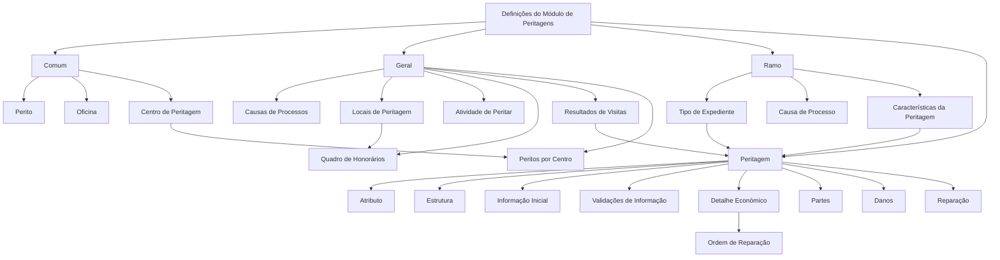

# Definições do Módulo de Peritagens para Sinistros de Automóvel

## 1. Metadados do Documento
- **Arquivo de Origem:** `Não identificado no conteúdo fornecido`
- **Tipo de Documento:** `Especificação Técnica`
- **Domínio / Sistema:** `Sinistros (Automóvel) — Módulo de Peritagens`
- **Público-Alvo:** `Negócio, analistas funcionais, configuradores e operação`
- **Data/Versão Identificada:** `Não identificada`

---

## 2. Resumo Executivo & Contexto de Negócio

O documento define elementos de configuração do módulo de peritagens aplicado ao domínio de sinistros de automóvel. As definições abrangem cadastros compartilhados, regras gerais aplicáveis aos processos de peritagem, configurações exclusivas do ramo e estruturas específicas da própria operação de peritagem.

No nível comum, o módulo mantém os cadastros de peritos, oficinas e centros de peritagem. Esses cadastros não são exclusivos do módulo de sinistros, mas são necessários para viabilizar a configuração e a execução das peritagens.

No nível geral, o documento estabelece configurações que podem afetar todos os expedientes passíveis de peritagem. Entre elas estão causas de processos, locais de peritagem, atividades habilitadas, quadros de honorários, resultados de visitas e associação de peritos a centros de peritagem.

No nível exclusivo do ramo, o documento define tipos de expediente, causas de processo e características da peritagem. Na operação de peritagem, são configurados atributos, estruturas de informação adicional, informações iniciais, validações, detalhes económicos, partes da propriedade, danos e reparações.

O objetivo operacional é permitir que a organização catalogue os motivos, intervenientes, locais, capacidades, validações, informações técnicas e itens económicos necessários para realizar peritagens e, quando aplicável, emitir ordens de reparação.

---

## 3. Arquitetura, Componentes & Tecnologias Envolvidas

O conteúdo não descreve tecnologias, protocolos, URLs, ambientes, servidores, APIs, métodos HTTP ou contratos JSON. O documento apresenta uma arquitetura funcional de definições para o módulo de peritagens.

| Componente / Nível | Elementos identificados | Função descrita |
| :--- | :--- | :--- |
| Comum | Perito, Oficina, Centro de Peritagem | Cadastros necessários para definir peritagens, não exclusivos do módulo de sinistros |
| Geral | Causas de Processos, Locais de Peritagem, Atividade de Peritar, Quadro de Honorários, Resultados de Visitas, Peritos por Centro | Configurações que afetam expedientes aos quais se pode realizar peritagem |
| Ramo | Tipo de Expediente, Causa de Processo, Características da Peritagem | Definições exclusivas do ramo configurado |
| Peritagem | Atributo, Estrutura, Informação Inicial, Validações de Informação, Detalhe Económico, Partes, Danos, Reparação | Configuração da informação, validações, danos e reparações da operação de peritagem |



> *Nota de Análise: O documento não detalha a implementação técnica dos componentes, integrações entre sistemas, persistência de dados ou contratos de interface.*

---

## 4. Regras de Negócio, Especificações Funcionais & Processos

### 4.1 Definições comuns

1. **Perito**
   - Deve permitir registar todos os peritos da companhia.

2. **Oficina**
   - Deve permitir registar todas as oficinas da companhia.

3. **Centro de Peritagem**
   - Deve permitir registar diferentes centros de peritagem.
   - Os centros de peritagem devem poder ser associados posteriormente a peritos.

### 4.2 Definições gerais

1. **Causas de Processos**
   - Devem permitir catalogar os motivos pelos quais se pretende realizar uma peritagem.

2. **Locais de Peritagem**
   - Devem permitir definir os locais de trabalho de peritos e inspetores.
   - Determinam onde uma peritagem pode ser realizada.
   - Exemplos apresentados: oficina, residência do segurado e empresa do segurado.

3. **Atividade de Peritar**
   - Deve definir quais atividades estão habilitadas para realizar peritagens.
   - O documento cita como possíveis atividades: peritos, inspetores e tramitadores.

4. **Quadro de Honorários**
   - Deve permitir definir diferentes honorários para peritos, inspetores externos e outros intervenientes.
   - Os honorários podem variar de acordo com os diferentes locais de trabalho dos peritos.

5. **Resultados de Visitas**
   - Deve permitir definir diferentes resultados para as visitas.
   - Um resultado de visita pode desencadear ou não o resultado da peritagem.
   - Caso a visita seja falhada, o resultado da peritagem não deve ser disparado.
   - Uma visita falhada exige a realização de uma nova visita.

6. **Peritos por Centro**
   - Deve permitir associar peritos aos diferentes centros de peritagem.

### 4.3 Definições exclusivas do ramo

1. **Tipo de Expediente**
   - Deve definir os tipos de dano aos quais pode ser realizada uma peritagem.
   - Deve indicar se a peritagem é obrigatória ou não para cada tipo de dano.

2. **Causa de Processo**
   - Deve catalogar os motivos para realizar uma operação.
   - Exemplos apresentados: causa da peritagem, subscrição e avaliação de danos para reparação.

3. **Características da Peritagem**
   - Deve definir a propriedade a ser peritada por tipo de dano.
   - Deve contemplar estruturas de dados adicionais.

### 4.4 Configurações da operação de peritagem

1. **Atributo**
   - Deve permitir definir informação adicional da peritagem.

2. **Estrutura**
   - Representa informação adicional da peritagem.

3. **Informação Inicial**
   - Deve permitir registar informações prévias para os atributos das operações de peritagem.
   - O objetivo é evitar a introdução posterior dessas informações.
   - Exemplo apresentado: atribuir, por defeito, a atividade de perito para realizar a peritagem.

4. **Validações de Informação**
   - Devem definir comportamentos e validações da informação core solicitada nas operações de peritagem.

5. **Detalhe Económico da Peritagem**
   - Deve determinar os conceitos de detalhe da peritagem usados para realizar uma ordem de reparação.
   - Exemplos apresentados: reparação, chapa, pintura e mão de obra.

6. **Partes**
   - Devem definir as partes de uma propriedade.
   - Para veículos, os exemplos apresentados incluem parte dianteira e parte lateral direita.

7. **Danos**
   - Devem definir danos por propriedade.

8. **Reparação**
   - Deve codificar as possíveis reparações de uma propriedade.
   - Exemplos apresentados: substituir e reparar.

---

## 5. Tabelas de Parâmetros, Ambientes e Estruturas de Dados

| Item / Parâmetro | Descrição / Função | Tipo / Valores / Formato | Ambiente / Observações |
| :--- | :--- | :--- | :--- |
| Perito | Registar os peritos da companhia | Cadastro de interveniente | Definição comum |
| Oficina | Registar as oficinas da companhia | Cadastro de entidade | Definição comum |
| Centro de Peritagem | Registar centros de peritagem | Cadastro de centro | Permite associação posterior de peritos |
| Peritos por Centro | Associar peritos a centros de peritagem | Associação entre cadastros | Definição geral |
| Causas de Processos | Catalogar motivos para realização de peritagem | Catálogo de causas | Definição geral |
| Locais de Peritagem | Definir locais de trabalho onde peritagens podem ocorrer | Catálogo de locais | Exemplos: oficina, residência do segurado, empresa do segurado |
| Atividade de Peritar | Definir atividades habilitadas para realizar peritagens | Catálogo de atividades | Exemplos: peritos, inspetores, tramitadores |
| Quadro de Honorários | Definir honorários por interveniente e local de trabalho | Quadro de valores | Para peritos, inspetores externos e outros |
| Resultados de Visitas | Definir resultados possíveis de visitas | Catálogo de resultados | Um resultado pode ou não disparar o resultado da peritagem |
| Visita falhada | Resultado de visita sem disparo do resultado da peritagem | Condição de processo | Requer nova visita |
| Tipo de Expediente | Definir tipos de dano passíveis de peritagem e obrigatoriedade | Tipo de dano + indicador de obrigatoriedade | Exclusivo do ramo |
| Causa de Processo | Catalogar motivos para realizar uma operação | Catálogo de causas | Exemplos: peritagem, subscrição, avaliação de danos para reparação |
| Características da Peritagem | Definir propriedade a peritar por tipo de dano | Estrutura funcional e dados adicionais | Exclusivo do ramo |
| Atributo | Definir informação adicional da peritagem | Atributo informacional | Afeta todas as peritagens |
| Estrutura | Representar informação adicional da peritagem | Estrutura de informação | Afeta todas as peritagens |
| Informação Inicial | Pré-preencher informação para atributos de operações | Valor predefinido | Exemplo: atividade padrão de perito |
| Validações de Informação | Definir comportamentos e validações da informação core | Regras de validação | Aplicadas às operações de peritagem |
| Detalhe Económico da Peritagem | Determinar conceitos para ordem de reparação | Conceitos económicos | Exemplos: reparação, chapa, pintura, mão de obra |
| Partes | Definir partes de uma propriedade | Catálogo de partes | Exemplo de veículo: dianteira e lateral direita |
| Danos | Definir danos por propriedade | Catálogo de danos | Sem detalhamento adicional |
| Reparação | Codificar reparações possíveis de uma propriedade | Código de reparação | Exemplos: substituir, reparar |

> *Nota de Análise: O documento não apresenta ambientes, URLs, servidores, tipos de dados técnicos, formatos de campos ou valores de parâmetros adicionais.*

---

## 6. Bateria de Perguntas & Respostas para RAG (FAQ Sintético)

### P1: Qual é o objetivo das definições comuns no módulo de peritagens?
**R:** As definições comuns disponibilizam cadastros necessários para configurar peritagens, embora não sejam exclusivos do módulo de sinistros. Os elementos citados são peritos, oficinas e centros de peritagem.

### P2: O que deve ser registado na definição de Perito?
**R:** A definição de Perito deve permitir registar todos os peritos da companhia.

### P3: Como os peritos são relacionados aos centros de peritagem?
**R:** Os centros de peritagem são registados e, posteriormente, os peritos podem ser associados aos diferentes centros por meio da definição “Peritos por Centro”.

### P4: Quais locais podem ser configurados como locais de peritagem?
**R:** O documento indica que os locais de peritagem definem onde peritos e inspetores podem trabalhar e realizar peritagens. Os exemplos fornecidos são oficina, residência do segurado e empresa do segurado.

### P5: O que acontece quando o resultado de uma visita é falhada?
**R:** Quando a visita é falhada, o resultado da peritagem não é disparado. O documento estabelece que será necessário realizar uma nova visita.

### P6: Para que serve o quadro de honorários?
**R:** O quadro de honorários permite definir honorários diferentes para peritos, inspetores externos e outros intervenientes, considerando os distintos locais de trabalho dos peritos.

### P7: Como o tipo de expediente influencia a peritagem?
**R:** O tipo de expediente define os tipos de dano que podem receber uma peritagem e indica se a peritagem é obrigatória ou não para cada tipo de dano.

### P8: Qual é a finalidade da informação inicial nas operações de peritagem?
**R:** A informação inicial permite registar previamente dados destinados aos atributos das operações de peritagem, evitando que sejam introduzidos posteriormente. O documento exemplifica a definição padrão da atividade de perito para executar a peritagem.

### P9: Quais informações são tratadas pelas validações de informação?
**R:** As validações de informação definem comportamentos e validações para a informação core solicitada nas operações de peritagem. O documento não detalha regras de validação específicas.

### P10: Como o detalhe económico da peritagem é utilizado?
**R:** O detalhe económico da peritagem determina os conceitos de detalhe necessários para realizar uma ordem de reparação. Os exemplos apresentados são reparação, chapa, pintura e mão de obra.

### P11: O que representam as partes de uma propriedade numa peritagem de veículo?
**R:** As partes representam segmentos da propriedade avaliados na peritagem. Para um veículo, o documento exemplifica a parte dianteira e a parte lateral direita.

### P12: Quais reparações podem ser codificadas?
**R:** A definição de Reparação permite codificar possíveis reparações de uma propriedade. O documento apresenta como exemplos substituir e reparar.

---

## 7. Glossário de Termos, Siglas & Conceitos-Chave

- **Peritagem:** Operação de avaliação relacionada a uma propriedade, danos e possíveis reparações.
- **Perito:** Profissional registado pela companhia para realizar peritagens.
- **Centro de Peritagem:** Centro registado para o qual peritos podem ser associados.
- **Expediente:** Entidade para a qual pode ser definida a possibilidade ou obrigatoriedade de realizar uma peritagem.
- **Tipo de Dano:** Classificação de dano usada para definir se uma peritagem pode ou deve ser realizada.
- **Causa de Processo:** Motivo catalogado para realizar uma peritagem ou outra operação.
- **Atividade de Peritar:** Atividade habilitada para realizar uma peritagem.
- **Resultado de Visita:** Resultado configurado para uma visita, que pode desencadear ou não o resultado da peritagem.
- **Quadro de Honorários:** Configuração de honorários por interveniente e local de trabalho.
- **Informação Core:** Informação principal solicitada nas operações de peritagem.
- **Detalhe Económico:** Conceito económico da peritagem utilizado para realizar uma ordem de reparação.
- **Ordem de Reparação:** Ordem cuja realização utiliza conceitos de detalhe económico da peritagem.
- **Atributo:** Informação adicional configurável da peritagem.
- **Estrutura:** Informação adicional da peritagem.
- **Ramo:** Nível de definições exclusivo do ramo configurado.

---

## 8. Notas Críticas, Riscos & Limitações

- O documento não identifica nome de arquivo, data, versão, autor, sistema tecnológico, ambientes ou URLs.
- O documento não descreve APIs, métodos HTTP, contratos JSON, bases de dados, filas, integrações ou mecanismos de autenticação.
- Não são apresentados campos, identificadores, formatos, tipos de dados, regras de obrigatoriedade técnica ou valores de configuração.
- A definição de “Validações de Informação” afirma que existem comportamentos e validações para a informação core, mas não detalha quais são essas regras.
- A definição de “Danos” limita-se a indicar que existem danos por propriedade, sem apresentar categorias, códigos ou critérios.
- A associação entre tipos de dano, propriedades, partes, danos, reparações e detalhes económicos é sugerida pela estrutura funcional, mas não é explicitamente detalhada no conteúdo.
- Não existem Notas do Apresentador disponíveis no conteúdo fornecido.

---

## 9. Conteúdo Bruto Estruturado (Referência Fiel)

```text
--- [PÁGINA 1 DE 4] ---

DOCUMENTACIÓN de DEFINICIÓN de
SINIESTROS (Automóvil)
DEFINICIONES - MÓDULO PERITACIONES
COMÚN
En este nivel se encuentran definiciones que NO son exclusivas del
módulo de siniestros, pero son necesarias para poder realizar la
definición de peritaciones. En otros se encuentran:
PERITO
Registrar todos los peritos de la compañía
TALLER
Registrar todos los talleres de la compañía
CENTRO DE PERITACIÓN
 / 
 CF
Home Solutions APIs Documentation Zeus
EN


--- [PÁGINA 2 DE 4] ---

Registrar los diferentes Centros de Peritación,
para posteriormente asociar peritos
GENERAL
En este Nivel se encuentran definiciones que afectarán a todos los
posibles expedientes a los que se les pueda realizar una peritación.
Entre otros se define:
CAUSAS DE PROCESOS 
Permite catalogar los motivos por los que se
quiere realizar una peritación
LUGARES PERITACIÓN 
Permite definir los lugares de trabajo de los
peritos, inspectores, es decir dónde va a
poder realizar las peritaciones. Por ejemplo
en un taller, en el hogar del asegurado, en la
empresa del asegurado, etc
ACTIVIDAD PERITAR 
Definir que actividad está capacitada para
realizar peritaciones, peritos, inspectores,
tramitadores..
CUADRO HONORARIOS
Permite definir para peritos, inspectores
externos etc, diferentes honorarios según los
distintos lugares de trabajo de los peritos
RESULTADO VISITAS 
Permite definir diferentes resultados de las
visitas pudiendo desencadenar o no el
resultado de la peritación. Por ejemplo si la
visita es fallida no se disparará el resultado de
la peritación, ya que habrá que volver a
realizar la visita
PERITOS POR CENTRO
Permite asociar los peritos a los distintos
centros de peritación
RAMO
Son exclusivas del ramo que se está definiendo


--- [PÁGINA 3 DE 4] ---

TIPO EXPEDIENTE 
Permite definir los Tipos de Daño a los que se
les va a poder realizar una peritación y si esta
es obligatoria o no
CAUSA PROCESO 
Permite catalogar los motivos por los que se
quiere realizar una operación. Ejemplo causa
de la peritación, para suscripción, evaluación
de daños para reparación
CARACTERÍSTICAS PERITACIÓN 
Definición de la propiedad que se va a peritar
por tipo de daño, estructura de datos
adicionales...
PERITACIÓN
Afecta a todas las peritaciones
ATRIBUTO
Permite definir la información adicional de la
peritación
ESTRUCTURA
Información adicional de la peritación
INFORMACIÓN INICIAL 
Registrar información previa para los atributos
de las operaciones de peritaciones, para no
tener que introducirla posteriormente. Un
ejemplo sería dar a la actividad para realizar
la peritación por defecto perito
VALIDACIONES INFORMACIÓN 
Definir comportamientos y validaciones la
información core, que se pide en las
operaciones de peritación.
DETALLE ECONÓMICO PERITACIÓN
Determina el concepto de detalle de la
peritación para realizar una orden de
reparación. Ejemplo Reparación, chapa,
pintura, mano de obra...
PARTES
Partes de una propiedad Si es un vehículo,
parte delantera, parte lateral derecha...


--- [PÁGINA 4 DE 4] ---

DAÑOS
Definición de Daños por propiedad
REPARACIÓN
Codificación de las posibles reparaciones de
una propiedad, sustituir, reparar
```
