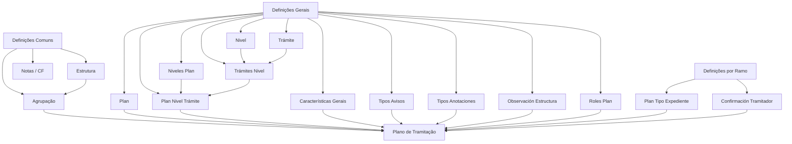

# Definições do Módulo de Sinistros — Plano de Tramitação

## 1. Metadados do Documento
- **Arquivo de Origem:** `Não informado; conteúdo bruto fornecido na solicitação`
- **Tipo de Documento:** `Especificação Técnica`
- **Domínio / Sistema:** `Módulo de Sinistros — Plano de Tramitação`
- **Público-Alvo:** `Analistas funcionais, desenvolvedores, arquitetos e operação`
- **Data/Versão Identificada:** `Não identificada`

---

## 2. Resumo Executivo & Contexto de Negócio

O documento descreve elementos de definição necessários para configurar o **Plano de Tramitação** do módulo de sinistros. O Plano de Tramitação organiza como expedientes e danos são processados, desde as definições comuns de informação até a execução de passos operacionais agrupados por níveis.

As definições são divididas em três grandes contextos: **Comum**, **General** e **Ramo**. O nível Comum contém definições prévias ao Plano de Tramitação que não são exclusivas de sinistros, mas são necessárias para construir a definição. O nível General reúne as configurações gerais do plano, seus níveis, trâmites, avisos, anotações, observações e papéis de execução.

No contexto de Ramo, o documento define a associação entre tipo de expediente, tipo de dano e Plano de Tramitação. Essa associação pode resultar em um plano fixo ou em um plano determinado por lógica de negócio que avalia condições especiais.

O documento também identifica controles operacionais relevantes: uso de papéis, datas de controle, calendário laboral para cálculo de datas, confirmação de trâmites e gravação de observações geradas pela execução de operações. Entretanto, não detalha telas, contratos de integração, métodos HTTP, modelos de dados, regras de cálculo completas ou mecanismos técnicos de persistência.

---

## 3. Arquitetura, Componentes & Tecnologias Envolvidas

O conteúdo não descreve tecnologias, linguagens, bancos de dados, APIs, ambientes ou infraestrutura. A arquitetura apresentada é funcional e de configuração do Plano de Tramitação.

### Componentes e definições identificadas

- **Estrutura:** conjunto de atributos que forma uma estrutura de informação.
- **Agrupação:** associação de Estruturas à agrupação do Plano de Tramitação.
- **Notas / CF:** definição de informação de notas para obtenção de comunicados.
- **Características Gerais:** define comportamentos do módulo de sinistros e do Plano de Tramitação.
- **Plan:** códigos de planos associados aos tipos de expedientes.
- **Nivel:** agrupação de trâmites.
- **Trámite:** cada passo necessário para concluir um processo.
- **Trámites Nivel:** associação de trâmites de mesma natureza sob um nível.
- **Niveles Plan:** níveis que compõem um plano.
- **Plan Nivel Trámite:** definição completa de um Plano de Tramitação, com passos agrupados em níveis.
- **Tipos Avisos:** categorização dos avisos que podem ser gerados.
- **Tipos Anotaciones:** definição de anotações livres.
- **Observación Estructura:** observação gravada no plano quando uma operação é executada.
- **Roles Plan:** papéis autorizados a trabalhar e executar níveis do Plano de Tramitação.
- **Plan Tipo Expediente:** associação de cada tipo de expediente e tipo de dano ao plano responsável pela tramitação.
- **Confirmación Tramitador:** perguntas de confirmação para execução de trâmites.



> **Nota de Análise:** o diagrama representa relações funcionais explicitamente indicadas no texto, como associações entre estruturas, agrupações, níveis, trâmites, planos e tipos de expediente. O documento não especifica integrações técnicas, persistência ou comunicação entre sistemas.

---

## 4. Regras de Negócio, Especificações Funcionais & Processos

### 4.1 Definições comuns anteriores ao Plano de Tramitação

As definições comuns são anteriores ao Plano de Tramitação. Essas definições não são exclusivas do módulo de sinistros, mas são necessárias para realizar a definição do plano.

1. **Estrutura**
   - Uma Estrutura representa um conjunto de atributos.
   - Os atributos formam uma estrutura de informação.

2. **Agrupação**
   - Uma Agrupação associa Estruturas à agrupação do Plano de Tramitação.

3. **Notas / CF**
   - A definição de Notas / CF contém informações de notas usadas para obter comunicados.

### 4.2 Características gerais do Plano de Tramitação

As Características Gerais determinam comportamentos do módulo de sinistros relacionados ao Plano de Tramitação. Os exemplos apresentados são:

- Definir se o módulo trabalhará com papéis.
- Definir se o módulo trabalhará com datas de controle.
- Definir se o calendário laboral será utilizado para cálculo de datas.

> **Nota de Análise:** o documento não informa os valores possíveis, critérios de ativação, algoritmos de cálculo de datas ou impacto técnico de cada característica geral.

### 4.3 Estruturação do Plano de Tramitação

O Plano de Tramitação é formado por planos, níveis e trâmites.

1. **Plan**
   - Define códigos de planos.
   - Os planos serão associados aos tipos de expedientes.

2. **Nivel**
   - Representa uma agrupação de trâmites.

3. **Trámite**
   - Representa cada passo que deve ser realizado para completar um processo.

4. **Trámites Nivel**
   - Associa trâmites da mesma natureza sob um mesmo nível.
   - Exemplo fornecido: o nível de peritação reúne todos os trâmites de peritações.

5. **Niveles Plan**
   - Define os diferentes níveis que um plano conterá.

6. **Plan Nivel Trámite**
   - Define de forma completa um Plano de Tramitação.
   - Reúne os diferentes passos possíveis para tramitar um expediente.
   - Os passos são agrupados em níveis.

### 4.4 Avisos, anotações e observações

1. **Tipos Avisos**
   - Define ou tipifica os diferentes avisos que podem ser gerados.

2. **Tipos Anotaciones**
   - Define as diferentes anotações livres que podem ser realizadas.

3. **Observación Estructura**
   - Define a observação que será gravada no plano toda vez que uma operação for executada.
   - Exemplo fornecido: na execução de uma liquidação, a observação pode registrar a quem será realizado o pagamento e o valor correspondente.

> **Nota de Análise:** o documento não define a estrutura, os campos obrigatórios, o formato, a persistência ou o ciclo de vida dos avisos, anotações e observações.

### 4.5 Papéis e restrições de execução

O componente **Roles Plan** define os diferentes papéis que podem trabalhar com os Planos de Tramitação.

As permissões podem ser restritas por nível. Os exemplos apresentados são:

- Um papel pode executar somente o nível de peritações.
- Um papel pode executar somente o nível de juízos.

> **Nota de Análise:** o documento não detalha a matriz completa de papéis, permissões de leitura, permissões de alteração, regras de segregação de funções ou fluxo de autorização.

### 4.6 Associação por ramo, tipo de expediente e tipo de dano

As definições por Ramo estabelecem como um tipo de expediente e um tipo de dano são encaminhados para um Plano de Tramitação.

A definição **Plan Tipo Expediente** deve:

1. Definir, para cada tipo de expediente, o plano responsável pela tramitação.
2. Considerar o tipo de dano associado.
3. Permitir que o plano seja fixo.
4. Permitir que o plano seja determinado por lógica de negócio que avalie condições especiais.

> **Nota de Análise:** o documento menciona lógica de negócio e condições especiais, mas não fornece regras, variáveis, prioridades ou exemplos de decisão para seleção dinâmica de planos.

### 4.7 Confirmação de trâmites

A definição **Confirmación Tramitador** permite configurar perguntas de confirmação para trâmites.

Exemplos de confirmações indicadas:

- Confirmar uma perda total.
- Confirmar coberturas.
- Confirmar uma situação de apólice.

> **Nota de Análise:** o documento não informa as respostas aceitas, o comportamento após confirmação, as regras de rejeição, nem quais trâmites requerem confirmação obrigatória.

---

## 5. Tabelas de Parâmetros, Ambientes e Estruturas de Dados

| Item / Parâmetro | Descrição / Função | Tipo / Valores / Formato | Ambiente / Observações |
| :--- | :--- | :--- | :--- |
| Estrutura | Conjunto de atributos que forma uma estrutura de informação. | Não especificado. | Definição comum e prévia ao Plano de Tramitação. |
| Agrupação | Associação de Estruturas à agrupação do Plano de Tramitação. | Não especificado. | Definição comum. |
| Notas / CF | Define informação de notas para obtenção de comunicados. | Não especificado. | A sigla `CF` não é expandida no conteúdo. |
| Características Gerais | Determina comportamentos do módulo de sinistros e do Plano de Tramitação. | Trabalho com papéis; datas de controle; uso de calendário laboral para cálculo de datas. | Valores, regras e parametrização não especificados. |
| Plan | Define códigos de planos associados a tipos de expedientes. | Código de plano; formato não especificado. | Definição geral. |
| Nivel | Agrupação de trâmites. | Não especificado. | Um plano pode conter diferentes níveis. |
| Trámite | Passo necessário para completar um processo. | Não especificado. | Pode ser associado a um nível. |
| Trámites Nivel | Associação de trâmites de mesma natureza sob um nível. | Não especificado. | Exemplo: nível de peritação reúne trâmites de peritações. |
| Niveles Plan | Define os níveis que compõem um plano. | Não especificado. | Definição geral. |
| Plan Nivel Trámite | Define completamente o Plano de Tramitação por meio de passos agrupados em níveis. | Não especificado. | Representa a combinação de plano, nível e trâmite. |
| Tipos Avisos | Tipifica os avisos que podem ser gerados. | Não especificado. | Não há lista de tipos de avisos. |
| Tipos Anotaciones | Define anotações livres possíveis. | Não especificado. | Não há catálogo de anotações. |
| Observación Estructura | Define observação gravada ao executar uma operação no plano. | Exemplo: destinatário e valor de uma liquidação. | Estrutura e formato não especificados. |
| Roles Plan | Define papéis que podem trabalhar com os Planos de Tramitação. | Papéis com permissão por nível. | Exemplos: papel para peritações; papel para juízos. |
| Plan Tipo Expediente | Define o plano responsável por tramitar um tipo de expediente e tipo de dano. | Plano fixo ou plano selecionado por lógica de negócio. | A lógica de condições especiais não foi detalhada. |
| Confirmación Tramitador | Define perguntas para confirmação de trâmites. | Exemplos: perda total, coberturas e situação de apólice. | Respostas e efeitos de confirmação não especificados. |
| Tecnologias | Tecnologias, APIs, bancos de dados, servidores e ambientes. | Não informado. | O documento não apresenta detalhes técnicos de infraestrutura. |

---

## 6. Bateria de Perguntas & Respostas para RAG (FAQ Sintético)

### P1: Qual é a finalidade do Plano de Tramitação no módulo de sinistros?
**R:** O Plano de Tramitação define os passos que podem ser realizados para tramitar um expediente no módulo de sinistros. Esses passos, denominados trâmites, são organizados e agrupados em níveis para formar a definição completa de um plano.

### P2: O que são as definições comuns do Plano de Tramitação?
**R:** As definições comuns são configurações prévias ao Plano de Tramitação. Elas não são exclusivas do módulo de sinistros, mas são necessárias para realizar a definição do plano. O documento cita Estrutura, Agrupação e Notas / CF como definições comuns.

### P3: Qual é a função de uma Estrutura?
**R:** Uma Estrutura é a definição de um conjunto de atributos que forma uma estrutura de informação. O documento não detalha quais atributos podem compor uma Estrutura nem o formato desses dados.

### P4: Como uma Agrupação se relaciona com o Plano de Tramitação?
**R:** A Agrupação associa Estruturas à agrupação do Plano de Tramitação. O documento não especifica as regras de cardinalidade, os critérios para associação ou como essa agrupação é persistida.

### P5: Quais comportamentos podem ser definidos nas Características Gerais?
**R:** As Características Gerais determinam comportamentos do módulo de sinistros relacionados ao Plano de Tramitação. Os exemplos fornecidos são trabalhar com papéis, trabalhar com datas de controle e utilizar o calendário laboral para cálculo de datas.

### P6: Qual é a diferença entre Nivel, Trámite e Trámites Nivel?
**R:** Nivel é uma agrupação de trâmites. Trámite é cada passo que deve ser realizado para completar um processo. Trámites Nivel associa trâmites da mesma natureza sob um nível; o documento exemplifica que um nível de peritação pode agrupar todos os trâmites de peritações.

### P7: O que representa a definição Plan Nivel Trámite?
**R:** Plan Nivel Trámite representa a definição completa de um Plano de Tramitação. Essa definição reúne todos os passos que podem ser realizados para tramitar um expediente, mantendo esses passos agrupados em níveis.

### P8: Como os papéis podem limitar a execução de um Plano de Tramitação?
**R:** Roles Plan define os papéis que podem trabalhar com os Planos de Tramitação. O documento informa que determinados papéis podem executar apenas níveis específicos, como somente o nível de peritações ou somente o nível de juízos.

### P9: Como é selecionado o plano para um tipo de expediente e tipo de dano?
**R:** A definição Plan Tipo Expediente determina qual Plano de Tramitação será responsável por um tipo de expediente e tipo de dano. O plano pode ser fixo ou pode ser determinado por lógica de negócio que avalie condições especiais.

### P10: O documento detalha a lógica de negócio usada para selecionar dinamicamente um plano?
**R:** Não. O documento afirma que um plano pode ser determinado por lógica de negócio que avalie condições especiais, mas não informa as condições, variáveis, regras, prioridades ou algoritmos dessa seleção.

### P11: Para que serve Observación Estructura?
**R:** Observación Estructura define a observação que será gravada no plano cada vez que uma operação for executada. O exemplo apresentado é uma liquidação, na qual a observação pode registrar a quem será efetuado o pagamento e o valor correspondente.

### P12: Quais confirmações podem ser configuradas em Confirmación Tramitador?
**R:** Confirmación Tramitador permite definir perguntas para confirmação de trâmites. Os exemplos apresentados são confirmação de perda total, confirmação de coberturas e confirmação de situação de apólice.

### P13: O documento informa quais tecnologias, serviços ou APIs implementam o módulo?
**R:** Não. O conteúdo apresenta definições funcionais do módulo de sinistros e do Plano de Tramitação, mas não especifica tecnologias, APIs, bancos de dados, URLs, servidores, ambientes ou contratos de integração.

---

## 7. Glossário de Termos, Siglas & Conceitos-Chave

- **Agrupação:** associação de Estruturas à agrupação do Plano de Tramitação.
- **Características Gerais:** definições que determinam comportamentos do módulo de sinistros e do Plano de Tramitação.
- **CF:** sigla apresentada junto de “Notas”, sem expansão ou significado definido no documento.
- **Confirmación Tramitador:** definição de perguntas para confirmação de trâmites.
- **Estrutura:** conjunto de atributos que forma uma estrutura de informação.
- **Nivel:** agrupação de trâmites.
- **Niveles Plan:** definição dos diferentes níveis que um plano conterá.
- **Notas / CF:** definição de informação de notas para obtenção de comunicados.
- **Observación Estructura:** observação gravada no plano quando uma operação é executada.
- **Plan:** definição de códigos de planos associados aos tipos de expedientes.
- **Plan Nivel Trámite:** definição completa de um Plano de Tramitação, com passos agrupados em níveis.
- **Plan Tipo Expediente:** definição do plano que tramita cada tipo de expediente e tipo de dano.
- **Plano de Tramitação:** conjunto estruturado de passos para tramitar um expediente, organizado em níveis.
- **RAMO:** contexto de definições por ramo do Plano de Tramitação; o documento não expande ou define o termo.
- **Roles Plan:** definição de papéis que podem trabalhar com os Planos de Tramitação.
- **Tipos Anotaciones:** definição de anotações livres.
- **Tipos Avisos:** tipificação dos avisos que podem ser gerados.
- **Trámite:** cada passo necessário para completar um processo.
- **Trámites Nivel:** associação de trâmites de mesma natureza sob um nível.

---

## 8. Notas Críticas, Riscos & Limitações

- O documento não identifica nome de arquivo, data, versão, autor ou organização responsável.
- O documento não especifica tecnologias, componentes de infraestrutura, APIs, métodos HTTP, contratos JSON, bancos de dados, servidores, URLs ou ambientes.
- A sigla **CF** aparece no item “NOTAS / CF”, mas não possui expansão ou definição adicional.
- O termo **RAMO** é usado para agrupar definições, mas não é explicado no documento.
- A lógica de negócio para seleção dinâmica de plano por tipo de expediente e tipo de dano não é detalhada.
- Não há catálogo de planos, níveis, trâmites, avisos, anotações, papéis ou perguntas de confirmação.
- Não são informados valores de configuração para papéis, datas de controle ou uso de calendário laboral.
- O documento não detalha permissões, regras de segregação, aprovação, auditoria ou tratamento de falhas.
- Não existem Notas do Apresentador no conteúdo fornecido.

---

## 9. Conteúdo Bruto Estruturado (Referência Fiel)

```text
--- [PÁGINA 1 DE 3] ---

DOCUMENTACIÓN de DEFINICIÓN de
SINIESTROS
DEFINICIONES MÓDULO - PLAN TRAMITACIÓN
 Los elementos de definición atienden a distintos niveles:
COMÚN
Son definiciones Previas al Plan de tramitación. En este nivel se
encuentran definiciones que NO son exclusivas de siniestros, pero son
necesarias para poder realizar la definición. Entre otras definiciones se
encuentra:
ESTRUCTURA
Definición de un conjunto de atributos que
forman una estructura de información.
AGRUPACIÓN
Asociación de Estructuras a la agrupación del
plan de tramitación
NOTAS
 / 
 CF
Home Solutions APIs Documentation Zeus
EN


--- [PÁGINA 2 DE 3] ---

Definición de información de notas para
obtener comunicados
GENERAL
Definiciones Generales del Plan de Tramitación
CARACTERÍSTICAS GENERALES 
Características Generales del módulo de
siniestros, determina comportamientos del
módulo de plan de tramitación por ejemplo si
se va a trabajar con roles, si se va a trabajar
con fechas de control, si se va a utilizar el
calendario laboral para el cálculo de fechas...
PLAN 
Definición de códigos que planes que serán
asociados a los tipos de expedientes
NIVEL 
Agrupación de Trámites
TRÁMITE 
Definición de cada paso que hay que realizar
para completar un proceso
TRAMITES NIVEL 
Asociación de trámites de la misma
naturaleza bajo un nivel, por ejemplo Nivel de
peritación aglutinará todos los trámites de
peritaciones
NIVELES PLAN 
Definición de los distintos niveles que va a
contener un plan
PLAN NIVEL TRÁMITE 
Definición completa de un plan de tramitación,
todos los diferentes pasos que se pueden
realizar para tramitar el expediente agrupados
en niveles.
TIPOS AVISOS 
Tipificar los distintos avisos que se pueden
generar
TIPOS ANOTACIONES
 OBSERVACIÓN ESTRUCTURA


--- [PÁGINA 3 DE 3] ---

Definir las distintas anotaciones libres que se
pueden realizar
Definición de la observación que se grabará
en el plan cada vez que se ejecute una
operación. Ejemplo si se ejecuta una
liquidación a quien se paga, el importe, etc
ROLES PLAN
Definir los distintos roles para poder trabajar
con los planes de tramitación. Puede haber
roles que sólo puedan ejecutar el nivel de
peritaciones, o roles que sólo puedan ejecutar
el nivel de juicios etc
RAMO
Definiciones por RAMO del Plan de Tramitación
PLAN TIPO EXPEDIENTE 
Definir para cada tipo de expediente, tipo de
daños qué plan se va a encargar de tramitar
ese daño. Puede ser un plan fijo o que se
determine mediante una lógica de negocio
evaluando condiciones especiales
CONFIRMACIÓN TRAMITADOR
Definición de preguntas para confirmación de
trámites. Ejemplo confirmar una pérdida total,
confirmar unas coberturas, una situación de
póliza, etc
```
