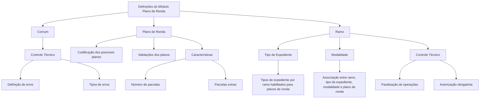

# Definições do Módulo de Plano de Renda para Sinistros de Automóvel

## 1. Metadados do Documento
- **Arquivo de Origem:** Não identificado no conteúdo fornecido.
- **Tipo de Documento:** Especificação Funcional.
- **Domínio / Sistema:** Sinistros de Automóvel — Módulo Plano de Renda.
- **Público-Alvo:** Analistas funcionais, desenvolvedores, arquitetos e operação.
- **Data/Versão Identificada:** Não identificada.

---

## 2. Resumo Executivo & Contexto de Negócio

O conteúdo define elementos de configuração e regras aplicáveis ao módulo de **Plano de Renda** no contexto de **sinistros de automóvel**. O documento organiza as definições em níveis funcionais que distinguem configurações comuns, configurações específicas do plano de renda e configurações aplicáveis aos expedientes de sinistro.

No nível **Comum**, o documento descreve definições não exclusivas do módulo de sinistros, mas necessárias para realizar a sua configuração. Entre essas definições está o **Controle Técnico**, responsável pela definição de erros e tipos de erros.

No nível **Plano de Renda**, são definidos os possíveis planos, suas codificações e validações. Também são descritas as características associadas ao plano de renda, incluindo número de parcelas e existência de parcelas extras.

No nível **Ramo**, o documento estabelece definições que afetam todos os possíveis expedientes de um sinistro. Essas definições incluem os tipos de expediente habilitados para trabalhar com planos de renda, a associação entre ramo, tipo de expediente, modalidade e tipo de plano de renda, além de condições para paralisação ou autorização obrigatória de operações relacionadas ao plano de renda.

O documento não apresenta detalhes de implementação, métodos HTTP, contratos JSON, banco de dados, ambientes, versões de software, URLs operacionais ou responsáveis pelos processos descritos.

---

## 3. Arquitetura, Componentes & Tecnologias Envolvidas

O conteúdo fornecido não descreve uma arquitetura tecnológica, componentes de software, microsserviços, integrações, protocolos ou tecnologias de implementação.

Os elementos funcionais identificados são:

- **Módulo de Sinistros:** Contexto funcional no qual existem definições necessárias para o plano de renda.
- **Plano de Renda:** Entidade funcional com codificação, validações e características.
- **Controle Técnico:** Área de definição de erros, tipos de erros e regras de paralisação ou autorização.
- **Ramo:** Nível de definição aplicável aos expedientes de sinistro.
- **Tipo de Expediente:** Define quais tipos de expediente, por ramo, podem trabalhar com planos de renda.
- **Modalidade:** Permite associar ramo, tipo de expediente e modalidade ao tipo de plano de renda.
- **Características do Plano de Renda:** Incluem número de parcelas e indicação de parcelas extras.



> **Nota de Análise:** O diagrama representa a organização funcional explicitamente apresentada no conteúdo. O documento não detalha componentes técnicos, interfaces de integração ou fluxos de execução entre sistemas.

---

## 4. Regras de Negócio, Especificações Funcionais & Processos

### 4.1 Definições comuns

As definições comuns não são exclusivas do módulo de sinistros, mas são necessárias para realizar a definição do módulo de plano de renda.

#### Controle Técnico no nível comum

O Controle Técnico no nível comum contempla:

1. Definição de erros.
2. Definição de tipos de erros.

O conteúdo não especifica:
- Quais erros existem.
- Quais tipos de erros são suportados.
- Critérios de classificação dos erros.
- Fluxos de tratamento, correção, bloqueio ou reprocessamento.

### 4.2 Definições de Plano de Renda

As definições no nível de Plano de Renda afetam todos os possíveis expedientes que possuem um plano de renda.

#### Plano de Renda

O plano de renda deve contemplar:

1. Definição da codificação dos possíveis planos.
2. Definição das validações aplicáveis aos possíveis planos.

O documento não detalha os códigos de plano, formatos de codificação, catálogo de planos ou regras específicas de validação.

#### Características do Plano de Renda

As características do plano de renda incluem, entre outros elementos:

1. Número de parcelas.
2. Existência de parcelas extras.

O documento não informa:
- Valores permitidos para o número de parcelas.
- Regras de cálculo de parcelas.
- Condições para inclusão de parcelas extras.
- Valores financeiros, periodicidade ou vigência dos planos.

### 4.3 Definições por Ramo

As definições no nível de Ramo afetam todos os possíveis expedientes de um sinistro.

#### Tipo de Expediente

O tipo de expediente define quais tipos de expediente, por ramo, poderão trabalhar com planos de renda.

#### Modalidade

A modalidade permite associar:

1. Ramo.
2. Tipo de expediente.
3. Modalidade.
4. Tipo de plano de renda que pode ser associado.

O documento não apresenta a matriz de associações permitidas entre ramo, tipo de expediente, modalidade e plano de renda.

#### Controle Técnico no nível de Ramo

O Controle Técnico no nível de Ramo define as condições em que:

1. As operações de plano de renda podem ser paralisadas.
2. Uma operação de plano de renda deve ser autorizada obrigatoriamente.

O conteúdo não especifica as condições concretas de paralisação, os níveis de autorização, os perfis autorizadores ou o fluxo de aprovação.

---

## 5. Tabelas de Parâmetros, Ambientes e Estruturas de Dados

| Item / Parâmetro | Descrição / Função | Tipo / Valores / Formato | Ambiente / Observações |
| :--- | :--- | :--- | :--- |
| Comum | Nível que contém definições não exclusivas do módulo de sinistros, mas necessárias para realizar a definição. | Nível funcional. | Não há ambiente informado. |
| Controle Técnico — Comum | Define erros e tipos de erros. | Regras e classificações de erro; valores não detalhados. | Aplicável ao nível comum. |
| Plano de Renda | Define a codificação dos possíveis planos e suas validações. | Entidade funcional; códigos e validações não detalhados. | Afeta expedientes que possuem plano de renda. |
| Codificação de Plano de Renda | Identifica os possíveis planos de renda. | Formato não detalhado. | Não há catálogo de códigos no conteúdo. |
| Validações do Plano de Renda | Aplica validações aos possíveis planos de renda. | Regras não detalhadas. | Não há critérios de validação informados. |
| Características do Plano de Renda | Define características do plano de renda. | Estrutura funcional. | Inclui número de parcelas e parcelas extras. |
| Número de Parcelas | Característica do plano de renda. | Valor não detalhado. | Sem regras de limite ou cálculo. |
| Parcelas Extras | Indica se o plano possui parcelas extras. | Condição ou característica; valores não detalhados. | Sem critérios de aplicação informados. |
| Ramo | Nível de definições aplicável a todos os expedientes de um sinistro. | Nível funcional. | Não há ramos listados. |
| Tipo de Expediente | Define que tipos de expediente por ramo podem trabalhar com planos de renda. | Associação entre ramo e tipo de expediente. | Matriz de permissões não fornecida. |
| Modalidade | Permite associar ramo, tipo de expediente, modalidade e tipo de plano de renda. | Regra de associação. | Combinações permitidas não fornecidas. |
| Controle Técnico — Ramo | Define condições para paralisação ou autorização obrigatória das operações de plano de renda. | Regras de controle; condições não detalhadas. | Aplicável às operações de plano de renda. |

> **Nota de Análise:** Não foram identificados URLs, servidores, variáveis de log, credenciais, estruturas JSON, esquemas de banco de dados, portas, ambientes de implantação ou parâmetros técnicos executáveis.

---

## 6. Bateria de Perguntas & Respostas para RAG (FAQ Sintético)

### P1: Qual é o objetivo das definições comuns no módulo de Plano de Renda?
**R:** As definições comuns correspondem a elementos que não são exclusivos do módulo de sinistros, mas que são necessários para realizar a definição do módulo de Plano de Renda. Entre essas definições está o Controle Técnico, que abrange erros e tipos de erros.

### P2: O que o Controle Técnico define no nível comum?
**R:** No nível comum, o Controle Técnico define erros e tipos de erros. O conteúdo não informa quais erros existem, quais tipos de erro são suportados ou como os erros devem ser tratados.

### P3: O que deve ser definido para um Plano de Renda?
**R:** Para um Plano de Renda, o documento estabelece a definição da codificação dos possíveis planos e das validações aplicáveis a esses planos. Os códigos concretos e as regras específicas de validação não são apresentados.

### P4: Quais características de um Plano de Renda são citadas?
**R:** O documento cita como características do Plano de Renda o número de parcelas e a indicação de existência de parcelas extras. Não há detalhamento sobre valores permitidos, cálculo de parcelas ou critérios para parcelas extras.

### P5: A quais expedientes se aplicam as definições do nível de Plano de Renda?
**R:** As definições do nível de Plano de Renda afetam todos os possíveis expedientes que possuem um plano de renda.

### P6: Qual é a responsabilidade do Tipo de Expediente no nível de Ramo?
**R:** O Tipo de Expediente define quais tipos de expediente, por ramo, poderão trabalhar com planos de renda. O documento não fornece a lista dos ramos ou tipos de expediente habilitados.

### P7: Como a Modalidade se relaciona ao Plano de Renda?
**R:** A Modalidade permite associar ramo, tipo de expediente e modalidade ao tipo de plano de renda que pode ser associado. O conteúdo não apresenta as combinações ou restrições específicas dessa associação.

### P8: Em que situações uma operação de Plano de Renda pode ser paralisada?
**R:** O Controle Técnico no nível de Ramo define as condições em que operações de Plano de Renda podem ser paralisadas. Contudo, as condições concretas de paralisação não são especificadas no conteúdo fornecido.

### P9: Quando uma operação de Plano de Renda exige autorização?
**R:** O Controle Técnico no nível de Ramo define quando uma operação de Plano de Renda deve ser obrigatoriamente autorizada. O documento não identifica os critérios de obrigatoriedade, os responsáveis pela autorização ou o fluxo de aprovação.

### P10: O documento apresenta detalhes de APIs, métodos HTTP ou contratos JSON?
**R:** Não. O conteúdo não descreve APIs, métodos HTTP, contratos JSON, tecnologias, integrações ou componentes técnicos de implementação.

### P11: O documento fornece uma matriz de associação entre ramo, tipo de expediente, modalidade e plano de renda?
**R:** Não. O documento informa que a Modalidade permite essa associação, mas não apresenta a matriz de combinações permitidas.

### P12: Existem ambientes, URLs ou informações de infraestrutura no conteúdo?
**R:** Não foram identificados ambientes, URLs, servidores, portas, configurações de infraestrutura ou rotas de log no conteúdo fornecido.

---

## 7. Glossário de Termos, Siglas & Conceitos-Chave

- **Controle Técnico:** Elemento de definição de erros, tipos de erros e condições relacionadas à paralisação ou à autorização obrigatória de operações de plano de renda.
- **Expediente:** Entidade mencionada no contexto de sinistros. O documento diferencia tipos de expediente e sua relação com planos de renda, sem apresentar definição adicional.
- **Modalidade:** Elemento que permite associar ramo, tipo de expediente, modalidade e tipo de plano de renda.
- **Plano de Renda:** Plano cuja codificação, validações e características — como número de parcelas e parcelas extras — devem ser definidas.
- **Ramo:** Nível funcional cujas definições afetam todos os possíveis expedientes de um sinistro.
- **Sinistros:** Domínio funcional relacionado a ocorrências de automóvel no qual o módulo de Plano de Renda está inserido.
- **Tipo de Expediente:** Definição que determina, por ramo, quais tipos de expediente podem trabalhar com planos de renda.

> **Nota de Análise:** Não foram identificadas siglas com expansão explícita no conteúdo fornecido.

---

## 8. Notas Críticas, Riscos & Limitações

- O conteúdo possui caráter resumido e não apresenta detalhamento técnico de implementação.
- Não há catálogo de planos de renda, códigos de plano, formatos de codificação ou regras específicas de validação.
- Não há definição das regras de cálculo, limites ou periodicidade do número de parcelas.
- Não há critérios para determinar quando existem parcelas extras.
- Não há matriz de associação entre ramo, tipo de expediente, modalidade e tipo de plano de renda.
- Não há lista de erros, tipos de erros, condições de paralisação ou condições de autorização obrigatória.
- Não são apresentados fluxos de aprovação, perfis autorizadores, responsabilidades operacionais ou trilhas de auditoria.
- Não foram identificados detalhes de arquitetura de software, tecnologias, APIs, integrações, bancos de dados, URLs, ambientes ou logs.
- A menção a “Home Solutions APIs Documentation Zeus” ocorre no conteúdo bruto, mas não há descrição adicional que permita caracterizar sua função, arquitetura ou relação operacional com o módulo de Plano de Renda.

---

## 9. Conteúdo Bruto Estruturado (Referência Fiel)

```text
--- [PÁGINA 1 DE 2] ---

DOCUMENTACIÓN de DEFINICIÓN de
SINIESTROS (Automóvil)
DEFINICIONES - MÓDULO PLAN DE RENTA
COMÚN
En este nivel se encuentran definiciones que NO son exclusivas del
módulo de siniestros, pero son necesarias para poder realizar la
definición. Entre otras definiciones se encuentra:
CONTROL TÉCNICO
Definición de errores, tipos de Errores
GENERAL
 /
 CF
Home Solutions APIs Documentation Zeus
EN


--- [PÁGINA 2 DE 2] ---

En este nivel se encuentran definiciones que afectarán a todos los
posibles expedientes que tienen un plan de renta
PLAN DE RENTA
Definición de la codificación de los posibles
planes y sus validaciones
CARACTERÍSTICAS
Definición de las características del plan de
renta, número de cuotas, si tiene cuotas
extras, etc
RAMO
En este nivel se encuentran definiciones que afectarán a todos los
posibles expedientes de un siniestro
TIPO EXPEDIENTE
Define que tipos de expediente por Ramo van
a poder trabajar con planes de Renta
MODALIDAD
Permite asociar por ramo, tipo de expediente
y modalidad que tipo de plan de renta se
puede asociar
CONTROL TÉCNICO
Definir en qué condiciones se puede paralizar
las operaciones de plan de renta u obligación
de ser autorizada
```
