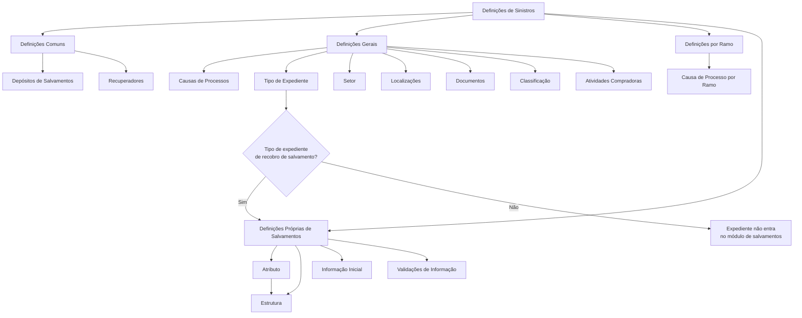

# Documentação de Definição de Sinistros — Módulo de Salvamentos

## 1. Metadados do Documento
- **Arquivo de Origem:** Não identificado no conteúdo fornecido
- **Tipo de Documento:** Especificação Técnica
- **Domínio / Sistema:** Definição de Sinistros — Módulo de Salvamentos
- **Público-Alvo:** Analistas funcionais, equipes de negócio, desenvolvedores e operação
- **Data/Versão Identificada:** Não identificada

---

## 2. Resumo Executivo & Contexto de Negócio

O documento descreve as definições necessárias para operar o módulo de **Salvamentos** dentro do domínio de **Sinistros**. O conteúdo organiza as configurações em níveis: definições comuns, definições gerais aplicáveis aos expedientes de salvamentos, definições específicas por ramo e definições próprias do módulo.

As definições comuns incluem depósitos de salvamentos e recuperadores. Os depósitos representam lugares onde salvados podem ser depositados. Os recuperadores representam pessoas dedicadas à busca de veículos ou propriedades roubadas pertencentes a segurados.

No nível geral, o documento descreve elementos que afetam todos os possíveis expedientes de salvamentos, como causas de processo, tipos de expediente, setor, localizações, documentos, classificação e atividades compradoras. Uma regra explícita determina que um expediente somente entra no módulo de salvamentos se possuir o tipo de expediente de **recobro de salvamento**.

No nível de ramo, a causa de processo é definida de forma exclusiva para cada ramo. No nível próprio de salvamentos, o documento descreve atributos, estruturas compostas por atributos, informação inicial e validações da informação core utilizada nas operações de salvamentos.

O conteúdo apresentado é predominantemente conceitual e configuracional. O documento não detalha interfaces, métodos HTTP, contratos JSON, bancos de dados, URLs, ambientes, permissões, responsáveis ou fluxos técnicos de integração.

---

## 3. Arquitetura, Componentes & Tecnologias Envolvidas

O documento não apresenta uma arquitetura tecnológica de software, infraestrutura, integração entre sistemas ou ambientes. O conteúdo descreve uma arquitetura funcional de definições para o módulo de Salvamentos.

### Componentes funcionais identificados

| Componente / Conceito | Escopo | Descrição sustentada pelo documento |
| :--- | :--- | :--- |
| Definições Comuns | Comum | Definições não exclusivas do módulo de sinistros, mas necessárias para realizar a definição. |
| Depósitos de Salvamentos | Comum | Lugares onde os salvados podem ser depositados. |
| Recuperadores | Comum | Pessoas dedicadas a buscar veículos ou propriedades roubadas dos segurados. |
| Definições Gerais | Geral | Definições que afetam todos os possíveis expedientes de salvamentos. |
| Causas de Processos | Geral | Catalogam os motivos pelos quais se pretende realizar uma operação. |
| Tipo de Expediente | Geral | Define os tipos de dano e sua classe. |
| Setor | Geral | Afeta todos os ramos do setor que está sendo definido. |
| Localizações | Geral | Possíveis localizações dos bens recuperados. |
| Documentos | Geral | Documentos necessários para que bens recuperados possam ser vendidos. |
| Classificação | Geral | Classificações possíveis dos bens recuperados quanto ao estado para venda. |
| Atividades Compradoras | Geral | Atividades que podem comprar salvados. |
| Ramo | Específico por ramo | Nível de definições exclusivas do ramo definido. |
| Causa de Processo por Ramo | Específico por ramo | Cataloga os motivos para realizar operações em cada ramo. |
| Atributo | Salvamentos | Informação adicional de salvamentos, incluindo dados do salvado. |
| Estrutura | Salvamentos | Informação adicional composta por atributos, obrigatoriedade e ordem de solicitação. |
| Informação Inicial | Salvamentos | Registro prévio de informações para atributos das operações de salvamentos. |
| Validações de Informação | Salvamentos | Comportamentos e validações da informação core solicitada nas operações de salvamentos. |



**Nota de Análise:** O documento não identifica tecnologias, microsserviços, APIs, bancos de dados, protocolos, endpoints, ambientes ou mecanismos de integração.

---

## 4. Regras de Negócio, Especificações Funcionais & Processos

### 4.1. Definições comuns

1. As definições comuns não são exclusivas do módulo de sinistros.
2. Apesar de não serem exclusivas do módulo de sinistros, as definições comuns são necessárias para realizar a definição.
3. Os depósitos de salvamentos devem representar os lugares onde os salvados podem ser depositados.
4. Os recuperadores devem representar as pessoas que buscarão veículos ou propriedades roubadas pertencentes aos segurados.

### 4.2. Definições gerais de expedientes de salvamentos

1. As definições gerais afetam todos os possíveis expedientes de salvamentos.
2. As causas de processos permitem catalogar os motivos pelos quais se deseja realizar uma operação.
3. O tipo de expediente permite definir os tipos de dano e sua classe.
4. Para que um expediente entre no módulo de salvamentos, o expediente deve possuir o tipo de expediente de **recobro de salvamento**.
5. O setor afeta todos os ramos do setor que está sendo definido.
6. As localizações devem representar as possíveis localizações dos bens recuperados.
7. Os documentos devem representar os documentos necessários para que os bens recuperados possam ser vendidos.
8. A classificação deve representar as possíveis classificações dos bens recuperados com relação ao estado para venda.
9. As atividades compradoras devem representar as atividades que podem comprar salvados.

### 4.3. Definições exclusivas por ramo

1. As definições no nível de ramo são exclusivas do ramo que está sendo definido.
2. A causa de processo por ramo permite catalogar os motivos pelos quais se deseja realizar operações para cada ramo.

### 4.4. Definições próprias de Salvamentos

1. Um atributo permite definir informações adicionais de salvamentos, incluindo dados do salvado.
2. Uma estrutura representa informação adicional de salvamentos composta por atributos.
3. A estrutura deve contemplar:
   - Atributos.
   - Obrigatoriedade ou não de solicitar determinada informação.
   - Ordem em que a informação será solicitada.
4. A informação inicial permite registrar previamente informações para os atributos das operações de salvamentos.
5. O registro prévio de informação inicial evita a necessidade de introduzir posteriormente essa informação.
6. As validações de informação permitem definir comportamentos e validações da informação core solicitada nas operações de salvamentos.

**Nota de Análise:** O documento não especifica os valores permitidos para tipos de dano, classes, causas de processo, setores, ramos, atributos, classificações, documentos ou validações.

---

## 5. Tabelas de Parâmetros, Ambientes e Estruturas de Dados

| Item / Parâmetro | Descrição / Função | Tipo / Valores / Formato | Ambiente / Observações |
| :--- | :--- | :--- | :--- |
| Depósitos de Salvamentos | Define os lugares onde salvados podem ser depositados. | Não especificado | Definição comum. |
| Recuperadores | Define pessoas dedicadas à busca de veículos ou propriedades roubadas de segurados. | Não especificado | Definição comum. |
| Causas de Processos | Cataloga motivos para realizar uma operação. | Não especificado | Aplicável às definições gerais. |
| Tipo de Expediente | Define tipos de dano e sua classe. | Deve incluir o tipo “recobro de salvamento” para entrada no módulo | Aplicável às definições gerais. |
| Regra de entrada no módulo | Determina a condição para um expediente entrar no módulo de salvamentos. | Tipo de expediente de recobro de salvamento | Regra explícita de elegibilidade. |
| Setor | Afeta todos os ramos do setor definido. | Não especificado | Aplicável às definições gerais. |
| Localizações | Define possíveis localizações de bens recuperados. | Não especificado | Aplicável às definições gerais. |
| Documentos | Define documentos necessários para venda de bens recuperados. | Não especificado | Aplicável às definições gerais. |
| Classificação | Define classificações dos bens recuperados segundo o estado para venda. | Não especificado | Aplicável às definições gerais. |
| Atividades Compradoras | Define atividades que podem comprar salvados. | Não especificado | Aplicável às definições gerais. |
| Ramo | Agrupa definições exclusivas do ramo definido. | Não especificado | Escopo específico por ramo. |
| Causa de Processo por Ramo | Cataloga motivos para realizar operações em cada ramo. | Não especificado | Exclusiva de cada ramo. |
| Atributo | Define informação adicional de salvamentos, como dados do salvado. | Não especificado | Definição própria de salvamentos. |
| Estrutura | Compõe informação adicional com atributos, obrigatoriedade e ordem de solicitação. | Atributos; obrigatoriedade; ordem | Definição própria de salvamentos. |
| Informação Inicial | Registra previamente informação para atributos de operações de salvamentos. | Não especificado | Evita inserção posterior de informação. |
| Validações de Informação | Define comportamentos e validações da informação core solicitada em operações. | Não especificado | Definição própria de salvamentos. |

**Nota de Análise:** O documento não fornece dados de servidores, URLs, portas, variáveis de ambiente, caminhos de logs, credenciais, bancos de dados ou formatos de payload.

---

## 6. Bateria de Perguntas & Respostas para RAG (FAQ Sintético)

### P1: Qual condição um expediente deve atender para entrar no módulo de Salvamentos?
**R:** O expediente deve possuir o tipo de expediente de **recobro de salvamento**. O documento estabelece essa condição como requisito para que o expediente entre no módulo de salvamentos.

### P2: Qual é a finalidade dos depósitos de salvamentos?
**R:** Os depósitos de salvamentos definem os lugares onde os salvados podem ser depositados. O documento não informa critérios de cadastro, capacidade, localização geográfica ou regras de movimentação dos salvados.

### P3: Quem são os recuperadores no contexto do módulo de Salvamentos?
**R:** Recuperadores são pessoas que se dedicarão a buscar veículos ou propriedades dos segurados que tenham sido roubados.

### P4: O que as causas de processos permitem configurar?
**R:** As causas de processos permitem catalogar os motivos pelos quais se deseja realizar uma operação. O documento também prevê causa de processo específica para cada ramo.

### P5: Qual é a diferença entre causas de processos gerais e causa de processo por ramo?
**R:** As causas de processos gerais pertencem ao nível de definições que afeta todos os possíveis expedientes de salvamentos. A causa de processo por ramo é exclusiva do ramo que está sendo definido e cataloga os motivos para realizar operações nesse ramo.

### P6: Qual é a função do tipo de expediente?
**R:** O tipo de expediente permite definir os tipos de dano e sua classe. Além disso, o tipo de expediente de recobro de salvamento é necessário para que um expediente entre no módulo de salvamentos.

### P7: Para que servem as localizações no módulo de Salvamentos?
**R:** As localizações definem as possíveis localizações dos bens recuperados. O documento não apresenta uma lista de localizações nem regras para alteração de localização.

### P8: Qual é o papel dos documentos nas definições gerais?
**R:** Os documentos definem os documentos necessários para que os bens recuperados possam ser vendidos. O documento não especifica quais documentos são obrigatórios, seus formatos ou regras de validação.

### P9: Como a classificação é utilizada para bens recuperados?
**R:** A classificação representa as possíveis classificações dos bens recuperados em relação ao seu estado para venda.

### P10: O que são atividades compradoras?
**R:** Atividades compradoras são atividades que podem comprar salvados. O documento não detalha critérios de habilitação, perfis de comprador ou processo de compra.

### P11: O que um atributo representa nas definições próprias de Salvamentos?
**R:** Um atributo permite definir informação adicional de salvamentos, incluindo dados do salvado.

### P12: Quais elementos compõem uma estrutura de informação adicional de Salvamentos?
**R:** Uma estrutura é composta por atributos, pela definição de obrigatoriedade ou não de solicitar informação e pela ordem em que a informação será solicitada.

### P13: Qual benefício é atribuído à informação inicial?
**R:** A informação inicial permite registrar previamente dados para os atributos das operações de salvamentos, evitando que essas informações precisem ser introduzidas posteriormente.

### P14: O que as validações de informação devem definir?
**R:** As validações de informação devem definir comportamentos e validações da informação core solicitada nas operações de salvamentos.

---

## 7. Glossário de Termos, Siglas & Conceitos-Chave

- **Salvamentos:** Domínio ou módulo abordado pelo documento; possui definições próprias para atributos, estruturas, informação inicial e validações.
- **Sinistros:** Domínio no qual está inserida a documentação de definição apresentada.
- **Expediente:** Entidade mencionada como possível expediente de salvamentos; o documento não apresenta uma definição adicional.
- **Tipo de Expediente:** Definição que permite estabelecer tipos de dano e sua classe.
- **Recobro de Salvamento:** Tipo de expediente necessário para que um expediente entre no módulo de salvamentos.
- **Salvado:** Bem relacionado ao processo de salvamentos; pode ser depositado, recuperado e vendido.
- **Depósito de Salvamentos:** Lugar onde salvados podem ser depositados.
- **Recuperador:** Pessoa dedicada à busca de veículos ou propriedades roubadas de segurados.
- **Causa de Processo:** Motivo catalogado para realizar uma operação.
- **Setor:** Elemento que afeta todos os ramos do setor que está sendo definido.
- **Ramo:** Nível de definição com elementos exclusivos do ramo configurado.
- **Localização:** Possível localização de um bem recuperado.
- **Atividade Compradora:** Atividade que pode comprar salvados.
- **Atributo:** Informação adicional de salvamentos, incluindo dados do salvado.
- **Estrutura:** Informação adicional composta por atributos, indicação de obrigatoriedade e ordem de solicitação.
- **Informação Inicial:** Informação registrada previamente para atributos de operações de salvamentos.
- **Informação Core:** Informação solicitada nas operações de salvamentos, sujeita a comportamentos e validações.

---

## 8. Notas Críticas, Riscos & Limitações

- O documento é conceitual e não informa tecnologias, versões, APIs, contratos, integrações, bancos de dados ou infraestrutura.
- Não há detalhamento dos valores válidos para tipos de dano, classes, causas de processo, setores, ramos, localizações, documentos, classificações, atividades compradoras ou atributos.
- A regra de entrada no módulo está explicitamente limitada à exigência do tipo de expediente de recobro de salvamento; não são descritas regras adicionais de elegibilidade.
- O documento menciona validações da informação core, mas não descreve regras de validação, mensagens de erro, comportamentos de rejeição ou critérios de aprovação.
- O documento informa que documentos são necessários para a venda de bens recuperados, mas não identifica documentos específicos, obrigatoriedade, responsáveis ou condições de validade.
- A relação entre recuperadores, depósitos, bens recuperados e operações de venda não é detalhada como fluxo operacional completo.
- Os trechos “CF”, “Home Solutions APIs Documentation Zeus” e “EN” aparecem na extração bruta, sem contexto funcional suficiente para definição confiável.

---

## 9. Conteúdo Bruto Estruturado (Referência Fiel)

```text
--- [PÁGINA 1 DE 3] ---

DOCUMENTACIÓN de DEFINICIÓN de
SINIESTROS
DEFINICIONES - MÓDULO SALVAMENTOS
COMÚN
En este nivel se encuentran definiciones que NO son exclusivas del
módulo de siniestros, pero son necesarias para poder realizar la
definición. Entre otras definiciones se encuentra:
DEPÓSITOS DE SALVAMENTOS
Definir en terceros los lugares donde se
pueden depositar los salvados
RECUPERADORES
Definir a las personas que se van a dedidar a
buscar vehículos o propiedades de nuestros
asegurados que han sido robados
 /
 CF
Home Solutions APIs Documentation Zeus
EN


--- [PÁGINA 2 DE 3] ---

GENERAL
En este nivel se encuentran definiciones que afectarán a todos los
posibles expedientes de salvamentos
CAUSAS DE PROCESOS 
Permite catalogar los motivos por los que se
quiere realizar una operación
TIPO EXPEDIENTE 
Permite definir los Tipos de Daño y su clase.
Para que el expediente entre en el módulo de
salvamentos, el expediente tiene que tener el
tipo de expediente de recobro de salvamento
SECTOR
Afectan a todos los ramos del sector que se está definiendo
UBICACIONES 
Definición de las Posibles ubicaciones de los
bienes recuperados
DOCUMENTOS
Definición de Documentos necesarios para
que los bienes recuperados puedan ser
vendidos
CLASIFICACIÓN
Posibles clasificaciones de los bienes
recuperados con respecto al estado para ser
vendidos
ACTIVIDADES COMPRADORAS 
Definición de las Actividades que pueden
Comprar salvados
RAMO
Son exclusivas del ramo que se está definiendo
CAUSA PROCESO


--- [PÁGINA 3 DE 3] ---

Permite catalogar los motivos por los que se quiere realizar las operaciones para cada ramo
SALVAMENTOS
Definiciones propias de salvamentos
ATRIBUTO
Permite definir la información adicional de
salvamentos , como datos del salvado, etc
ESTRUCTURA
Información adicional de salvamentos
compuesta por atributos, obligatoriedad o no
de pedir información, orden en el que se va a
pedir
INFORMACIÓN INICIAL 
Registrar información previa para los atributos
de las operaciones de salvamentos, para no
tener que introducirla posteriormente.
VALIDACIONES INFORMACIÓN 
Definir comportamientos y validaciones de la
información core, que se piden en las
operaciones de salvamentos
```
