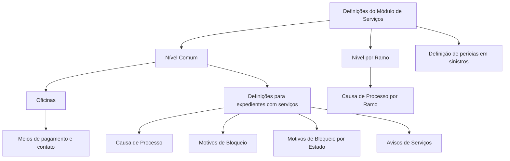

# Definições do Módulo de Serviços Comum e Ramo para Sinistros de Automóvel

## 1. Metadados do Documento
- **Arquivo de Origem:** Não identificado
- **Tipo de Documento:** Especificação Funcional
- **Domínio / Sistema:** Sinistros de Automóvel — Módulo de Serviços
- **Público-Alvo:** Negócio, Analistas Funcionais e Operação
- **Data/Versão Identificada:** Não identificada

---

## 2. Resumo Executivo & Contexto de Negócio

O documento apresenta definições funcionais aplicáveis ao módulo de serviços relacionado a sinistros de automóvel. As definições são organizadas em dois níveis: um nível comum, com elementos não exclusivos de sinistros, e um nível específico por ramo.

No nível comum, o documento identifica cadastros e parametrizações necessários para a definição de perícias. Entre esses elementos está o cadastro de oficinas da companhia, incluindo meios de pagamento e meios de contato.

Também são definidos parâmetros que podem afetar todos os expedientes aos quais um serviço possa ser associado. Esses parâmetros abrangem causas de processo, motivos de bloqueio, motivos de bloqueio condicionados ao estado do serviço e avisos de serviços.

No nível de ramo, o documento estabelece definições aplicáveis a cada ramo. A causa de processo, nesse contexto, permite catalogar motivos para cancelar ou reabrir um serviço por ramo.

---

## 3. Arquitetura, Componentes & Tecnologias Envolvidas

O conteúdo descreve uma organização funcional por níveis de definição:

- **Módulo de Serviços Comum:** contém definições reutilizáveis e não exclusivas de sinistros.
- **Sinistros de Automóvel:** contexto em que as definições são necessárias para a configuração de perícias.
- **Expedientes:** podem receber associação de serviços e são afetados por determinadas definições comuns.
- **Ramo:** nível que contém definições específicas para cada ramo, incluindo causas de processo.
- **Oficinas:** entidades cadastradas com meios de pagamento e contato.
- **Avisos de Serviços:** definidos conforme tipo de serviço, tipo de expediente, nível, trâmite e outros critérios mencionados.
- **Home Solutions APIs Documentation Zeus:** texto citado na extração, sem detalhamento de função, integração ou tecnologia.



> **Nota de Análise:** O documento não detalha interfaces, métodos HTTP, contratos de APIs, bancos de dados, tecnologias de implementação, ambientes ou integrações técnicas.

---

## 4. Regras de Negócio, Especificações Funcionais & Processos

### 4.1 Definições do nível comum

O nível comum contém definições que não são exclusivas do módulo de sinistros, mas são necessárias para realizar a definição de perícias.

#### Oficinas

O cadastro de oficinas deve permitir registrar todas as oficinas da companhia. Para cada oficina, o documento informa a necessidade de registrar:

- Meios de pagamento.
- Meios de contato.
- Outros dados não especificados na extração original.

#### Definições aplicáveis a expedientes associados a serviços

O documento informa que determinadas definições afetam todos os possíveis expedientes aos quais um serviço possa ser associado.

##### Causa de Processo

A causa de processo permite catalogar os motivos pelos quais se deseja:

- Cancelar um serviço.
- Reabrir um serviço.

##### Motivos de Bloqueio

Os motivos de bloqueio permitem catalogar as causas pelas quais um serviço é bloqueado.

##### Motivos de Bloqueio por Estado

Os motivos de bloqueio por estado permitem catalogar as causas de bloqueio de um serviço de acordo com o estado em que o serviço se encontra.

##### Avisos de Serviços

Os avisos de serviços permitem definir avisos considerando, entre outros critérios:

- Tipo de serviço.
- Tipo de expediente.
- Nível.
- Trâmite.

### 4.2 Definições por ramo

No nível de ramo, existem definições específicas para cada ramo.

#### Causa de Processo por Ramo

A causa de processo por ramo permite catalogar os motivos para realizar o cancelamento ou a reabertura de um serviço para cada ramo.

> **Nota de Análise:** O documento não especifica os valores permitidos para causas, motivos, estados, níveis, tipos de expediente, tipos de serviço ou trâmites.

---

## 5. Tabelas de Parâmetros, Ambientes e Estruturas de Dados

| Item / Parâmetro | Descrição / Função | Tipo / Valores / Formato | Ambiente / Observações |
| :--- | :--- | :--- | :--- |
| Nível comum | Agrupa definições não exclusivas do módulo de sinistros, necessárias para a definição de perícias. | Nível funcional de definição. | Aplicável ao módulo de serviços. |
| Oficinas | Registra todas as oficinas da companhia. | Cadastro de entidades. | Inclui meios de pagamento e meios de contato; demais campos não detalhados. |
| Meios de pagamento | Informação associada às oficinas. | Não especificado. | Sem lista de valores no documento. |
| Meios de contato | Informação associada às oficinas. | Não especificado. | Sem lista de valores no documento. |
| Causa de processo — nível comum | Cataloga motivos para cancelar ou reabrir um serviço. | Catálogo de motivos. | Afeta possíveis expedientes associados a um serviço. |
| Motivos de bloqueio | Cataloga causas pelas quais um serviço é bloqueado. | Catálogo de causas. | Aplicável a serviços. |
| Motivos de bloqueio por estado | Cataloga causas de bloqueio conforme o estado do serviço. | Catálogo condicionado por estado. | O documento não lista estados ou causas. |
| Avisos de serviços | Define avisos por critérios de classificação. | Definição de avisos. | Considera tipo de serviço, tipo de expediente, nível, trâmite e outros critérios não detalhados. |
| Ramo | Agrupa definições para cada ramo. | Nível funcional de definição. | Inclui causa de processo por ramo. |
| Causa de processo — ramo | Cataloga motivos para cancelamento ou reabertura de serviço por ramo. | Catálogo de motivos por ramo. | Valores e ramos não especificados. |
| Home Solutions APIs Documentation Zeus | Referência textual presente na extração. | Não especificado. | Não há explicação sobre propósito, integração ou uso. |

---

## 6. Bateria de Perguntas & Respostas para RAG (FAQ Sintético)

### P1: Qual é a finalidade das definições do nível comum no módulo de serviços?
**R:** As definições do nível comum reúnem elementos que não são exclusivos do módulo de sinistros, mas que são necessários para realizar a definição de perícias no contexto de sinistros de automóvel.

### P2: Quais informações devem ser registradas para as oficinas da companhia?
**R:** O documento determina o registro de todas as oficinas da companhia, incluindo seus meios de pagamento e meios de contato. Outros campos do cadastro não são detalhados.

### P3: O que é uma causa de processo no nível comum?
**R:** A causa de processo no nível comum é um catálogo de motivos utilizado para identificar por que se deseja cancelar ou reabrir um serviço.

### P4: Para quais entidades as definições de causa de processo, bloqueio e avisos são aplicáveis?
**R:** Essas definições afetam todos os possíveis expedientes aos quais um serviço possa ser associado.

### P5: Qual é a função dos motivos de bloqueio?
**R:** Os motivos de bloqueio permitem catalogar as causas pelas quais um serviço é bloqueado.

### P6: Qual é a diferença entre motivos de bloqueio e motivos de bloqueio por estado?
**R:** Os motivos de bloqueio catalogam causas de bloqueio de um serviço de forma geral. Os motivos de bloqueio por estado catalogam causas de bloqueio em função do estado em que o serviço se encontra.

### P7: Quais critérios podem ser usados para definir avisos de serviços?
**R:** Os avisos de serviços podem ser definidos por tipo de serviço, tipo de expediente, nível, trâmite e outros critérios indicados genericamente pelo documento.

### P8: O que é definido no nível de ramo?
**R:** O nível de ramo contém definições aplicáveis a cada ramo. O documento cita especificamente a causa de processo por ramo.

### P9: Qual é a função da causa de processo por ramo?
**R:** A causa de processo por ramo permite catalogar os motivos para realizar o cancelamento ou a reabertura de um serviço para cada ramo.

### P10: O documento especifica quais estados de serviço podem ser usados nos motivos de bloqueio por estado?
**R:** Não. O documento apenas informa que o bloqueio pode ser catalogado em função do estado do serviço, sem listar os estados disponíveis.

### P11: O documento descreve APIs ou contratos técnicos para o módulo de serviços?
**R:** Não. Embora a expressão “Home Solutions APIs Documentation Zeus” apareça na extração, não há descrição de endpoints, métodos HTTP, autenticação, payloads ou contratos de integração.

---

## 7. Glossário de Termos, Siglas & Conceitos-Chave

- **Expediente:** Registro ao qual um serviço pode ser associado, conforme o contexto do documento.
- **Oficina:** Entidade da companhia cadastrada com meios de pagamento e meios de contato.
- **Perícia:** Atividade cuja definição depende das definições do nível comum, no contexto de sinistros.
- **Ramo:** Nível de definição utilizado para organizar configurações específicas por ramo.
- **Serviço:** Elemento que pode ser associado a expedientes e que pode ser cancelado, reaberto ou bloqueado.
- **Causa de Processo:** Catálogo de motivos para cancelamento ou reabertura de um serviço.
- **Motivo de Bloqueio:** Causa catalogada para o bloqueio de um serviço.
- **Motivo de Bloqueio por Estado:** Causa catalogada para bloqueio de serviço conforme o seu estado.
- **Aviso de Serviço:** Definição de aviso classificada por critérios como tipo de serviço, tipo de expediente, nível e trâmite.

---

## 8. Notas Críticas, Riscos & Limitações

- O arquivo de origem, a data, a versão e a autoria do documento não foram identificados.
- O documento não detalha os campos completos do cadastro de oficinas além de meios de pagamento e meios de contato.
- Não há catálogo dos valores possíveis para causas de processo, motivos de bloqueio, estados de serviço, ramos, níveis, tipos de serviço, tipos de expediente ou trâmites.
- Não há descrição de fluxos operacionais completos para cancelamento, reabertura, bloqueio ou emissão de avisos.
- Não há especificações técnicas de integrações, APIs, contratos, autenticação, persistência de dados ou ambientes.
- A referência a “Home Solutions APIs Documentation Zeus” não possui detalhamento adicional no conteúdo extraído.

---

## 9. Conteúdo Bruto Estruturado (Referência Fiel)

```text
--- [PÁGINA 1 DE 2] ---

DOCUMENTACIÓN de DEFINICIÓN de
SINIESTROS (Automóvil)
DEFINICIONES - MÓDULO SERVICIOS
COMÚN
En este nivel se encuentran definiciones que NO son exclusivas del
módulo de siniestros, pero son necesarias para poder realizar la
definición de peritaciones. En otros se encuentran:
TALLERES
Registrar todos los talleres de la compañía con sus medios de pago, medio de contacto, etc
GENERAL
 /
 CF
Home Solutions APIs Documentation Zeus
EN


--- [PÁGINA 2 DE 2] ---

En este Nivel se encuentran definiciones que afectarán a todos los
posibles expedientes a los que se les pueda asociar un servicio. Entre
otros se define:
CAUSA PROCESO
Permite catalogar los motivos por los que se
quiere cancelar un servicio o reaperturar un
servicio
MOTIVOS BLOQUEO
Permite catalogar las causas por las que se
bloquea un servicio
MOTIVOS BLOQUEO POR ESTADO
Permite catalogar las causas por las que se
bloquea un servicio en función del estado en
el que se encuentra.
AVISOS SERVICIOS
Permite definir los avisos por tipo de servicio,
tipo de expediente, nivel, trámite etc
RAMO
En este Nivel se encuentran definiciones para cada ramo
CAUSA PROCESO
Permite catalogar los motivos por los que se quiere realizar la cancelación o reapertura de un
servicio para cada ramo
```
