_Transient error (attempt 1/3): Post "https://axet.nttdata.com/api/llm-enabler/v3/ntt/v1/responses": read tcp 100.64.0.1:52180->150.171.110.39:443: read: connection reset by peer. Retrying…_

# Definições do Módulo de Tramitação de Expedientes de Sinistros

## 1. Metadados do Documento
- **Arquivo de Origem:** `Não informado — conteúdo bruto fornecido na solicitação`
- **Tipo de Documento:** Especificação Funcional
- **Domínio / Sistema:** Módulo de sinistros — tramitação de expedientes
- **Público-Alvo:** Analistas funcionais, desenvolvedores, arquitetos, operação e negócio
- **Data/Versão Identificada:** Não identificada

---

## 2. Resumo Executivo & Contexto de Negócio

O documento define elementos de configuração do módulo de tramitação de expedientes de sinistros. As definições estão organizadas em quatro escopos: **Comum**, **Geral**, **Ramo** e **Expediente**. Cada escopo concentra parâmetros que determinam como os expedientes de sinistro são estruturados, classificados, avaliados e controlados.

No escopo **Comum**, o documento apresenta definições não exclusivas do módulo de sinistros, mas necessárias para sua operação. Essas definições incluem estrutura de tramitação, cobertura, franquia e controle técnico. A estrutura de tramitação associa escritórios, supervisores e tramitadores responsáveis pelos expedientes.

No escopo **Geral**, o documento descreve definições aplicáveis a todos os expedientes de sinistro, independentemente do ramo. Destacam-se as características gerais do módulo, causas de processos e tipos de expediente. Essas definições orientam comportamentos operacionais, como a solicitação de causas durante a abertura ou alteração de valoração de um expediente.

No escopo **Ramo**, as configurações são específicas do ramo definido. O documento prevê a associação entre produtos, tipos de danos, coberturas, causas de processo e sub-limites. Dessa forma, o comportamento de um expediente pode variar conforme o produto e o ramo aos quais ele está associado.

No escopo **Expediente**, o documento concentra as definições particulares de cada expediente de sinistro: atributos, estruturas de informações, validações, conceitos de reserva, coberturas afetadas, relação causa-consequência, valores iniciais, valores máximos e controles técnicos. O objetivo é estabelecer as informações, regras de valoração, restrições e condições de paralisação ou autorização da tramitação.

---

## 3. Arquitetura, Componentes & Tecnologias Envolvidas

O documento não descreve arquitetura de infraestrutura, tecnologias de implementação, APIs, protocolos, bancos de dados ou ambientes técnicos. A arquitetura identificada é funcional e hierárquica, organizada por níveis de definição do módulo de sinistros.

### Componentes funcionais identificados

| Componente / Escopo | Finalidade descrita |
| :--- | :--- |
| Comum | Reúne definições não exclusivas do módulo de sinistros, mas necessárias para a definição do módulo. |
| Estrutura de Tramitação | Define escritórios de tramitação de expedientes e associa supervisores e tramitadores. |
| Cobertura | Representa a obrigação principal em um contrato de seguro; existem tipos de cobertura que determinam comportamentos nos processos de emissão e prestações. |
| Franquia | Estabelece a quantia pela qual o segurado responde em caso de sinistro. |
| Controle Técnico | Define erros, tipos de erros e condições relacionadas à tramitação de expedientes. |
| Geral | Reúne definições que afetam todos os possíveis expedientes de um sinistro. |
| Características Gerais | Configura o comportamento de operações de expedientes, incluindo solicitação de causas na abertura ou na alteração de valoração. |
| Causas de Processos | Cataloga os motivos pelos quais uma operação deve ser realizada. |
| Tipo de Expediente | Define tipos de dano. |
| Ramo | Reúne definições exclusivas do ramo em configuração. |
| Sub-limites | Define, por ramo, os tipos de expediente e coberturas que utilizarão sub-limites. |
| Expediente | Reúne definições aplicáveis a cada expediente possível de sinistro. |
| Atributo | Define informações adicionais do expediente. |
| Estrutura | Organiza informações adicionais compostas por atributos, obrigatoriedade e ordem de solicitação. |
| Validações de Informação | Define comportamentos e validações para informações core solicitadas em operações de expedientes. |
| Conceito de Reserva | Determina o detalhamento econômico do expediente. |
| Causa-Consequência | Propõe tipos de expediente que podem ser abertos conforme causa e consequência. |
| Valor Inicial | Define custo médio utilizado para valorar um expediente quando não há valoração clara. |
| Valor Máximo | Determina o valor máximo para valorar uma cobertura e conceito de reserva. |

```mermaid
graph TD
  A[Módulo de Tramitação de Expedientes de Sinistros]

  A --> B[Definições Comuns]
  B --> B1[Estrutura de Tramitação]
  B --> B2[Cobertura]
  B --> B3[Franquia]
  B --> B4[Controle Técnico]

  A --> C[Definições Gerais]
  C --> C1[Características Gerais]
  C --> C2[Causas de Processos]
  C --> C3[Tipo de Expediente]

  A --> D[Definições por Ramo]
  D --> D1[Tipo de Expediente por Produto]
  D --> D2[Causa de Processo por Ramo]
  D --> D3[Sub-limites]

  A --> E[Definições por Expediente]
  E --> E1[Atributo]
  E --> E2[Estrutura]
  E --> E3[Validações de Informação]
  E --> E4[Conceito de Reserva]
  E --> E5[Cobertura]
  E --> E6[Causa-Consequência]
  E --> E7[Valor Inicial]
  E --> E8[Valor Máximo]
  E --> E9[Controle Técnico]
```



> **Nota de Análise:** O documento não detalha interfaces, métodos HTTP, contratos JSON, tecnologias de desenvolvimento, integrações externas ou mecanismos técnicos de persistência.

---

## 4. Regras de Negócio, Especificações Funcionais & Processos

### 4.1 Definições comuns

1. A **estrutura de tramitação** deve permitir a definição dos escritórios onde os expedientes são tramitados.
2. A estrutura de tramitação deve associar supervisores e tramitadores aos escritórios definidos.
3. A **cobertura** é definida como a obrigação principal em um contrato de seguro.
4. Existem diversos tipos de cobertura; esses tipos determinam comportamentos nos processos de emissão e nos processos de prestações.
5. A **franquia** estabelece a quantia pela qual o segurado responde em caso de sinistro.
6. O **controle técnico** deve contemplar a definição de erros e tipos de erros aplicáveis à tramitação de expedientes.

### 4.2 Definições gerais aplicáveis aos expedientes de sinistro

1. As características gerais afetam todos os possíveis expedientes de um sinistro.
2. As características gerais permitem definir o comportamento de operações de expediente.
3. Entre os comportamentos configuráveis, o documento cita a solicitação de causas:
   - Na abertura de expediente.
   - Na alteração de valoração do expediente.
4. As causas de processos permitem catalogar os motivos pelos quais uma operação deve ser realizada.
5. O tipo de expediente permite definir os tipos de dano.

### 4.3 Definições específicas por ramo

1. As definições por ramo são exclusivas do ramo em configuração.
2. O tipo de expediente por ramo permite associar, a cada produto:
   - Os tipos de danos possíveis.
   - As coberturas associadas.
   - As características aplicáveis.
3. A causa de processo por ramo permite catalogar os motivos para realização das operações de expediente em cada ramo.
4. Os sub-limites permitem definir, por ramo:
   - Quais tipos de expediente utilizarão sub-limites.
   - Quais coberturas utilizarão sub-limites.

### 4.4 Definições específicas por expediente

1. Os atributos permitem definir informações adicionais do expediente.
2. A estrutura do expediente é composta por atributos e define:
   - Se a solicitação de uma informação é obrigatória ou não.
   - A ordem em que a informação será solicitada.
3. As validações de informação definem comportamentos e validações para informações core solicitadas durante operações de expediente.
4. O documento apresenta como exemplo de validação a obrigatoriedade da data de declaração de um expediente.
5. O conceito de reserva determina o detalhamento econômico do expediente.
6. Os tipos de conceito de reserva citados são:
   - Indenização.
   - Honorários.
   - Gastos.
7. A cobertura do expediente define, entre as coberturas existentes no produto:
   - Qual cobertura será afetada por cada tipo de expediente.
   - Qual será o comportamento da cobertura afetada.
8. A relação causa-consequência permite propor os possíveis tipos de expediente que poderão ser abertos por causa e consequência.
9. O valor inicial define o custo médio utilizado para valorar um expediente quando não existe uma valoração clara.
10. O valor máximo determina o valor máximo pelo qual uma cobertura e um conceito de reserva podem ser valorados.
11. O controle técnico define as condições nas quais a tramitação de um expediente pode:
    - Ser paralisada.
    - Exigir autorização.

---

## 5. Tabelas de Parâmetros, Ambientes e Estruturas de Dados

| Item / Parâmetro | Descrição / Função | Tipo / Valores / Formato | Ambiente / Observações |
| :--- | :--- | :--- | :--- |
| Estrutura de Tramitação | Define os escritórios onde os expedientes são tramitados e associa supervisores e tramitadores. | Escritórios, supervisores e tramitadores. | Definição comum. |
| Cobertura | Define a obrigação principal em um contrato de seguro e influencia processos de emissão e prestações. | Diversos tipos de cobertura. | Aparece nos níveis Comum e Expediente. |
| Franquia | Define a quantia pela qual o segurado responde em caso de sinistro. | Quantia não especificada. | Definição comum. |
| Controle Técnico | Define erros, tipos de erros e condições para paralisação ou autorização de tramitação. | Erros, tipos de erros e condições. | Aparece nos níveis Comum e Expediente. |
| Características Gerais | Define comportamento das operações de expediente. | Pode incluir solicitação de causas. | Aplicável a todos os expedientes. |
| Causas de Processos | Cataloga motivos para realizar uma operação. | Motivos de operação. | Definição geral. |
| Tipo de Expediente | Define tipos de dano. | Tipos de dano. | Definição geral. |
| Tipo de Expediente por Produto | Associa produtos a tipos de dano, coberturas e características. | Produto, tipo de dano, cobertura e características. | Definição por ramo. |
| Causa de Processo por Ramo | Cataloga motivos para operações de expediente em cada ramo. | Motivos de operação. | Definição por ramo. |
| Sub-limites | Define tipos de expediente e coberturas que utilizarão sub-limites. | Tipo de expediente e cobertura. | Definição por ramo. |
| Atributo | Define informação adicional do expediente. | Informação adicional não detalhada. | Definição por expediente. |
| Estrutura | Organiza atributos, obrigatoriedade de solicitação e ordem de solicitação. | Atributos, obrigatório/não obrigatório e ordem. | Definição por expediente. |
| Validações de Informação | Define validações e comportamentos para informações core do expediente. | Exemplo: data de declaração obrigatória. | Definição por expediente. |
| Conceito de Reserva | Define o detalhamento econômico do expediente. | Indenização, Honorários e Gastos. | Definição por expediente. |
| Cobertura por Tipo de Expediente | Define qual cobertura do produto é afetada e seu comportamento. | Coberturas definidas no produto. | Definição por expediente. |
| Causa-Consequência | Propõe tipos de expediente que podem ser abertos conforme causa e consequência. | Causa, consequência e tipo de expediente. | Definição por expediente. |
| Valor Inicial | Define custo médio para valorar expediente sem valoração clara. | Custo médio. | Definição por expediente. |
| Valor Máximo | Define valor máximo para valorar cobertura e conceito de reserva. | Valor máximo não especificado. | Definição por expediente. |

> **Nota de Análise:** O documento não fornece nomes de servidores, URLs, ambientes, caminhos de logs, formatos de campos, valores numéricos, limites quantitativos ou tipos técnicos de dados.

---

## 6. Bateria de Perguntas & Respostas para RAG (FAQ Sintético)

### P1: Qual é a finalidade da estrutura de tramitação no módulo de sinistros?
**R:** A estrutura de tramitação define os escritórios onde os expedientes são tramitados e permite associar supervisores e tramitadores a esses escritórios.

### P2: O que representa uma cobertura no contexto do documento?
**R:** Cobertura é a obrigação principal em um contrato de seguro. O documento informa que existem diversos tipos de cobertura e que esses tipos determinam o comportamento tanto no processo de emissão quanto no processo de prestações.

### P3: Como a franquia é definida no módulo de tramitação de expedientes?
**R:** A franquia estabelece a quantia pela qual o segurado responde em caso de sinistro. O documento não detalha fórmula, moeda, regras de cálculo ou critérios de aplicação dessa quantia.

### P4: Quais comportamentos podem ser configurados nas características gerais de sinistros?
**R:** As características gerais permitem definir o comportamento das operações de expediente. O documento cita como exemplos a decisão de solicitar causas na abertura do expediente e na alteração de valoração do expediente.

### P5: Para que servem as causas de processos?
**R:** As causas de processos servem para catalogar os motivos pelos quais se deseja realizar uma operação. O documento também prevê causa de processo específica para cada ramo.

### P6: Como o tipo de expediente é utilizado nas definições por ramo?
**R:** Nas definições por ramo, o tipo de expediente permite associar a cada produto os tipos de danos possíveis, suas coberturas e suas características.

### P7: O que os sub-limites definem para um ramo?
**R:** Os sub-limites permitem definir, por ramo, quais tipos de expediente e quais coberturas utilizarão sub-limites. O documento não apresenta critérios de cálculo, valores ou regras adicionais para esses sub-limites.

### P8: Como a estrutura de um expediente controla a solicitação de informações?
**R:** A estrutura do expediente é composta por atributos e permite definir informações adicionais, a obrigatoriedade ou não de solicitar cada informação e a ordem em que as informações serão solicitadas.

### P9: Qual validação de informação é explicitamente exemplificada no documento?
**R:** O documento apresenta como exemplo a configuração que torna obrigatória a data de declaração de um expediente.

### P10: Quais tipos de conceito de reserva são mencionados?
**R:** Os tipos de conceito de reserva mencionados são Indenização, Honorários e Gastos. Esses conceitos determinam o detalhamento econômico do expediente.

### P11: Como é definida a cobertura afetada por um tipo de expediente?
**R:** A configuração de cobertura do expediente define, entre todas as coberturas já definidas no produto, qual cobertura será afetada por cada tipo de expediente e qual será o comportamento dessa cobertura.

### P12: Quando o valor inicial é usado na valoração de um expediente?
**R:** O valor inicial é utilizado como custo médio para valorar um expediente quando não existe uma valoração clara.

### P13: O que o valor máximo restringe?
**R:** O valor máximo determina o valor máximo pelo qual uma cobertura e um conceito de reserva podem ser valorados.

### P14: Em quais situações o controle técnico pode afetar a tramitação de um expediente?
**R:** O controle técnico pode definir as condições em que a tramitação de um expediente pode ser paralisada ou em que a tramitação exige autorização. O documento não detalha quais condições específicas acionam essas regras.

---

## 7. Glossário de Termos, Siglas & Conceitos-Chave

- **Cobertura:** Obrigação principal em um contrato de seguro; seus tipos determinam comportamentos nos processos de emissão e prestações.
- **Conceito de Reserva:** Elemento que determina o detalhamento econômico de um expediente.
- **Controle Técnico:** Definição de erros, tipos de erros e condições para paralisação ou autorização na tramitação de expedientes.
- **Causa-Consequência:** Relação usada para propor possíveis tipos de expediente que poderão ser abertos.
- **Causas de Processos:** Catálogo de motivos pelos quais uma operação é realizada.
- **Expediente:** Unidade de tramitação relacionada a um sinistro; o documento aborda suas informações, validações, valores, coberturas e controles.
- **Franquia:** Quantia pela qual o segurado responde em caso de sinistro.
- **Informação core:** Informação central solicitada nas operações de expediente; o documento não apresenta uma definição adicional.
- **Indenização:** Tipo de conceito de reserva citado no documento.
- **Honorários:** Tipo de conceito de reserva citado no documento.
- **Gastos:** Tipo de conceito de reserva citado no documento.
- **Ramo:** Escopo de definições exclusivas do ramo que está sendo configurado.
- **Sub-limites:** Configuração que define quais tipos de expediente e coberturas utilizarão sub-limites.
- **Tipo de Expediente:** Definição dos tipos de dano e, por ramo, associação com produtos, coberturas e características.
- **Tramitador:** Papel associado aos escritórios onde os expedientes são tramitados.
- **Supervisor:** Papel associado aos escritórios de tramitação de expedientes.
- **Valoração:** Processo mencionado para valorar um expediente, uma cobertura ou um conceito de reserva.

---

## 8. Notas Críticas, Riscos & Limitações

- O documento possui caráter predominantemente funcional e resumido; não especifica arquitetura técnica, tecnologias, integrações, APIs, contratos de dados ou persistência.
- Não foram identificados valores concretos para franquias, sub-limites, valores iniciais ou valores máximos.
- O documento não apresenta critérios detalhados para definir erros, tipos de erros, paralisações de tramitação ou exigências de autorização.
- Não há descrição de papéis, permissões ou matrizes de autorização para supervisores, tramitadores ou outros usuários.
- Não foram identificados ambientes, URLs, servidores, portas, caminhos de logs, mecanismos de auditoria ou processos de implantação.
- O termo **informação core** é mencionado, mas não é definido nem acompanhado de uma lista de campos.
- O documento lista o conceito de cobertura em mais de um nível, mas não detalha a regra de precedência entre definições comuns, por ramo e por expediente.
- O documento apresenta tipos de conceitos de reserva, mas não descreve seus cálculos, ciclo de vida, impactos contábeis ou regras de aprovação.

---

## 9. Conteúdo Bruto Estruturado (Referência Fiel)

```text
--- [PÁGINA 1 DE 4] ---

DOCUMENTACIÓN DEFINICIÓN de
SINIESTROS
DEFINICIONES - MÓDULO TRAMITACIÓN EXPEDIENTES
COMÚN
En este nivel se encuentran definiciones que NO son exclusivas del
módulo de siniestros, pero son necesarias para poder realizar la
definición. Entre otras definiciones se encuentra:
ESTRUCTURA TRAMITACIÓN
Definición de oficinas donde se tramitan
expedientes, se asocian supervisores,
tramitadores
COBERTURA
Obligación principal en un contrato de seguro.
Existen diversos tipos de cobertura que
determinan el comportamiento tanto en el
proceso de emisión, como en el proceso de
prestaciones
 /
 CF
Home Solutions APIs Documentation Zeus
EN


--- [PÁGINA 2 DE 4] ---

FRANQUICIA
Establecer la cantidad por la que el
asegurado responde en caso de siniestro
CONTROL TÉCNICO
Definición de errores, tipos de Errores para
tramitación de expediente
GENERAL
En este nivel se encuentran definiciones que afectarán a todos los
posibles expedientes de un siniestro. Entre otros se define:
CARACTERÍSTICAS GENERALES
Características generales del módulo de
siniestros, permite definir el comportamiento
de las operaciones de expedientes como por
ejemplo si se va a pedir causas en la apertura
de expediente, en al cambio de valoración...
CAUSAS DE PROCESOS
Permite catalogar los motivos por los que se
quiere realizar una operación
TIPO EXPEDIENTE
Permite definir los Tipos de Daño
RAMO
Son exclusivas del ramo que se está definiendo. Por ejemplo:
TIPO EXPEDIENTE
Permite asociar a cada Producto los Tipos de
daños posibles , sus coberturas y sus
características
CAUSA PROCESO
Permite catalogar los motivos por los que se
quiere realizar las operaciones de
expedientes para cada ramo
SUB-LIMITES


--- [PÁGINA 3 DE 4] ---

Permite definir por Ramo, qué tipos de
expediente y coberturas van a utilizar sub-
límites.
EXPEDIENTE
Definiciones que afectan a cada uno de los posibles expedientes del
siniestro
ATRIBUTO
Permite definir la información adicional del
expediente
ESTRUCTURA
Información adicional del expediente
compuesta por atributos, obligatoriedad o no
de pedir información, orden en el que se va a
pedir
VALIDACIONES INFORMACIÓN
Definir comportamientos y validaciones de la
información core, que se pide en las
operaciones de expedientes. Ejemplo poner
obligatoria la fecha de declaración de un
expediente
CONCEPTO RESERVA
Determinar el desglose económico del
expediente. Los tipos de conceptos de
reserva pueden ser Indemnización,
Honorarios o Gastos
COBERTURA
Definir de todas las coberturas definidas en el
producto, cual va a ser afectada por cada uno
de los tipos de expedientes y su
comportamiento
CAUSA-CONSECUENCIA
Permite proponer los posibles Tipos de
Expedientes que se podrán aperturar por
causa consecuencia
VALOR INICIAL
Definición del coste medio con el que se va a
valorar el expediente si no se tiene una
valoración clara
VALOR MÁXIMO
Determinar el importe Máximo por el que se
puede valorar una cobertura concepto de
reserva
CONTROL TÉCNICO


--- [PÁGINA 4 DE 4] ---

Definir en qué condiciones se puede paralizar
la tramitación de un expediente u obligación
de ser autorizada
```
