# Documentação de Definições do Módulo de Tramitação de Sinistros — Automóvel

## 1. Metadados do Documento
- **Arquivo de Origem:** Não identificado no conteúdo fornecido
- **Tipo de Documento:** Especificação Técnica
- **Domínio / Sistema:** Módulo de Tramitação de Sinistros — Automóvel
- **Público-Alvo:** Desenvolvedores, Arquitetos, Operação e Negócio
- **Data/Versão Identificada:** Não identificada

---

## 2. Resumo Executivo & Contexto de Negócio

O documento descreve as definições necessárias para configurar o módulo de tramitação de sinistros no contexto de Automóvel. A estrutura apresentada separa elementos comuns, gerais, específicos de ramo e específicos de sinistro, estabelecendo níveis de definição para suportar a operação de expedientes de sinistros.

No nível **Comum**, o documento inclui cadastros corporativos ou transversais, como companhia, moeda, estrutura geográfica, estrutura comercial, estrutura de produto, estrutura de tramitação e controle técnico. Esses elementos não são exclusivos do módulo de sinistros, mas são necessários para sua definição e operação.

No nível **Geral**, são descritos parâmetros reutilizáveis no módulo de sinistros, incluindo numeração, eventos, características gerais e causas de processos. No nível **Ramo**, são apresentadas definições que se aplicam ao ramo configurado, como extemporaneidade, especialidades de supervisores e tramitadores, causas de processo e características gerais por ramo.

No nível **Sinistro**, o documento detalha definições que afetam todos os possíveis expedientes: causa de origem, consequência, relação causa-consequência, atributos, estruturas de informação adicional, informação inicial, validações de informação e controle técnico. O texto não apresenta fluxos operacionais completos, métodos de integração, contratos técnicos, tecnologias, URLs ou ambientes.

---

## 3. Arquitetura, Componentes & Tecnologias Envolvidas

O documento organiza a configuração do módulo de tramitação de sinistros em quatro níveis funcionais:

- **Comum:** definições corporativas necessárias para o módulo de sinistros.
- **Geral:** definições não exclusivas de um ramo, utilizadas no módulo de sinistros.
- **Ramo:** definições exclusivas do ramo configurado.
- **Sinistro:** definições que afetam os expedientes de sinistro.

Não são citadas tecnologias, linguagens, bancos de dados, APIs, microsserviços, servidores, URLs, mecanismos de autenticação ou ferramentas de implantação.

```mermaid
graph TD
    A[Módulo de Tramitação de Sinistros<br/>Automóvel]

    A --> B[Comum]
    A --> C[Geral]
    A --> D[Ramo]
    A --> E[Sinistro]

    B --> B1[Companhia]
    B --> B2[Moeda]
    B --> B3[Estrutura Geográfica]
    B --> B4[Estrutura Comercial]
    B --> B5[Estrutura Produto]
    B --> B6[Estrutura Tramitação]
    B --> B7[Controle Técnico]

    C --> C1[Numeração]
    C --> C2[Eventos]
    C --> C3[Características Gerais]
    C --> C4[Causas de Processos]

    D --> D1[Extemporaneidade]
    D --> D2[Características Gerais por Ramo]
    D --> D3[Causa Processo]
    D --> D4[Especialidade Supervisores]
    D --> D5[Especialidade Tramitadores]

    E --> E1[Causa Origem]
    E --> E2[Consequência]
    E --> E3[Causa-Consequência]
    E --> E4[Atributo]
    E --> E5[Estrutura]
    E --> E6[Informação Inicial]
    E --> E7[Validações Informação]
    E --> E8[Controle Técnico]
```



**Nota de Análise:** O documento apresenta uma taxonomia de definições funcionais do módulo de sinistros, mas não detalha a implementação técnica, o modelo de dados, os responsáveis pelos cadastros ou os fluxos de aprovação.

---

## 4. Regras de Negócio, Especificações Funcionais & Processos

### 4.1. Definições comuns

As definições comuns não são exclusivas do módulo de sinistros, mas são necessárias para sua configuração:

1. **Companhia:** concentra informações gerais da empresa.
2. **Moeda:** concentra informações gerais das moedas.
3. **Estrutura Geográfica:** representa divisões de um país por zonas.
4. **Estrutura Comercial:** representa divisões organizativas da companhia.
5. **Estrutura Produto:** representa divisões dos ramos.
6. **Estrutura Tramitação:** define os escritórios nos quais os expedientes são tramitados e associa supervisores e tramitadores.
7. **Controle Técnico:** define erros e tipos de erros.

### 4.2. Definições gerais do módulo de sinistros

As definições gerais não são exclusivas de um ramo e são utilizadas pelo módulo de sinistros:

1. **Numeração:** determina quais elementos compõem o número de sinistro e a ordem desses elementos.
2. **Eventos:** registra fenômenos catastróficos ocorridos em uma zona geográfica determinada.
3. **Características Gerais:** determina comportamentos do módulo de sinistros.
4. **Causas de Processos:** cataloga os motivos pelos quais se deseja realizar uma operação.

### 4.3. Definições específicas por ramo

As definições de ramo são exclusivas do ramo em configuração:

1. **Extemporaneidade:** define o número máximo de dias que pode transcorrer entre a data de ocorrência do sinistro e a data em que o sinistro é comunicado à companhia.
2. **Características Gerais por Ramo:** determina comportamentos do módulo de sinistros para cada ramo.
3. **Causa Processo por Ramo:** cataloga os motivos pelos quais se deseja realizar operações de sinistros para cada ramo.
4. **Especialidade Supervisores:** permite especializar supervisores em produtos determinados.
5. **Especialidade Tramitadores:** permite especializar tramitadores em produtos determinados.

### 4.4. Definições aplicáveis ao sinistro

As definições do nível Sinistro afetam todos os possíveis expedientes de sinistro:

1. **Causa Origem:** cataloga as diferentes causas que originam um sinistro.
2. **Consequência:** define os possíveis danos ocasionados por um sinistro, incluindo danos materiais e danos pessoais.
3. **Causa-Consequência:** define, para cada causa de origem de sinistro, os possíveis danos ocorridos.
4. **Atributo:** define informações adicionais do sinistro, como dados de veículo contrário e dados de pessoa lesionada.
5. **Estrutura:** organiza informações adicionais do sinistro compostas por atributos, incluindo obrigatoriedade de coleta e ordem de solicitação das informações.
6. **Informação Inicial:** registra informações prévias para atributos de operações de sinistro, evitando introdução posterior de dados. O exemplo apresentado é preencher a data de comunicação do sinistro com a data do dia.
7. **Validações Informação:** define comportamentos e validações das informações core solicitadas nas operações de sinistros. O exemplo apresentado é tornar obrigatória a hora de declaração de um sinistro.
8. **Controle Técnico:** define as condições em que a tramitação de um sinistro pode ser paralisada ou em que existe obrigação de autorização.

---

## 5. Tabelas de Parâmetros, Ambientes e Estruturas de Dados

| Item / Parâmetro | Descrição / Função | Tipo / Valores / Formato | Ambiente / Observações |
| :--- | :--- | :--- | :--- |
| Companhia | Informação geral da empresa. | Não especificado. | Definição comum. |
| Moeda | Informação geral das moedas. | Não especificado. | Definição comum. |
| Estrutura Geográfica | Divisões do país por zonas. | Zonas geográficas. | Definição comum. |
| Estrutura Comercial | Divisões organizativas da companhia. | Estrutura organizativa. | Definição comum. |
| Estrutura Produto | Divisões dos ramos. | Estrutura de ramos. | Definição comum. |
| Estrutura Tramitação | Define escritórios de tramitação de expedientes e associa supervisores e tramitadores. | Escritórios, supervisores e tramitadores. | Definição comum. |
| Controle Técnico | Define erros e tipos de erros. | Erros e tipos de erros. | Citado nos níveis Comum e Sinistro. |
| Numeração | Determina os elementos que compõem o número de sinistro e sua ordem. | Elementos e ordem. | Definição geral. |
| Eventos | Registra fenômenos catastróficos ocorridos em zona geográfica determinada. | Eventos e zona geográfica. | Definição geral. |
| Características Gerais | Determina comportamentos do módulo de sinistros. | Comportamentos não detalhados. | Definição geral. |
| Causas de Processos | Cataloga motivos para realizar uma operação. | Motivos de operação. | Definição geral. |
| Extemporaneidade | Indica o máximo de dias entre ocorrência e notificação do sinistro à companhia. | Número máximo de dias. | Definição por ramo. |
| Características Gerais por Ramo | Determina comportamentos do módulo de sinistros para cada ramo. | Comportamentos por ramo. | Definição por ramo. |
| Causa Processo por Ramo | Cataloga motivos para operações de sinistro por ramo. | Motivos de operação. | Definição por ramo. |
| Especialidade Supervisores | Especializa supervisores em produtos determinados. | Supervisor e produto. | Definição por ramo. |
| Especialidade Tramitadores | Especializa tramitadores em produtos determinados. | Tramitador e produto. | Definição por ramo. |
| Causa Origem | Cataloga causas que originam sinistros. | Causas de origem. | Definição de sinistro. |
| Consequência | Define danos possíveis do sinistro. | Exemplos: danos materiais e danos pessoais. | Definição de sinistro. |
| Causa-Consequência | Relaciona uma causa de origem aos danos possíveis. | Relação entre causa e consequência. | Definição de sinistro. |
| Atributo | Define informação adicional do sinistro. | Exemplos: dados de veículo contrário e pessoa lesionada. | Definição de sinistro. |
| Estrutura | Agrupa atributos e define obrigatoriedade e ordem de coleta. | Atributos, obrigatoriedade e ordem. | Definição de sinistro. |
| Informação Inicial | Pré-registra informações para atributos de operações de sinistros. | Valores iniciais. | Exemplo: data de comunicação igual à data do dia. |
| Validações Informação | Define comportamentos e validações da informação core. | Regras de validação e obrigatoriedade. | Exemplo: hora de declaração obrigatória. |

**Nota de Análise:** O documento não informa valores concretos de parametrização, formatos de campos, identificadores, ambientes, servidores, URLs, rotas de log ou estruturas físicas de dados.

---

## 6. Bateria de Perguntas & Respostas para RAG (FAQ Sintético)

### P1: Qual é o objetivo das definições comuns no módulo de tramitação de sinistros?
**R:** As definições comuns reúnem elementos que não são exclusivos do módulo de sinistros, mas são necessários para sua configuração. Entre esses elementos estão companhia, moeda, estrutura geográfica, estrutura comercial, estrutura de produto, estrutura de tramitação e controle técnico.

### P2: O que a definição de numeração controla no módulo de sinistros?
**R:** A definição de numeração determina quais elementos farão parte do número de sinistro e em qual ordem esses elementos serão organizados.

### P3: Como o módulo registra fenômenos catastróficos?
**R:** O módulo utiliza a definição de eventos para registrar todos os fenômenos catastróficos ocorridos em uma zona geográfica determinada.

### P4: O que é extemporaneidade no contexto do ramo de sinistros?
**R:** Extemporaneidade permite indicar o número máximo de dias que pode transcorrer entre a data de ocorrência do sinistro e a data em que o sinistro é notificado à companhia.

### P5: Como os supervisores e tramitadores são associados à operação de sinistros?
**R:** A estrutura de tramitação define os escritórios onde os expedientes são tramitados e associa supervisores e tramitadores. Adicionalmente, as definições de especialidade permitem especializar supervisores e tramitadores em produtos determinados.

### P6: Qual é a função da relação causa-consequência em um sinistro?
**R:** A relação causa-consequência permite definir, para cada causa de origem de sinistro, quais danos podem ocorrer em decorrência do sinistro, como danos materiais ou danos pessoais.

### P7: Que tipo de informação pode ser tratada como atributo de um sinistro?
**R:** Um atributo permite definir informações adicionais do sinistro. O documento cita como exemplos os dados do veículo contrário e os dados da pessoa lesionada.

### P8: O que uma estrutura de sinistro define?
**R:** Uma estrutura de sinistro organiza informações adicionais compostas por atributos. A estrutura também determina se determinada informação é obrigatória e a ordem na qual a informação deve ser solicitada.

### P9: Para que serve a informação inicial nas operações de sinistro?
**R:** A informação inicial permite registrar previamente valores para atributos das operações de sinistro, evitando que essas informações precisem ser introduzidas posteriormente. O documento exemplifica o preenchimento da data de comunicação do sinistro com a data do dia.

### P10: Que validações podem ser configuradas para informações de sinistro?
**R:** As validações de informação definem comportamentos e validações para a informação core solicitada nas operações de sinistros. O documento apresenta como exemplo tornar obrigatória a hora de declaração de um sinistro.

### P11: Quando a tramitação de um sinistro pode ser paralisada?
**R:** O controle técnico define as condições nas quais a tramitação de um sinistro pode ser paralisada ou nas quais existe obrigação de autorização. O documento não detalha quais condições, erros ou tipos de autorização são configurados.

### P12: O documento especifica tecnologias, APIs ou contratos de integração do módulo de sinistros?
**R:** Não. O documento descreve definições funcionais e parâmetros de configuração do módulo de tramitação de sinistros, mas não detalha tecnologias, APIs, métodos HTTP, contratos JSON, bancos de dados, servidores ou ambientes.

---

## 7. Glossário de Termos, Siglas & Conceitos-Chave

- **Atributo:** Informação adicional associada a um sinistro, como dados de veículo contrário ou de pessoa lesionada.
- **Causa Origem:** Catálogo de causas que dão origem a um sinistro.
- **Causa-Consequência:** Relação entre uma causa de origem de sinistro e os danos possíveis associados.
- **Causa Processo:** Motivo catalogado para realizar operações de sinistros, inclusive por ramo.
- **Companhia:** Empresa para a qual são mantidas informações gerais.
- **Consequência:** Dano possível decorrente de um sinistro, como dano material ou dano pessoal.
- **Controle Técnico:** Definição de erros, tipos de erros e, no contexto do sinistro, condições de paralisação ou obrigação de autorização.
- **Estrutura Comercial:** Divisão organizativa da companhia.
- **Estrutura Geográfica:** Divisão de um país por zonas.
- **Estrutura Produto:** Divisão dos ramos.
- **Estrutura Tramitação:** Definição de escritórios de tramitação e associação de supervisores e tramitadores.
- **Eventos:** Registro de fenômenos catastróficos em uma zona geográfica determinada.
- **Expediente:** Caso ou processo de sinistro submetido à tramitação.
- **Extemporaneidade:** Número máximo de dias entre a ocorrência do sinistro e sua notificação à companhia.
- **Informação Core:** Informação central solicitada nas operações de sinistro.
- **Informação Inicial:** Informação pré-registrada para atributos de operações de sinistro.
- **Numeração:** Configuração dos elementos e da ordem que compõem o número de sinistro.
- **Ramo:** Contexto de definição específico de um produto ou ramo configurado.
- **Sinistro:** Ocorrência que gera expediente e requer tramitação, definição de causas, consequências, atributos e validações.
- **Supervisor:** Papel associado aos escritórios de tramitação e potencialmente especializado em produtos.
- **Tramitador:** Papel associado aos escritórios de tramitação e potencialmente especializado em produtos.

---

## 8. Notas Críticas, Riscos & Limitações

- O documento não identifica o nome do arquivo de origem, data, versão, autor ou proprietário funcional.
- Não há descrição de arquitetura técnica, componentes de software, integrações, APIs, bancos de dados, ambientes ou mecanismos de segurança.
- Não são informados valores configurados para extemporaneidade, numeração, eventos, causas, consequências, atributos ou validações.
- O controle técnico é citado em mais de um nível, mas o documento não detalha erros, tipos de erro, regras de paralisação ou fluxos de autorização.
- A estrutura de tramitação menciona escritórios, supervisores e tramitadores, mas não define critérios de associação, responsabilidades, permissões ou roteamento de expedientes.
- Não há detalhamento sobre os produtos determinados utilizados nas especialidades de supervisores e tramitadores.
- **Nota de Análise:** O documento apresenta a definição funcional dos elementos configuráveis, mas não fornece procedimentos operacionais para criar, alterar, validar ou publicar essas configurações.

---

## 9. Conteúdo Bruto Estruturado (Referência Fiel)

```text
--- [PÁGINA 1 DE 4] ---

DOCUMENTACIÓN DEFINICIÓN de
SINIESTROS (Automóvil)
DEFINICIONES - MÓDULO TRAMITACIÓN SINIESTROS
COMÚN
En este nivel se encuentran definiciones que NO son exclusivas del
módulo de siniestros, pero son necesarias para poder realizar la
definición. Entre otras definiciones se encuentra:
COMPAÑÍA
Información General de la empresa
MONEDA
Información General de las monedas
ESTRUCTURA GEOGRÁFICA
Divisiones del país por zonas
ESTRUCTURA COMERCIAL
Divisiones organizativas de la compañía
 / 
 CF
Home Solutions APIs Documentation Zeus
EN


--- [PÁGINA 2 DE 4] ---

ESTRUCTURA PRODUCTO
Divisiones de los ramos
ESTRUCTURA TRAMITACIÓN
Definición de oficinas donde se tramitan
expedientes, se asocian supervisores,
tramitadores
CONTROL TÉCNICO
Definición de errores, tipos de Errores
GENERAL
Son definiciones que NO son exclusivas de un ramo y se utilizan en el
módulo de siniestros. Las más importantes son:
NUMERACIÓN 
Determina qué elementos formarán parte del
número de siniestros y en qué orden
EVENTOS :
Registra todos los fenómenos catrastróficos
ocurridos en una zona geográfica
determinada
CARACTERÍSTICAS GENERALES 
Determinar comportamientos del módulo de
siniestros
CAUSAS DE PROCESOS 
Permite catalogar los motivos por los que se
quiere realizar una operación
RAMO
Son exclusivas del ramo que se está definiendo
EXTEMPORANEIDAD
Permite indicar el número máximo de días
que pueden transcurrir entre la fecha de
CARACTERÍSTICAS GENERALES 
Determinar comportamientos del módulo de
siniestros para cada ramo


--- [PÁGINA 3 DE 4] ---

ocurrencia del siniestro y la fecha en la que se
notifica a la compañía
CAUSA PROCESO 
Permite catalogar los motivos por los que se
quiere realizar las operaciones de siniestros
para cada ramo
ESPECIALIDAD SUPERVISORES 
Permite especializar a los supervisores en
Productos determinados
ESPECIALIDAD TRAMITADORES 
Permite especializar a los tramitadores en
Productos determinados
SINIESTRO
En este nivel se encuentran definiciones que afectarán a todos los
posibles expedientes de un siniestro
CAUSA ORIGEN 
Catalogar las diferentes causas que originan
un siniestro
CONSECUENCIA 
Permite definir los posibles daños ocurridos
por el siniestro (Daños materiales, daños
personales...)
CAUSA-CONSECUENCIA 
Permite definir para cada causa de origen de
siniestros las posibles daños ocurridos por el
siniestro (Daños materiales, daños
personales...)
ATRIBUTO
Permite definir la información adicional del
siniestro, como datos vehículo contrario,
datos lesionado, etc.
ESTRUCTURA
Información adicional del siniestro compuesta
por atributos, obligatoriedad o no de pedir
información, orden en el que se va a pedir
INFORMACIÓN INICIAL 
Registrar información previa para los atributos
de las operaciones de siniestros, para no
tener que introducirla posteriormente. Un


--- [PÁGINA 4 DE 4] ---

ejemplo sería la fecha de comunicación del
siniestro que salga la fecha del día
VALIDACIONES INFORMACIÓN 
Definir comportamientos y validaciones de la
información core, que se piden en las
operaciones de siniestros. Ejemplo poner
obligatoria la hora de declaración de un
siniestro
CONTROL TÉCNICO
Definición de en qué condiciones se puede
paralizar la tramitación de un siniestro u
obligación de ser autorizado
```
