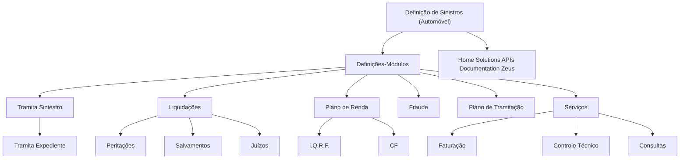

# Documentação de Definição de Sinistros (Automóvel): Módulos e Domínios Funcionais

## 1. Metadados do Documento
- **Arquivo de Origem:** Não identificado
- **Tipo de Documento:** Apresentação Executiva
- **Domínio / Sistema:** Sinistros de Automóvel / Home Solutions APIs Documentation Zeus
- **Público-Alvo:** Negócio, Desenvolvedores, Arquitetos e Operação
- **Data/Versão Identificada:** Não identificada

---

## 2. Resumo Executivo & Contexto de Negócio

O documento apresenta uma estrutura de definições e módulos associados ao domínio de **sinistros de automóvel**. O conteúdo indica que a documentação é orientada à definição e à tipologia de negócio, organizando áreas funcionais relacionadas ao tratamento de sinistros.

Os módulos listados abrangem atividades de tramitação de sinistros e expedientes, liquidações, peritações, salvamentos, juízos, plano de renda, fraude, plano de tramitação, serviços, faturação, controlo técnico e consultas.

O documento também cita **Home Solutions APIs Documentation Zeus**, sem detalhar a natureza da integração, os contratos de API, os métodos HTTP, os endpoints ou os formatos de mensagens associados.

A estrutura disponível é predominantemente uma taxonomia funcional. O material não descreve regras operacionais, responsabilidades por módulo, fluxos de execução, critérios de decisão, dados de entrada, dados de saída ou dependências técnicas entre os componentes.

---

## 3. Arquitetura, Componentes & Tecnologias Envolvidas

Os componentes e áreas funcionais explicitamente citados são:

- Documentação de definição de sinistros de automóvel.
- Tramita Siniestro.
- Tramita Expediente.
- Liquidações.
- Peritações.
- Salvamentos.
- Juízos.
- Plano de Renda.
- I.Q.R.F.
- CF.
- Fraude.
- Plano de Tramitação.
- Serviços.
- Faturação.
- Controlo Técnico.
- Consultas.
- Home Solutions APIs Documentation Zeus.



> **Nota de Análise:** O diagrama representa apenas a hierarquia visual e as relações de agrupamento sugeridas pelo conteúdo bruto. O documento não confirma fluxos de integração, chamadas entre componentes, dependências de execução ou relações de dados.

---

## 4. Regras de Negócio, Especificações Funcionais & Processos

O documento não apresenta regras de negócio detalhadas, condições de validação, fórmulas de cálculo, critérios de elegibilidade, estados processuais ou fluxos operacionais passo a passo.

As informações funcionais identificáveis limitam-se à organização de módulos e submódulos:

1. **Tramita Siniestro** contém o item **Tramita Expediente**.
2. **Liquidações** contém os itens **Peritações**, **Salvamentos** e **Juízos**.
3. **Plano de Renda** contém os itens **I.Q.R.F.** e **CF**.
4. **Serviços** contém os itens **Faturação**, **Controlo Técnico** e **Consultas**.
5. **Fraude** e **Plano de Tramitação** são apresentados como itens funcionais independentes na estrutura fornecida.

> **Nota de Análise:** Não há detalhamento adicional sobre as responsabilidades, entradas, saídas, regras de decisão ou interfaces de cada módulo.

---

## 5. Tabelas de Parâmetros, Ambientes e Estruturas de Dados

| Item / Parâmetro | Descrição / Função | Tipo / Valores / Formato | Ambiente / Observações |
| :--- | :--- | :--- | :--- |
| Definição de Sinistros (Automóvel) | Tema principal da documentação. | Domínio de negócio. | Não há ambiente identificado. |
| Tramita Siniestro | Módulo listado na seção de definições. | Módulo funcional. | Contém Tramita Expediente. |
| Tramita Expediente | Item associado a Tramita Siniestro. | Submódulo funcional. | Não há detalhamento operacional. |
| Liquidações | Módulo listado na seção de definições. | Módulo funcional. | Agrupa Peritações, Salvamentos e Juízos. |
| Peritações | Item associado a Liquidações. | Submódulo funcional. | Não há detalhamento adicional. |
| Salvamentos | Item associado a Liquidações. | Submódulo funcional. | Não há detalhamento adicional. |
| Juízos | Item associado a Liquidações. | Submódulo funcional. | Não há detalhamento adicional. |
| Plano de Renda | Módulo listado na seção de definições. | Módulo funcional. | Agrupa I.Q.R.F. e CF. |
| I.Q.R.F. | Item associado a Plano de Renda. | Sigla ou submódulo. | Significado não definido no documento. |
| CF | Item associado a Plano de Renda. | Sigla ou submódulo. | Significado não definido no documento. |
| Fraude | Módulo listado na estrutura documental. | Módulo funcional. | Não há regras de deteção ou tratamento descritas. |
| Plano de Tramitação | Módulo listado na estrutura documental. | Módulo funcional. | Não há etapas ou estados descritos. |
| Serviços | Módulo listado na estrutura documental. | Módulo funcional. | Agrupa Faturação, Controlo Técnico e Consultas. |
| Faturação | Item associado a Serviços. | Submódulo funcional. | Não há regras de faturação descritas. |
| Controlo Técnico | Item associado a Serviços. | Submódulo funcional. | Não há critérios de controlo descritos. |
| Consultas | Item associado a Serviços. | Submódulo funcional. | Não há mecanismos ou fontes de consulta descritos. |
| Home Solutions APIs Documentation Zeus | Nome citado no documento. | Referência documental ou tecnológica. | Não há APIs, URLs, contratos ou tecnologias especificados. |

---

## 6. Bateria de Perguntas & Respostas para RAG (FAQ Sintético)

### P1: Qual é o domínio de negócio abordado pela documentação?
**R:** A documentação aborda o domínio de definição de sinistros de automóvel, apresentando módulos e áreas funcionais relacionados ao tratamento desse tipo de sinistro.

### P2: Quais módulos estão associados ao tratamento de sinistros no documento?
**R:** O documento lista Tramita Siniestro, Tramita Expediente, Liquidações, Peritações, Salvamentos, Juízos, Plano de Renda, I.Q.R.F., CF, Fraude, Plano de Tramitação, Serviços, Faturação, Controlo Técnico e Consultas.

### P3: Qual submódulo está associado a Tramita Siniestro?
**R:** O conteúdo apresenta Tramita Expediente como item subordinado ou associado ao módulo Tramita Siniestro.

### P4: Quais itens estão agrupados sob Liquidações?
**R:** Liquidações agrupa Peritações, Salvamentos e Juízos.

### P5: Quais itens pertencem ao Plano de Renda?
**R:** O Plano de Renda contém os itens I.Q.R.F. e CF. O documento não expande o significado dessas siglas nem descreve os respetivos processos.

### P6: O documento descreve regras de prevenção ou tratamento de fraude?
**R:** Não. O documento apenas lista Fraude como um módulo ou área funcional, sem apresentar regras, indicadores, fluxos, critérios de deteção ou procedimentos operacionais.

### P7: Quais componentes estão associados ao módulo Serviços?
**R:** O módulo Serviços inclui Faturação, Controlo Técnico e Consultas.

### P8: O que é Home Solutions APIs Documentation Zeus no contexto apresentado?
**R:** Home Solutions APIs Documentation Zeus é uma referência citada no documento. O material não informa se representa um sistema, repositório documental, conjunto de APIs ou plataforma tecnológica, nem fornece endpoints, métodos HTTP ou contratos.

### P9: Existem URLs, ambientes, servidores ou parâmetros técnicos documentados?
**R:** Não. O conteúdo fornecido não contém URLs, nomes de ambientes, servidores, portas, variáveis de configuração, rotas de logs ou parâmetros técnicos.

### P10: O documento define o fluxo de ponta a ponta de um sinistro de automóvel?
**R:** Não. A documentação apresenta uma taxonomia de módulos, mas não descreve a sequência operacional, os gatilhos, os estados de processo, os responsáveis ou as transições entre atividades.

---

## 7. Glossário de Termos, Siglas & Conceitos-Chave

- **Sinistros:** Domínio principal referido no documento, especificamente relacionado a automóvel.
- **Tramita Siniestro:** Módulo listado para tratamento de sinistro.
- **Tramita Expediente:** Item associado a Tramita Siniestro.
- **Liquidações:** Módulo que agrupa Peritações, Salvamentos e Juízos.
- **Peritações:** Item listado sob Liquidações.
- **Salvamentos:** Item listado sob Liquidações.
- **Juízos:** Item listado sob Liquidações.
- **Plano de Renda:** Módulo que agrupa I.Q.R.F. e CF.
- **I.Q.R.F.:** Sigla listada sob Plano de Renda; significado não definido no documento.
- **CF:** Sigla listada sob Plano de Renda; significado não definido no documento.
- **Fraude:** Área funcional listada sem detalhamento adicional.
- **Plano de Tramitação:** Área funcional listada sem detalhamento adicional.
- **Faturação:** Item listado sob Serviços.
- **Controlo Técnico:** Item listado sob Serviços.
- **Consultas:** Item listado sob Serviços.
- **Home Solutions APIs Documentation Zeus:** Referência citada sem descrição técnica adicional.

---

## 8. Notas Críticas, Riscos & Limitações

- O conteúdo possui natureza resumida e não contém especificações técnicas detalhadas.
- Não foram identificados contratos de API, endpoints, métodos HTTP, modelos de dados, estruturas JSON, protocolos ou mecanismos de autenticação.
- Não foram identificados ambientes, servidores, URLs, portas, caminhos de logs ou variáveis de configuração.
- As siglas **I.Q.R.F.** e **CF** não são definidas pelo documento.
- A relação entre módulos é inferida exclusivamente pela indentação apresentada no conteúdo bruto.
- O documento não informa fluxos de processamento, regras de negócio, critérios de validação, responsabilidades organizacionais ou dependências entre equipas.
- **Nota de Análise:** O documento cita “Home Solutions APIs Documentation Zeus”, porém não detalha os métodos HTTP, contratos JSON, integrações ou serviços expostos.

---

## 9. Conteúdo Bruto Estruturado (Referência Fiel)

```text
--- [PÁGINA 1 DE 2] ---

DOCUMENTACIÓN de DEFINICIÓN de
SINIESTROS (Automóvil)
Documentación orientada a la definición y tipo de negocio
DEFINICIONES-MÓDULOS
 TRAMITA SINIESTRO
  TRAMITA EXPEDIENTE
 LIQUIDACIONES
  PERITACIONES
 SALVAMENTOS
  JUICIOS
 PLAN DE RENTA
  I.Q.R.F.
 /
 CF
Home Solutions APIs Documentation Zeus
EN


--- [PÁGINA 2 DE 2] ---

FRAUDE
  PLAN DE TRAMITACIÓN
 SERVICIOS
  FACTURACION
 CONTROL TÉCNICO
  CONSULTAS
```
