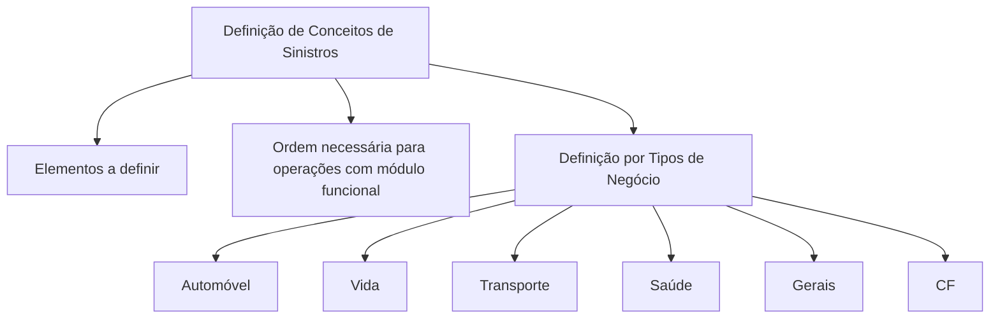

# Definição de Conceitos de Sinistros por Tipos de Negócio

## 1. Metadados do Documento
- **Arquivo de Origem:** `Não identificado`
- **Tipo de Documento:** `Não identificado; conteúdo resumido de apresentação ou documento conceitual`
- **Domínio / Sistema:** `Siniestros (Sinistros); tipos de negócio`
- **Público-Alvo:** `Não identificado`
- **Data/Versão Identificada:** `Não identificada`

---

## 2. Resumo Executivo & Contexto de Negócio

O conteúdo apresenta a definição de conceitos de sinistros, denominados no texto original como “Siniestros”. O objetivo declarado é definir os elementos necessários e a ordem que deve ser seguida para realizar operações com um módulo funcional.

A organização conceitual é estruturada por tipos de negócio. Os tipos explicitamente listados são Automóvel, Vida, Transporte, Saúde, Gerais e CF.

O documento não descreve regras operacionais específicas, etapas detalhadas, responsáveis, contratos de integração, tecnologias ou critérios de validação. Também não esclarece a relação entre os tipos de negócio e o módulo funcional mencionado.

A expressão “Home Solutions APIs Documentation Zeus EN” aparece no conteúdo bruto, mas não possui explicação contextual adicional. Portanto, não é possível afirmar se representa sistema, portal, documentação, ambiente, produto ou outro artefato corporativo.

---

## 3. Arquitetura, Componentes & Tecnologias Envolvidas

O documento não fornece uma arquitetura técnica detalhada, componentes de software, microsserviços, tecnologias, URLs, ambientes ou interfaces. O único elemento funcional citado é um “módulo funcional”, sem identificação técnica.

A estrutura apresentada relaciona a definição de conceitos de sinistros aos tipos de negócio listados.



**Nota de Análise:** O documento menciona um módulo funcional, mas não detalha nome, funcionalidades, operações, métodos, contratos, integrações ou dependências técnicas.

---

## 4. Regras de Negócio, Especificações Funcionais & Processos

O conteúdo estabelece os seguintes pontos conceituais:

1. Existem elementos que precisam ser definidos.
2. Deve existir uma ordem necessária a seguir.
3. A finalidade dessa definição e ordem é permitir operações com um módulo funcional.
4. A definição é organizada por tipos de negócio.
5. Os tipos de negócio apresentados são:
   - Automóvel;
   - Vida;
   - Transporte;
   - Saúde;
   - Gerais;
   - CF.

O documento não especifica:

- quais são os elementos a definir;
- qual é a ordem necessária;
- quais operações são realizadas;
- quais condições validam uma operação;
- quais regras se aplicam a cada tipo de negócio;
- o significado de `CF`;
- o comportamento do módulo funcional.

---

## 5. Tabelas de Parâmetros, Ambientes e Estruturas de Dados

| Item / Parâmetro | Descrição / Função | Tipo / Valores / Formato | Ambiente / Observações |
| :--- | :--- | :--- | :--- |
| Conceitos de Sinistros | Tema central do documento. | Conceito de negócio. | O texto utiliza o termo “Siniestros”. |
| Elementos a definir | Elementos necessários para realizar operações com um módulo funcional. | Não detalhado. | O documento não lista os elementos. |
| Ordem necessária | Sequência que deve ser seguida para realizar operações com um módulo funcional. | Não detalhada. | O documento não apresenta as etapas da ordem. |
| Módulo funcional | Módulo para o qual as operações devem poder ser realizadas. | Não identificado. | Não há nome, tecnologia ou descrição funcional. |
| Automóvel | Tipo de negócio listado. | Categoria de negócio. | Sem regras ou parâmetros associados. |
| Vida | Tipo de negócio listado. | Categoria de negócio. | Sem regras ou parâmetros associados. |
| Transporte | Tipo de negócio listado. | Categoria de negócio. | Sem regras ou parâmetros associados. |
| Saúde | Tipo de negócio listado. | Categoria de negócio. | Sem regras ou parâmetros associados. |
| Gerais | Tipo de negócio listado. | Categoria de negócio. | Sem regras ou parâmetros associados. |
| CF | Tipo de negócio listado. | Sigla ou categoria não expandida. | Significado não identificado no texto. |
| Home Solutions APIs Documentation Zeus EN | Texto presente no conteúdo original. | Não identificado. | Sem contexto suficiente para classificar ou interpretar. |

---

## 6. Bateria de Perguntas & Respostas para RAG (FAQ Sintético)

### P1: Qual é o objetivo da definição de conceitos de sinistros?
**R:** O objetivo declarado é definir os elementos e a ordem necessária para que seja possível realizar operações com um módulo funcional.

### P2: Quais elementos devem ser definidos para operar o módulo funcional?
**R:** O documento afirma que existem elementos que precisam ser definidos, mas não identifica quais são esses elementos.

### P3: O documento informa qual é a ordem necessária para realizar as operações?
**R:** Não. O conteúdo afirma que uma ordem deve ser seguida, porém não apresenta etapas, sequência, critérios ou responsáveis.

### P4: Quais tipos de negócio são contemplados na definição de sinistros?
**R:** Os tipos de negócio listados são Automóvel, Vida, Transporte, Saúde, Gerais e CF.

### P5: Existem regras específicas para sinistros de Automóvel?
**R:** Não. Automóvel é listado como tipo de negócio, mas o documento não detalha regras, processos, parâmetros ou operações específicas para essa categoria.

### P6: O que significa a sigla CF no documento?
**R:** O texto lista “CF” entre os tipos de negócio, mas não apresenta a expansão ou o significado da sigla.

### P7: Qual módulo funcional é citado no documento?
**R:** O documento menciona genericamente um “módulo funcional”, sem informar nome, finalidade detalhada, tecnologia, operações ou integração associada.

### P8: O documento apresenta APIs, URLs ou contratos de integração?
**R:** Não. A expressão “Home Solutions APIs Documentation Zeus EN” está presente no conteúdo bruto, mas não há detalhes sobre APIs, URLs, métodos HTTP, contratos ou sistemas integrados.

### P9: Há ambientes técnicos identificados, como desenvolvimento, homologação ou produção?
**R:** Não. O conteúdo não apresenta ambientes, servidores, endereços, credenciais, parâmetros de implantação ou configurações técnicas.

### P10: O documento define processos de sinistro completos para Vida, Transporte e Saúde?
**R:** Não. Vida, Transporte e Saúde são apenas listados como tipos de negócio; não há processos completos ou regras específicas para essas categorias.

---

## 7. Glossário de Termos, Siglas & Conceitos-Chave

- **Siniestros:** Termo utilizado no documento original para o domínio de sinistros.
- **Módulo funcional:** Módulo mencionado como alvo das operações; não detalhado no conteúdo.
- **Tipos de negócio:** Classificação usada para organizar a definição de conceitos de sinistros.
- **CF:** Categoria ou sigla listada entre os tipos de negócio; significado não definido.
- **Home Solutions APIs Documentation Zeus EN:** Expressão literal presente no documento; sem definição contextual.

---

## 8. Notas Críticas, Riscos & Limitações

- O conteúdo é altamente resumido e não define os elementos necessários para as operações.
- A ordem necessária para operar o módulo funcional é mencionada, mas não é descrita.
- Não há regras de negócio específicas por tipo de negócio.
- O módulo funcional não é identificado nem especificado tecnicamente.
- Não há informações sobre APIs, métodos HTTP, contratos de dados, integrações, tecnologias, ambientes ou logs.
- A sigla `CF` não é expandida.
- A expressão “Home Solutions APIs Documentation Zeus EN” não possui contexto suficiente para interpretação confiável.

---

## 9. Conteúdo Bruto Estruturado (Referência Fiel)

```text
--- [PÁGINA 1 DE 1] ---

DEFINICIÓN de CONCEPTOS de Siniestros
Elementos que se han de definir así como el orden necesario a seguir con el fin de poder realizar
operaciones con un módulo funcional.
DEFINICIÓN POR TIPOS DE NEGOCIO
 AUTOMÓVIL
  VIDA
 TRANSPORTE
  SALUD
 GENERALES
 / 
 CF
Home Solutions APIs Documentation Zeus
EN
```
