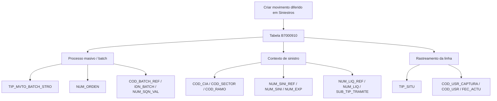

# Criar Movimento Diferido em Siniestros — Visão Técnica e Modelo de Dados B7000910

## 1. Metadados do Documento
- **Arquivo de Origem:** `Não identificado no conteúdo fornecido`
- **Tipo de Documento:** Especificação Técnica
- **Domínio / Sistema:** Siniestros — processos massivos e movimentos em lote
- **Público-Alvo:** Desenvolvedores, Arquitetos, Operação
- **Data/Versão Identificada:** Não identificada

---

## 2. Resumo Executivo & Contexto de Negócio

O documento descreve, em visão técnica, a criação de um movimento diferido no domínio de **Siniestros**. O conteúdo concentra-se no modelo de dados envolvido na operação e identifica a tabela `B7000910` como a estrutura participante.

A tabela `B7000910` é descrita como **MAESTRA PROCESOS MASIVO DE SINIESTROS**. A extração apresenta atributos associados à execução e ao rastreamento de processos massivos, incluindo data de tratamento, tipo de movimento batch, número de ordem, situação da linha, companhia, setor, ramo, sinistro, expediente, liquidação, juízo, inventário, subasta, batch, fraude, IQRF e usuários.

Os campos obrigatórios identificados sustentam a contextualização do processo massivo e da linha processada. Entre eles estão `FEC_TRATAMIENTO`, `TIP_MVTO_BATCH_STRO`, `NUM_ORDEN`, `TIP_SITU`, `COD_CIA`, `COD_SECTOR`, `COD_RAMO`, `NUM_SINI_REF`, `NUM_SINI`, `NUM_EXP`, `NUM_LIQ_REF`, `NUM_LIQ`, `SUB_TIP_TRAMITE`, `COD_USR_CAPTURA`, `COD_USR` e `FEC_ACTU`.

O documento não especifica métodos HTTP, contratos JSON, serviços responsáveis pela operação, regras de transição de estado, mecanismo de processamento assíncrono ou comportamento de falha/reprocessamento. A referência textual a “Home Solutions APIs Documentation Zeus” aparece no conteúdo extraído, mas sem explicação adicional sobre sua relação com a tabela ou com o movimento diferido.

---

## 3. Arquitetura, Componentes & Tecnologias Envolvidas

| Componente / Termo | Papel identificado no documento | Detalhamento disponível |
| :--- | :--- | :--- |
| Movimento diferido em Siniestros | Operação técnica em construção | O documento não detalha o fluxo operacional do movimento. |
| `B7000910` | Tabela envolvida na operação | Descrita como tabela mestra de processos massivos de sinistros. |
| Processo masivo / batch | Contexto de processamento registrado na tabela | Há campos para tipo de movimento batch, número de processo, código batch, identificador batch e sequência. |
| Sinistro | Entidade de negócio referenciada | Há número de sinistro e referência a sinistro de outro sistema. |
| “Home Solutions APIs Documentation Zeus” | Texto presente na extração | Não há contexto suficiente para classificá-lo como sistema, API, ferramenta ou ambiente. |



> **Nota de Análise:** O diagrama representa somente associações deduzidas das descrições de campos e da estrutura apresentada. O documento não descreve integrações entre aplicações, APIs, microsserviços ou fluxos de rede.

---

## 4. Regras de Negócio, Especificações Funcionais & Processos

1. A operação documentada é denominada **“Crear movimiento diferido en Siniestros”** e é apresentada como **“visión técnica”**.
2. A tabela envolvida na operação é `B7000910`, descrita como tabela mestra de processos massivos de sinistros.
3. `FEC_TRATAMIENTO` é obrigatório e representa a data em que é realizado o processo massivo.
4. `TIP_MVTO_BATCH_STRO` é obrigatório e representa o tipo de movimento batch.
5. `NUM_ORDEN` é obrigatório e representa o número do processo massivo.
6. `TXT_ALIAS` não é obrigatório e representa o nome desejado para o processo.
7. `TIP_SITU` é obrigatório e possui o valor indicado `1-Sin Procesar`, descrito como a situação na qual a linha se encontra.
8. `COD_CIA`, `COD_SECTOR` e `COD_RAMO` são obrigatórios e identificam, respectivamente, companhia, setor e ramo.
9. `NUM_SINI_REF` é obrigatório e representa o sinistro de referência de outro sistema.
10. `NUM_SINI` é obrigatório e representa o número de sinistro.
11. `NUM_EXP` é obrigatório e representa o número de expediente.
12. `NUM_LIQ_REF` e `NUM_LIQ` são obrigatórios e representam, respectivamente, o número de liquidação de referência e o número de liquidação.
13. `SUB_TIP_TRAMITE` é obrigatório e representa o tipo de trâmite.
14. Os campos de juízo, inventário, subasta, referência batch, fraude e IQRF aparecem como não obrigatórios.
15. `COD_USR_CAPTURA`, `COD_USR` e `FEC_ACTU` são obrigatórios para registrar o usuário que simula a captura, o usuário atual da linha e a data de atualização da linha.

> **Nota de Análise:** O documento não informa se `TIP_SITU` aceita outros valores além de `1-Sin Procesar`, nem apresenta regras para atualização dessa situação após o processamento.

---

## 5. Tabelas de Parâmetros, Ambientes e Estruturas de Dados

| Item / Parâmetro | Descrição / Função | Tipo / Valores / Formato | Ambiente / Observações |
| :--- | :--- | :--- | :--- |
| `B7000910` | Tabela mestra de processos massivos de sinistros | Não informado | Tabela envolvida na operação. |
| `FEC_TRATAMIENTO` | Data em que é realizado o processo massivo | `S`; valor não aplicável indicado como `N.A.` | Obrigatório: Sim. |
| `TIP_MVTO_BATCH_STRO` | Tipo de movimento batch | `S`; valor não aplicável indicado como `N.A.` | Obrigatório: Sim. |
| `NUM_ORDEN` | Número do processo massivo | `S`; valor não aplicável indicado como `N.A.` | Obrigatório: Sim. |
| `TXT_ALIAS` | Nome desejado para o processo | `S`; valor não aplicável indicado como `N.A.` | Obrigatório: Não. |
| `TIP_SITU` | Situação em que a linha se encontra | `S`; valor indicado: `1-Sin Procesar` | Obrigatório: Sim. |
| `COD_CIA` | Companhia | `S`; valor não aplicável indicado como `N.A.` | Obrigatório: Sim. |
| `COD_SECTOR` | Setor | `S`; valor não aplicável indicado como `N.A.` | Obrigatório: Sim. |
| `COD_RAMO` | Ramo | `S`; valor não aplicável indicado como `N.A.` | Obrigatório: Sim. |
| `NUM_SINI_REF` | Sinistro de referência de outro sistema | `S`; valor não aplicável indicado como `N.A.` | Obrigatório: Sim. |
| `NUM_SINI` | Número de sinistro | `S`; valor não aplicável indicado como `N.A.` | Obrigatório: Sim. |
| `NUM_EXP` | Número de expediente | `S`; valor não aplicável indicado como `N.A.` | Obrigatório: Sim. |
| `NUM_LIQ_REF` | Número de liquidação de referência | `S`; valor não aplicável indicado como `N.A.` | Obrigatório: Sim. |
| `NUM_LIQ` | Número de liquidação | `S`; valor não aplicável indicado como `N.A.` | Obrigatório: Sim. |
| `SUB_TIP_TRAMITE` | Tipo de trâmite | `S`; valor não aplicável indicado como `N.A.` | Obrigatório: Sim. |
| `NUM_JUICIO_REF` | Número de juízo de referência | `S`; valor não aplicável indicado como `N.A.` | Obrigatório: Não. |
| `NUM_JUICIO` | Número de juízo | `S`; valor não aplicável indicado como `N.A.` | Obrigatório: Não. |
| `COD_INVENTARIO_REF` | Inventário de referência | `S`; valor não aplicável indicado como `N.A.` | Obrigatório: Não. |
| `COD_INVENTARIO` | Número de inventário | `S`; valor não aplicável indicado como `N.A.` | Obrigatório: Não. |
| `COD_SUBASTA_REF` | Código de subasta de referência | `S`; valor não aplicável indicado como `N.A.` | Obrigatório: Não. |
| `COD_SUBASTA` | Subasta | `S`; valor não aplicável indicado como `N.A.` | Obrigatório: Não. |
| `COD_BATCH_REF` | Código de referência para processo batch | `S`; valor não aplicável indicado como `N.A.` | Obrigatório: Não. |
| `IDN_BATCH` | Identificador batch | `S`; valor não aplicável indicado como `N.A.` | Obrigatório: Não. |
| `NUM_SQN_VAL` | Número sequencial | `S`; valor não aplicável indicado como `N.A.` | Obrigatório: Não. |
| `IDN_FRAUDE` | Identificador de fraude | `S`; valor não aplicável indicado como `N.A.` | Obrigatório: Não. |
| `IDN_FRAUDE_REF` | Referência de identificador de fraude | `S`; valor não aplicável indicado como `N.A.` | Obrigatório: Não. |
| `IDN_IQRF` | Identificador IQRF | `S`; valor não aplicável indicado como `N.A.` | Obrigatório: Não. |
| `IDN_IQRF_REF` | Referência de identificador IQRF | `S`; valor não aplicável indicado como `N.A.` | Obrigatório: Não. |
| `COD_USR_CAPTURA` | Usuário que simula a captura | `S`; valor não aplicável indicado como `N.A.` | Obrigatório: Sim. |
| `COD_USR` | Usuário atual da linha | `S`; valor não aplicável indicado como `N.A.` | Obrigatório: Sim. |
| `FEC_ACTU` | Data de atualização da linha | `S`; valor não aplicável indicado como `N.A.` | Obrigatório: Sim. |

> **Nota de Análise:** A extração contém a coluna `CAMBIA VALOR`, frequentemente com `S`, mas não define o significado da letra `S`. Portanto, ela foi preservada como valor textual, sem interpretação adicional.

---

## 6. Bateria de Perguntas & Respostas para RAG (FAQ Sintético)

### P1: Qual tabela participa da criação de movimento diferido em Siniestros?
**R:** A tabela identificada no documento é a `B7000910`, descrita como **MAESTRA PROCESOS MASIVO DE SINIESTROS**. O documento a apresenta como a tabela envolvida na operação de criação de movimento diferido em Siniestros.

### P2: Qual é a situação inicial indicada para uma linha do processo massivo?
**R:** O campo `TIP_SITU` possui o valor indicado `1-Sin Procesar`. O documento descreve esse campo como a situação em que a linha se encontra e o classifica como obrigatório.

### P3: Quais campos obrigatórios contextualizam companhia, setor e ramo?
**R:** Os campos obrigatórios são `COD_CIA` para companhia, `COD_SECTOR` para setor e `COD_RAMO` para ramo. Todos aparecem na tabela `B7000910` com obrigatoriedade marcada como “SI”.

### P4: Como o processo massivo é identificado na tabela B7000910?
**R:** O documento associa `NUM_ORDEN` ao número do processo massivo. Também registra campos relacionados a processamento batch, como `TIP_MVTO_BATCH_STRO`, `COD_BATCH_REF`, `IDN_BATCH` e `NUM_SQN_VAL`; porém somente `NUM_ORDEN` e `TIP_MVTO_BATCH_STRO` são identificados como obrigatórios.

### P5: Quais informações de sinistro são obrigatórias para a operação?
**R:** O documento marca como obrigatórios `NUM_SINI_REF`, descrito como sinistro de referência de outro sistema, `NUM_SINI`, descrito como número de sinistro, e `NUM_EXP`, descrito como número de expediente. Também são obrigatórios `NUM_LIQ_REF` e `NUM_LIQ`, referentes à liquidação.

### P6: O alias do processo é obrigatório?
**R:** Não. O campo `TXT_ALIAS`, descrito como o nome desejado para o processo, possui obrigatoriedade marcada como “NO”.

### P7: Quais dados de auditoria de usuário e atualização são obrigatórios?
**R:** `COD_USR_CAPTURA`, `COD_USR` e `FEC_ACTU` são obrigatórios. Eles representam, respectivamente, o usuário que simula a captura, o usuário atual da linha e a data de atualização da linha.

### P8: Os dados de juízo, inventário e subasta são obrigatórios?
**R:** Não. `NUM_JUICIO_REF`, `NUM_JUICIO`, `COD_INVENTARIO_REF`, `COD_INVENTARIO`, `COD_SUBASTA_REF` e `COD_SUBASTA` aparecem com obrigatoriedade marcada como “NO”.

### P9: Há campos de fraude e IQRF na estrutura B7000910?
**R:** Sim. A estrutura inclui `IDN_FRAUDE`, `IDN_FRAUDE_REF`, `IDN_IQRF` e `IDN_IQRF_REF`. Todos são apresentados como não obrigatórios. O documento não define os significados funcionais de “IQRF” nem as regras de uso desses identificadores.

### P10: O documento especifica APIs, URLs ou contratos de integração para criar o movimento diferido?
**R:** Não. Embora o texto extraído contenha a expressão “Home Solutions APIs Documentation Zeus”, não há URL, método HTTP, endpoint, contrato JSON, sistema consumidor ou sistema provedor detalhado no conteúdo fornecido.

---

## 7. Glossário de Termos, Siglas & Conceitos-Chave

- **Siniestros:** Domínio citado no título da operação e na descrição da tabela de processos massivos.
- **`B7000910`:** Tabela descrita como “MAESTRA PROCESOS MASIVO DE SINIESTROS”.
- **Batch:** Termo usado para identificar movimentos e processos em lote.
- **Processo masivo:** Processo massivo relacionado ao tratamento de sinistros.
- **`TIP_MVTO_BATCH_STRO`:** Campo descrito como tipo de movimento batch.
- **`TIP_SITU`:** Campo que identifica a situação em que a linha se encontra.
- **`NUM_SINI`:** Número de sinistro.
- **`NUM_EXP`:** Número de expediente.
- **`NUM_LIQ`:** Número de liquidação.
- **`SUB_TIP_TRAMITE`:** Tipo de trâmite.
- **`IDN_FRAUDE`:** Identificador de fraude.
- **IQRF:** Sigla presente nos campos `IDN_IQRF` e `IDN_IQRF_REF`; significado não definido no documento.
- **Subasta:** Termo presente nos campos `COD_SUBASTA` e `COD_SUBASTA_REF`; sem definição adicional no documento.
- **`S`:** Valor apresentado na coluna “CAMBIA VALOR”; significado não definido no documento.

---

## 8. Notas Críticas, Riscos & Limitações

- O documento não identifica arquivo de origem, autor, data, versão, ambiente ou URL.
- O conteúdo não especifica tipos físicos de dados, tamanhos, chaves primárias, chaves estrangeiras, índices ou restrições de banco de dados para `B7000910`.
- Não há descrição de operações CRUD, métodos HTTP, endpoints, payloads, contratos de integração ou mecanismos de autenticação.
- Não há fluxo detalhado de criação, processamento, conclusão, erro, reprocessamento ou cancelamento do movimento diferido.
- O valor `1-Sin Procesar` é apresentado para `TIP_SITU`, mas não existe matriz de estados ou regras de transição.
- O significado da coluna `CAMBIA VALOR` e do valor `S` não é explicado.
- A expressão “Home Solutions APIs Documentation Zeus” está incompleta no contexto extraído e não deve ser interpretada como evidência de integração técnica específica.

---

## 9. Conteúdo Bruto Estruturado (Referência Fiel)

```text
--- [PÁGINA 1 DE 4] ---

EN CONSTRUCCIÓN
CREAR movimiento diferido en Siniestros
(visión técnica)
Modelo de datos involucrado
Las tablas que intervienen en esta operación son:
B7000910
TABLA DESCRIPCIÓN
B7000910 MAESTRA PROCESOS MASIVO DE SINIESTROS
COLUMNA CAMBIA
VALOR
MOTIVO/VALOR OBLIGATORIA COMENT
FEC_TRATAMIENTO S N.A. SI FECHA E
QUE SE
REALIZA
PROCES
MASIVO
 /
 CF
Home Solutions APIs Documentation Zeus
EN


--- [PÁGINA 2 DE 4] ---

COLUMNA CAMBIA
VALOR
MOTIVO/VALOR OBLIGATORIA COMENT
TIP_MVTO_BATCH_STRO S N.A. SI TIPO DE
MOVIMIE
BATCH
NUM_ORDEN S N.A. SI NUMERO
PROCES
MASIVO
TXT_ALIAS S N.A. NO NOMBRE
SE QUIE
AL PROC
TIP_SITU S 1-Sin Procesar SI SITUACI
LA QUE
ENCUEN
FILA
COD_CIA S N.A. SI COMPAN
COD_SECTOR S N.A. SI SECTOR
COD_RAMO S N.A. SI RAMO
NUM_SINI_REF S N.A. SI SINIEST
REFERE
DE OTRO
SISTEMA
NUM_SINI S N.A. SI SINIEST
NUM_EXP S N.A. SI NUMERO
EXPEDIE
NUM_LIQ_REF S N.A. SI NUMERO
LIQUIDA
DE
REFERE


--- [PÁGINA 3 DE 4] ---

COLUMNA CAMBIA
VALOR
MOTIVO/VALOR OBLIGATORIA COMENT
NUM_LIQ S N.A. SI NUMERO
LIQUIDA
SUB_TIP_TRAMITE S N.A. SI TIPO DE
TRAMITE
NUM_JUICIO_REF S N.A. NO NUMERO
JUICIO D
REFERE
NUM_JUICIO S N.A. NO NUMERO
JUICIO
COD_INVENTARIO_REF S N.A. NO INVENTA
REFERE
COD_INVENTARIO S N.A. NO NUMERO
INVENTA
COD_SUBASTA_REF S N.A. NO CODIGO
SUBAST
REFERE
COD_SUBASTA S N.A. NO SUBAST
COD_BATCH_REF S N.A. NO CODIGO
REFERE
PARA
PROCES
BATCH
IDN_BATCH S N.A. NO IDENTIF
BATCH
NUM_SQN_VAL S N.A. NO SECUEN


--- [PÁGINA 4 DE 4] ---

COLUMNA CAMBIA
VALOR
MOTIVO/VALOR OBLIGATORIA COMENT
IDN_FRAUDE S N.A. NO IDENTIF
DE FRAU
IDN_FRAUDE_REF S N.A. NO REFERE
DE
IDENTIF
DE FRAU
IDN_IQRF S N.A. NO IDENTIF
IQRF
IDN_IQRF_REF S N.A. NO REFERE
DE
IDENTIF
IQRF
COD_USR_CAPTURA S N.A. SI USUARIO
SIMULA
CAPTUR
COD_USR S N.A. SI USUARIO
ACTUAL
FILA
FEC_ACTU S N.A. SI FECHA D
ACTUAL
DE LA FI
```
