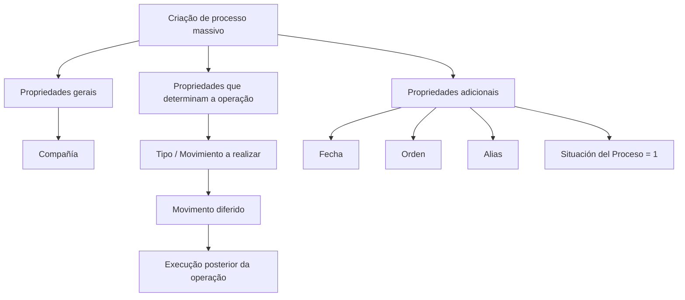

# Criar Movimento Diferido em Sinistros — Processo Massivo

## 1. Metadados do Documento
- **Arquivo de Origem:** Não identificado no conteúdo fornecido
- **Tipo de Documento:** Procedimento funcional / especificação de processo
- **Domínio / Sistema:** Siniestros, Expedientes, Salvamentos, Fraude e I.Q.R.F.
- **Público-Alvo:** Analistas funcionais, operadores e desenvolvedores
- **Data/Versão Identificada:** Não identificada

---

## 2. Resumo Executivo & Contexto de Negócio

O documento descreve a ação **“Crear movimiento diferido en Siniestros”**, identificada como o primeiro passo obrigatório para criar um processo massivo. A finalidade dessa ação é gerar as informações necessárias para executar posteriormente um movimento em modo diferido.

A configuração de um processo massivo exige propriedades gerais, propriedades que determinam a operação e propriedades adicionais. A entidade **Compañía** determina em qual entidade será lançada a operação diferida. O campo **Tipo / Movimiento a realizar** define a ação de negócio que será executada pelo processo.

O catálogo de movimentos cobre operações sobre sinistros, expedientes, liquidações, plano de tramitação, planos de renda mensal, peritagem, salvamentos, processos judiciais, fraude e I.Q.R.F. Alguns tipos resultam em uma operação única; outros podem criar ou modificar dados conforme a existência prévia de registros.

A data do processo massivo identifica quando o processo será executado. O campo **Orden** permite diferenciar múltiplos processos massivos criados na mesma data, enquanto **Alias** adiciona uma descrição operacional ao processo. Na criação, a **Situación del Proceso** deve conter o valor `'1'`, que indica que o processo ainda não foi processado.

> **Nota de Análise:** O conteúdo fornecido descreve tipos de movimento e seus efeitos funcionais, mas não detalha interface, métodos HTTP, contratos JSON, banco de dados, autenticação, agendamento, mecanismo de execução ou transições posteriores do estado do processo.

---

## 3. Arquitetura, Componentes & Tecnologias Envolvidas

Os componentes funcionais explicitamente citados são:

| Componente / Conceito | Papel descrito |
| :--- | :--- |
| Processo massivo | Processo configurado para executar um movimento de forma diferida. |
| Movimento diferido | Operação gerada para execução posterior. |
| Compañía | Entidade na qual a operação diferida será lançada. |
| Tipo / Movimiento a realizar | Propriedade que define a operação do processo massivo. |
| Siniestro | Entidade de sinistro sobre a qual podem ocorrer abertura, modificação, terminação, reabilitação, fraude e I.Q.R.F. |
| Expediente | Entidade relacionada a sinistros, sujeita a abertura, modificação, terminação, reabilitação, avaliação, liquidação e plano de tramitação. |
| Plan de tramitación | Estrutura de tramitação de expediente que inclui avisos, anotações, níveis e trâmites. |
| P.R.M. / Plan de Renta Mensual | Plano de renda mensal associado a um expediente. |
| Peritación | Processo que inclui solicitação, resultado, detalhe de danos e ordens de reparação. |
| Salvamentos | Domínio de inventários, salvamentos, subastas, associação, anulação, liberação e venda. |
| Juicio | Domínio judicial que inclui demanda, sentença, expediente e intervenção. |
| Fraude | Registro de fraude associado a sinistro ou expediente. |
| I.Q.R.F. | Registro associado a sinistro ou expediente; a sigla não é expandida pelo documento. |



> **Nota de Análise:** O diagrama representa exclusivamente a relação funcional informada no documento. Não há detalhamento de sistemas externos, microsserviços, camadas técnicas, filas, APIs ou infraestrutura.

---

## 4. Regras de Negócio, Especificações Funcionais & Processos

### 4.1. Criação do processo massivo

1. Criar um movimento diferido em Siniestros é o primeiro passo para criar um processo massivo.
2. A ação é obrigatória para a criação de um processo massivo.
3. O objetivo é gerar a informação necessária para realizar um movimento que será executado de forma diferida.
4. O processo deve receber propriedades gerais, propriedades que determinam a operação e propriedades adicionais.
5. A propriedade **Compañía** identifica a entidade em que será lançada a operação diferida.
6. A propriedade **Tipo / Movimiento a realizar** determina a operação que será executada de forma diferida.
7. A propriedade **Fecha** representa a data do processo massivo.
8. É permitido criar mais de um processo massivo na mesma data.
9. A propriedade **Orden** diferencia um processo de outro quando ambos pertencem ao mesmo dia.
10. A propriedade **Alias** permite descrever de forma concreta o processo massivo definido.
11. Na criação de um processo massivo, a propriedade **Situación del Proceso** deve conter o valor `'1'`, indicando que o processo não foi processado.

### 4.2. Regras por tipo de movimento

| Código | Movimento | Regra funcional / operação executada |
| :--- | :--- | :--- |
| 10 | Apertura de Siniestro | Abre um sinistro e tenta abrir expedientes; executa **APERTURAR siniestro**. |
| 11 | Modificación de Siniestro | Modifica os dados de um sinistro; executa **MODIFICAR siniestro**. |
| 12 | Terminación de Siniestro | Termina sinistros que não tenham expedientes; executa **TERMINAR siniestro**. |
| 14 | Rehabilitación de Siniestro | Reabilita um sinistro terminado para incluir um novo expediente; executa **REHABILITAR siniestro**. |
| 20 | Apertura de Expediente desde el Batch de Siniestros | Abre um novo expediente com valorização média; executa **APERTURAR expediente desde Batch de Siniestros** e **CREAR valoración Expediente**. |
| 21 | Apertura de Expediente | Abre um novo expediente com valorização média; executa **APERTURAR expediente** e **CREAR valoración Expediente**. |
| 22 | Modificación de Expediente | Modifica somente os dados de um expediente; executa **MODIFICAR expediente**. |
| 23 | Terminación de Expediente | Termina expedientes; executa **TERMINAR expediente**. |
| 24 | Rehabilitación de Expediente | Reabilita um expediente terminado; executa **REHABILITAR expediente**. |
| 25 | Cambio de Valoración de Expediente | Modifica a valorização de um expediente pendente; executa **MODIFICAR valoración expediente**. |
| 30 | Liquidación de Expediente | Gera uma liquidação de expediente e uma ordem de pagamento; executa **LIQUIDAR expediente**. |
| 31 | Rectificación de Liquidación | Modifica uma liquidação e a ordem de pagamento quando a liquidação não estiver paga; executa **MODIFICAR liquidación**. |
| 32 | Anulación de Liquidación | Anula uma liquidação e a ordem de pagamento quando a liquidação não estiver paga; executa **ANULAR liquidación**. |
| 33 | Justificante suelto (Liquidación a Expediente Terminado) | Gera uma liquidação quando o expediente estiver terminado; executa **GENERAR liquidación**. |
| 40 | Crear Aviso | Gera um novo aviso no plano de tramitação de um expediente; executa **CREAR aviso**. |
| 41 | Crear Anotaciones Libres | Gera uma anotação livre no plano de tramitação de um expediente; executa **CREAR anotación**. |
| 42 | Crear Nivel en el Plan | Gera um nível no plano de tramitação de um expediente; executa **CREAR nivel**. |
| 43 | Crear Trámite en el Plan | Gera um trâmite no plano de tramitação de um expediente; executa **CREAR trámite**. |
| 44 | Reasignar Tramitador Expediente | Altera o tramitador de um expediente; executa **REASIGNAR tramitador**. |
| 46 | Finalizar Trámite Pendiente | Finaliza um trâmite do plano de tramitação de um expediente; executa **FINALIZAR trámite**. |
| 50 | Plan de Renta Mensual | Cria um plano de renda mensal para um expediente; executa **CREAR plan de renta mensual**. |
| 51 | Anulación de un P.R.M. | Anula o plano de renda mensal de um expediente; executa **ANULAR plan de renta**. |
| 52 | Terminación de un P.R.M. | Termina o plano de renda mensal de um expediente; executa **TERMINAR plan de renta**. |
| 53 | Terminación de un P.R.M. sin anular | Termina um plano de renda mensal de expediente sem anulá-lo; executa **TERMINAR plan de renta sin anular**. |
| 60 | Solicitud y Resultado de la Peritación | Cria ou modifica a solicitação de peritagem conforme sua existência; também pode criar ou modificar o resultado se este não estiver informado. Pode executar **CREAR solicitud peritacion**, **MODIFICAR solicitud peritacion**, **CREAR resultado peritacion** e **MODIFICAR resultado peritacion**. |
| 61 | Crear Modificar Detalle de daños | Cria, se não existir, ou modifica o detalhe de danos da peritagem; pode executar **CREAR Detalle de daños** e **MODIFICAR peritación**. |
| 62 | Crear Órdenes de Reparación | Gera uma ordem de reparação se ela não existir e a modifica se existir; executa **CREAR orden reparación** e **MODIFICAR orden reparación**. |
| 70 | Entrada y Salida de un inventario en Salvamentos | Gera a entrada de um inventário e, se o inventário já estiver registrado, gera sua saída; pode executar **CREAR entrada inventario** e **CREAR salida inventario**. |
| 71 | Actualización del Inventario en Salvamentos | Gera a informação do inventário e, se já estiver registrado, gera sua atualização; pode executar **CREAR salvamento** e **MODIFICAR salvamento**. |
| 72 | Crear y Modificar Subastas | Cria uma subasta se não existir ou a modifica se existir; pode executar **CREAR Subasta** e **MODIFICAR Subasta**. |
| 73 | Selección de Inventarios a Subasta y Asociación de Expedientes a Inventarios | Associa um sinistro ou expediente a um inventário e associa um inventário a uma subasta; pode executar **ASOCIAR siniestro salvamento**, **ASOCIAR expediente salvamento** e **ASOCIAR inventario subasta**. |
| 74 | Anulación de inventario | Anula um inventário de salvamentos; executa **ANULAR inventario**. |
| 75 | Anulación Salvamento | Atualiza uma subasta anulando um inventário que não pôde ser vendido e não poderá ser vendido; executa **ANULAR inventario**. |
| 76 | Liberación Salvamento | Atualiza uma subasta, liberando um inventário e deixando-o pendente para associação a outra subasta; executa **LIBERAR inventario**. |
| 77 | Venta del Inventario | Atualiza uma subasta e marca o inventário como vendido, atualizando os dados da venda; executa **VENDER inventario**. |
| 80 | Siniestros judiciales | Cria ou modifica dados de demanda de um juízo; pode executar **CREAR juicio demanda**, **MODIFICAR juicio demanda**, **ASOCIAR juicio expediente**, **CREAR juicio intervención** e **MODIFICAR juicio intervención**. |
| 81 | Crear Datos de la Sentencia | Cria ou modifica dados de sentença de um juízo; pode executar **CREAR juicio sentencia**, **MODIFICAR juicio sentencia**, **ASOCIAR juicio expediente**, **CREAR juicio intervención** e **MODIFICAR juicio intervención**. |
| 110 | Crear Fraude Siniestro | Gera um novo fraude para um sinistro; executa **CREAR fraude**. |
| 111 | Modificar Fraude sinestro | Gera uma modificação em um fraude de sinistro; executa **MODIFICAR fraude**. |
| 112 | Crear Fraude Expediente | Gera um novo fraude para um expediente; executa **CREAR fraude expediente**. |
| 114 | Modificar Fraude Expediente | Gera uma modificação em um fraude de expediente; executa **MODIFICAR fraude expediente**. |
| 115 | Crear I.Q.R.F. Siniestro | O texto informa que gera uma modificação em um I.Q.R.F. de sinistro; executa **MODIFICAR i.q.r.f.** |
| 116 | Modificar I.Q.R.F. Siniestro | Gera uma modificação em um I.Q.R.F. de sinistro; executa **MODIFICAR i.q.r.f.** |
| 117 | Crear I.Q.R.F. Expediente | Gera um novo I.Q.R.F. para um expediente; executa **CREAR i.q.r.f expediente**. |
| 118 | Modificar I.Q.R.F. Expediente | Gera uma modificação em um I.Q.R.F. de expediente; executa **MODIFICAR i.q.r.f. expediente**. |

---

## 5. Tabelas de Parâmetros, Ambientes e Estruturas de Dados

### 5.1. Propriedades do processo massivo

| Item / Parâmetro | Descrição / Função | Tipo / Valores / Formato | Ambiente / Observações |
| :--- | :--- | :--- | :--- |
| Compañía | Define a entidade em que a operação diferida será lançada. | Não detalhado | Propriedade geral. |
| Tipo / Movimiento a realizar | Define a operação que será executada de forma diferida. | Códigos de movimento listados no catálogo funcional | Propriedade que determina a operação. |
| Fecha | Data do processo massivo. | Data; formato não detalhado | Propriedade adicional. |
| Orden | Diferencia processos massivos criados na mesma data. | Número; formato não detalhado | Propriedade adicional. |
| Alias | Descrição para identificar concretamente o processo massivo. | Texto; formato não detalhado | Propriedade adicional. Exemplo fornecido: “Aperturas Centro Telefónico de agosto”. |
| Situación del Proceso | Indica o estado do processo massivo. | `'1'` na criação | O valor `'1'` indica que o processo não foi processado. |

### 5.2. Restrições funcionais explícitas

| Item / Parâmetro | Descrição / Função | Tipo / Valores / Formato | Ambiente / Observações |
| :--- | :--- | :--- | :--- |
| Tipo 12 — Terminación de Siniestro | Permite terminar sinistros. | Sem expedientes | O sinistro deve não ter expedientes. |
| Tipo 14 — Rehabilitación de Siniestro | Permite reabilitar sinistro terminado. | Inclusão de novo expediente | Aplicável para incluir novo expediente. |
| Tipo 25 — Cambio de Valoración de Expediente | Modifica a valorização do expediente. | Expediente pendente | Aplicável somente a expediente pendente. |
| Tipo 31 — Rectificación de Liquidación | Modifica liquidação e ordem de pagamento. | Liquidação não paga | Não aplicável quando a liquidação estiver paga. |
| Tipo 32 — Anulación de Liquidación | Anula liquidação e ordem de pagamento. | Liquidação não paga | Não aplicável quando a liquidação estiver paga. |
| Tipo 33 — Justificante suelto | Gera liquidação. | Expediente terminado | Aplicável quando o expediente estiver terminado. |
| Tipo 60 — Resultado de la Peritación | Modifica resultado de peritagem. | Resultado não informado | A modificação ocorre se o resultado não estiver informado. |
| Tipo 70 — Salida de inventario | Gera saída de inventário. | Inventário já registrado | A saída é gerada se o inventário já estiver registrado. |
| Tipo 72 — Modificar Subasta | Modifica uma subasta. | Subasta existente | A criação ocorre se a subasta não existir. |
| Tipo 76 — Liberación Salvamento | Libera inventário de uma subasta. | Inventário pendente | O inventário fica disponível para associação a outra subasta. |
| Tipo 75 — Anulación Salvamento | Anula inventário em uma subasta. | Inventário não vendido e não vendável | O documento declara que o inventário não pôde e não poderá ser vendido. |

> **Nota de Análise:** O documento não informa URLs, portas, servidores, ambientes, logs, esquemas de banco, estruturas JSON, nomes de APIs ou variáveis de configuração.

---

## 6. Bateria de Perguntas & Respostas para RAG (FAQ Sintético)

### P1: Qual é o objetivo de criar um movimento diferido em Siniestros?
**R:** O objetivo é gerar a informação necessária para realizar um movimento que será executado de forma diferida. A criação desse movimento é apresentada como o primeiro passo obrigatório para criar um processo massivo.

### P2: Quais propriedades são necessárias para criar um processo massivo?
**R:** O documento organiza as informações em propriedades gerais, propriedades que determinam a operação e propriedades adicionais. As propriedades explicitamente detalhadas são Compañía, Tipo / Movimiento a realizar, Fecha, Orden, Alias e Situación del Proceso.

### P3: Qual valor deve ser informado em Situación del Proceso ao criar um processo massivo?
**R:** A Situación del Proceso deve conter o valor `'1'` durante a criação do processo massivo. Esse valor indica que o processo ainda não foi processado.

### P4: Como diferenciar dois processos massivos criados na mesma data?
**R:** A propriedade **Orden** diferencia um processo massivo de outro no mesmo dia. O documento também informa que o sistema permite criar mais de um processo massivo em uma mesma data.

### P5: O que o tipo de movimento 20 executa?
**R:** O tipo 20, **Apertura de Expediente desde el Batch de Siniestros**, abre um novo expediente com valorização média. O processo executa as operações **APERTURAR expediente desde Batch de Siniestros** e **CREAR valoración Expediente**.

### P6: Em que condição a retificação ou a anulação de uma liquidação pode ocorrer?
**R:** Os movimentos 31 e 32 somente se aplicam quando a liquidação não estiver paga. O tipo 31 modifica uma liquidação e a ordem de pagamento; o tipo 32 anula a liquidação e a ordem de pagamento.

### P7: Qual movimento é usado para criar ou modificar a solicitação e o resultado de uma peritagem?
**R:** O movimento 60, **Solicitud y Resultado de la Peritación**, cria ou modifica a solicitação de peritagem conforme sua existência. Também pode criar o resultado ou modificá-lo caso o resultado ainda não esteja informado.

### P8: O que acontece no movimento 70 de Salvamentos?
**R:** O movimento 70, **Entrada y Salida de un inventario en Salvamentos**, gera a entrada de um inventário. Se o inventário já estiver registrado, o processo gera a saída do inventário. As operações possíveis são **CREAR entrada inventario** e **CREAR salida inventario**.

### P9: Como um inventário pode ser liberado de uma subasta?
**R:** O movimento 76, **Liberación Salvamento**, atualiza uma subasta liberando o inventário. O inventário liberado fica pendente para poder ser associado a outra subasta, e a operação executada é **LIBERAR inventario**.

### P10: Quais operações podem ser realizadas pelo movimento 80 de Siniestros judiciales?
**R:** O movimento 80 cria ou modifica dados de demanda de um juízo. As operações possíveis são **CREAR juicio demanda**, **MODIFICAR juicio demanda**, **ASOCIAR juicio expediente**, **CREAR juicio intervención** e **MODIFICAR juicio intervención**.

### P11: Qual é a diferença entre os movimentos 110 e 112?
**R:** O movimento 110 cria um novo fraude para um sinistro e executa **CREAR fraude**. O movimento 112 cria um novo fraude para um expediente e executa **CREAR fraude expediente**.

### P12: O documento detalha APIs, métodos HTTP ou contratos JSON para os movimentos diferidos?
**R:** Não. O conteúdo fornecido apresenta os tipos de movimento e os efeitos funcionais, mas não descreve APIs, métodos HTTP, contratos JSON, endpoints, autenticação ou estruturas de integração.

---

## 7. Glossário de Termos, Siglas & Conceitos-Chave

- **Alias:** Descrição que permite identificar concretamente um processo massivo definido.
- **Batch de Siniestros:** Referência usada no movimento 20 para abertura de expediente a partir do batch de sinistros; o documento não detalha sua implementação.
- **Compañía:** Entidade em que será lançada a operação diferida.
- **Expediente:** Entidade operacional associada a sinistros, sujeita a abertura, modificação, terminação, reabilitação, liquidação e outros movimentos.
- **Fecha:** Data do processo massivo.
- **I.Q.R.F.:** Sigla mencionada em movimentos associados a sinistro e expediente; o significado da sigla não é informado.
- **Inventario:** Registro de inventário utilizado no domínio de Salvamentos.
- **Liquidación:** Liquidação de expediente que pode gerar ou estar associada a uma ordem de pagamento.
- **Movimiento diferido:** Movimento preparado para execução posterior.
- **Orden:** Propriedade que diferencia processos massivos criados na mesma data.
- **P.R.M.:** Plan de Renta Mensual.
- **Peritación:** Processo que contempla solicitação, resultado, detalhe de danos e ordens de reparação.
- **Plan de tramitación:** Plano de tramitação de um expediente, no qual podem ser criados avisos, anotações, níveis e trâmites.
- **Proceso masivo:** Processo configurado para realizar um movimento de forma diferida.
- **Salvamentos:** Domínio funcional que inclui inventários, subastas, entradas, saídas, associações, anulações, liberação e venda.
- **Siniestro:** Entidade de sinistro.
- **Situación del Proceso:** Propriedade que indica o estado do processo; o valor `'1'` representa processo não processado.
- **Subasta:** Entidade de leilão associada a inventários no domínio de Salvamentos.
- **Tramitador:** Responsável pelo tratamento de um expediente.
- **Juicio:** Entidade de processo judicial, incluindo demanda, sentença e intervenção.

---

## 8. Notas Críticas, Riscos & Limitações

- O conteúdo está identificado com a expressão **“EN CONSTRUCCIÓN”**, indicando que pode representar documentação em elaboração.
- Não há identificação do nome do arquivo, data, versão, autoria ou sistema de origem completo.
- Não são descritos endpoints, protocolos, métodos HTTP, payloads, contratos de integração, persistência, logs, permissões ou tratamento de erros.
- Não há detalhamento sobre como ocorre a execução diferida após a criação do processo massivo.
- O documento informa apenas o valor inicial `'1'` para **Situación del Proceso**; outros estados e suas transições não são detalhados.
- O texto do movimento **115 — Crear I.Q.R.F. Siniestro** declara “crear” no título, mas descreve uma modificação e a operação **MODIFICAR i.q.r.f.**. Essa inconsistência deve ser validada com o responsável funcional.
- O movimento **71** contém redação ambígua sobre inventário “já registrado”, mas lista as operações **CREAR salvamento** e **MODIFICAR salvamento**.
- A sigla **I.Q.R.F.** não é expandida nem definida no conteúdo.
- Não há detalhamento adicional sobre o exemplo de Alias, além de “Aperturas Centro Telefónico de agosto” e referências a números de ordem 1 e 2.

---

## 9. Conteúdo Bruto Estruturado (Referência Fiel)

```text
--- [PÁGINA 1 DE 7] ---

EN CONSTRUCCIÓN
CREAR movimiento diferido en Siniestros
(enlace con visión técnica)
¿En que consiste?
Esta acción supone el primer paso que se debe realizar para crear un proceso masivo. Esta acción
además, es obligatoria realizarla.
Objetivo
Genera la información necesaria que permitirá realizar un movimiento que se ejecutará de forma
diferida.
Proceso a seguir
En este caso hay indicar información a las siguientes propiedades:
CREAR proceso masivo Siniestros
Propiedades generales
Propiedades que determinan la operación a realizar
Propiedades adicionales a la operación
Propiedades generales
 /
 CF
Home Solutions APIs Documentation Zeus
EN


--- [PÁGINA 2 DE 7] ---

Compañía
Entidad en la que se lanzará la operación en diferido.
Propiedades que determinan la operación a realizar (Tipo)
Movimiento a realizar
Determina la operación que se realizará en diferido.
Los posibles movimientos se encuentran detallados a continuación:
10 Apertura de Siniestro
Abre un siniestro e intenta abrir expedientes, por lo que la operación que se ejecuta es APERTURAR
siniestro.
11 Modificación de Siniestro
Modifica los datos de un siniestro, por lo que la operación que se ejecuta es MODIFICAR siniestro.
12 Terminación de Siniestro
Termina siniestros que no tengan expedientes, por lo que la operación que se ejecuta es TERMINAR
siniestro.
14 Rehabilitación de Siniestro
Rehabilita un siniestro que está terminado, para incluir un nuevo expediente, por lo que la operación
que se ejecuta es REHABILITAR siniestro.
20 Apertura de Expediente desde el Batch de Siniestros
Abre un nuevo expediente con valoración promedio. Este proceso ejecuta varias operaciones:
APERTURAR expediente desde Batch de Siniestros.
CREAR valoración Expediente
21 Apertura de Expediente
Abre un nuevo expediente con valoración promedio. Este proceso ejecuta distintas operaciones:
APERTURAR expediente.
CREAR valoración Expediente
22 Modificación de Expediente
Modifica sólo los datos de un expediente, por lo que la operación que se ejecuta es MODIFICAR
expediente.
23 Terminación de Expediente


--- [PÁGINA 3 DE 7] ---

Termina expedientes, por lo que la operación que se ejecuta es TERMINAR expediente.
24 Rehabilitación de Expediente
Rehabilita un expediente que está terminado, por lo que la operación que se ejecuta es
REHABILITAR expediente.
25 Cambio de Valoración de Expediente
Modifica la valoración de un expediente que está pendiente, por lo que la operación que se ejecuta
es MODIFICAR valoración expediente.
30 Liquidación de Expediente
Genera una liquidación de expediente, una orden de pago, por lo que la operación que se ejecuta es
LIQUIDAR expediente.
31 Rectificación de Liquidación
Modifica una liquidación de expediente y la orden de pago, siempre y cuando no esté pagada, por lo
que la operación que se ejecuta es MODIFICAR liquidación.
32 Anulación de Liquidación
Anula una liquidación de expediente y la orden de pago, siempre y cuando no esté pagada, por lo
que la operación que se ejecuta es ANULAR liquidación.
33 Justificante suelto (Liquidación a Expediente Terminado)
Genera una liquidación, cuando el expediente está terminado por lo que la operación que se ejecuta
es GENERAR liquidación.
40 Crear Aviso
Genera un nuevo Aviso en el plan de tramitación de un expediente, por lo que la operación que se
ejecuta es CREAR aviso.
41 Crear Anotaciones Libres
Genera una Anotación libre en el plan de tramitación de un expediente, por lo que la operación que
se ejecuta es CREAR anotación.
42 Crear Nivel en el Plan
Genera un nivel en el plan de tramitación de un expediente, por lo que la operación que se ejecuta es
CREAR nivel.
43 Crear Trámite en el Plan
Genera un trámite en el plan de tramitación de un expediente, por lo que la operación que se ejecuta
es CREAR trámite.
44 Reasignar Tramitador Expediente


--- [PÁGINA 4 DE 7] ---

Cambia el tramitador de un expediente, por lo que la operación que se ejecuta es REASIGNAR
tramitador.
46 Finalizar Trámite Pendiente
Finaliza un trámite del plan de tramitación de un expediente, por lo que la operación que se ejecuta
es FINALIZAR trámite.
50 Plan de Renta Mensual
Crea un Plan de Renta Mensual a un expediente, por lo que la operación que se ejecuta es CREAR
plan de renta mensual.
51 Anulación de un P.R.M.
Anula el Plan de Renta Mensual de un expediente, por lo que la operación que se ejecuta es
ANULAR plan de renta.
52 Terminación de un P.R.M.
Termina el Plan de Renta Mensual de un expediente, por lo que la operación que se ejecuta es
TERMINAR plan de renta.
53 Terminación de un P.R.M. sin anular
Termina un plan de Renta Mensual de un expediente sin anularlo, por lo que la operación que se
ejecuta es TERMINAR plan de renta sin anular.
60 Solicitud y Resultado de la Peritación
Crea la solicitud de la peritación o la modifica si ya existe, también puede crear el resultado de la
misma o modificar el resultado si no estuviera informado. Este proceso puede generar distintas
operaciones:
CREAR solicitud peritacion
MODIFICAR solicitud peritacion
CREAR resultado peritacion
MODIFICAR resultado peritacion
61 Crear Modificar Detalle de daños
Crear si no existe o Modificar el detalle de los daños de la peritación, por lo que la operaciones que
se pueden ejecutar son:
CREAR Detalle de daños
MODIFICAR peritación.
62 Crear Órdenes de Reparación


--- [PÁGINA 5 DE 7] ---

Genera una orden de reparación si no existe y si existe la modifica, por lo que las operaciones que se
ejecutan son:
CREAR orden reparación
MODIFICAR orden reparación.
70 Entrada y Salida de un inventario en Salvamentos
Genera la entrada de un inventario y si ya está registrado, genera la salida del inventario , por lo que
las operaciones que se pueden ejecutar son:
CREAR entrada inventario
CREAR salida inventario
71 Actualización del Inventario en Salvamentos
Genera la información del inventario y si ya está registrado, o genera la actualización del inventario si
ya existe. Este proceso puede generar distintas operaciones:
CREAR salvamento
MODIFICAR salvamento.
72 Crear y Modificar Subastas
Crear si no existe o Modificar si existe, una subasta. Este proceso puede generar distintas
operaciones:
CREAR Subasta
MODIFICAR Subasta
73 Selección de Inventarios a Subasta y Asociación de Expedientes a Inventarios
Asocia un siniestro o expediente a una inventario y un inventario a una subasta. Este proceso puede
generar distintas operaciones:
ASOCIAR siniestro salvamento
ASOCIAR expediente salvamento
ASOCIAR inventario subasta
74 Anulación de inventario
Anula un inventario de salvamentos, por lo que la operación que se ejecuta es ANULAR inventario.
75 Anulación Salvamento
Actualiza la subasta anulando un inventario que no ha podido venderse y que no se va a poder
vender, por lo que la operación que se ejecuta es ANULAR inventario.
76 Liberación Salvamento


--- [PÁGINA 6 DE 7] ---

Actualiza una subasta, liberando un inventario y dejando pendiente dicho inventario para poder ser
asociado a otra subasta, por lo que la operación que se ejecuta es LIBERAR inventario.
77 Venta del Inventario
Actualiza una subasta, actualizando el inventario como vendido actualizando los datos de la venta
operación que se ejecuta es VENDER inventario.
80 Siniestros judiciales
Crear si no existe o Modificar si existe, los datos de la demanda de un juicio. Este proceso puede
generar distintas operaciones:
CREAR juicio demanda
MODIFICAR juicio demanda
ASOCIAR juicio expediente
CREAR juicio intervención
MODIFICAR juicio intervención
81 Crear Datos de la Sentencia
Crear si no existe o Modificar si existe, los datos de la sentencia de un juicio. Este proceso puede
generar distintas operaciones:
CREAR juicio sentencia
MODIFICAR juicio sentencia
ASOCIAR juicio expediente
CREAR juicio intervención
MODIFICAR juicio intervención
110 Crear Fraude Siniestro
Genera un nuevo Fraude para un siniestro, por lo que la operación que se ejecuta es CREAR fraude.
111 Modificar Fraude sinestro
Genera una modificación a un Fraude de un siniestro, por lo que la operación que se ejecuta es
MODIFICAR fraude.
112 Crear Fraude Expediente
Genera un nuevo Fraude para un expediente, por lo que la operación que se ejecuta es CREAR
fraude expediente.
114 Modificar Fraude Expediente
Genera una modificación a un Fraude de un expediente, por lo que la operación que se ejecuta es
MODIFICAR fraude expediente.


--- [PÁGINA 7 DE 7] ---

115 Crear I.Q.R.F. Siniestro
Genera una modificación a un I.Q.R.F. de un siniestro, por lo que la operación que se ejecuta es
MODIFICAR i.q.r.f..
116 Modificar I.Q.R.F. Siniestro
Genera una modificación a un I.Q.R.F. de un siniestro, por lo que la operación que se ejecuta es
MODIFICAR i.q.r.f..
117 Crear I.Q.R.F. Expediente
Genera un nuevo I.Q.R.F. para un expediente, por lo que la operación que se ejecuta es CREAR
i.q.r.f expediente.
118 Modificar I.Q.R.F. Expediente
Genera una modificación a un I.Q.R.F. de un expediente, por lo que la operación que se ejecuta es
MODIFICAR i.q.r.f. expediente.
Fecha
Fecha del Proceso Masivo.
Propiedades adicionales a la operación
Orden
El sistema permite crear más de un proceso masivo en una misma fecha. Esta propiedad es la que
diferencia un proceso de otro en un mismo día.
Alias
Permite crear una descripción que haga que el proceso masivo definido contenga información
concreta.
Por ejemplo, si se define un proceso masivo que abran los siniestros desde otra aplicación del mes
de agosto, se puede especificar esta propiedad con esta información (Aperturas Centro Telefónico de
agosto), número de orden 1, número de orden 2.
Situación del Proceso
Indica en que estado se encuentra el proceso. Cuando estamos creando un proceso masivo el
proceso debe contener un '1', que indica que no se ha procesado.
```
