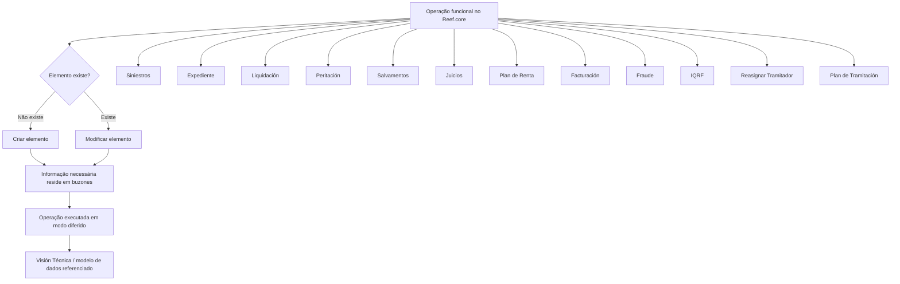

# Catálogo de Operações em Modo Diferido para Siniestros no Reef.core

## 1. Metadados do Documento
- **Arquivo de Origem:** `Não identificado — texto bruto extraído de 6 páginas`
- **Tipo de Documento:** Especificação Funcional / Catálogo de Operações
- **Domínio / Sistema:** Siniestros; Reef.core
- **Público-Alvo:** Desenvolvedores, Arquitetos, Analistas Funcionais e Operação
- **Data/Versão Identificada:** Não identificada

---

## 2. Resumo Executivo & Contexto de Negócio

O documento apresenta um catálogo de operações funcionais relacionadas ao domínio de **Siniestros** no sistema **Reef.core**. O objetivo declarado é estabelecer as informações necessárias para criar um elemento inexistente ou realizar alterações em um elemento já existente, abrangendo entidades como siniestro, expediente, liquidación, peritación e outros objetos associados.

O processo descrito está condicionado às operações funcionais que o Reef.core permite executar em **modo diferido**. Nesse modelo, a informação necessária para criação ou modificação não é descrita diretamente no conteúdo extraído; o documento afirma que essa informação residirá em estruturas denominadas **buzones**.

A organização do catálogo é baseada em domínios funcionais. Cada domínio reúne operações de criação, modificação, término, reabilitação, anulação, associação, geração ou venda, conforme aplicável ao objeto de negócio. Os domínios identificados incluem Siniestros, Expediente, Liquidación, Peritación, Salvamentos, Juicios, Plan de Renta, Facturación, Fraude, IQRF, Reasignar Tramitador e Plan de Tramitación.

O documento indica que as operações possuem enlaces para a operação funcional e para uma visão técnica que especifica o modelo de dados contendo as informações a criar ou modificar. Contudo, os destinos desses enlaces, seus contratos técnicos, URLs, métodos HTTP, campos de dados e versões técnicas não estão presentes no texto extraído.

---

## 3. Arquitetura, Componentes & Tecnologias Envolvidas

Os componentes e conceitos explicitamente citados são:

| Componente / Conceito | Papel identificado no documento |
| :--- | :--- |
| **Reef.core** | Sistema que permite operações funcionais em modo diferido. |
| **Siniestros** | Domínio principal do catálogo e entidade passível de criação, modificação, término, reabilitação, fraude e IQRF. |
| **Expediente** | Entidade associada a operações de criação, modificação, valoração, término, reabilitação, fraude e IQRF. |
| **Liquidación** | Entidade vinculada à criação, modificação e anulação de liquidações de expediente. |
| **Peritación** | Domínio para solicitações, resultados, danos e ordens de reparação. |
| **Salvamentos** | Domínio para entradas, saídas, associação com siniestro ou expediente, subastas, venda, liberação e anulação. |
| **Juicios** | Domínio para demanda, sentença, associação a expediente e intervenções. |
| **Plan de Renta** | Domínio para criação, anulação e término de planos de renda. |
| **Facturación** | Domínio para criação, modificação, liquidação e anulação de faturação. |
| **Fraude** | Registro de fraude associado a siniestro ou expediente. |
| **IQRF** | Registro associado a siniestro ou expediente; o significado da sigla não é definido. |
| **Reasignar Tramitador** | Operação de reatribuição de tramitador. |
| **Plan de Tramitación** | Domínio para níveis, trâmites, avisos, anotações e encerramentos. |
| **Buzones** | Estruturas onde residirá a informação necessária às operações em modo diferido. |
| **Visión Técnica** | Referência técnica que deveria especificar o modelo de dados das informações a criar ou modificar. |



> **Nota de Análise:** O documento não descreve a arquitetura física, microsserviços, bancos de dados, protocolos de integração, métodos HTTP, contratos JSON, ambientes ou URLs. O diagrama representa exclusivamente o fluxo funcional explicitamente descrito.

---

## 4. Regras de Negócio, Especificações Funcionais & Processos

### Processo geral para criação ou modificação

1. Identificar a operação funcional que o Reef.core permite realizar em modo diferido.
2. Verificar se o elemento de negócio existe.
3. Quando o elemento não existe, estabelecer a informação necessária para a sua criação.
4. Quando o elemento existe, estabelecer as alterações necessárias para sua modificação.
5. Considerar que a diferença do modo diferido é que a informação residirá nos denominados **buzones**.
6. Consultar o enlace da operação e o enlace da visão técnica correspondente para obter o modelo de dados aplicável à criação ou modificação.

### Regras funcionais explicitamente identificadas

| Regra / Condição | Comportamento descrito |
| :--- | :--- |
| Elemento inexistente | Deve ser estabelecida a informação necessária para criar o elemento. |
| Elemento existente | Devem ser estabelecidas as alterações a realizar no elemento. |
| Operação em modo diferido | A informação necessária para criar ou modificar reside nos denominados buzones. |
| Modelo de dados | A visão técnica referenciada contém o modelo de dados da informação a criar ou modificar. |
| Operações permitidas | Dependem das operações funcionais que o Reef.core permite realizar em modo diferido. |

### Operações por domínio funcional

#### Siniestros
- Criar siniestro.
- Modificar siniestro.
- Terminar siniestro.
- Reabilitar siniestro.

#### Expediente
- Criar expediente.
- Modificar informação de expediente.
- Valorar expediente.
- Modificar valoração de expediente.
- Terminar expediente.
- Reabilitar expediente.

#### Liquidación
- Criar liquidación de expediente.
- Modificar liquidación.
- Anular liquidación.
- Gerenciar justificante suelto.

#### Peritación
- Criar solicitação de peritación.
- Modificar solicitação de peritación.
- Criar resultado de peritación.
- Modificar resultado de peritación.
- Criar dano de peritación.
- Modificar dano de peritación.
- Criar ordem de reparação.
- Modificar ordem de reparação.
- Anular ordem de reparação.

#### Salvamentos
- Criar entrada de salvamento.
- Criar saída de salvamento.
- Modificar salvamento.
- Associar salvamento a siniestro.
- Associar salvamento a expediente.
- Criar subasta.
- Modificar subasta.
- Associar inventário a subasta.
- Vender salvamento.
- Liberar salvamento.
- Anular salvamento.

#### Juicios
- Criar juicio demanda.
- Modificar juicio demanda.
- Criar juicio sentencia.
- Modificar juicio sentencia.
- Associar juicio a expediente.
- Criar intervención.
- Modificar intervención.

#### Plan de Renta
- Criar plan de Renta.
- Anular plan de Renta.
- Terminar plan de Renta.
- Terminar plan de Renta sem anular.

#### Facturación
- Criar facturación.
- Modificar facturación.
- Modificar facturación não liquidada.
- Gerar liquidación de facturación.
- Anular facturación.
- Anular facturación não liquidada.

#### Fraude
- Criar fraude de siniestro.
- Modificar fraude de siniestro.
- Criar fraude de expediente.
- Modificar fraude de expediente.

#### IQRF
- Criar I.Q.R.F. de siniestro.
- Modificar I.Q.R.F. de siniestro.
- Criar I.Q.R.F. de expediente.
- Modificar I.Q.R.F. de expediente.

#### Reasignar Tramitador
- Reatribuir tramitador.

#### Plan de Tramitación
- Incluir nível.
- Incluir trâmite.
- Criar aviso.
- Criar anotação.
- Terminar trâmite.
- Terminar aviso.

---

## 5. Tabelas de Parâmetros, Ambientes e Estruturas de Dados

O texto extraído não contém nomes de campos, tipos de dados, valores permitidos, servidores, URLs de ambiente, portas, rotas de log ou contratos de integração. A tabela a seguir registra os parâmetros funcionais e as referências disponíveis.

| Item / Parâmetro | Descrição / Função | Tipo / Valores / Formato | Ambiente / Observações |
| :--- | :--- | :--- | :--- |
| Modo de operação | Execução permitida pelo Reef.core em modo diferido. | Modo funcional; valores não detalhados. | A informação reside em buzones. |
| Existência do elemento | Define se a operação é criação ou modificação. | Elemento existe / elemento não existe. | Regra funcional explícita. |
| Informação de criação | Informação requerida quando o elemento não existe. | Modelo de dados não apresentado. | Deve ser consultada na visão técnica referenciada. |
| Informação de modificação | Alterações requeridas quando o elemento existe. | Modelo de dados não apresentado. | Deve ser consultada na visão técnica referenciada. |
| Buzones | Local onde reside a informação das operações diferidas. | Estrutura não detalhada. | Não há descrição de tecnologia, persistência ou acesso. |
| Enlace da operação | Referência para a operação funcional. | Link indicado como “Acceder”. | URL não extraída. |
| Visión Técnica | Referência técnica para o modelo de dados. | Link indicado como “Acceder”. | Conteúdo técnico não incluído na extração. |
| Siniestro | Elemento de negócio do domínio de sinistros. | Operações: criar, modificar, terminar, reabilitar. | Também possui operações de fraude e IQRF. |
| Expediente | Elemento de negócio associado ao siniestro. | Operações: criar, modificar, valorar, terminar, reabilitar. | Também possui operações de fraude, IQRF, salvamento e juicio. |
| Liquidación | Entidade de liquidação ligada a expediente ou facturación. | Criar, modificar, anular; gerar em facturación. | O modelo de dados não foi fornecido. |
| Facturación não liquidada | Variação funcional de facturación. | Modificar ou anular. | Critérios para o estado “não liquidada” não são detalhados. |
| Plan de Renta sem anular | Modalidade específica de término de plano de renda. | Terminar sem anular. | Sem regras adicionais no conteúdo. |
| Tramitador | Responsável que pode ser reatribuído. | Reasignar Tramitador. | Critérios de reatribuição não foram descritos. |

---

## 6. Bateria de Perguntas & Respostas para RAG (FAQ Sintético)

### P1: Qual é o objetivo do catálogo de operações de Siniestros no Reef.core?
**R:** O objetivo é identificar a informação necessária para criar um elemento quando ele não existe ou modificar um elemento quando ele já existe. O catálogo abrange objetos como siniestro, expediente, liquidación, peritación e entidades relacionadas.

### P2: Qual é a diferença entre criar e modificar um elemento no processo descrito?
**R:** Quando o elemento não existe, a operação requer a informação necessária para sua criação. Quando o elemento existe, a operação requer as alterações que devem ser realizadas sobre o elemento existente.

### P3: Onde reside a informação necessária para operações em modo diferido?
**R:** O documento afirma que, para operações que o Reef.core permite realizar em modo diferido, a informação necessária para criar ou modificar elementos residirá nos denominados buzones.

### P4: Quais operações estão disponíveis para um siniestro?
**R:** Para siniestro, o documento lista as operações de criar siniestro, modificar siniestro, terminar siniestro e reabilitar siniestro. Adicionalmente, existem operações específicas para criar e modificar fraude de siniestro e criar e modificar I.Q.R.F. de siniestro.

### P5: Quais ações podem ser realizadas sobre um expediente?
**R:** Um expediente pode ser criado, ter sua informação modificada, ser valorado, ter sua valoração modificada, ser terminado ou reabilitado. O catálogo também prevê associação de salvamento e juicio a expediente, além de criação e modificação de fraude e I.Q.R.F. de expediente.

### P6: Quais operações de peritación são listadas?
**R:** O domínio de peritación contempla criar e modificar solicitação de peritación, criar e modificar resultado de peritación, criar e modificar dano de peritación, criar e modificar ordem de reparação, além de anular ordem de reparação.

### P7: Como o catálogo trata salvamentos?
**R:** O catálogo permite criar entrada e saída de salvamento, modificar salvamento, associar salvamento a siniestro ou expediente, criar e modificar subasta, associar inventário a subasta, vender salvamento, liberar salvamento e anular salvamento.

### P8: Quais operações existem para facturación não liquidada?
**R:** O documento lista duas operações específicas: modificar facturación não liquidada e anular facturación não liquidada. Não são detalhados os critérios que caracterizam uma facturación como não liquidada.

### P9: O documento contém os modelos de dados necessários para cada operação?
**R:** Não. O documento informa que existem enlaces para uma visão técnica que especifica o modelo de dados da informação a criar ou modificar, mas o conteúdo desses enlaces não está presente na extração fornecida.

### P10: Quais operações estão disponíveis no Plan de Tramitación?
**R:** O Plan de Tramitación permite incluir nível, incluir trâmite, criar aviso, criar anotação, terminar trâmite e terminar aviso.

### P11: Qual é a diferença entre terminar e reabilitar um siniestro ou expediente?
**R:** O documento lista as operações de terminar e reabilitar para siniestro e expediente, mas não apresenta regras, pré-condições, estados, transições ou efeitos de negócio que expliquem a diferença funcional entre essas operações.

### P12: O que significa a sigla IQRF no catálogo?
**R:** O documento lista operações de criação e modificação de I.Q.R.F. para siniestro e expediente, mas não define o significado da sigla IQRF nem descreve seu modelo de dados ou suas regras de negócio.

---

## 7. Glossário de Termos, Siglas & Conceitos-Chave

- **Acceder:** Rótulo exibido para os enlaces de operação e visão técnica; o destino dos links não foi incluído na extração.
- **Buzones:** Estruturas nas quais residirá a informação necessária para criação ou modificação em modo diferido.
- **Expediente:** Entidade de negócio com operações de criação, modificação, valoração, término e reabilitação.
- **Facturación:** Domínio funcional com operações de criação, modificação, geração de liquidación e anulação.
- **Fraude:** Domínio para registrar ou modificar fraude associada a siniestro ou expediente.
- **IQRF / I.Q.R.F.:** Sigla utilizada para operações associadas a siniestro e expediente; significado não definido no documento.
- **Juicio:** Domínio que inclui demanda, sentencia, associação a expediente e intervención.
- **Liquidación:** Entidade tratada por operações de criação, modificação e anulação.
- **Modo diferido:** Modo de execução permitido pelo Reef.core no qual a informação necessária reside em buzones.
- **Peritación:** Domínio que trata solicitações, resultados, danos e ordens de reparação.
- **Plan de Renta:** Domínio com operações de criação, anulação e término.
- **Plan de Tramitación:** Domínio para níveis, trâmites, avisos e anotações.
- **Reef.core:** Sistema mencionado como responsável por permitir operações funcionais em modo diferido.
- **Salvamento:** Entidade com operações de entrada, saída, modificação, associação, subasta, venda, liberação e anulação.
- **Siniestro:** Elemento de negócio central tratado por operações de criação, modificação, término e reabilitação.
- **Subasta:** Entidade associada a salvamentos e inventários.
- **Tramitador:** Papel ou responsável que pode ser reatribuído.
- **Visión Técnica:** Referência técnica que deveria especificar o modelo de dados das informações a criar ou modificar.

---

## 8. Notas Críticas, Riscos & Limitações

- O documento não fornece o conteúdo dos enlaces marcados como **“Acceder”**; portanto, não é possível recuperar os modelos de dados, contratos técnicos ou especificações de cada operação.
- Não foram identificados métodos HTTP, endpoints, URLs, protocolos, formatos JSON/XML, códigos de retorno, mecanismos de autenticação ou regras de integração.
- Não foram identificados ambientes de desenvolvimento, homologação, produção, servidores, portas, rotas de logs ou procedimentos operacionais.
- O documento não define o significado de siglas como **IQRF**, nem explica os termos **CF**, **Home Solutions APIs Documentation** ou **Zeus**, que aparecem no conteúdo bruto como elementos de navegação.
- Operações como terminar, reabilitar, anular, liberar, valorar e vender são listadas sem pré-condições, pós-condições, regras de estado, autorização ou critérios de validação.
- A referência a **buzones** informa apenas que a informação reside nessas estruturas no modo diferido; não há detalhamento sobre persistência, processamento, monitoramento, reprocessamento ou tratamento de falhas.
- **Nota de Análise:** O documento funciona como índice funcional de operações e referências técnicas, não como especificação técnica completa das interfaces ou modelos de dados.

---

## 9. Conteúdo Bruto Estruturado (Referência Fiel)

```text
--- [PÁGINA 1 DE 6] ---

EN CONSTRUCCIÓN
INDICAR CAMBIOS elementos candidatos en
Siniestros
¿En que consiste?
Establecer la información (en el caso que el elemento no exista) o los cambios a realizar (en el caso
que el elemento exista) a un siniestro, expediente, liquidación, peritación....
Objetivo
Conocer que información que se necesita para crear o modificar un elemento.
Proceso a seguir
La información necesaria para crear (en el caso que el elemento no exista) o para modificar (en el
caso que el elemento exista), depende de la operación funcional que Reef.core permita realizar en
modo diferido. La diferencia radica que la información residirá en los denominados buzones.
La información mostrada a continuación cuenta con enlaces a la operación y enlaces a la versión
técnica que especifica el modelo de datos que contiene la información a crear o modificar.
 / 
 CF
Home Solutions APIs Documentation Zeus
EN


--- [PÁGINA 2 DE 6] ---

SINIESTROS
OPERACIÓN VISIÓN TÉCNICA
CREAR siniestro Acceder
MODIFICAR siniestro Acceder
TERMINAR siniestro Acceder
REHABILITAR siniestro Acceder
EXPEDIENTE
OPERACIÓN VISIÓN TÉCNICA
CREAR expediente Acceder
MODIFICAR información expediente Acceder
VALORAR expediente Acceder
MODIFICAR valoración expediente Acceder
TERMINAR expediente Acceder
REHABILITAR expediente Acceder
LIQUIDACIÓN
OPERACIÓN VISIÓN TÉCNICA
CREAR liquidación expediente Acceder
MODIFICAR liquidación Acceder
ANULAR liquidación Acceder


--- [PÁGINA 3 DE 6] ---

LIQUIDACIÓN
JUSTIFICANTE suelto Acceder
PERITACIÓN
OPERACIÓN VISIÓN TÉCNICA
CREAR solicitud peritación Acceder
MODIFICAR solicitud peritación Acceder
CREAR resultado peritación Acceder
MODIFICAR resultado peritación Acceder
CREAR daño peritación Acceder
MODIFICAR daño peritación Acceder
CREAR orden reparación Acceder
MODIFICAR orden reparación Acceder
ANULAR orden reparación Acceder
SALVAMENTOS
OPERACIÓN VISIÓN TÉCNICA
CREAR entrada salvamento Acceder
CREAR salida salvamento Acceder
MODIFICAR salvamento Acceder
ASOCIAR salvamento siniestro Acceder


--- [PÁGINA 4 DE 6] ---

SALVAMENTOS
ASOCIAR salvamento expediente Acceder
CREAR subasta Acceder
MODIFICAR subasta Acceder
ASOCIAR inventario subasta Acceder
VENDER salvamento Acceder
LIBERAR salvamento Acceder
ANULAR salvamento Acceder
JUICIOS
OPERACIÓN VISIÓN TÉCNICA
CREAR juicio demanda Acceder
MODIFICAR juicio demanda Acceder
CREAR juicio sentencia Acceder
MODIFICAR juicio sentencia Acceder
ASOCIAR juicio expediente Acceder
CREAR intervención Acceder
MODIFICAR intervención Acceder
PLAN DE RENTA
OPERACIÓN VISIÓN TÉCNICA


--- [PÁGINA 5 DE 6] ---

PLAN DE RENTA
CREAR plan de Renta Acceder
ANULAR plan de Renta Acceder
TERMINAR plan de Renta Acceder
TERMINAR plan de Renta sin anular Acceder
FACTURACIÓN
OPERACIÓN VISIÓN TÉCNICA
CREAR facturación Acceder
MODIFICAR facturación Acceder
MODIFICAR facturación no liquidada Acceder
GENERAR liquidación facturación Acceder
ANULAR facturación Acceder
ANULAR facturación no liquidada Acceder
FRAUDE
OPERACIÓN VISIÓN TÉCNICA
CREAR fraude siniestro Acceder
MODIFICAR fraude siniestro Acceder
CREAR fraude expediente Acceder
MODIFICAR fraude expediente Acceder


--- [PÁGINA 6 DE 6] ---

IQRF
OPERACIÓN VISIÓN TÉCNICA
CREAR I.Q.R.F. siniestro Acceder
MODIFICAR I.Q.R.F. siniestro Acceder
CREAR I.Q.R.F. expediente Acceder
MODIFICAR I.Q.R.F. expediente Acceder
REASIGNAR TRAMITADOR
OPERACIÓN VISIÓN TÉCNICA
REASIGNAR Tramitador Acceder
PLAN DE TRAMITACIÓN
OPERACIÓN VISIÓN TÉCNICA
INCLUIR Nivel Acceder
INCLUIR Trámite Acceder
CREAR Aviso Acceder
CREAR Anotación Acceder
TERMINAR Trámite Acceder
TERMINAR Aviso Acceder
```
