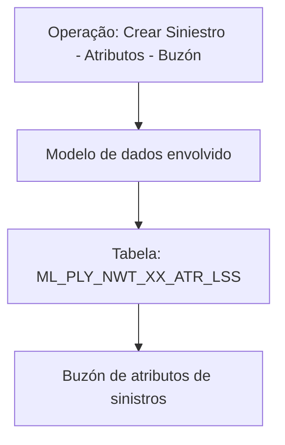

# Criar Sinistro — Atributos — Buzón: Visão Técnica e Modelo de Dados

## 1. Metadados do Documento
- **Arquivo de Origem:** Não identificado no conteúdo fornecido
- **Tipo de Documento:** Especificação Técnica
- **Domínio / Sistema:** Operação de criação de sinistro; atributos; buzón
- **Público-Alvo:** Desenvolvedores e Arquitetos
- **Data/Versão Identificada:** Não identificada

---

## 2. Resumo Executivo & Contexto de Negócio

O documento apresenta uma visão técnica em construção para a operação **“Crear Siniestro - Atributos - buzón”**. O conteúdo explicita que existe um modelo de dados envolvido na operação de criação de sinistro associada a atributos e a um buzón.

A única tabela de dados identificada é `ML_PLY_NWT_XX_ATR_LSS`, descrita como **“BUZÓN DE ATRIBUTOS DE SINIESTROS”**. Portanto, a evidência disponível estabelece uma associação entre a operação de criação de sinistro e o armazenamento ou gestão de atributos de sinistros em um buzón.

O material também contém as referências textuais “Home Solutions”, “APIs Documentation” e “Zeus”. Entretanto, o conteúdo fornecido não descreve responsabilidades, interfaces, contratos, URLs, métodos HTTP, eventos, integrações ou relações arquiteturais entre esses elementos.

> **Nota de Análise:** O documento encontra-se marcado como “EN CONSTRUCCIÓN” e não detalha o fluxo operacional, regras de negócio, estrutura de colunas da tabela, nem contratos técnicos da operação.

---

## 3. Arquitetura, Componentes & Tecnologias Envolvidas

| Componente / Termo | Evidência no documento | Detalhamento disponível |
| :--- | :--- | :--- |
| Criar Sinistro — Atributos — Buzón | Nome da operação apresentada | Visão técnica; sem etapas, endpoints ou regras descritas |
| Modelo de dados envolvido | Seção do documento | Identifica uma tabela participante na operação |
| `ML_PLY_NWT_XX_ATR_LSS` | Tabela listada | Descrita como buzón de atributos de sinistros |
| Home Solutions | Texto presente no rodapé/navegação | Função não detalhada |
| APIs Documentation | Texto presente no rodapé/navegação | Não há documentação de APIs no conteúdo extraído |
| Zeus | Texto presente no rodapé/navegação | Papel técnico ou funcional não detalhado |



> **Nota de Análise:** O diagrama representa apenas a relação explicitamente indicada entre a operação, o modelo de dados e a tabela. O documento não fornece evidências para representar fluxos de API, integrações com Home Solutions ou Zeus, nem comunicação entre componentes.

---

## 4. Regras de Negócio, Especificações Funcionais & Processos

O conteúdo fornecido não apresenta regras de negócio, critérios de validação, cálculos, transições de estado, condições de erro, perfis de acesso, passos de execução ou contratos de integração.

As especificações explicitamente disponíveis são:

1. Existe uma operação denominada **“CREAR SINIESTRO - Atributos- BUZÓN”**.
2. A operação possui um **modelo de dados envolvido**.
3. A tabela `ML_PLY_NWT_XX_ATR_LSS` intervém nessa operação.
4. A tabela `ML_PLY_NWT_XX_ATR_LSS` é descrita como **“BUZÓN DE ATRIBUTOS DE SINIESTROS”**.

> **Nota de Análise:** Não há detalhamento adicional sobre como atributos são criados, recebidos, validados, associados a um sinistro, processados ou consultados.

---

## 5. Tabelas de Parâmetros, Ambientes e Estruturas de Dados

| Item / Parâmetro | Descrição / Função | Tipo / Valores / Formato | Ambiente / Observações |
| :--- | :--- | :--- | :--- |
| Operação | `CREAR SINIESTRO - Atributos- BUZÓN` | Operação de criação de sinistro relacionada a atributos e buzón | Não detalhado |
| Tabela | `ML_PLY_NWT_XX_ATR_LSS` | Nome de tabela | Intervém na operação apresentada |
| Descrição da tabela | `BUZÓN DE ATRIBUTOS DE SINIESTROS` | Descrição funcional da tabela | Não há colunas, chaves, tipos ou restrições informados |
| Home Solutions | Termo citado no documento | Não identificado | Sem detalhamento adicional |
| APIs Documentation | Termo citado no documento | Não identificado | Sem URLs, especificações ou contratos de API |
| Zeus | Termo citado no documento | Não identificado | Sem detalhamento adicional |

---

## 6. Bateria de Perguntas & Respostas para RAG (FAQ Sintético)

### P1: Qual operação técnica é apresentada no documento?
**R:** O documento apresenta a operação `CREAR SINIESTRO - Atributos- BUZÓN`, associada à criação de sinistro, atributos e um buzón.

### P2: Qual tabela participa da operação “Crear Siniestro - Atributos - Buzón”?
**R:** A tabela identificada como participante da operação é `ML_PLY_NWT_XX_ATR_LSS`.

### P3: Qual é a descrição funcional da tabela `ML_PLY_NWT_XX_ATR_LSS`?
**R:** A tabela `ML_PLY_NWT_XX_ATR_LSS` é descrita como `BUZÓN DE ATRIBUTOS DE SINIESTROS`.

### P4: O documento informa as colunas da tabela `ML_PLY_NWT_XX_ATR_LSS`?
**R:** Não. O conteúdo fornecido informa apenas o nome e a descrição da tabela; não apresenta colunas, tipos de dados, chaves, índices ou relacionamentos.

### P5: O documento descreve APIs para criar um sinistro?
**R:** Não. Embora o texto contenha a expressão “APIs Documentation”, não há endpoints, métodos HTTP, URLs, payloads, respostas ou contratos de API apresentados.

### P6: Quais regras de validação existem para atributos de sinistros?
**R:** O documento não descreve regras de validação para atributos de sinistros, incluindo obrigatoriedade, formato, valores permitidos ou tratamento de erros.

### P7: Home Solutions é um componente integrado à operação de criação de sinistro?
**R:** Não é possível confirmar. “Home Solutions” aparece no conteúdo extraído, mas o documento não descreve sua função ou relação técnica com a operação `CREAR SINIESTRO - Atributos- BUZÓN`.

### P8: Qual é o papel de Zeus na arquitetura apresentada?
**R:** O papel de Zeus não é detalhado. O termo aparece no conteúdo fornecido, sem indicação de responsabilidade, integração, ambiente ou tecnologia associada.

### P9: O documento apresenta um fluxo completo de criação de sinistro?
**R:** Não. O documento identifica a operação e a tabela envolvida, mas não fornece etapas de processo, sequenciamento, atores, entradas, saídas ou estados.

### P10: O documento está finalizado?
**R:** Não. O conteúdo contém a indicação `EN CONSTRUCCIÓN`, sinalizando que o material está em construção.

---

## 7. Glossário de Termos, Siglas & Conceitos-Chave

- **Siniestro:** Termo usado no documento para a entidade tratada pela operação de criação; não há definição adicional no conteúdo fornecido.
- **Atributos:** Dados relacionados ao sinistro no contexto da operação apresentada; suas estruturas e regras não são detalhadas.
- **Buzón:** Conceito usado na descrição da tabela `ML_PLY_NWT_XX_ATR_LSS` como “BUZÓN DE ATRIBUTOS DE SINIESTROS”.
- **`ML_PLY_NWT_XX_ATR_LSS`:** Tabela que intervém na operação `CREAR SINIESTRO - Atributos- BUZÓN`.
- **Home Solutions:** Termo presente no documento, sem definição ou responsabilidade técnica explicitada.
- **Zeus:** Termo presente no documento, sem definição ou responsabilidade técnica explicitada.

---

## 8. Notas Críticas, Riscos & Limitações

- O documento está identificado como **“EN CONSTRUCCIÓN”**.
- Não há arquivo de origem, data, versão ou responsável identificados no conteúdo extraído.
- Não são apresentadas colunas, chaves, relacionamentos, tipos de dados ou regras de persistência para `ML_PLY_NWT_XX_ATR_LSS`.
- Não existem detalhes de APIs, como URLs, métodos HTTP, autenticação, payloads, códigos de resposta ou contratos JSON.
- Não há fluxo funcional ou técnico completo para a operação de criação de sinistro.
- As referências a Home Solutions, APIs Documentation e Zeus não possuem explicação suficiente para determinar responsabilidades ou dependências.
- Não há informação sobre ambientes, servidores, logs, monitoramento, permissões, erros ou contingência.

---

## 9. Conteúdo Bruto Estruturado (Referência Fiel)

```text
--- [PÁGINA 1 DE 1] ---

Imagen LOGO
EN CONSTRUCCIÓN
CREAR Siniestro - Atributos - buzón (visión
técnica)
Modelo de datos involucrado
Las tablas que intervienen en esta operación son:
OPERACIÓN
CREAR SINIESTRO - Atributos- BUZÓN
TABLA DESCRIPCIÓN
ML_PLY_NWT_XX_ATR_LSS BUZÓN DE ATRIBUTOS DE SINIESTROS
|
 / 
 CF
Home Solutions APIs Documentation Zeus
EN
```
