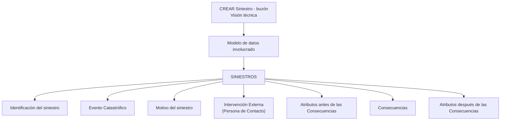

# Criar Siniestro - Buzón (Visão Técnica): Modelo de Dados Envolvido

## 1. Metadados do Documento
- **Arquivo de Origem:** Não identificado — texto bruto fornecido na solicitação
- **Tipo de Documento:** Apresentação Técnica
- **Domínio / Sistema:** SINIESTROS / Criar Siniestro - buzón
- **Público-Alvo:** Desenvolvedores e Arquitetos
- **Data/Versão Identificada:** Não identificada

---

## 2. Resumo Executivo & Contexto de Negócio

O conteúdo apresenta uma visão técnica relacionada ao processo **“CREAR Siniestro - buzón”**, no domínio identificado como **SINIESTROS**. O foco explícito é o modelo de dados envolvido no buzón associado à criação de um sinistro.

O documento informa que o modelo de dados do buzón pode ser consultado por meio de links de acesso para entidades ou tópicos específicos. Os itens listados cobrem identificação do sinistro, evento catastrófico, motivo do sinistro, intervenção externa, atributos anteriores às consequências, consequências e atributos posteriores às consequências.

Não há detalhamento sobre fluxos operacionais, contratos de integração, métodos HTTP, estruturas de banco de dados, campos, tipos de dados, regras de cálculo, URLs ou responsabilidades entre sistemas.

**Nota de Análise:** o documento lista referências de acesso para elementos do modelo de dados, mas não descreve o conteúdo técnico disponível em cada referência.

---

## 3. Arquitetura, Componentes & Tecnologias Envolvidas

Os componentes, domínios ou tópicos explicitamente citados são:

- **SINIESTROS**
- **CREAR Siniestro - buzón**
- **Modelo de datos involucrado**
- **Identificación del siniestro**
- **Evento Catastrófico**
- **Motivo del siniestro**
- **Intervención Externa (Persona de Contacto)**
- **Atributos antes de las Consecuencias**
- **Consecuencias**
- **Atributos después de las Consecuencias**
- **Home**
- **Solutions**
- **APIs**
- **Documentation**
- **Zeus**



**Nota de Análise:** o diagrama representa somente a associação documental indicada entre o modelo de dados de SINIESTROS e os links de acesso listados. O material não especifica dependências técnicas, ordem de execução, integrações, APIs, protocolos ou fluxo de dados entre os itens.

---

## 4. Regras de Negócio, Especificações Funcionais & Processos

O material não apresenta regras de negócio, condições de validação, fórmulas, critérios de elegibilidade, estados de processo ou etapas operacionais detalhadas.

As especificações funcionais disponíveis restringem-se à identificação dos seguintes elementos do modelo de dados do buzón:

1. **Identificación del siniestro**
2. **Evento Catastrófico**
3. **Motivo del siniestro**
4. **Intervención Externa (Persona de Contacto)**
5. **Atributos antes de las Consecuencias**
6. **Consecuencias**
7. **Atributos después de las Consecuencias**

Cada elemento é acompanhado pela indicação **“Acceder”**, sugerindo a existência de uma referência navegável ou ponto de consulta documental. O conteúdo não fornece os destinos desses acessos.

---

## 5. Tabelas de Parâmetros, Ambientes e Estruturas de Dados

| Item / Parâmetro | Descrição / Função | Tipo / Valores / Formato | Ambiente / Observações |
| :--- | :--- | :--- | :--- |
| CREAR Siniestro - buzón | Título do conteúdo técnico apresentado. | Tópico de visão técnica. | Associado ao domínio SINIESTROS. |
| Modelo de datos involucrado | Modelo de dados do buzón mencionado no documento. | Não detalhado. | O documento direciona para links de acesso. |
| Identificación del siniestro | Elemento listado no modelo de dados envolvido. | Não detalhado. | Marcado como “Acceder”. |
| Evento Catastrófico | Elemento listado no modelo de dados envolvido. | Não detalhado. | Marcado como “Acceder”. |
| Motivo del siniestro | Elemento listado no modelo de dados envolvido. | Não detalhado. | Marcado como “Acceder”. |
| Intervención Externa (Persona de Contacto) | Elemento listado no modelo de dados envolvido. | Não detalhado. | Marcado como “Acceder”. |
| Atributos antes de las Consecuencias | Elemento listado no modelo de dados envolvido. | Não detalhado. | Marcado como “Acceder”. |
| Consecuencias | Elemento listado no modelo de dados envolvido. | Não detalhado. | Marcado como “Acceder”. |
| Atributos después de las Consecuencias | Elemento listado no modelo de dados envolvido. | Não detalhado. | Marcado como “Acceder”. |
| Home / Solutions / APIs / Documentation / Zeus | Termos presentes no rodapé ou navegação da página. | Não detalhado. | Não há relação técnica explicitada com o modelo de dados. |
| CF | Sigla exibida na página. | Não detalhado. | O documento não define o significado. |
| EN | Indicador exibido na página. | Não detalhado. | Pode representar seleção de idioma, mas isso não é confirmado pelo texto. |

---

## 6. Bateria de Perguntas & Respostas para RAG (FAQ Sintético)

### P1: Qual é o assunto principal do documento “CREAR Siniestro - buzón”?
**R:** O documento apresenta uma visão técnica do modelo de dados envolvido no buzón do processo “CREAR Siniestro”, no domínio identificado como SINIESTROS.

### P2: Quais elementos do modelo de dados do buzón são listados?
**R:** O material lista: Identificación del siniestro, Evento Catastrófico, Motivo del siniestro, Intervención Externa (Persona de Contacto), Atributos antes de las Consecuencias, Consecuencias e Atributos después de las Consecuencias.

### P3: O documento define os campos da entidade “Identificación del siniestro”?
**R:** Não. O documento apenas lista “Identificación del siniestro” como um item acessível no modelo de dados do buzón, sem fornecer campos, tipos, regras ou relacionamentos.

### P4: Existem detalhes sobre o tratamento de eventos catastróficos?
**R:** Não. “Evento Catastrófico” é apresentado somente como uma referência acessível dentro do modelo de dados envolvido.

### P5: O que o documento informa sobre “Intervención Externa (Persona de Contacto)”?
**R:** O documento indica “Intervención Externa (Persona de Contacto)” como um item do modelo de dados do buzón. Não há descrição de atributos, responsabilidades, validações ou fluxo operacional associados.

### P6: O material descreve a relação entre consequências e atributos anteriores ou posteriores?
**R:** Não. O documento lista “Atributos antes de las Consecuencias”, “Consecuencias” e “Atributos después de las Consecuencias”, mas não descreve relacionamentos, cardinalidades ou sequência de processamento.

### P7: Há URLs, endpoints ou contratos de API para consultar o modelo de dados?
**R:** Não. Embora os termos “APIs” e “Documentation” apareçam na página, o conteúdo não apresenta URLs, endpoints, métodos HTTP, formatos JSON ou contratos técnicos.

### P8: O documento especifica ambientes, servidores ou configurações de implantação?
**R:** Não. Não foram identificadas informações sobre ambientes, servidores, portas, variáveis de configuração, pipelines de CI/CD ou procedimentos de implantação.

### P9: O que significa a indicação “Acceder” ao lado dos elementos do modelo?
**R:** “Acceder” é exibido junto a cada item listado, indicando que existe um acesso ou referência associada. Os destinos, conteúdos e mecanismos desses acessos não são apresentados no texto extraído.

### P10: Qual é o sistema ou domínio citado explicitamente?
**R:** O domínio explicitamente citado é **SINIESTROS**. O documento não apresenta uma definição expandida para esse domínio além de sua associação ao conteúdo “CREAR Siniestro - buzón”.

---

## 7. Glossário de Termos, Siglas & Conceitos-Chave

- **SINIESTROS:** Domínio ou seção identificada no documento; não há definição adicional apresentada.
- **CREAR Siniestro - buzón:** Título do conteúdo de visão técnica relacionado ao modelo de dados envolvido.
- **Buzón:** Termo usado para identificar o contexto do modelo de dados; o documento não define seu significado funcional ou técnico.
- **CF:** Sigla exibida na página; significado não identificado no conteúdo.
- **EN:** Indicador exibido na página; significado não identificado no conteúdo.
- **Acceder:** Indicação de acesso associada aos itens do modelo de dados.
- **Evento Catastrófico:** Item listado no modelo de dados; sem definição adicional.
- **Intervención Externa (Persona de Contacto):** Item listado no modelo de dados; sem definição adicional.
- **Consecuencias:** Item listado no modelo de dados; sem definição adicional.

---

## 8. Notas Críticas, Riscos & Limitações

- O conteúdo extraído possui apenas uma página com informações textuais substantivas; a segunda página está em branco ou contém somente elementos visuais.
- Não há campos, tipos, chaves, relacionamentos, diagramas entidade-relacionamento ou exemplos de registros do modelo de dados.
- Não há detalhes sobre serviços, APIs, integrações, URLs, autenticação, logs, monitoramento ou tratamento de erros.
- Não há regras de negócio, critérios de validação, máquinas de estado ou fluxos operacionais descritos.
- Os links indicados por **“Acceder”** não tiveram seus destinos extraídos; portanto, não é possível inferir seu conteúdo.
- A presença de “Home”, “Solutions”, “APIs”, “Documentation” e “Zeus” não permite concluir uma arquitetura, tecnologia ou dependência específica.

---

## 9. Conteúdo Bruto Estruturado (Referência Fiel)

```text
--- [PÁGINA 1 DE 2] ---

Imagen LOGO
EN CONSTRUCCIÓN
CREAR Siniestro - buzón (visión técnica)
Modelo de datos involucrado
El modelo de datos (buzón) que interviene se encuentra en los siguientes enlaces
SINIESTROS
VISIÓN TÉCNICA
Identificación del siniestro Acceder
Evento Catastrófico Acceder
Motivo del siniestro Acceder
Intervención Externa (Persona de Contacto) Acceder
Atributos antes de las Consecuencias Acceder
Consecuencias Acceder
Atributos después de las Consecuencias Acceder
 /
 CF
Home Solutions APIs Documentation Zeus
EN


--- [PÁGINA 2 DE 2] ---

[Página em branco ou apenas elementos visuais/imagem]
```
