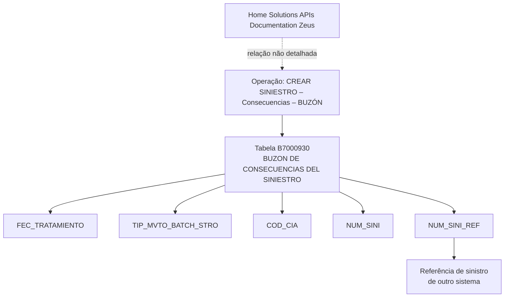

# Operação “Crear Siniestro – Consecuencias – Buzón”: Modelo de Dados Envolvido — Visão Técnica

## 1. Metadados do Documento
- **Arquivo de Origem:** Não identificado; conteúdo bruto fornecido no enunciado.
- **Tipo de Documento:** Especificação Técnica.
- **Domínio / Sistema:** Operação de criação de sinistro, consequências e buzón.
- **Público-Alvo:** Desenvolvedores, Arquitetos, Operação.
- **Data/Versão Identificada:** Não identificada.

---

## 2. Resumo Executivo & Contexto de Negócio

O documento apresenta uma visão técnica, ainda marcada como “EN CONSTRUCCIÓN”, da operação **“CREAR Siniestro – Consecuencias – BUZÓN”**. O conteúdo concentra-se no modelo de dados envolvido na criação de sinistros e no tratamento de consequências associadas.

A tabela explicitamente identificada como participante da operação é a **B7000930**, descrita como **“BUZON DE CONSECUENCIAS DEL SINIESTRO”**. O material enumera campos dessa estrutura e indica que determinados valores sofrem alteração durante o processo.

Entre os campos apresentados estão a data de tratamento, o tipo de movimento batch, o código da companhia, o número do sinistro e a referência de sinistro proveniente de outro sistema. A extração contém fragmentos incompletos devido ao formato original ou à qualidade do OCR.

O documento também cita **“Home Solutions APIs Documentation Zeus”**, mas não detalha a relação operacional, técnica ou de integração entre essa documentação, Zeus e a operação de criação de sinistro.

---

## 3. Arquitetura, Componentes & Tecnologias Envolvidas

### Componentes e estruturas citadas

| Componente / Estrutura | Papel identificado no documento | Detalhamento disponível |
| :--- | :--- | :--- |
| Operação “CREAR SINIESTRO – Consecuencias – BUZÓN” | Operação técnica documentada. | O fluxo funcional completo não é detalhado. |
| B7000930 | Tabela “BUZON DE CONSECUENCIAS DEL SINIESTRO”. | Campos relacionados ao tratamento de consequências de sinistro são listados. |
| Home Solutions APIs Documentation | Referência textual a documentação de APIs. | Não há URLs, métodos, contratos ou escopo informados. |
| Zeus | Termo citado ao lado de “Home Solutions APIs Documentation”. | Não há definição ou integração descrita. |
| Processo masivo | Contexto associado ao campo `TIP_MVTO_BATCH_STRO`. | Não são descritas regras de execução, agendamento ou processamento. |
| Outro sistema | Origem associada à referência de sinistro. | O sistema externo não é identificado. |



> **Nota de Análise:** O documento não especifica microsserviços, métodos HTTP, contratos de API, bancos de dados, tecnologias de persistência, URLs, ambientes ou mecanismos de autenticação.

---

## 4. Regras de Negócio, Especificações Funcionais & Processos

1. A operação apresentada é denominada **“CREAR SINIESTRO – Consecuencias – BUZÓN”**.
2. A tabela identificada como participante da operação é a **B7000930**, com a descrição **“BUZON DE CONSECUENCIAS DEL SINIESTRO”**.
3. O campo `FEC_TRATAMIENTO` é listado com indicação de alteração de valor (`S`) e obrigatoriedade (`SI`), sendo associado a uma **data em que se realiza** determinada ação. A frase está truncada no conteúdo fornecido.
4. O campo `TIP_MVTO_BATCH_STRO` é listado com indicação de alteração de valor (`S`) e obrigatoriedade (`SI`), sendo descrito como **tipo de movimento batch**.
5. O campo `COD_CIA` é listado com indicação de alteração de valor (`S`) e obrigatoriedade (`SI`), sendo associado a **companhia**. A descrição está truncada.
6. O campo `NUM_SINI` é listado com indicação de alteração de valor (`S`) e obrigatoriedade (`SI`), sendo associado ao **sinistro**. A descrição está truncada.
7. O campo `NUM_SINI_REF` é listado com indicação de alteração de valor (`S`) e obrigatoriedade (`SI`), sendo associado a um **sinistro de referência de outro sistema**.
8. O conteúdo associa `TIP_MVTO_BATCH_STRO` a um **processo masivo**, mas não informa critérios de seleção, tratamento de erro, periodicidade ou comportamento do processo.
9. O documento não apresenta regras de cálculo, regras de transição de estado, contratos de integração, valores permitidos, tipo de dado físico ou tamanho dos campos.

---

## 5. Tabelas de Parâmetros, Ambientes e Estruturas de Dados

| Item / Parâmetro | Descrição / Função | Tipo / Valores / Formato | Ambiente / Observações |
| :--- | :--- | :--- | :--- |
| Operação | `CREAR SINIESTRO – Consecuencias – BUZÓN` | Não informado | Documento identificado como visão técnica. |
| Tabela | `B7000930` | Tabela de dados | Descrição literal: `BUZON DE CONSECUENCIAS DEL SINIESTRO`. |
| `FEC_TRATAMIENTO` | Data em que se realiza determinada ação ou tratamento. | Alteração: `S`; motivo/valor: `N.A.`; obrigatória: `SI`. | Comentário extraído de forma incompleta: `FECHA E QUE SE REALIZA`. |
| `TIP_MVTO_BATCH_STRO` | Tipo de movimento batch. | Alteração: `S`; motivo/valor: `N.A.`; obrigatória: `SI`. | Relacionado ao texto `PROCES MASIVO`; valores permitidos não informados. |
| `COD_CIA` | Campo associado à companhia. | Alteração: `S`; motivo/valor: `N.A.`; obrigatória: `SI`. | Descrição OCR truncada como `COMPAN`. |
| `NUM_SINI` | Campo associado ao sinistro. | Alteração: `S`; motivo/valor: `N.A.`; obrigatória: `SI`. | Descrição OCR truncada como `SINIEST`. |
| `NUM_SINI_REF` | Referência de sinistro de outro sistema. | Alteração: `S`; motivo/valor: `N.A.`; obrigatória: `SI`. | Texto identifica `SINIEST REFERENCIA DE OTRO SISTEMA`. |
| Home Solutions APIs Documentation Zeus | Referência a documentação/API e Zeus. | Não informado | Não há endpoint, URL ou contrato técnico. |

---

## 6. Bateria de Perguntas & Respostas para RAG (FAQ Sintético)

### P1: Qual tabela participa da operação “CREAR SINIESTRO – Consecuencias – BUZÓN”?
**R:** A tabela identificada no documento é a `B7000930`, descrita como `BUZON DE CONSECUENCIAS DEL SINIESTRO`.

### P2: Qual é o objetivo técnico descrito para o documento?
**R:** O documento apresenta o modelo de dados envolvido na operação `CREAR SINIESTRO – Consecuencias – BUZÓN`, com foco nos campos da tabela `B7000930`.

### P3: O campo `FEC_TRATAMIENTO` é obrigatório?
**R:** Sim. No conteúdo extraído, `FEC_TRATAMIENTO` aparece com a coluna de obrigatoriedade marcada como `SI`.

### P4: O que representa o campo `FEC_TRATAMIENTO`?
**R:** O campo `FEC_TRATAMIENTO` é associado a uma data, conforme o trecho extraído `FECHA E QUE SE REALIZA`. A descrição completa não está disponível no documento fornecido.

### P5: Qual campo identifica o tipo de movimento batch do sinistro?
**R:** O campo `TIP_MVTO_BATCH_STRO` é descrito como `TIPO DE MOVIMIENTO BATCH` e está associado no documento a `PROCES MASIVO`.

### P6: O campo `TIP_MVTO_BATCH_STRO` possui valores permitidos documentados?
**R:** Não. O documento informa que o campo é obrigatório e corresponde ao tipo de movimento batch, mas não enumera valores permitidos, domínio, tipo físico ou regras de validação.

### P7: Qual campo está relacionado ao código da companhia?
**R:** O campo `COD_CIA` está relacionado à companhia. A descrição disponível está truncada como `COMPAN`.

### P8: Qual campo identifica o número de sinistro?
**R:** O campo `NUM_SINI` é o campo listado como associado ao sinistro. A extração não informa o formato ou o tamanho do número de sinistro.

### P9: Como é registrada a referência de sinistro proveniente de outro sistema?
**R:** A referência de sinistro de outro sistema é registrada no campo `NUM_SINI_REF`, descrito no documento como `SINIEST REFERENCIA DE OTRO SISTEMA`.

### P10: O documento especifica APIs, URLs ou métodos HTTP para a criação de sinistro?
**R:** Não. Embora o texto cite `Home Solutions APIs Documentation Zeus`, não há URLs, endpoints, métodos HTTP, contratos JSON, autenticação ou fluxos de integração detalhados.

### P11: A documentação define o fluxo completo do processo masivo?
**R:** Não. O documento somente associa o campo `TIP_MVTO_BATCH_STRO` ao conceito de processo masivo; não descreve disparadores, frequência, processamento, falhas ou reprocessamento.

---

## 7. Glossário de Termos, Siglas & Conceitos-Chave

- **B7000930:** Tabela identificada no documento como `BUZON DE CONSECUENCIAS DEL SINIESTRO`.
- **Buzón:** Termo em espanhol utilizado na descrição da tabela; o documento não fornece definição funcional adicional.
- **COD_CIA:** Campo associado à companhia, conforme a extração disponível.
- **Consecuencias:** Consequências associadas ao sinistro no contexto da operação documentada.
- **FEC_TRATAMIENTO:** Campo de data de tratamento; a definição completa está truncada.
- **NUM_SINI:** Campo associado ao sinistro.
- **NUM_SINI_REF:** Campo associado ao sinistro de referência de outro sistema.
- **Proceso masivo:** Processo em lote mencionado em associação com `TIP_MVTO_BATCH_STRO`.
- **Siniestro:** Termo em espanhol para sinistro.
- **TIP_MVTO_BATCH_STRO:** Campo que representa o tipo de movimento batch.
- **Zeus:** Termo citado junto a `Home Solutions APIs Documentation`; não definido no documento.

---

## 8. Notas Críticas, Riscos & Limitações

- O material está explicitamente marcado como **“EN CONSTRUCCIÓN”**, indicando documentação incompleta.
- O conteúdo extraído apresenta truncamentos e possíveis imperfeições de OCR, incluindo descrições como `COMPAN`, `SINIEST` e `FECHA E QUE SE REALIZA`.
- Não há especificação de tipos de dados, tamanhos, chaves primárias, chaves estrangeiras, índices ou relacionamentos físicos da tabela `B7000930`.
- Não há descrição de valores permitidos, enumerações ou regras de preenchimento além das indicações extraídas de alteração (`S`), motivo/valor (`N.A.`) e obrigatoriedade (`SI`).
- Não são fornecidos endpoints, URLs, métodos HTTP, payloads, contratos de integração, ambientes, logs, permissões ou mecanismos de tratamento de erro.
- A relação entre `Home Solutions APIs Documentation`, `Zeus` e a operação de criação de sinistro não é detalhada.
- A referência a outro sistema não identifica o nome, a responsabilidade, o contrato ou o método de integração com esse sistema.

---

## 9. Conteúdo Bruto Estruturado (Referência Fiel)

```text
--- [PÁGINA 1 DE 2] ---

Imagen LOGO
EN CONSTRUCCIÓN
CREAR Siniestro - Consecuencias - buzón
(visión técnica)
Modelo de datos involucrado
Las tablas que intervienen en esta operación son:
OPERACIÓN
CREAR SINIESTRO- Consecuencias- BUZÓN
TABLA DESCRIPCIÓN
B7000930 BUZON DE CONSECUENCIAS DEL SINIESTRO
COLUMNA CAMBIA
VALOR
MOTIVO/VALOR OBLIGATORIA COMENT
FEC_TRATAMIENTO S N.A. SI FECHA E
QUE SE
REALIZA
 / 
 CF
Home Solutions APIs Documentation Zeus
EN


--- [PÁGINA 2 DE 2] ---

COLUMNA CAMBIA
VALOR
MOTIVO/VALOR OBLIGATORIA COMENT
PROCES
MASIVO
TIP_MVTO_BATCH_STRO S N.A. SI TIPO DE
MOVIMIE
BATCH
COD_CIA S N.A. SI COMPAN
NUM_SINI S N.A. SI SINIEST
NUM_SINI_REF S N.A. SI SINIEST
REFERE
DE OTRO
SISTEMA
```
