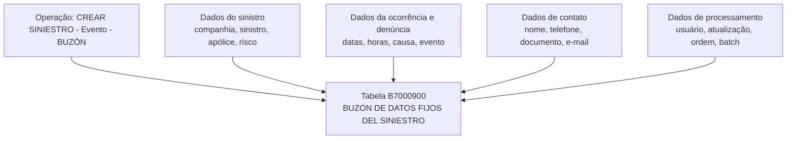
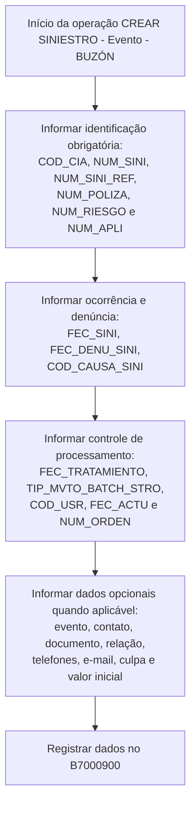

# Especificação Técnica — Criar Sinistro: Evento e Buzón

## 1. Metadados do Documento
- **Arquivo de Origem:** `Não identificado no conteúdo extraído`
- **Tipo de Documento:** `Especificação Técnica`
- **Domínio / Sistema:** `Criar Sinistro — Evento — Buzón`
- **Público-Alvo:** `Desenvolvedores, Arquitetos, Operação`
- **Data/Versão Identificada:** `Não identificada`

---

## 2. Resumo Executivo & Contexto de Negócio

O documento descreve, em visão técnica, a operação **“Crear Siniestro - Evento - Buzón”**, relacionada à criação de um sinistro e ao registro de dados no buzón de dados fixos do sinistro. A extração identifica a tabela `B7000900` como estrutura envolvida na operação.

A maior parte do conteúdo apresenta uma matriz de colunas do registro de sinistro, indicando que os campos possuem valor de alteração `S`, valor/motivo `N.A.` e uma classificação de obrigatoriedade `SI` ou `NO`. Os campos abrangem identificação da companhia, sinistro, apólice, risco, ocorrência, denúncia, contato, evento, causa e dados de processamento em lote.

O processo técnico documentado concentra-se no preenchimento e persistência de atributos do sinistro e de seu contato associado. O conteúdo inclui informações de canal de contato móvel, telefônico e e-mail, além de dados de documento e relação entre a pessoa de contato e o assegurado.

Não foram identificados contratos de API, métodos HTTP, formatos JSON, regras de persistência, validações de domínio detalhadas, códigos de erro ou URLs de ambiente. A referência a “Home Solutions APIs Documentation Zeus” aparece na extração, porém sem detalhamento técnico adicional.

---

## 3. Arquitetura, Componentes & Tecnologias Envolvidas

| Componente / Referência | Papel identificado no conteúdo | Observações |
| :--- | :--- | :--- |
| Operação `CREAR SINIESTRO - Evento - BUZÓN` | Operação técnica de criação de sinistro, evento e buzón. | Não há fluxo transacional detalhado. |
| `B7000900` | Tabela identificada como “BUZON DE DATOS FIJOS DEL SINIESTRO”. | A extração não descreve chave primária, índices ou relacionamentos. |
| Home Solutions APIs Documentation Zeus | Referência documental identificada na primeira página. | Não há URLs, rotas, métodos HTTP ou contratos expostos. |
| `CF` | Texto isolado presente na primeira página. | Significado não detalhado. |



> **Nota de Análise:** O diagrama representa exclusivamente a relação inferível entre a operação, os grupos de campos e a tabela `B7000900`. O documento não descreve serviços, integrações, protocolos ou sequência operacional entre sistemas.

---

## 4. Regras de Negócio, Especificações Funcionais & Processos

### 4.1 Operação identificada

A operação apresentada é `CREAR SINIESTRO - Evento - BUZÓN`, associada à tabela `B7000900`, descrita como `BUZON DE DATOS FIJOS DEL SINIESTRO`.

### 4.2 Regra de alteração dos campos

Todos os campos apresentados nas páginas 2 a 5 possuem `S` na coluna `CAMBIA VALOR`. O conteúdo extraído não explica formalmente o significado do indicador `S`; contudo, o documento o aplica a todos os atributos relacionados à operação.

### 4.3 Regra de motivo/valor

Todos os campos apresentados possuem `N.A.` na coluna `MOTIVO/VALOR`. O documento não detalha a semântica operacional de `N.A.`.

### 4.4 Campos obrigatórios

Os seguintes campos estão marcados como obrigatórios (`SI`) na extração:

- `FEC_TRATAMIENTO`
- `TIP_MVTO_BATCH_STRO`
- `COD_CIA`
- `NUM_SINI`
- `NUM_SINI_REF`
- `NUM_POLIZA`
- `NUM_RIESGO`
- `NUM_APLI`
- `FEC_SINI`
- `FEC_DENU_SINI`
- `COD_CAUSA_SINI`
- `COD_USR`
- `FEC_ACTU`
- `NUM_ORDEN`

Os seguintes campos estão marcados como não obrigatórios (`NO`) na extração:

- `HORA_SINI`
- `COD_EVENTO`
- `NOM_CONTACTO`
- `APE_CONTACTO`
- `TEL_PAIS_CONTACTO`
- `TEL_ZONA_CONTACTO`
- `TEL_NUMERO_CONTACTO`
- `MCA_CULPABLE`
- `TIP_DOCUM_CONTACTO`
- `COD_DOCUM_CONTACTO`
- `TIP_RELACION`
- `EMAIL_CONTACTO`
- `HORA_DENU_SINI`
- `IMP_VAL_INI_SINI`
- `NUM_SINI_REF_MOD`
- `TXT_CNH_CLR`
- `TXT_CNH_TLP`
- `TXT_CNH_EML`

### 4.5 Processo funcional inferível



> **Nota de Análise:** A sequência acima é uma organização lógica dos grupos de campos obrigatórios e opcionais. O documento não explicita ordem de chamada, regras de rejeição, valores padrão, dependências condicionais ou processamento de erros.

---

## 5. Tabelas de Parâmetros, Ambientes e Estruturas de Dados

### 5.1 Estrutura identificada

| Item / Parâmetro | Descrição / Função | Tipo / Valores / Formato | Ambiente / Observações |
| :--- | :--- | :--- | :--- |
| `B7000900` | `BUZON DE DATOS FIJOS DEL SINIESTRO` | Tabela | A operação `CREAR SINIESTRO - Evento - BUZÓN` utiliza esta tabela. |
| `CREAR SINIESTRO - Evento - BUZÓN` | Operação descrita no documento. | Operação | Não há especificação de endpoint, interface ou contrato. |
| `Home Solutions APIs Documentation Zeus` | Referência presente na extração. | Referência documental | Sem detalhes técnicos adicionais. |
| `CF` | Texto isolado identificado na primeira página. | Não especificado | Significado não detalhado. |

### 5.2 Campos da operação

| Item / Parâmetro | Descrição / Função | Tipo / Valores / Formato | Ambiente / Observações |
| :--- | :--- | :--- | :--- |
| `FEC_TRATAMIENTO` | Data de tratamento. | `CAMBIA VALOR: S`; `MOTIVO/VALOR: N.A.`; obrigatório: `SI`. | O comentário extraído inicia com `FECHA`. |
| `TIP_MVTO_BATCH_STRO` | Tipo de movimento batch. | `CAMBIA VALOR: S`; `MOTIVO/VALOR: N.A.`; obrigatório: `SI`. | Comentário fragmentado: `TIPO D MOVIM BATCH`. |
| `COD_CIA` | Companhia. | `CAMBIA VALOR: S`; `MOTIVO/VALOR: N.A.`; obrigatório: `SI`. | Comentário extraído: `COMPA`. |
| `NUM_SINI` | Sinistro. | `CAMBIA VALOR: S`; `MOTIVO/VALOR: N.A.`; obrigatório: `SI`. | Comentário extraído: `SINIES`. |
| `NUM_SINI_REF` | Sinistro de referência de outros sistemas. | `CAMBIA VALOR: S`; `MOTIVO/VALOR: N.A.`; obrigatório: `SI`. | Comentário fragmentado: `SINIES REFER OTROS SISTEM`. |
| `NUM_POLIZA` | Apólice. | `CAMBIA VALOR: S`; `MOTIVO/VALOR: N.A.`; obrigatório: `SI`. | Comentário extraído: `POLIZA`. |
| `NUM_RIESGO` | Risco. | `CAMBIA VALOR: S`; `MOTIVO/VALOR: N.A.`; obrigatório: `SI`. | Comentário extraído: `RIESG`. |
| `NUM_APLI` | Número de aplicação. | `CAMBIA VALOR: S`; `MOTIVO/VALOR: N.A.`; obrigatório: `SI`. | Comentário fragmentado: `NUMER APLICA`. |
| `FEC_SINI` | Data de ocorrência do sinistro. | `CAMBIA VALOR: S`; `MOTIVO/VALOR: N.A.`; obrigatório: `SI`. | Comentário fragmentado: `FECHA OCURR DEL SI`. |
| `FEC_DENU_SINI` | Data de notificação ou denúncia do sinistro. | `CAMBIA VALOR: S`; `MOTIVO/VALOR: N.A.`; obrigatório: `SI`. | Comentário fragmentado: `FECHA NOTIFI DENUN SINIES`. |
| `HORA_SINI` | Hora de ocorrência do sinistro. | `CAMBIA VALOR: S`; `MOTIVO/VALOR: N.A.`; obrigatório: `NO`. | Comentário fragmentado: `HORA OCURR DEL SI`. |
| `COD_CAUSA_SINI` | Causa do sinistro. | `CAMBIA VALOR: S`; `MOTIVO/VALOR: N.A.`; obrigatório: `SI`. | Comentário fragmentado: `CAUSA SINIES`. |
| `COD_EVENTO` | Evento associado ao sinistro. | `CAMBIA VALOR: S`; `MOTIVO/VALOR: N.A.`; obrigatório: `NO`. | Comentário fragmentado: `EVENT CATRA QUE O SINIES`. |
| `NOM_CONTACTO` | Nome da pessoa de contato. | `CAMBIA VALOR: S`; `MOTIVO/VALOR: N.A.`; obrigatório: `NO`. | Comentário fragmentado: `PERSO CONTA`. |
| `APE_CONTACTO` | Sobrenome da pessoa de contato. | `CAMBIA VALOR: S`; `MOTIVO/VALOR: N.A.`; obrigatório: `NO`. | Comentário fragmentado: `APELL CONTA`. |
| `TEL_PAIS_CONTACTO` | País do telefone da pessoa de contato. | `CAMBIA VALOR: S`; `MOTIVO/VALOR: N.A.`; obrigatório: `NO`. | Comentário fragmentado: `PAIS D TELEF PERSO CONTA`. |
| `TEL_ZONA_CONTACTO` | Zona do telefone da pessoa de contato. | `CAMBIA VALOR: S`; `MOTIVO/VALOR: N.A.`; obrigatório: `NO`. | Comentário fragmentado: `ZONA D TELEF PERSO CONTA`. |
| `TEL_NUMERO_CONTACTO` | Número de telefone da pessoa de contato. | `CAMBIA VALOR: S`; `MOTIVO/VALOR: N.A.`; obrigatório: `NO`. | Comentário fragmentado: `NUMER TELEF PERSO CONTA`. |
| `MCA_CULPABLE` | Indicador sobre culpabilidade no sinistro. | `CAMBIA VALOR: S`; `MOTIVO/VALOR: N.A.`; obrigatório: `NO`. | Comentário fragmentado: `SI ES O CULPA SINIES`. |
| `COD_USR` | Usuário que atualiza a fila. | `CAMBIA VALOR: S`; `MOTIVO/VALOR: N.A.`; obrigatório: `SI`. | Comentário fragmentado: `USUAR ACTUA FILA`. |
| `FEC_ACTU` | Data de atualização. | `CAMBIA VALOR: S`; `MOTIVO/VALOR: N.A.`; obrigatório: `SI`. | Comentário fragmentado: `FECHA ACTUA DE LA`. |
| `TIP_DOCUM_CONTACTO` | Tipo de documento da pessoa de contato. | `CAMBIA VALOR: S`; `MOTIVO/VALOR: N.A.`; obrigatório: `NO`. | Comentário fragmentado: `TIPO D DOCUM LA PER CONTA`. |
| `COD_DOCUM_CONTACTO` | Documento da pessoa de contato. | `CAMBIA VALOR: S`; `MOTIVO/VALOR: N.A.`; obrigatório: `NO`. | Comentário fragmentado: `DOCUM LA PER CONTA`. |
| `TIP_RELACION` | Relação entre a pessoa de contato e o assegurado. | `CAMBIA VALOR: S`; `MOTIVO/VALOR: N.A.`; obrigatório: `NO`. | Comentário fragmentado: `RELAC EL ASE`. |
| `EMAIL_CONTACTO` | Endereço de correio eletrônico da pessoa de contato. | `CAMBIA VALOR: S`; `MOTIVO/VALOR: N.A.`; obrigatório: `NO`. | Comentário fragmentado: `DIREC CORRE ELECT DE LA DE CO`. |
| `HORA_DENU_SINI` | Hora da denúncia do sinistro. | `CAMBIA VALOR: S`; `MOTIVO/VALOR: N.A.`; obrigatório: `NO`. | Comentário fragmentado: `HORA DENUN SINIES`. |
| `NUM_ORDEN` | Número de processo massivo. | `CAMBIA VALOR: S`; `MOTIVO/VALOR: N.A.`; obrigatório: `SI`. | Comentário fragmentado: `NUMER PROCE MASIV`. |
| `IMP_VAL_INI_SINI` | Valor estimado inicial do sinistro. | `CAMBIA VALOR: S`; `MOTIVO/VALOR: N.A.`; obrigatório: `NO`. | Comentário fragmentado: `IMPOR ESTIMA LA VAL DEL SI`. |
| `NUM_SINI_REF_MOD` | Sinistro de referência de outros sistemas modificado. | `CAMBIA VALOR: S`; `MOTIVO/VALOR: N.A.`; obrigatório: `NO`. | Comentário fragmentado: `SINIES REFER OTROS SISTEM MODIF`. |
| `TXT_CNH_CLR` | Meio de contato móvel. | `CAMBIA VALOR: S`; `MOTIVO/VALOR: N.A.`; obrigatório: `NO`. | Comentário extraído: `MEDIO CONTA MOVIL`. |
| `TXT_CNH_TLP` | Meio de contato telefônico. | `CAMBIA VALOR: S`; `MOTIVO/VALOR: N.A.`; obrigatório: `NO`. | Comentário extraído: `MEDIO CONTA TELEF`. |
| `TXT_CNH_EML` | Meio de contato por e-mail. | `CAMBIA VALOR: S`; `MOTIVO/VALOR: N.A.`; obrigatório: `NO`. | Comentário extraído: `MEDIO CONTA EMAIL`. |

---

## 6. Bateria de Perguntas & Respostas para RAG (FAQ Sintético)

### P1: Qual tabela está envolvida na operação CREAR SINIESTRO - Evento - BUZÓN?
**R:** A tabela identificada no documento é `B7000900`, descrita como `BUZON DE DATOS FIJOS DEL SINIESTRO`.

### P2: Quais são os campos obrigatórios para identificação básica do sinistro?
**R:** Os campos obrigatórios de identificação apresentados são `COD_CIA`, `NUM_SINI`, `NUM_SINI_REF`, `NUM_POLIZA`, `NUM_RIESGO` e `NUM_APLI`.

### P3: Quais dados obrigatórios de ocorrência e denúncia devem ser informados?
**R:** O documento marca como obrigatórios `FEC_SINI`, referente à data de ocorrência do sinistro, `FEC_DENU_SINI`, referente à data de notificação ou denúncia do sinistro, e `COD_CAUSA_SINI`, associado à causa do sinistro.

### P4: A hora de ocorrência do sinistro é obrigatória?
**R:** Não. O campo `HORA_SINI` está marcado como não obrigatório (`NO`) na matriz extraída.

### P5: O código do evento é obrigatório na operação de criação de sinistro?
**R:** Não. O campo `COD_EVENTO` está presente para registrar o evento associado ao sinistro, mas está marcado como não obrigatório (`NO`).

### P6: Quais campos de controle de processamento são obrigatórios?
**R:** A extração marca como obrigatórios `FEC_TRATAMIENTO`, `TIP_MVTO_BATCH_STRO`, `COD_USR`, `FEC_ACTU` e `NUM_ORDEN`. Os comentários associados indicam, respectivamente, data de tratamento, tipo de movimento batch, usuário que atualiza a fila, data de atualização e número de processo massivo.

### P7: Quais dados de contato são opcionais?
**R:** Os dados opcionais de contato incluem `NOM_CONTACTO`, `APE_CONTACTO`, `TEL_PAIS_CONTACTO`, `TEL_ZONA_CONTACTO`, `TEL_NUMERO_CONTACTO`, `TIP_DOCUM_CONTACTO`, `COD_DOCUM_CONTACTO`, `TIP_RELACION`, `EMAIL_CONTACTO`, `TXT_CNH_CLR`, `TXT_CNH_TLP` e `TXT_CNH_EML`.

### P8: O documento define os formatos dos campos de data, hora, telefone ou e-mail?
**R:** Não. Apesar de identificar campos de data, hora, telefone e e-mail, o documento extraído não apresenta tipos de dados, máscaras, limites de tamanho, expressões de validação ou formatos aceitos.

### P9: O campo MCA_CULPABLE é obrigatório?
**R:** Não. O campo `MCA_CULPABLE`, associado na extração à culpabilidade no sinistro, está marcado como não obrigatório (`NO`).

### P10: Existe uma API documentada com endpoint, método HTTP e contrato JSON para essa operação?
**R:** Não. O texto contém a referência `Home Solutions APIs Documentation Zeus`, mas não informa endpoint, URL, método HTTP, autenticação, payload JSON, resposta ou códigos de erro.

### P11: Qual campo registra o valor estimado inicial do sinistro?
**R:** O campo `IMP_VAL_INI_SINI` é descrito de forma fragmentada como valor estimado inicial do sinistro e está marcado como não obrigatório (`NO`).

### P12: O que representam os indicadores S e N.A. na matriz de campos?
**R:** Todos os campos exibem `S` em `CAMBIA VALOR` e `N.A.` em `MOTIVO/VALOR`. O documento não fornece definição explícita para esses indicadores; portanto, não é possível atribuir significado adicional sem extrapolar o conteúdo.

---

## 7. Glossário de Termos, Siglas & Conceitos-Chave

- **B7000900:** Tabela descrita como `BUZON DE DATOS FIJOS DEL SINIESTRO`.
- **Buzón:** Termo presente no nome da operação e na descrição da tabela; o documento não apresenta uma definição adicional.
- **COD_CIA:** Campo associado à companhia.
- **COD_CAUSA_SINI:** Campo associado à causa do sinistro.
- **COD_EVENTO:** Campo associado ao evento relacionado ao sinistro.
- **COD_USR:** Campo associado ao usuário que atualiza a fila.
- **FEC_ACTU:** Campo associado à data de atualização.
- **FEC_DENU_SINI:** Campo associado à data de notificação ou denúncia do sinistro.
- **FEC_SINI:** Campo associado à data de ocorrência do sinistro.
- **FEC_TRATAMIENTO:** Campo associado à data de tratamento.
- **IMP_VAL_INI_SINI:** Campo associado ao valor estimado inicial do sinistro.
- **MCA_CULPABLE:** Campo associado à indicação de culpabilidade no sinistro.
- **NUM_APLI:** Campo associado ao número de aplicação.
- **NUM_ORDEN:** Campo associado ao número de processo massivo.
- **NUM_POLIZA:** Campo associado à apólice.
- **NUM_RIESGO:** Campo associado ao risco.
- **NUM_SINI:** Campo associado ao sinistro.
- **NUM_SINI_REF:** Campo associado ao sinistro de referência de outros sistemas.
- **NUM_SINI_REF_MOD:** Campo associado ao sinistro de referência de outros sistemas modificado.
- **Siniestro:** Termo em espanhol utilizado no documento para sinistro.
- **TIP_MVTO_BATCH_STRO:** Campo associado ao tipo de movimento batch.
- **TXT_CNH_CLR:** Campo associado ao meio de contato móvel.
- **TXT_CNH_EML:** Campo associado ao meio de contato por e-mail.
- **TXT_CNH_TLP:** Campo associado ao meio de contato telefônico.

---

## 8. Notas Críticas, Riscos & Limitações

- A extração apresenta OCR fragmentado em diversos comentários, especialmente nas descrições de campos. As descrições foram preservadas sem completar termos não suportados pelo texto.
- Não foram identificados tipos de dados, tamanhos, domínios de valores, valores padrão, chaves, índices ou relacionamentos da tabela `B7000900`.
- Não há especificação de API, métodos HTTP, URL, autenticação, contratos de requisição/resposta ou tratamento de erros.
- O documento não define a semântica dos valores `S` em `CAMBIA VALOR` e `N.A.` em `MOTIVO/VALOR`.
- O documento não apresenta regras condicionais entre campos opcionais e obrigatórios.
- Não foram identificados ambientes, servidores, rotas de log, versões ou responsáveis operacionais.
- A referência a `Home Solutions APIs Documentation Zeus` não possui detalhamento suficiente para estabelecer uma dependência técnica concreta.

---

## 9. Conteúdo Bruto Estruturado (Referência Fiel)

```text
--- [PÁGINA 1 DE 5] ---

Imagen LOGO
EN CONSTRUCCIÓN
CREAR Siniestro - Evento - buzón (visión
técnica){#titulo}
Modelo de datos involucrado
Las tablas que intervienen en esta operación son:
OPERACIÓN
CREAR SINIESTRO - Evento - BUZÓN
TABLA DESCRIPCIÓN
B7000900 BUZON DE DATOS FIJOS DEL SINIESTRO
 / 
 CF
Home Solutions APIs Documentation Zeus
EN


--- [PÁGINA 2 DE 5] ---

COLUMNA CAMBIA
VALOR
MOTIVO/VALOR OBLIGATORIA COMEN
FEC_TRATAMIENTO S N.A. SI FECHA
QUE S
EL PRO
MASIV
TIP_MVTO_BATCH_STRO S N.A. SI TIPO D
MOVIM
BATCH
COD_CIA S N.A. SI COMPA
NUM_SINI S N.A. SI SINIES
NUM_SINI_REF S N.A. SI SINIES
REFER
OTROS
SISTEM
NUM_POLIZA S N.A. SI POLIZA
NUM_RIESGO S N.A. SI RIESG
NUM_APLI S N.A. SI NUMER
APLICA
FEC_SINI S N.A. SI FECHA
OCURR
DEL SI
FEC_DENU_SINI S N.A. SI FECHA
NOTIFI
DENUN
SINIES
HORA_SINI S N.A. NO HORA 
OCURR
DEL SI


--- [PÁGINA 3 DE 5] ---

COLUMNA CAMBIA
VALOR
MOTIVO/VALOR OBLIGATORIA COMEN
COD_CAUSA_SINI S N.A. SI CAUSA
SINIES
COD_EVENTO S N.A. NO EVENT
CATRA
QUE O
SINIES
NOM_CONTACTO S N.A. NO PERSO
CONTA
APE_CONTACTO S N.A. NO APELL
CONTA
TEL_PAIS_CONTACTO S N.A. NO PAIS D
TELEF
PERSO
CONTA
TEL_ZONA_CONTACTO S N.A. NO ZONA D
TELEF
PERSO
CONTA
TEL_NUMERO_CONTACTO S N.A. NO NUMER
TELEF
PERSO
CONTA
MCA_CULPABLE S N.A. NO SI ES O
CULPA
SINIES
COD_USR S N.A. SI USUAR
ACTUA
FILA


--- [PÁGINA 4 DE 5] ---

COLUMNA CAMBIA
VALOR
MOTIVO/VALOR OBLIGATORIA COMEN
FEC_ACTU S N.A. SI FECHA
ACTUA
DE LA 
TIP_DOCUM_CONTACTO S N.A. NO TIPO D
DOCUM
LA PER
CONTA
COD_DOCUM_CONTACTO S N.A. NO DOCUM
LA PER
CONTA
TIP_RELACION S N.A. NO RELAC
EL ASE
EMAIL_CONTACTO S N.A. NO DIREC
CORRE
ELECT
DE LA 
DE CO
HORA_DENU_SINI S N.A. NO HORA 
DENUN
SINIES
NUM_ORDEN S N.A. SI NUMER
PROCE
MASIV
IMP_VAL_INI_SINI S N.A. NO IMPOR
ESTIMA
LA VAL
DEL SI
NUM_SINI_REF_MOD S N.A. NO SINIES
REFER
OTROS


--- [PÁGINA 5 DE 5] ---

COLUMNA CAMBIA
VALOR
MOTIVO/VALOR OBLIGATORIA COMEN
SISTEM
MODIF
TXT_CNH_CLR S N.A. NO MEDIO
CONTA
MOVIL
TXT_CNH_TLP S N.A. NO MEDIO
CONTA
TELEF
TXT_CNH_EML S N.A. NO MEDIO
CONTA
EMAIL
```
