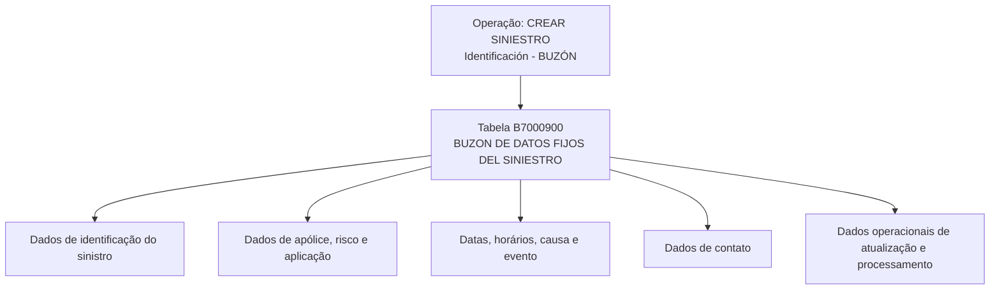

# CREAR Siniestro – Identificación – Buzón: Modelo de Datos Involucrado

## 1. Metadados do Documento
- **Arquivo de Origem:** Não identificado no conteúdo fornecido
- **Tipo de Documento:** Especificação Técnica
- **Domínio / Sistema:** Criar Siniestro – Identificación – Buzón; CF Home Solutions APIs Documentation Zeus
- **Público-Alvo:** Desenvolvedores, Arquitetos, Operação e Analistas Funcionais
- **Data/Versão Identificada:** Não identificada

---

## 2. Resumo Executivo & Contexto de Negócio

O documento descreve o modelo de dados envolvido na operação **“CREAR SINIESTRO - Identificación - BUZÓN”**. A operação está associada à criação e identificação de um sinistro, com uso da tabela **B7000900**, descrita como **“BUZON DE DATOS FIJOS DEL SINIESTRO”**.

A especificação apresenta uma matriz de colunas da tabela B7000900, indicando para cada campo os valores extraídos nas colunas “CAMBIA”, “VALOR”, “OBLIGATORIA” e “COMEN”. A maior parte dos campos possui `CAMBIA = S` e `VALOR = N.A.`; a obrigatoriedade é explicitada como `SI` ou `NO`.

Os dados cobrem identificação corporativa e operacional do sinistro, incluindo companhia, número de sinistro, apólice, risco, aplicação, datas e horários de ocorrência e denúncia, causa, evento, usuário atualizador e data de atualização. Também há informações opcionais de contato, como nome, sobrenome, telefones, documento, relação com o segurado, e-mail e meios de contato.

O conteúdo fornecido não descreve contratos de API, métodos HTTP, formatos JSON, chaves primárias, regras de persistência, processamento de erros ou integrações detalhadas. A referência a **“CF Home Solutions APIs Documentation Zeus”** aparece no conteúdo bruto, mas não é explicada tecnicamente.

---

## 3. Arquitetura, Componentes & Tecnologias Envolvidas

### Componentes identificados

| Componente | Tipo | Descrição sustentada pelo documento |
| :--- | :--- | :--- |
| CREAR SINIESTRO - Identificación - BUZÓN | Operação | Operação de criação de sinistro, identificação e buzón. |
| B7000900 | Tabela | “BUZON DE DATOS FIJOS DEL SINIESTRO”. |
| CF Home Solutions APIs Documentation Zeus | Referência textual | Texto presente na extração; não há detalhamento sobre responsabilidade, integração ou tecnologia. |



> **Nota de Análise:** O documento identifica a operação e a tabela B7000900, porém não detalha camadas de aplicação, microsserviços, bancos de dados, protocolos, autenticação, rotas, métodos HTTP ou contratos de integração.

---

## 4. Regras de Negócio, Especificações Funcionais & Processos

### Operação identificada
- A operação apresentada é **CREAR SINIESTRO - Identificación - BUZÓN**.
- A tabela participante é **B7000900**, denominada **BUZON DE DATOS FIJOS DEL SINIESTRO**.
- Todos os campos exibidos possuem `CAMBIA = S`.
- Todos os campos exibidos possuem `VALOR = N.A.`.
- A obrigatoriedade de cada campo está marcada como `SI` ou `NO` na fonte original.

### Campos obrigatórios marcados como `SI`
Os seguintes campos são apresentados como obrigatórios:
- `FEC_TRATAMIENTO`
- `TIP_MVTO_BATCH_STRO`
- `COD_CIA`
- `NUM_SINI`
- `NUM_SINI_REF`
- `NUM_POLIZA`
- `NUM_RIESGO`
- `NUM_APLI`
- `FEC_SINI`
- `FEC_DENU_SINI`
- `COD_CAUSA_SINI`
- `COD_USR`
- `FEC_ACTU`
- `NUM_ORDEN`

### Campos não obrigatórios marcados como `NO`
Os seguintes campos são apresentados como não obrigatórios:
- `HORA_SINI`
- `COD_EVENTO`
- `NOM_CONTACTO`
- `APE_CONTACTO`
- `TEL_PAIS_CONTACTO`
- `TEL_ZONA_CONTACTO`
- `TEL_NUMERO_CONTACTO`
- `MCA_CULPABLE`
- `TIP_DOCUM_CONTACTO`
- `COD_DOCUM_CONTACTO`
- `TIP_RELACION`
- `EMAIL_CONTACTO`
- `HORA_DENU_SINI`
- `IMP_VAL_INI_SINI`
- `NUM_SINI_REF_MOD`
- `TXT_CNH_CLR`
- `TXT_CNH_TLP`
- `TXT_CNH_EML`

> **Nota de Análise:** A extração contém comentários em espanhol fragmentados por quebra de linha. Não foram inferidos tipos físicos de banco de dados, domínios válidos, tamanhos de campos, regras de cálculo ou semântica adicional além da descrição legível no texto.

---

## 5. Tabelas de Parâmetros, Ambientes e Estruturas de Dados

### Tabela principal

| Item / Parâmetro | Descrição / Função | Tipo / Valores / Formato | Ambiente / Observações |
| :--- | :--- | :--- | :--- |
| `B7000900` | BUZON DE DATOS FIJOS DEL SINIESTRO | Tabela | Associada à operação CREAR SINIESTRO - Identificación - BUZÓN. |

### Campos da tabela B7000900

| Item / Parâmetro | Descrição / Função | Tipo / Valores / Formato | Ambiente / Observações |
| :--- | :--- | :--- | :--- |
| `FEC_TRATAMIENTO` | Fecha que se… / referência a processamento massivo no texto fragmentado | `CAMBIA: S`; `VALOR: N.A.`; Obrigatória: `SI` | Comentário extraído de forma incompleta. |
| `TIP_MVTO_BATCH_STRO` | Tipo de movimiento batch | `CAMBIA: S`; `VALOR: N.A.`; Obrigatória: `SI` | Associado a movimento batch. |
| `COD_CIA` | Compañía | `CAMBIA: S`; `VALOR: N.A.`; Obrigatória: `SI` | Código de companhia. |
| `NUM_SINI` | Siniestro | `CAMBIA: S`; `VALOR: N.A.`; Obrigatória: `SI` | Número de sinistro. |
| `NUM_SINI_REF` | Siniestro referencia otros sistemas | `CAMBIA: S`; `VALOR: N.A.`; Obrigatória: `SI` | Referência a outros sistemas. |
| `NUM_POLIZA` | Póliza | `CAMBIA: S`; `VALOR: N.A.`; Obrigatória: `SI` | Número de apólice. |
| `NUM_RIESGO` | Riesgo | `CAMBIA: S`; `VALOR: N.A.`; Obrigatória: `SI` | Número ou identificação de risco. |
| `NUM_APLI` | Número de aplicación | `CAMBIA: S`; `VALOR: N.A.`; Obrigatória: `SI` | Campo de aplicação. |
| `FEC_SINI` | Fecha de ocurrencia del siniestro | `CAMBIA: S`; `VALOR: N.A.`; Obrigatória: `SI` | Data de ocorrência do sinistro. |
| `FEC_DENU_SINI` | Fecha de notificación o denuncia del siniestro | `CAMBIA: S`; `VALOR: N.A.`; Obrigatória: `SI` | Data de denúncia/notificação. |
| `HORA_SINI` | Hora de ocurrencia del siniestro | `CAMBIA: S`; `VALOR: N.A.`; Obrigatória: `NO` | Horário da ocorrência. |
| `COD_CAUSA_SINI` | Causa del siniestro | `CAMBIA: S`; `VALOR: N.A.`; Obrigatória: `SI` | Código da causa do sinistro. |
| `COD_EVENTO` | Evento CATRA que ocasiona el siniestro | `CAMBIA: S`; `VALOR: N.A.`; Obrigatória: `NO` | O significado de “CATRA” não é definido. |
| `NOM_CONTACTO` | Persona de contacto | `CAMBIA: S`; `VALOR: N.A.`; Obrigatória: `NO` | Nome da pessoa de contato. |
| `APE_CONTACTO` | Apellido de contacto | `CAMBIA: S`; `VALOR: N.A.`; Obrigatória: `NO` | Sobrenome da pessoa de contato. |
| `TEL_PAIS_CONTACTO` | País del teléfono de la persona de contacto | `CAMBIA: S`; `VALOR: N.A.`; Obrigatória: `NO` | País associado ao telefone de contato. |
| `TEL_ZONA_CONTACTO` | Zona del teléfono de la persona de contacto | `CAMBIA: S`; `VALOR: N.A.`; Obrigatória: `NO` | Zona associada ao telefone de contato. |
| `TEL_NUMERO_CONTACTO` | Número de teléfono de la persona de contacto | `CAMBIA: S`; `VALOR: N.A.`; Obrigatória: `NO` | Número de telefone de contato. |
| `MCA_CULPABLE` | Si es o no culpable del siniestro | `CAMBIA: S`; `VALOR: N.A.`; Obrigatória: `NO` | Indicador de culpa. |
| `COD_USR` | Usuario que actualiza la fila | `CAMBIA: S`; `VALOR: N.A.`; Obrigatória: `SI` | Usuário atualizador. |
| `FEC_ACTU` | Fecha de actualización de la fila | `CAMBIA: S`; `VALOR: N.A.`; Obrigatória: `SI` | Data de atualização. |
| `TIP_DOCUM_CONTACTO` | Tipo de documento de la persona de contacto | `CAMBIA: S`; `VALOR: N.A.`; Obrigatória: `NO` | Tipo documental do contato. |
| `COD_DOCUM_CONTACTO` | Documento de la persona de contacto | `CAMBIA: S`; `VALOR: N.A.`; Obrigatória: `NO` | Código/documento do contato. |
| `TIP_RELACION` | Relación con el asegurado | `CAMBIA: S`; `VALOR: N.A.`; Obrigatória: `NO` | Relação do contato com o segurado. |
| `EMAIL_CONTACTO` | Dirección de correo electrónico de la persona de contacto | `CAMBIA: S`; `VALOR: N.A.`; Obrigatória: `NO` | E-mail do contato. |
| `HORA_DENU_SINI` | Hora de denuncia del siniestro | `CAMBIA: S`; `VALOR: N.A.`; Obrigatória: `NO` | Horário da denúncia do sinistro. |
| `NUM_ORDEN` | Número de proceso masivo | `CAMBIA: S`; `VALOR: N.A.`; Obrigatória: `SI` | Número do processo massivo. |
| `IMP_VAL_INI_SINI` | Importe estimado / valor del siniestro | `CAMBIA: S`; `VALOR: N.A.`; Obrigatória: `NO` | Comentário original fragmentado. |
| `NUM_SINI_REF_MOD` | Siniestro referencia otros sistemas modifi… | `CAMBIA: S`; `VALOR: N.A.`; Obrigatória: `NO` | Texto original truncado. |
| `TXT_CNH_CLR` | Medio contacto móvil | `CAMBIA: S`; `VALOR: N.A.`; Obrigatória: `NO` | Meio de contato móvel. |
| `TXT_CNH_TLP` | Medio contacto teléfono | `CAMBIA: S`; `VALOR: N.A.`; Obrigatória: `NO` | Meio de contato telefônico. |
| `TXT_CNH_EML` | Medio contacto email | `CAMBIA: S`; `VALOR: N.A.`; Obrigatória: `NO` | Meio de contato por e-mail. |

---

## 6. Bateria de Perguntas & Respostas para RAG (FAQ Sintético)

### P1: Qual tabela participa da operação CREAR SINIESTRO - Identificación - BUZÓN?
**R:** A tabela identificada no documento é a `B7000900`, descrita como **BUZON DE DATOS FIJOS DEL SINIESTRO**.

### P2: Quais campos obrigatórios identificam o sinistro e sua referência?
**R:** A especificação marca como obrigatórios os campos `NUM_SINI`, para o sinistro, e `NUM_SINI_REF`, descrito como referência do sinistro a outros sistemas. O campo `NUM_SINI_REF_MOD` também trata de referência, mas é marcado como não obrigatório.

### P3: Quais dados de apólice e risco são obrigatórios na tabela B7000900?
**R:** Os campos `NUM_POLIZA`, descrito como apólice, `NUM_RIESGO`, descrito como risco, e `NUM_APLI`, descrito como número de aplicação, são marcados como obrigatórios (`SI`).

### P4: Quais informações temporais obrigatórias são registradas para o sinistro?
**R:** O documento marca como obrigatórios `FEC_TRATAMIENTO`, `FEC_SINI`, `FEC_DENU_SINI` e `FEC_ACTU`. Esses campos correspondem, respectivamente, a tratamento, ocorrência do sinistro, denúncia/notificação do sinistro e atualização da linha, conforme os comentários disponíveis.

### P5: Os horários de ocorrência e denúncia do sinistro são obrigatórios?
**R:** Não. `HORA_SINI`, referente à hora de ocorrência do sinistro, e `HORA_DENU_SINI`, referente à hora de denúncia do sinistro, são ambos marcados como não obrigatórios (`NO`).

### P6: Qual campo registra a causa do sinistro?
**R:** O campo `COD_CAUSA_SINI` registra a causa do sinistro e é marcado como obrigatório (`SI`).

### P7: O evento associado ao sinistro é obrigatório?
**R:** Não. O campo `COD_EVENTO`, descrito como evento “CATRA que ocasiona el siniestro”, é marcado como não obrigatório (`NO`). O documento não define a sigla ou o termo “CATRA”.

### P8: Quais dados de contato podem ser armazenados na tabela B7000900?
**R:** A tabela pode conter nome (`NOM_CONTACTO`), sobrenome (`APE_CONTACTO`), país, zona e número de telefone (`TEL_PAIS_CONTACTO`, `TEL_ZONA_CONTACTO`, `TEL_NUMERO_CONTACTO`), tipo e código de documento (`TIP_DOCUM_CONTACTO`, `COD_DOCUM_CONTACTO`), relação com o segurado (`TIP_RELACION`), e-mail (`EMAIL_CONTACTO`) e meios de contato móvel, telefone e e-mail (`TXT_CNH_CLR`, `TXT_CNH_TLP`, `TXT_CNH_EML`). Todos esses campos são marcados como não obrigatórios.

### P9: Quais campos permitem rastrear a atualização operacional da linha?
**R:** O documento indica `COD_USR`, descrito como o usuário que atualiza a fila, e `FEC_ACTU`, descrito como a data de atualização da fila. Ambos são campos obrigatórios.

### P10: Qual campo indica se há culpabilidade relacionada ao sinistro?
**R:** O campo `MCA_CULPABLE` é descrito como indicador de “si es o no culpable del siniestro”. Esse campo é não obrigatório.

### P11: Qual informação é obrigatória para processamento massivo?
**R:** O campo `NUM_ORDEN`, descrito como número de processo massivo, é obrigatório. O campo `TIP_MVTO_BATCH_STRO`, descrito como tipo de movimento batch, também é obrigatório.

### P12: O documento define tipos físicos, tamanhos ou contratos de API para os campos da B7000900?
**R:** Não. O documento apresenta nomes de campos, valores extraídos de `CAMBIA`, `VALOR`, indicação de obrigatoriedade e comentários descritivos fragmentados. Não há definição de tipo físico, comprimento, formato de payload, métodos HTTP, endpoints ou contratos JSON.

---

## 7. Glossário de Termos, Siglas & Conceitos-Chave

- **B7000900:** Tabela descrita como “BUZON DE DATOS FIJOS DEL SINIESTRO”.
- **BUZÓN / BUZON:** Termo usado no nome da operação e na descrição da tabela; o documento não define seu significado funcional adicional.
- **Siniestro:** Termo em espanhol usado para sinistro.
- **Póliza:** Termo em espanhol usado para apólice.
- **COD_CIA:** Campo descrito como companhia.
- **COD_USR:** Campo descrito como usuário que atualiza a linha.
- **FEC_ACTU:** Campo descrito como data de atualização da linha.
- **FEC_DENU_SINI:** Campo descrito como data de denúncia/notificação do sinistro.
- **FEC_SINI:** Campo descrito como data de ocorrência do sinistro.
- **MCA_CULPABLE:** Campo indicador de culpa no sinistro.
- **NUM_ORDEN:** Campo descrito como número de processo massivo.
- **TIP_MVTO_BATCH_STRO:** Campo descrito como tipo de movimento batch.
- **CATRA:** Termo presente na descrição de `COD_EVENTO`; não definido no documento.
- **CF Home Solutions APIs Documentation Zeus:** Referência textual presente na extração; não detalhada no conteúdo fornecido.

---

## 8. Notas Críticas, Riscos & Limitações

- O conteúdo fornecido é uma extração com diversas descrições truncadas por quebras de linha e OCR, especialmente nas colunas de comentários.
- Não há tipos de dados físicos, tamanhos máximos, formatos de data/hora, domínios permitidos ou chaves de integridade para os campos.
- Não há descrição de API, endpoint, URL, método HTTP, autenticação, payload JSON, tratamento de erro ou mecanismo de persistência.
- Não há detalhamento sobre o significado operacional dos valores `S` em `CAMBIA` e `N.A.` em `VALOR`; estes foram preservados sem interpretação adicional.
- O termo `CATRA` é mencionado na descrição de `COD_EVENTO`, mas não possui definição no documento.
- A referência a “CF Home Solutions APIs Documentation Zeus” não contém contexto suficiente para confirmar se representa sistema, portal documental, produto ou ambiente.
- O documento não apresenta ambientes, servidores, rotas de logs, versões, dependências externas ou responsabilidades de equipes.

---

## 9. Conteúdo Bruto Estruturado (Referência Fiel)

```text
--- [PÁGINA 1 DE 5] ---

Imagen LOGO
EN CONSTRUCCIÓN
CREAR Siniestro - Identificación - buzón
(visión técnica){#titulo}
Modelo de datos involucrado
Las tablas que intervienen en esta operación son:
OPERACIÓN
CREAR SINIESTRO - Identificación - BUZÓN
TABLA DESCRIPCIÓN
B7000900 BUZON DE DATOS FIJOS DEL SINIESTRO
 /
 CF
Home Solutions APIs Documentation Zeus
EN


--- [PÁGINA 2 DE 5] ---

COLUMNA CAMBIA
VALOR
MOTIVO/VALOR OBLIGATORIA COMEN
FEC_TRATAMIENTO S N.A. SI FECHA
QUE S
EL PRO
MASIV
TIP_MVTO_BATCH_STRO S N.A. SI TIPO D
MOVIM
BATCH
COD_CIA S N.A. SI COMPA
NUM_SINI S N.A. SI SINIES
NUM_SINI_REF S N.A. SI SINIES
REFER
OTROS
SISTEM
NUM_POLIZA S N.A. SI POLIZA
NUM_RIESGO S N.A. SI RIESG
NUM_APLI S N.A. SI NUMER
APLICA
FEC_SINI S N.A. SI FECHA
OCURR
DEL SI
FEC_DENU_SINI S N.A. SI FECHA
NOTIFI
DENUN
SINIES
HORA_SINI S N.A. NO HORA
OCURR
DEL SI


--- [PÁGINA 3 DE 5] ---

COLUMNA CAMBIA
VALOR
MOTIVO/VALOR OBLIGATORIA COMEN
COD_CAUSA_SINI S N.A. SI CAUSA
SINIES
COD_EVENTO S N.A. NO EVENT
CATRA
QUE O
SINIES
NOM_CONTACTO S N.A. NO PERSO
CONTA
APE_CONTACTO S N.A. NO APELL
CONTA
TEL_PAIS_CONTACTO S N.A. NO PAIS D
TELEF
PERSO
CONTA
TEL_ZONA_CONTACTO S N.A. NO ZONA D
TELEF
PERSO
CONTA
TEL_NUMERO_CONTACTO S N.A. NO NUMER
TELEF
PERSO
CONTA
MCA_CULPABLE S N.A. NO SI ES O
CULPA
SINIES
COD_USR S N.A. SI USUAR
ACTUA
FILA


--- [PÁGINA 4 DE 5] ---

COLUMNA CAMBIA
VALOR
MOTIVO/VALOR OBLIGATORIA COMEN
FEC_ACTU S N.A. SI FECHA
ACTUA
DE LA
TIP_DOCUM_CONTACTO S N.A. NO TIPO D
DOCUM
LA PER
CONTA
COD_DOCUM_CONTACTO S N.A. NO DOCUM
LA PER
CONTA
TIP_RELACION S N.A. NO RELAC
EL ASE
EMAIL_CONTACTO S N.A. NO DIREC
CORRE
ELECT
DE LA
DE CO
HORA_DENU_SINI S N.A. NO HORA
DENUN
SINIES
NUM_ORDEN S N.A. SI NUMER
PROCE
MASIV
IMP_VAL_INI_SINI S N.A. NO IMPOR
ESTIMA
LA VAL
DEL SI
NUM_SINI_REF_MOD S N.A. NO SINIES
REFER
OTROS


--- [PÁGINA 5 DE 5] ---

COLUMNA CAMBIA
VALOR
MOTIVO/VALOR OBLIGATORIA COMEN
SISTEM
MODIF
TXT_CNH_CLR S N.A. NO MEDIO
CONTA
MOVIL
TXT_CNH_TLP S N.A. NO MEDIO
CONTA
TELEF
TXT_CNH_EML S N.A. NO MEDIO
CONTA
EMAIL
```
