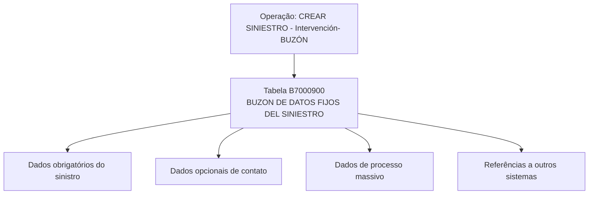

# Criar Sinistro — Intervenção-Buzón (Visão Técnica): Modelo de Dados Envolvido

## 1. Metadados do Documento
- **Arquivo de Origem:** Não identificado no conteúdo fornecido
- **Tipo de Documento:** Especificação Técnica
- **Domínio / Sistema:** Operação **CREAR SINIESTRO - Intervención- BUZÓN**
- **Público-Alvo:** Desenvolvedores, Arquitetos e Operação
- **Data/Versão Identificada:** Não identificada

---

## 2. Resumo Executivo & Contexto de Negócio

O documento descreve, sob uma visão técnica, o modelo de dados associado à operação **CREAR SINIESTRO - Intervención- BUZÓN**. O conteúdo identifica a tabela **B7000900**, descrita como **BUZON DE DATOS FIJOS DEL SINIESTRO**, como estrutura envolvida na operação.

A especificação apresenta uma relação de colunas da tabela B7000900 e indica, para cada coluna, informações relacionadas a alteração de valor, motivo/valor, obrigatoriedade e comentários descritivos. A maioria dos campos listados possui indicação `S` na coluna “CAMBIA VALOR” e `N.A.` em “MOTIVO/VALOR”.

O documento distingue campos obrigatórios e não obrigatórios na operação. Entre os campos obrigatórios estão dados de tratamento, tipo de movimento batch, companhia, número do sinistro, apólice, risco, aplicação, datas do sinistro e da denúncia, causa do sinistro, usuário de atualização, data de atualização e número de ordem do processo massivo.

Não há detalhamento de contratos HTTP, métodos de integração, formatos JSON, mecanismos de persistência, valores permitidos, chaves primárias, relacionamentos entre tabelas ou regras de validação além da indicação de obrigatoriedade apresentada.  
> **Nota de Análise:** o documento cita “Home Solutions APIs Documentation Zeus”, mas não fornece detalhes técnicos adicionais sobre APIs, endpoints ou contratos.

---

## 3. Arquitetura, Componentes & Tecnologias Envolvidas

### Componentes e estruturas identificadas

| Componente / Elemento | Descrição sustentada pelo documento |
| :--- | :--- |
| Operação `CREAR SINIESTRO - Intervención- BUZÓN` | Operação técnica de criação de sinistro associada a intervenção e buzón. |
| Tabela `B7000900` | Descrita como “BUZON DE DATOS FIJOS DEL SINIESTRO”. |
| Home Solutions APIs Documentation Zeus | Texto citado no cabeçalho da primeira página, sem detalhamento funcional ou técnico adicional. |
| Processo massivo | Referenciado em comentários de `FEC_TRATAMIENTO`, `TIP_MVTO_BATCH_STRO` e `NUM_ORDEN`. |
| Outros sistemas | Referenciados nos comentários de campos de sinistro de referência, sem identificação dos sistemas envolvidos. |



> **Nota de Análise:** o diagrama representa somente a associação documental entre a operação, a tabela B7000900 e os grupos de campos citados. O documento não descreve arquitetura de microsserviços, integrações efetivas, protocolos, bancos de dados ou fluxos de rede.

---

## 4. Regras de Negócio, Especificações Funcionais & Processos

### Regras de obrigatoriedade identificadas

1. A operação utiliza a tabela `B7000900`, denominada **BUZON DE DATOS FIJOS DEL SINIESTRO**.
2. Os campos `FEC_TRATAMIENTO`, `TIP_MVTO_BATCH_STRO`, `COD_CIA`, `NUM_SINI`, `NUM_SINI_REF`, `NUM_POLIZA`, `NUM_RIESGO`, `NUM_APLI`, `FEC_SINI`, `FEC_DENU_SINI`, `COD_CAUSA_SINI`, `COD_USR`, `FEC_ACTU` e `NUM_ORDEN` estão marcados como obrigatórios (`SI`).
3. Os campos `HORA_SINI`, `COD_EVENTO`, `NOM_CONTACTO`, `APE_CONTACTO`, `TEL_PAIS_CONTACTO`, `TEL_ZONA_CONTACTO`, `TEL_NUMERO_CONTACTO`, `MCA_CULPABLE`, `TIP_DOCUM_CONTACTO`, `COD_DOCUM_CONTACTO`, `TIP_RELACION`, `EMAIL_CONTACTO`, `HORA_DENU_SINI`, `IMP_VAL_INI_SINI`, `NUM_SINI_REF_MOD`, `TXT_CNH_CLR`, `TXT_CNH_TLP` e `TXT_CNH_EML` estão marcados como não obrigatórios (`NO`).
4. Todos os campos exibidos possuem `S` na coluna **CAMBIA VALOR**.
5. Todos os campos exibidos possuem `N.A.` na coluna **MOTIVO/VALOR**.
6. O documento associa `FEC_TRATAMIENTO`, `TIP_MVTO_BATCH_STRO` e `NUM_ORDEN` a um processo massivo.
7. O documento associa `NUM_SINI_REF` e `NUM_SINI_REF_MOD` a referências de sinistro em outros sistemas.
8. O documento lista informações opcionais de contato, incluindo nome, sobrenome, país, zona, número de telefone, tipo e código de documento, relação, e-mail e meios de contato móvel, telefone e e-mail.
9. O documento lista um campo opcional para o valor inicial estimado do sinistro: `IMP_VAL_INI_SINI`.
10. O documento não define dependências condicionais entre campos, regras de preenchimento, máscaras, tipos de dados físicos, domínios de valores ou mensagens de erro.

---

## 5. Tabelas de Parâmetros, Ambientes e Estruturas de Dados

### Tabela envolvida

| Item / Parâmetro | Descrição / Função | Tipo / Valores / Formato | Ambiente / Observações |
| :--- | :--- | :--- | :--- |
| `B7000900` | BUZON DE DATOS FIJOS DEL SINIESTRO | Tabela | Estrutura envolvida na operação `CREAR SINIESTRO - Intervención- BUZÓN`. |
| `CREAR SINIESTRO - Intervención- BUZÓN` | Operação de criação de sinistro | Operação | O documento a apresenta sob “visión técnica”. |
| `Home Solutions APIs Documentation Zeus` | Referência textual no documento | Não detalhado | Não há URLs, endpoints ou especificações de API. |

### Campos da tabela B7000900

| Item / Parâmetro | Descrição / Função | Tipo / Valores / Formato | Ambiente / Observações |
| :--- | :--- | :--- | :--- |
| `FEC_TRATAMIENTO` | “FECHA QUE S EL PRO MASIV” | `CAMBIA VALOR: S`; `MOTIVO/VALOR: N.A.` | Obrigatória: `SI`. Comentário parcialmente extraído. |
| `TIP_MVTO_BATCH_STRO` | “TIPO D MOVIM BATCH” | `CAMBIA VALOR: S`; `MOTIVO/VALOR: N.A.` | Obrigatória: `SI`. |
| `COD_CIA` | “COMPA” | `CAMBIA VALOR: S`; `MOTIVO/VALOR: N.A.` | Obrigatória: `SI`. |
| `NUM_SINI` | “SINIES” | `CAMBIA VALOR: S`; `MOTIVO/VALOR: N.A.` | Obrigatória: `SI`. |
| `NUM_SINI_REF` | “SINIES REFER OTROS SISTEM” | `CAMBIA VALOR: S`; `MOTIVO/VALOR: N.A.` | Obrigatória: `SI`. Referência a outros sistemas. |
| `NUM_POLIZA` | “POLIZA” | `CAMBIA VALOR: S`; `MOTIVO/VALOR: N.A.` | Obrigatória: `SI`. |
| `NUM_RIESGO` | “RIESG” | `CAMBIA VALOR: S`; `MOTIVO/VALOR: N.A.` | Obrigatória: `SI`. |
| `NUM_APLI` | “NUMER APLICA” | `CAMBIA VALOR: S`; `MOTIVO/VALOR: N.A.` | Obrigatória: `SI`. |
| `FEC_SINI` | “FECHA OCURR DEL SI” | `CAMBIA VALOR: S`; `MOTIVO/VALOR: N.A.` | Obrigatória: `SI`. |
| `FEC_DENU_SINI` | “FECHA NOTIFI DENUN SINIES” | `CAMBIA VALOR: S`; `MOTIVO/VALOR: N.A.` | Obrigatória: `SI`. |
| `HORA_SINI` | “HORA OCURR DEL SI” | `CAMBIA VALOR: S`; `MOTIVO/VALOR: N.A.` | Não obrigatória: `NO`. |
| `COD_CAUSA_SINI` | “CAUSA SINIES” | `CAMBIA VALOR: S`; `MOTIVO/VALOR: N.A.` | Obrigatória: `SI`. |
| `COD_EVENTO` | “EVENT CATRA QUE O SINIES” | `CAMBIA VALOR: S`; `MOTIVO/VALOR: N.A.` | Não obrigatória: `NO`. Comentário parcialmente extraído. |
| `NOM_CONTACTO` | “PERSO CONTA” | `CAMBIA VALOR: S`; `MOTIVO/VALOR: N.A.` | Não obrigatória: `NO`. |
| `APE_CONTACTO` | “APELL CONTA” | `CAMBIA VALOR: S`; `MOTIVO/VALOR: N.A.` | Não obrigatória: `NO`. |
| `TEL_PAIS_CONTACTO` | “PAIS D TELEF PERSO CONTA” | `CAMBIA VALOR: S`; `MOTIVO/VALOR: N.A.` | Não obrigatória: `NO`. |
| `TEL_ZONA_CONTACTO` | “ZONA D TELEF PERSO CONTA” | `CAMBIA VALOR: S`; `MOTIVO/VALOR: N.A.` | Não obrigatória: `NO`. |
| `TEL_NUMERO_CONTACTO` | “NUMER TELEF PERSO CONTA” | `CAMBIA VALOR: S`; `MOTIVO/VALOR: N.A.` | Não obrigatória: `NO`. |
| `MCA_CULPABLE` | “SI ES O CULPA SINIES” | `CAMBIA VALOR: S`; `MOTIVO/VALOR: N.A.` | Não obrigatória: `NO`. Comentário parcialmente extraído. |
| `COD_USR` | “USUAR ACTUA FILA” | `CAMBIA VALOR: S`; `MOTIVO/VALOR: N.A.` | Obrigatória: `SI`. |
| `FEC_ACTU` | “FECHA ACTUA DE LA” | `CAMBIA VALOR: S`; `MOTIVO/VALOR: N.A.` | Obrigatória: `SI`. Comentário parcialmente extraído. |
| `TIP_DOCUM_CONTACTO` | “TIPO D DOCUM LA PER CONTA” | `CAMBIA VALOR: S`; `MOTIVO/VALOR: N.A.` | Não obrigatória: `NO`. |
| `COD_DOCUM_CONTACTO` | “DOCUM LA PER CONTA” | `CAMBIA VALOR: S`; `MOTIVO/VALOR: N.A.` | Não obrigatória: `NO`. |
| `TIP_RELACION` | “RELAC EL ASE” | `CAMBIA VALOR: S`; `MOTIVO/VALOR: N.A.` | Não obrigatória: `NO`. Comentário parcialmente extraído. |
| `EMAIL_CONTACTO` | “DIREC CORRE ELECT DE LA DE CO” | `CAMBIA VALOR: S`; `MOTIVO/VALOR: N.A.` | Não obrigatória: `NO`. Comentário parcialmente extraído. |
| `HORA_DENU_SINI` | “HORA DENUN SINIES” | `CAMBIA VALOR: S`; `MOTIVO/VALOR: N.A.` | Não obrigatória: `NO`. |
| `NUM_ORDEN` | “NUMER PROCE MASIV” | `CAMBIA VALOR: S`; `MOTIVO/VALOR: N.A.` | Obrigatória: `SI`. |
| `IMP_VAL_INI_SINI` | “IMPOR ESTIMA LA VAL DEL SI” | `CAMBIA VALOR: S`; `MOTIVO/VALOR: N.A.` | Não obrigatória: `NO`. Comentário parcialmente extraído. |
| `NUM_SINI_REF_MOD` | “SINIES REFER OTROS SISTEM MODIF” | `CAMBIA VALOR: S`; `MOTIVO/VALOR: N.A.` | Não obrigatória: `NO`. Referência modificada em outros sistemas. |
| `TXT_CNH_CLR` | “MEDIO CONTA MOVIL” | `CAMBIA VALOR: S`; `MOTIVO/VALOR: N.A.` | Não obrigatória: `NO`. |
| `TXT_CNH_TLP` | “MEDIO CONTA TELEF” | `CAMBIA VALOR: S`; `MOTIVO/VALOR: N.A.` | Não obrigatória: `NO`. |
| `TXT_CNH_EML` | “MEDIO CONTA EMAIL” | `CAMBIA VALOR: S`; `MOTIVO/VALOR: N.A.` | Não obrigatória: `NO`. |

---

## 6. Bateria de Perguntas & Respostas para RAG (FAQ Sintético)

### P1: Qual tabela está envolvida na operação CREAR SINIESTRO - Intervención- BUZÓN?
**R:** A tabela identificada no documento é a `B7000900`, descrita como **BUZON DE DATOS FIJOS DEL SINIESTRO**.

### P2: Quais campos são obrigatórios para a operação de criação de sinistro?
**R:** Os campos marcados como obrigatórios são `FEC_TRATAMIENTO`, `TIP_MVTO_BATCH_STRO`, `COD_CIA`, `NUM_SINI`, `NUM_SINI_REF`, `NUM_POLIZA`, `NUM_RIESGO`, `NUM_APLI`, `FEC_SINI`, `FEC_DENU_SINI`, `COD_CAUSA_SINI`, `COD_USR`, `FEC_ACTU` e `NUM_ORDEN`.

### P3: O número do sinistro é obrigatório na tabela B7000900?
**R:** Sim. O campo `NUM_SINI` está marcado como obrigatório (`SI`) no documento.

### P4: A operação possui campos para dados de contato?
**R:** Sim. O documento lista campos opcionais de contato: `NOM_CONTACTO`, `APE_CONTACTO`, `TEL_PAIS_CONTACTO`, `TEL_ZONA_CONTACTO`, `TEL_NUMERO_CONTACTO`, `TIP_DOCUM_CONTACTO`, `COD_DOCUM_CONTACTO`, `TIP_RELACION`, `EMAIL_CONTACTO`, `TXT_CNH_CLR`, `TXT_CNH_TLP` e `TXT_CNH_EML`.

### P5: Quais campos estão associados ao processo massivo?
**R:** Os comentários extraídos associam `FEC_TRATAMIENTO`, `TIP_MVTO_BATCH_STRO` e `NUM_ORDEN` ao processo massivo. O texto apresenta referências como “EL PRO MASIV”, “MOVIM BATCH” e “PROCE MASIV”.

### P6: Há campos para registrar data e hora do sinistro?
**R:** Sim. `FEC_SINI` é obrigatório e está associado à data de ocorrência do sinistro. `HORA_SINI` está associado à hora de ocorrência do sinistro, mas é não obrigatório.

### P7: Há campos para registrar data e hora da denúncia do sinistro?
**R:** Sim. `FEC_DENU_SINI` é obrigatório e está associado à data de notificação ou denúncia do sinistro. `HORA_DENU_SINI` registra a hora da denúncia do sinistro e é não obrigatório.

### P8: O documento especifica quais APIs, URLs ou métodos HTTP devem ser usados?
**R:** Não. Embora o texto cite “Home Solutions APIs Documentation Zeus”, não há URLs, métodos HTTP, contratos JSON, autenticação, endpoints ou especificações de integração no conteúdo fornecido.

### P9: Como são tratados sinistros de referência de outros sistemas?
**R:** O documento lista `NUM_SINI_REF` como obrigatório e `NUM_SINI_REF_MOD` como não obrigatório. Os comentários extraídos fazem referência a sinistro de referência e a outros sistemas, mas não especificam os sistemas externos, regras de sincronização ou formato das referências.

### P10: Existe um campo para valor inicial estimado do sinistro?
**R:** Sim. O campo `IMP_VAL_INI_SINI` está associado, no comentário extraído, a um “importe estimado” ou valor inicial do sinistro. Esse campo é não obrigatório.

---

## 7. Glossário de Termos, Siglas & Conceitos-Chave

- **B7000900:** Tabela descrita como **BUZON DE DATOS FIJOS DEL SINIESTRO**.
- **BUZÓN:** Termo usado na descrição da tabela e no nome da operação. O documento não detalha seu significado funcional.
- **CREAR SINIESTRO:** Nome da operação de criação de sinistro.
- **Intervención:** Termo presente no nome da operação; não recebe definição adicional.
- **SINIESTRO:** Termo de domínio utilizado para o registro tratado pela operação.
- **`FEC_SINI`:** Campo associado à data de ocorrência do sinistro.
- **`FEC_DENU_SINI`:** Campo associado à data de notificação ou denúncia do sinistro.
- **`HORA_SINI`:** Campo associado à hora de ocorrência do sinistro.
- **`HORA_DENU_SINI`:** Campo associado à hora de denúncia do sinistro.
- **`NUM_SINI`:** Campo associado ao número do sinistro.
- **`NUM_SINI_REF`:** Campo associado a um sinistro de referência em outros sistemas.
- **`NUM_SINI_REF_MOD`:** Campo associado a uma referência modificada de sinistro em outros sistemas.
- **`TIP_MVTO_BATCH_STRO`:** Campo associado ao tipo de movimento batch.
- **`NUM_ORDEN`:** Campo associado ao número de processo massivo.
- **`COD_CIA`:** Campo cuja descrição extraída contém “COMPA”; o documento não expande a sigla.
- **`COD_USR`:** Campo associado ao usuário que atualiza a fila, conforme comentário parcialmente extraído.
- **`MCA_CULPABLE`:** Campo opcional associado a culpa no sinistro, conforme comentário parcialmente extraído.
- **N.A.:** Valor apresentado na coluna “MOTIVO/VALOR” para todos os campos listados; o documento não define formalmente a sigla.

---

## 8. Notas Críticas, Riscos & Limitações

- O conteúdo extraído está parcialmente truncado em várias descrições e comentários de campos.
- O documento não informa o tipo físico dos campos, tamanho, precisão, formato de datas, domínio de valores, chaves, índices ou relacionamentos da tabela `B7000900`.
- Não há regras de validação além da indicação de obrigatoriedade `SI` ou `NO`.
- Não há detalhamento de APIs, métodos HTTP, contratos de requisição/resposta, autenticação, URLs, ambientes ou mecanismos de integração.
- A referência a “Home Solutions APIs Documentation Zeus” não é acompanhada de especificação técnica adicional.
- O documento não identifica versões, data, autoria, sistemas externos envolvidos ou procedimento operacional de execução.
- As descrições de campos foram preservadas conforme a extração disponível; termos fragmentados não foram completados por inferência.

---

## 9. Conteúdo Bruto Estruturado (Referência Fiel)

```text
--- [PÁGINA 1 DE 5] ---

Imagen LOGO
EN CONSTRUCCIÓN
CREAR Siniestro - Intervencion- buzón (visión
técnica)
Modelo de datos involucrado
Las tablas que intervienen en esta operación son:
OPERACIÓN
CREAR SINIESTRO - Intervención- BUZÓN
TABLA DESCRIPCIÓN
B7000900 BUZON DE DATOS FIJOS DEL SINIESTRO
 / 
 CF
Home Solutions APIs Documentation Zeus
EN


--- [PÁGINA 2 DE 5] ---

COLUMNA CAMBIA
VALOR
MOTIVO/VALOR OBLIGATORIA COMEN
FEC_TRATAMIENTO S N.A. SI FECHA
QUE S
EL PRO
MASIV
TIP_MVTO_BATCH_STRO S N.A. SI TIPO D
MOVIM
BATCH
COD_CIA S N.A. SI COMPA
NUM_SINI S N.A. SI SINIES
NUM_SINI_REF S N.A. SI SINIES
REFER
OTROS
SISTEM
NUM_POLIZA S N.A. SI POLIZA
NUM_RIESGO S N.A. SI RIESG
NUM_APLI S N.A. SI NUMER
APLICA
FEC_SINI S N.A. SI FECHA
OCURR
DEL SI
FEC_DENU_SINI S N.A. SI FECHA
NOTIFI
DENUN
SINIES
HORA_SINI S N.A. NO HORA 
OCURR
DEL SI


--- [PÁGINA 3 DE 5] ---

COLUMNA CAMBIA
VALOR
MOTIVO/VALOR OBLIGATORIA COMEN
COD_CAUSA_SINI S N.A. SI CAUSA
SINIES
COD_EVENTO S N.A. NO EVENT
CATRA
QUE O
SINIES
NOM_CONTACTO S N.A. NO PERSO
CONTA
APE_CONTACTO S N.A. NO APELL
CONTA
TEL_PAIS_CONTACTO S N.A. NO PAIS D
TELEF
PERSO
CONTA
TEL_ZONA_CONTACTO S N.A. NO ZONA D
TELEF
PERSO
CONTA
TEL_NUMERO_CONTACTO S N.A. NO NUMER
TELEF
PERSO
CONTA
MCA_CULPABLE S N.A. NO SI ES O
CULPA
SINIES
COD_USR S N.A. SI USUAR
ACTUA
FILA


--- [PÁGINA 4 DE 5] ---

COLUMNA CAMBIA
VALOR
MOTIVO/VALOR OBLIGATORIA COMEN
FEC_ACTU S N.A. SI FECHA
ACTUA
DE LA 
TIP_DOCUM_CONTACTO S N.A. NO TIPO D
DOCUM
LA PER
CONTA
COD_DOCUM_CONTACTO S N.A. NO DOCUM
LA PER
CONTA
TIP_RELACION S N.A. NO RELAC
EL ASE
EMAIL_CONTACTO S N.A. NO DIREC
CORRE
ELECT
DE LA 
DE CO
HORA_DENU_SINI S N.A. NO HORA 
DENUN
SINIES
NUM_ORDEN S N.A. SI NUMER
PROCE
MASIV
IMP_VAL_INI_SINI S N.A. NO IMPOR
ESTIMA
LA VAL
DEL SI
NUM_SINI_REF_MOD S N.A. NO SINIES
REFER
OTROS


--- [PÁGINA 5 DE 5] ---

COLUMNA CAMBIA
VALOR
MOTIVO/VALOR OBLIGATORIA COMEN
SISTEM
MODIF
TXT_CNH_CLR S N.A. NO MEDIO
CONTA
MOVIL
TXT_CNH_TLP S N.A. NO MEDIO
CONTA
TELEF
TXT_CNH_EML S N.A. NO MEDIO
CONTA
EMAIL
```
