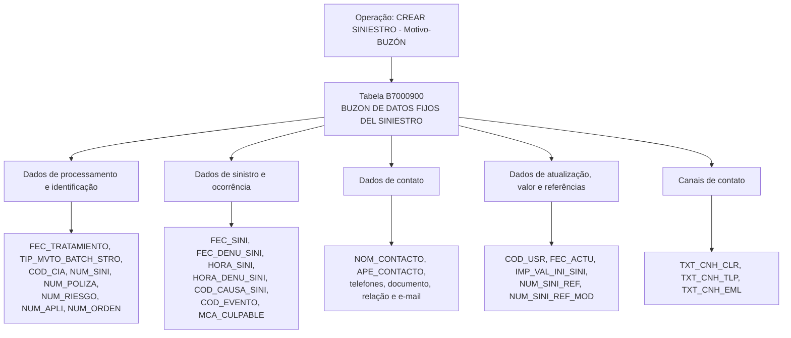

# Criar Sinistro — Motivo-Buzón (Visão Técnica) e Modelo de Dados

## 1. Metadados do Documento
- **Arquivo de Origem:** Não identificado no conteúdo fornecido
- **Tipo de Documento:** Especificação Técnica
- **Domínio / Sistema:** Operação de criação de sinistro; buzón de dados fixos do sinistro
- **Público-Alvo:** Desenvolvedores, Arquitetos, Operação
- **Data/Versão Identificada:** Não identificada

---

## 2. Resumo Executivo & Contexto de Negócio

O documento descreve, em visão técnica, a operação **“CREAR SINIESTRO - Motivo-BUZÓN”** e o modelo de dados envolvido nessa operação. O conteúdo identifica a tabela `B7000900` como **“BUZON DE DATOS FIJOS DEL SINIESTRO”**.

A especificação apresenta uma relação de colunas da tabela `B7000900`, incluindo a indicação de obrigatoriedade para diversos campos. Os atributos abrangem dados de processamento massivo, identificação de companhia, sinistro, apólice, risco e aplicação, além de informações de ocorrência, denúncia e contato.

O material também registra campos relacionados a causa e evento do sinistro, dados de contato, usuário e data de atualização, valores estimados, referências de sinistro e preferências de canais de contato móvel, telefônico e e-mail.

O texto extraído está fragmentado e não apresenta detalhes completos de tipos físicos, tamanhos, contratos de API, métodos HTTP, regras de persistência, responsáveis pela operação ou fluxo operacional completo. A documentação menciona referências a “Home Solutions APIs Documentation Zeus”, mas não detalha essa referência.

---

## 3. Arquitetura, Componentes & Tecnologias Envolvidas

### Componentes e elementos identificados

| Componente / Elemento | Descrição sustentada pelo documento |
| :--- | :--- |
| `CREAR SINIESTRO - Motivo-BUZÓN` | Operação descrita pelo documento. |
| `B7000900` | Tabela identificada como “BUZON DE DATOS FIJOS DEL SINIESTRO”. |
| Home Solutions APIs Documentation Zeus | Referência textual presente na primeira página; não há detalhamento adicional. |
| Processamento massivo | Contexto indicado por campos como `FEC_TRATAMIENTO` e `NUM_ORDEN`. |
| Sinistro | Entidade central identificada por campos como `NUM_SINI`, `FEC_SINI`, `FEC_DENU_SINI` e `COD_CAUSA_SINI`. |
| Contato | Dados associados por campos como nome, sobrenome, telefone, documento, relação e e-mail. |



> *Nota de Análise: O documento não detalha tecnologias de implementação, motores de banco de dados, APIs, métodos HTTP, contratos JSON, URLs, ambientes ou integrações externas. O diagrama representa exclusivamente a relação explícita entre a operação e a tabela identificada.*

---

## 4. Regras de Negócio, Especificações Funcionais & Processos

### Operação identificada
- A operação é denominada **“CREAR SINIESTRO - Motivo-BUZÓN”**.
- A tabela que intervém na operação é `B7000900`, descrita como **“BUZON DE DATOS FIJOS DEL SINIESTRO”**.

### Obrigatoriedade de campos

Os seguintes campos estão marcados como obrigatórios (`SI`) na extração:

- `FEC_TRATAMIENTO`
- `TIP_MVTO_BATCH_STRO`
- `COD_CIA`
- `NUM_SINI`
- `NUM_SINI_REF`
- `NUM_POLIZA`
- `NUM_RIESGO`
- `NUM_APLI`
- `FEC_SINI`
- `FEC_DENU_SINI`
- `COD_CAUSA_SINI`
- `COD_USR`
- `FEC_ACTU`
- `NUM_ORDEN`

Os seguintes campos estão marcados como não obrigatórios (`NO`) na extração:

- `HORA_SINI`
- `COD_EVENTO`
- `NOM_CONTACTO`
- `APE_CONTACTO`
- `TEL_PAIS_CONTACTO`
- `TEL_ZONA_CONTACTO`
- `TEL_NUMERO_CONTACTO`
- `MCA_CULPABLE`
- `TIP_DOCUM_CONTACTO`
- `COD_DOCUM_CONTACTO`
- `TIP_RELACION`
- `EMAIL_CONTACTO`
- `HORA_DENU_SINI`
- `IMP_VAL_INI_SINI`
- `NUM_SINI_REF_MOD`
- `TXT_CNH_CLR`
- `TXT_CNH_TLP`
- `TXT_CNH_EML`

### Condições e restrições explicitamente disponíveis

- O campo `FEC_TRATAMIENTO` é associado a uma **data de processamento massivo**, conforme texto parcial extraído.
- O campo `TIP_MVTO_BATCH_STRO` é associado ao **tipo de movimento batch**.
- O campo `NUM_ORDEN` é associado a um **número de processo massivo**.
- O campo `COD_USR` é associado ao **usuário que atualiza a fila**, conforme texto fragmentado.
- O campo `FEC_ACTU` é associado à **data de atualização**.
- O campo `IMP_VAL_INI_SINI` é associado a um **importe estimado**, com descrição parcial relacionada ao valor do sinistro.
- `TXT_CNH_CLR`, `TXT_CNH_TLP` e `TXT_CNH_EML` são associados, respectivamente, a meios de contato móvel, telefônico e e-mail.

> *Nota de Análise: O documento apresenta a coluna “CAMBIA VALOR” com valor `S` e a coluna “MOTIVO/VALOR” com valor `N.A.` para os campos listados. Não há explicação textual suficiente para interpretar o significado funcional completo desses valores.*

---

## 5. Tabelas de Parâmetros, Ambientes e Estruturas de Dados

### Tabela envolvida na operação

| Item / Parâmetro | Descrição / Função | Tipo / Valores / Formato | Ambiente / Observações |
| :--- | :--- | :--- | :--- |
| `B7000900` | BUZON DE DATOS FIJOS DEL SINIESTRO | Tabela | Intervém na operação “CREAR SINIESTRO - Motivo-BUZÓN”. |

### Campos de processamento, identificação e referência

| Item / Parâmetro | Descrição / Função | Tipo / Valores / Formato | Ambiente / Observações |
| :--- | :--- | :--- | :--- |
| `FEC_TRATAMIENTO` | Data de processamento massivo | Não informado | Obrigatório: `SI`; cambia valor: `S`; motivo/valor: `N.A.` |
| `TIP_MVTO_BATCH_STRO` | Tipo de movimento batch | Não informado | Obrigatório: `SI`; cambia valor: `S`; motivo/valor: `N.A.` |
| `COD_CIA` | Companhia | Não informado | Obrigatório: `SI`; cambia valor: `S`; motivo/valor: `N.A.` |
| `NUM_SINI` | Sinistro | Não informado | Obrigatório: `SI`; cambia valor: `S`; motivo/valor: `N.A.` |
| `NUM_SINI_REF` | Sinistro de referência de outros sistemas | Não informado | Obrigatório: `SI`; cambia valor: `S`; motivo/valor: `N.A.` |
| `NUM_POLIZA` | Apólice | Não informado | Obrigatório: `SI`; cambia valor: `S`; motivo/valor: `N.A.` |
| `NUM_RIESGO` | Risco | Não informado | Obrigatório: `SI`; cambia valor: `S`; motivo/valor: `N.A.` |
| `NUM_APLI` | Número de aplicação | Não informado | Obrigatório: `SI`; cambia valor: `S`; motivo/valor: `N.A.` |
| `NUM_ORDEN` | Número de processo massivo | Não informado | Obrigatório: `SI`; cambia valor: `S`; motivo/valor: `N.A.` |
| `NUM_SINI_REF_MOD` | Sinistro de referência de outros sistemas modificado | Não informado | Obrigatório: `NO`; cambia valor: `S`; motivo/valor: `N.A.` |

### Campos de sinistro, ocorrência e denúncia

| Item / Parâmetro | Descrição / Função | Tipo / Valores / Formato | Ambiente / Observações |
| :--- | :--- | :--- | :--- |
| `FEC_SINI` | Data de ocorrência do sinistro | Não informado | Obrigatório: `SI`; cambia valor: `S`; motivo/valor: `N.A.` |
| `FEC_DENU_SINI` | Data de notificação/denúncia do sinistro | Não informado | Obrigatório: `SI`; cambia valor: `S`; motivo/valor: `N.A.` |
| `HORA_SINI` | Hora de ocorrência do sinistro | Não informado | Obrigatório: `NO`; cambia valor: `S`; motivo/valor: `N.A.` |
| `HORA_DENU_SINI` | Hora de denúncia do sinistro | Não informado | Obrigatório: `NO`; cambia valor: `S`; motivo/valor: `N.A.` |
| `COD_CAUSA_SINI` | Causa do sinistro | Não informado | Obrigatório: `SI`; cambia valor: `S`; motivo/valor: `N.A.` |
| `COD_EVENTO` | Evento associado ao sinistro | Não informado | Obrigatório: `NO`; cambia valor: `S`; motivo/valor: `N.A.` |
| `MCA_CULPABLE` | Indicador de culpabilidade no sinistro | Não informado | Obrigatório: `NO`; cambia valor: `S`; motivo/valor: `N.A.` |
| `IMP_VAL_INI_SINI` | Importe estimado / valor inicial do sinistro | Não informado | Obrigatório: `NO`; cambia valor: `S`; motivo/valor: `N.A.` |

### Campos de contato

| Item / Parâmetro | Descrição / Função | Tipo / Valores / Formato | Ambiente / Observações |
| :--- | :--- | :--- | :--- |
| `NOM_CONTACTO` | Nome da pessoa de contato | Não informado | Obrigatório: `NO`; cambia valor: `S`; motivo/valor: `N.A.` |
| `APE_CONTACTO` | Sobrenome da pessoa de contato | Não informado | Obrigatório: `NO`; cambia valor: `S`; motivo/valor: `N.A.` |
| `TEL_PAIS_CONTACTO` | País do telefone da pessoa de contato | Não informado | Obrigatório: `NO`; cambia valor: `S`; motivo/valor: `N.A.` |
| `TEL_ZONA_CONTACTO` | Zona do telefone da pessoa de contato | Não informado | Obrigatório: `NO`; cambia valor: `S`; motivo/valor: `N.A.` |
| `TEL_NUMERO_CONTACTO` | Número de telefone da pessoa de contato | Não informado | Obrigatório: `NO`; cambia valor: `S`; motivo/valor: `N.A.` |
| `TIP_DOCUM_CONTACTO` | Tipo de documento da pessoa de contato | Não informado | Obrigatório: `NO`; cambia valor: `S`; motivo/valor: `N.A.` |
| `COD_DOCUM_CONTACTO` | Documento da pessoa de contato | Não informado | Obrigatório: `NO`; cambia valor: `S`; motivo/valor: `N.A.` |
| `TIP_RELACION` | Relação com o segurado | Não informado | Obrigatório: `NO`; cambia valor: `S`; motivo/valor: `N.A.` |
| `EMAIL_CONTACTO` | Endereço de correio eletrônico da pessoa de contato | Não informado | Obrigatório: `NO`; cambia valor: `S`; motivo/valor: `N.A.` |

### Campos de atualização e canais de contato

| Item / Parâmetro | Descrição / Função | Tipo / Valores / Formato | Ambiente / Observações |
| :--- | :--- | :--- | :--- |
| `COD_USR` | Usuário que atualiza a fila | Não informado | Obrigatório: `SI`; cambia valor: `S`; motivo/valor: `N.A.` |
| `FEC_ACTU` | Data de atualização | Não informado | Obrigatório: `SI`; cambia valor: `S`; motivo/valor: `N.A.` |
| `TXT_CNH_CLR` | Meio de contato móvel | Não informado | Obrigatório: `NO`; cambia valor: `S`; motivo/valor: `N.A.` |
| `TXT_CNH_TLP` | Meio de contato telefônico | Não informado | Obrigatório: `NO`; cambia valor: `S`; motivo/valor: `N.A.` |
| `TXT_CNH_EML` | Meio de contato por e-mail | Não informado | Obrigatório: `NO`; cambia valor: `S`; motivo/valor: `N.A.` |

---

## 6. Bateria de Perguntas & Respostas para RAG (FAQ Sintético)

### P1: Qual tabela participa da operação “CREAR SINIESTRO - Motivo-BUZÓN”?
**R:** A tabela identificada no documento é `B7000900`, descrita como **“BUZON DE DATOS FIJOS DEL SINIESTRO”**.

### P2: Quais são os campos obrigatórios de identificação do sinistro na tabela B7000900?
**R:** Entre os campos obrigatórios identificados estão `COD_CIA`, `NUM_SINI`, `NUM_SINI_REF`, `NUM_POLIZA`, `NUM_RIESGO` e `NUM_APLI`. O documento os marca com obrigatoriedade `SI`.

### P3: Quais campos obrigatórios registram datas associadas ao sinistro?
**R:** Os campos obrigatórios de data identificados são `FEC_TRATAMIENTO`, `FEC_SINI`, `FEC_DENU_SINI` e `FEC_ACTU`. A extração associa `FEC_SINI` à data de ocorrência do sinistro, `FEC_DENU_SINI` à data de notificação ou denúncia e `FEC_ACTU` à data de atualização.

### P4: A hora de ocorrência do sinistro é obrigatória?
**R:** Não. O campo `HORA_SINI`, associado à hora de ocorrência do sinistro, está marcado como `NO` na coluna de obrigatoriedade.

### P5: Qual campo registra a causa do sinistro e ele é obrigatório?
**R:** O campo `COD_CAUSA_SINI` representa a causa do sinistro. O documento o marca como obrigatório, com valor `SI`.

### P6: Quais informações de contato podem ser registradas na tabela B7000900?
**R:** A tabela contém campos para nome (`NOM_CONTACTO`), sobrenome (`APE_CONTACTO`), país, zona e número de telefone (`TEL_PAIS_CONTACTO`, `TEL_ZONA_CONTACTO`, `TEL_NUMERO_CONTACTO`), tipo e código de documento (`TIP_DOCUM_CONTACTO`, `COD_DOCUM_CONTACTO`), relação com o segurado (`TIP_RELACION`) e e-mail (`EMAIL_CONTACTO`). Todos esses campos estão marcados como não obrigatórios.

### P7: O documento exige o preenchimento do e-mail do contato?
**R:** Não. O campo `EMAIL_CONTACTO`, descrito como endereço de correio eletrônico da pessoa de contato, está marcado como não obrigatório (`NO`).

### P8: Quais campos representam canais de contato no documento?
**R:** Os campos `TXT_CNH_CLR`, `TXT_CNH_TLP` e `TXT_CNH_EML` são associados, respectivamente, aos meios de contato móvel, telefônico e por e-mail. Os três estão marcados como não obrigatórios.

### P9: Como o processamento massivo é representado na estrutura de dados?
**R:** O documento associa `FEC_TRATAMIENTO` à data de processamento massivo, `TIP_MVTO_BATCH_STRO` ao tipo de movimento batch e `NUM_ORDEN` ao número do processo massivo. Os três campos são obrigatórios.

### P10: Qual campo registra o usuário responsável pela atualização?
**R:** O campo `COD_USR` é associado ao usuário que atualiza a fila. O campo está marcado como obrigatório (`SI`).

### P11: Existe um campo para o valor inicial ou estimado do sinistro?
**R:** Sim. O campo `IMP_VAL_INI_SINI` é associado a um importe estimado ou valor inicial do sinistro. A extração o marca como não obrigatório (`NO`).

### P12: O documento define tipos de dados, tamanhos de campos ou contratos de API para a operação?
**R:** Não. O conteúdo fornecido lista campos, descrições parciais, obrigatoriedade e valores como `S` e `N.A.`, mas não especifica tipos físicos, tamanhos, métodos HTTP, contratos JSON ou endpoints.

---

## 7. Glossário de Termos, Siglas & Conceitos-Chave

- **B7000900:** Tabela denominada “BUZON DE DATOS FIJOS DEL SINIESTRO”.
- **Buzón:** Termo usado no nome da tabela e da operação; o documento não fornece definição adicional.
- **Sinistro:** Entidade central da operação “CREAR SINIESTRO - Motivo-BUZÓN”.
- **Apólice / Póliza:** Associada ao campo `NUM_POLIZA`.
- **Risco / Riesgo:** Associado ao campo `NUM_RIESGO`.
- **Batch:** Termo associado ao campo `TIP_MVTO_BATCH_STRO`, descrito como tipo de movimento batch.
- **Processamento massivo:** Contexto associado aos campos `FEC_TRATAMIENTO` e `NUM_ORDEN`.
- **COD_CIA:** Campo associado à companhia.
- **COD_CAUSA_SINI:** Campo associado à causa do sinistro.
- **COD_EVENTO:** Campo associado ao evento do sinistro.
- **MCA_CULPABLE:** Campo associado à indicação de culpabilidade no sinistro.
- **COD_USR:** Campo associado ao usuário que atualiza a fila.
- **FEC_ACTU:** Campo associado à data de atualização.
- **Home Solutions APIs Documentation Zeus:** Referência textual presente na primeira página, sem explicação adicional.

---

## 8. Notas Críticas, Riscos & Limitações

- O conteúdo extraído possui fragmentação de palavras, linhas e descrições, o que limita a reconstrução integral de algumas definições.
- Não foram identificados tipo de banco de dados, esquema, chaves primárias, chaves estrangeiras, índices ou regras de integridade da tabela `B7000900`.
- Não foram informados tipos de dados, formatos, limites de tamanho ou domínios válidos para os campos.
- O documento não explica o significado funcional completo das colunas “CAMBIA VALOR” e “MOTIVO/VALOR”, embora os registros exibam predominantemente `S` e `N.A.`.
- Não há detalhes sobre APIs, URLs, autenticação, ambientes, integrações, filas, mecanismos de processamento batch ou tratamento de erros.
- A menção a “Home Solutions APIs Documentation Zeus” não é acompanhada de URL, contrato técnico ou instrução operacional.
- As descrições de `NUM_SINI_REF` e `NUM_SINI_REF_MOD` estão parcialmente fragmentadas; a interpretação como referência a sinistros de outros sistemas é baseada exclusivamente nos trechos visíveis.
- Não foi identificada data, versão, autor, proprietário do sistema ou aprovação documental.

---

## 9. Conteúdo Bruto Estruturado (Referência Fiel)

```text
--- [PÁGINA 1 DE 5] ---

Imagen LOGO
EN CONSTRUCCIÓN
CREAR Siniestro - Motivo- buzón (visión
técnica)
Modelo de datos involucrado
Las tablas que intervienen en esta operación son:
OPERACIÓN
CREAR SINIESTRO - Motivo- BUZÓN
TABLA DESCRIPCIÓN
B7000900 BUZON DE DATOS FIJOS DEL SINIESTRO
 / 
 CF
Home Solutions APIs Documentation Zeus
EN


--- [PÁGINA 2 DE 5] ---

COLUMNA CAMBIA
VALOR
MOTIVO/VALOR OBLIGATORIA COMEN
FEC_TRATAMIENTO S N.A. SI FECHA
QUE S
EL PRO
MASIV
TIP_MVTO_BATCH_STRO S N.A. SI TIPO D
MOVIM
BATCH
COD_CIA S N.A. SI COMPA
NUM_SINI S N.A. SI SINIES
NUM_SINI_REF S N.A. SI SINIES
REFER
OTROS
SISTEM
NUM_POLIZA S N.A. SI POLIZA
NUM_RIESGO S N.A. SI RIESG
NUM_APLI S N.A. SI NUMER
APLICA
FEC_SINI S N.A. SI FECHA
OCURR
DEL SI
FEC_DENU_SINI S N.A. SI FECHA
NOTIFI
DENUN
SINIES
HORA_SINI S N.A. NO HORA 
OCURR
DEL SI


--- [PÁGINA 3 DE 5] ---

COLUMNA CAMBIA
VALOR
MOTIVO/VALOR OBLIGATORIA COMEN
COD_CAUSA_SINI S N.A. SI CAUSA
SINIES
COD_EVENTO S N.A. NO EVENT
CATRA
QUE O
SINIES
NOM_CONTACTO S N.A. NO PERSO
CONTA
APE_CONTACTO S N.A. NO APELL
CONTA
TEL_PAIS_CONTACTO S N.A. NO PAIS D
TELEF
PERSO
CONTA
TEL_ZONA_CONTACTO S N.A. NO ZONA D
TELEF
PERSO
CONTA
TEL_NUMERO_CONTACTO S N.A. NO NUMER
TELEF
PERSO
CONTA
MCA_CULPABLE S N.A. NO SI ES O
CULPA
SINIES
COD_USR S N.A. SI USUAR
ACTUA
FILA


--- [PÁGINA 4 DE 5] ---

COLUMNA CAMBIA
VALOR
MOTIVO/VALOR OBLIGATORIA COMEN
FEC_ACTU S N.A. SI FECHA
ACTUA
DE LA 
TIP_DOCUM_CONTACTO S N.A. NO TIPO D
DOCUM
LA PER
CONTA
COD_DOCUM_CONTACTO S N.A. NO DOCUM
LA PER
CONTA
TIP_RELACION S N.A. NO RELAC
EL ASE
EMAIL_CONTACTO S N.A. NO DIREC
CORRE
ELECT
DE LA 
DE CO
HORA_DENU_SINI S N.A. NO HORA 
DENUN
SINIES
NUM_ORDEN S N.A. SI NUMER
PROCE
MASIV
IMP_VAL_INI_SINI S N.A. NO IMPOR
ESTIMA
LA VAL
DEL SI
NUM_SINI_REF_MOD S N.A. NO SINIES
REFER
OTROS


--- [PÁGINA 5 DE 5] ---

COLUMNA CAMBIA
VALOR
MOTIVO/VALOR OBLIGATORIA COMEN
SISTEM
MODIF
TXT_CNH_CLR S N.A. NO MEDIO
CONTA
MOVIL
TXT_CNH_TLP S N.A. NO MEDIO
CONTA
TELEF
TXT_CNH_EML S N.A. NO MEDIO
CONTA
EMAIL
```
