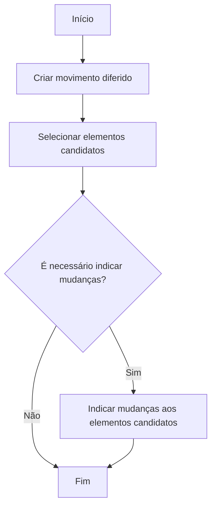

# Processo Massivo em Siniestros no Reef.core

## 1. Metadados do Documento
- **Arquivo de Origem:** Não identificado
- **Tipo de Documento:** Procedimento
- **Domínio / Sistema:** Reef.core — Siniestros / expedientes
- **Público-Alvo:** Operação, Negócio e usuários responsáveis por operações diferidas
- **Data/Versão Identificada:** Não identificada

---

## 2. Resumo Executivo & Contexto de Negócio

O documento descreve a criação de um **processo massivo** no domínio de *Siniestros* do sistema **Reef.core**. Reef.core é apresentado como composto por uma série de operações que podem ser executadas imediatamente, em linha, ou diferidas no tempo.

Quando uma operação pode ser realizada de forma diferida, o processo permite definir os elementos que serão afetados. Os elementos podem ser únicos ou múltiplos; o documento exemplifica a seleção de vários siniestros/expedientes para realização de uma operação como a alteração de valoração.

O processo massivo determina três dimensões: qual operação diferida será realizada, quais elementos serão impactados e quais modificações esses elementos sofrerão. Portanto, o processo massivo funciona como a preparação necessária antes do lançamento de uma operação diferida.

O objetivo declarado é conhecer as ações necessárias para posteriormente lançar uma operação de forma diferida. O documento não detalha uma operação específica, seus métodos, regras de elegibilidade, contratos, interfaces ou resultados de execução.

---

## 3. Arquitetura, Componentes & Tecnologias Envolvidas

### Componentes e conceitos identificados

| Componente / Conceito | Descrição baseada no documento |
| :--- | :--- |
| Reef.core | Sistema composto por uma série de operações. |
| Operação em linha | Operação realizada no momento. |
| Operação diferida | Operação realizada em momento posterior. |
| Processo massivo | Definição da operação diferida, dos elementos afetados e das modificações aplicáveis aos elementos. |
| Siniestros / expedientes | Elementos que podem ser selecionados como candidatos a uma operação; o documento apresenta o uso de múltiplos siniestros/expedientes como exemplo. |
| Movimiento diferido | Etapa inicial do fluxo para criação de uma operação diferida. |
| Elementos candidatos | Elementos selecionados para serem afetados pela operação diferida. |



**Nota de Análise:** o documento apresenta um fluxo funcional de preparação de operações diferidas, mas não descreve arquitetura técnica, serviços, APIs, bases de dados, protocolos, ambientes ou integrações.

---

## 4. Regras de Negócio, Especificações Funcionais & Processos

1. **Reef.core é composto por uma série de operações.**
2. **Determinadas operações podem ser executadas em linha ou de forma diferida no tempo.**
3. **Uma operação diferida pode afetar um ou vários elementos.**
4. **O processo massivo define a operação diferida que será realizada.**
5. **O processo massivo define os elementos afetados pela operação.**
6. **O processo massivo define as modificações que os elementos sofrerão, quando aplicável.**
7. **A criação do processo segue três etapas principais:**
   1. Criar o movimento diferido.
   2. Selecionar os elementos candidatos.
   3. Indicar mudanças aos elementos candidatos, somente quando houver necessidade de indicar mudanças.
8. **Exemplo citado:** podem ser selecionados vários siniestros/expedientes para executar determinada operação, como alterar a valoração.
9. **Escopo declarado:** o documento explica as ações necessárias para posteriormente lançar uma operação diferida; não se concentra em uma operação específica.

---

## 5. Tabelas de Parâmetros, Ambientes e Estruturas de Dados

| Item / Parâmetro | Descrição / Função | Tipo / Valores / Formato | Ambiente / Observações |
| :--- | :--- | :--- | :--- |
| Operação | Ação pertencente ao conjunto de operações de Reef.core. | Em linha ou diferida. | O documento não lista operações específicas. |
| Movimento diferido | Registro ou etapa de criação associada à futura execução de uma operação diferida. | Etapa 1 do processo. | Não são informados campos, identificadores ou formato. |
| Elementos candidatos | Elementos selecionados para serem afetados pela operação. | Um ou vários elementos. | O exemplo menciona siniestros/expedientes. |
| Mudanças aos elementos candidatos | Modificações a indicar para os elementos selecionados. | Condicional: aplicável quando houver necessidade de indicar mudanças. | Não são detalhados tipos de mudança ou regras de validação. |
| Processo massivo | Configuração que determina operação, elementos afetados e modificações. | Processo funcional. | Preparação para lançamento posterior de operação diferida. |
| Alteração de valoração | Exemplo de operação aplicável a siniestros/expedientes selecionados. | Exemplo funcional. | Sem detalhamento sobre cálculo, campos ou regras. |
| Ambientes | Ambientes técnicos do sistema. | Não identificado. | O documento não informa URLs, servidores, portas ou ambientes. |
| Logs | Rotas, variáveis ou mecanismos de log. | Não identificado. | O documento não fornece dados de logging. |

---

## 6. Bateria de Perguntas & Respostas para RAG (FAQ Sintético)

### P1: O que é um processo massivo no Reef.core?
**R:** Um processo massivo é a definição de uma operação diferida, dos elementos que serão afetados por essa operação e das modificações que esses elementos sofrerão. O processo massivo prepara a execução posterior de uma operação que não será realizada no momento.

### P2: Quais tipos de execução de operação são mencionados no documento?
**R:** O documento informa que determinadas operações do Reef.core podem ser realizadas no momento, em linha, ou de forma diferida no tempo.

### P3: Quais são as etapas para criar um processo massivo?
**R:** As etapas são: criar o movimento diferido, selecionar os elementos candidatos e, se necessário, indicar mudanças aos elementos candidatos.

### P4: Em que momento devem ser indicadas mudanças aos elementos candidatos?
**R:** As mudanças devem ser indicadas após a seleção dos elementos candidatos somente quando houver necessidade de indicar modificações para esses elementos.

### P5: Um processo massivo pode afetar mais de um elemento?
**R:** Sim. O documento afirma que, quando uma operação pode ser diferida, é possível determinar os elementos afetados, que podem corresponder a um único elemento ou a vários elementos.

### P6: Qual exemplo de elementos candidatos é apresentado?
**R:** O documento apresenta como exemplo a seleção de uma série de siniestros/expedientes para realizar determinada operação sobre eles.

### P7: Qual exemplo de operação é citado para siniestros/expedientes?
**R:** O exemplo indicado é a realização de uma operação para mudar a valoração de uma série de siniestros/expedientes selecionados.

### P8: O documento detalha uma operação específica do Reef.core?
**R:** Não. O objetivo declarado é explicar as ações necessárias para posteriormente lançar uma operação de forma diferida. O documento informa expressamente que não se concentra em nenhuma operação concreta.

### P9: O que deve ser definido antes de lançar uma operação diferida?
**R:** Antes do lançamento, deve ser criado o movimento diferido, selecionados os elementos candidatos e, quando necessário, indicadas as mudanças que serão aplicadas aos elementos candidatos.

### P10: O documento define APIs, métodos HTTP ou contratos de integração para o processo massivo?
**R:** Não. O documento não apresenta APIs, métodos HTTP, contratos JSON, serviços, URLs, ambientes técnicos ou detalhes de integração.

---

## 7. Glossário de Termos, Siglas & Conceitos-Chave

- **Reef.core:** Sistema formado por uma série de operações, conforme descrito no documento.
- **Processo massivo:** Processo que determina a operação diferida, os elementos afetados e as modificações aplicáveis.
- **Operação em linha:** Operação realizada no momento.
- **Operação diferida:** Operação cuja realização ocorre em momento posterior.
- **Movimiento diferido:** Etapa de criação da operação diferida no fluxo apresentado.
- **Elementos candidatos:** Elementos selecionados para serem afetados por uma operação diferida.
- **Siniestros / expedientes:** Tipos de elementos mencionados como exemplo de seleção para uma operação.
- **Valoração:** Elemento ou atributo que pode ser alterado, citado como exemplo de operação.

---

## 8. Notas Críticas, Riscos & Limitações

- O documento não identifica arquivo de origem, data, versão, autor, ambiente ou responsável pelo processo.
- O documento não especifica quais operações de Reef.core permitem execução diferida.
- Não são descritos critérios para seleção de elementos candidatos.
- Não são definidos os tipos de mudanças que podem ser indicadas aos elementos candidatos.
- Não são fornecidas regras de validação, tratamento de erros, aprovações, permissões, auditoria ou comportamento de execução.
- Não há detalhes sobre serviços, APIs, contratos, interfaces, persistência de dados, logs, URLs, servidores ou ambientes.
- **Nota de Análise:** o documento cita a alteração de valoração como exemplo, mas não detalha campos, regras de cálculo ou efeitos dessa alteração.
- **Nota de Análise:** o documento descreve a preparação para lançamento de operação diferida, mas não detalha o mecanismo de lançamento nem o processamento posterior da operação.

---

## 9. Conteúdo Bruto Estruturado (Referência Fiel)

```text
--- [PÁGINA 1 DE 2] ---

EN CONSTRUCCIÓN
CREAR proceso masivo en Siniestros
¿En que consiste?
Reef.core está formado por una serie de operaciones. Ciertas operaciones se pueden realizar tanto
en el momento (en línea), como diferidas en el tiempo. Cuando una operación se puede diferir,
además, se permite determinar a qué elementos afectará la operación (puede ser uno o varios
elementos). Por ejemplo, se puede seleccionar una serie de siniestros/expedientes a los que realizar
un determinada operación por ejemplo cambiar valoración.
Al proceso que determina qué operación diferida se va a realizar, a qué elementos afectará esa
operación y qué modificaciones sufrirán los elementos, se le denomina proceso masivo.
Objetivo
Conocer que acciones se deben realizar para que posteriormente se pueda lanzar una operación de
forma diferida. Este documento no se centra en ninguna operación en concreto.
Proceso a seguir
 /
 CF
Home Solutions APIs Documentation Zeus
EN


--- [PÁGINA 2 DE 2] ---

SI
NO
CREAR
movimiento
diferido (1)
SELECCIONAR
elementos
candidatos (2)
¿Hay
que
indicar
cambios? INDICAR cambios
a elementos
candidatos (3)
FIN
1. CREAR movimiento diferido
2. SELECCIONAR elementos candidatos
3. INDICAR cambios a elementos candidatos
```
