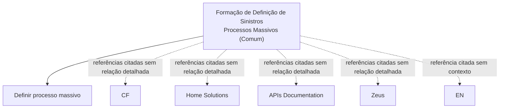

# Formação de Definição de Sinistros — Processos Massivos (Comum)

## 1. Metadados do Documento
- **Arquivo de Origem:** Não identificado
- **Tipo de Documento:** Apresentação Executiva
- **Domínio / Sistema:** Definição de Sinistros — Processos Massivos
- **Público-Alvo:** Não identificado
- **Data/Versão Identificada:** Não identificada

---

## 2. Resumo Executivo & Contexto de Negócio

O conteúdo extraído identifica uma apresentação em construção sobre **Formação de Definição de Sinistros — Processos Massivos (Comum)**. O documento aparenta ter finalidade formativa ou de definição conceitual relacionada a processos massivos no domínio de sinistros.

O conteúdo menciona explicitamente a necessidade de **definir processo massivo**. Entretanto, a extração não apresenta definição funcional, regras de negócio, etapas operacionais, critérios de entrada, critérios de saída ou responsabilidades associadas ao processo massivo.

Também são citadas referências a **CF**, **Home Solutions**, **APIs Documentation** e **Zeus**. Não há explicação sobre a natureza dessas referências, suas integrações, proprietários, tecnologias ou responsabilidades no processo de sinistros.

> **Nota de Análise:** O material contém apenas tópicos resumidos e não fornece detalhamento adicional sobre arquitetura, contratos de APIs, regras de negócio, ambientes ou procedimentos operacionais.

---

## 3. Arquitetura, Componentes & Tecnologias Envolvidas

Os elementos técnicos ou sistêmicos citados no conteúdo são:

- **CF**
- **Home Solutions**
- **APIs Documentation**
- **Zeus**
- **EN**

O documento não especifica se os itens são sistemas, módulos, ambientes, portais, integrações, tecnologias ou fontes documentais. Também não descreve fluxos de comunicação, interfaces, protocolos, métodos HTTP ou estruturas de dados.



> **Nota de Análise:** O diagrama representa somente a associação documental entre os termos citados. O conteúdo original não sustenta a existência de integrações ou fluxos técnicos entre CF, Home Solutions, APIs Documentation, Zeus e EN.

---

## 4. Regras de Negócio, Especificações Funcionais & Processos

### Processo massivo

O conteúdo apresenta o item **“DEFINIR proceso masivo”**, indicando que a definição de processo massivo é um tópico do documento.

Não foram identificados detalhes sobre:

- Definição operacional de processo massivo.
- Eventos que iniciam processos massivos.
- Sistemas responsáveis pela execução.
- Dados de entrada ou saída.
- Regras para processamento de sinistros.
- Validações, exceções ou critérios de elegibilidade.
- Regras de reprocessamento, cancelamento ou auditoria.
- Indicadores de acompanhamento operacional.
- Responsáveis funcionais ou técnicos.

> **Nota de Análise:** O documento lista o tópico “DEFINIR proceso masivo”, mas não detalha o conceito nem fornece especificações funcionais associadas.

---

## 5. Tabelas de Parâmetros, Ambientes e Estruturas de Dados

| Item / Parâmetro | Descrição / Função | Tipo / Valores / Formato | Ambiente / Observações |
| :--- | :--- | :--- | :--- |
| Formação de Definição de Sinistros — Processos Massivos (Comum) | Tema principal identificado no conteúdo. | Título de apresentação ou material formativo. | O documento está marcado como “EN CONSTRUCCIÓN”. |
| DEFINIR proceso masivo | Tópico listado no conteúdo. | Texto em espanhol. | Sem definição ou detalhamento adicional. |
| CF | Referência citada no material. | Sigla ou nome não definido. | Não há contexto funcional ou técnico. |
| Home Solutions | Referência citada no material. | Nome não definido. | Não há contexto funcional ou técnico. |
| APIs Documentation | Referência citada no material. | Texto em inglês. | Não há URLs, contratos, métodos ou documentação efetivamente extraída. |
| Zeus | Referência citada no material. | Nome não definido. | Não há contexto funcional ou técnico. |
| EN | Referência citada no material. | Sigla ou texto não definido. | Não há contexto adicional. |

---

## 6. Bateria de Perguntas & Respostas para RAG (FAQ Sintético)

### P1: Qual é o tema principal do documento?
**R:** O documento trata de **Formação de Definição de Sinistros — Processos Massivos (Comum)**. O material está identificado como “EN CONSTRUCCIÓN”, indicando que seu conteúdo ainda está em construção.

### P2: O documento define o que é um processo massivo?
**R:** Não. O documento apresenta o tópico “DEFINIR proceso masivo”, mas não fornece uma definição operacional, funcional ou técnica para processo massivo.

### P3: Quais sistemas ou referências são citados no documento?
**R:** O conteúdo cita **CF**, **Home Solutions**, **APIs Documentation**, **Zeus** e **EN**. A extração não descreve a função, a tecnologia ou a relação entre esses itens.

### P4: Há documentação de APIs disponível no conteúdo extraído?
**R:** O termo “APIs Documentation” é citado, mas não há URLs, especificações de endpoints, métodos HTTP, autenticação, contratos JSON ou outros detalhes de APIs no conteúdo extraído.

### P5: O documento descreve uma integração entre Home Solutions e Zeus?
**R:** Não. Home Solutions e Zeus são apenas termos citados no material. Não existem informações que comprovem integração, troca de dados ou dependência entre os dois elementos.

### P6: Quais regras de negócio de sinistros foram identificadas?
**R:** Nenhuma regra de negócio específica foi identificada. O conteúdo não informa critérios de processamento, validações, cálculos, exceções ou decisões relacionadas à definição de sinistros.

### P7: O documento contém informações sobre ambientes, servidores ou URLs?
**R:** Não. Não foram identificados ambientes, endereços de servidores, portas, URLs, variáveis de configuração ou caminhos de logs.

### P8: Existe um fluxo operacional de processos massivos no documento?
**R:** Não. O documento menciona a necessidade de definir processo massivo, porém não detalha etapas, gatilhos, entradas, saídas, responsáveis ou exceções do fluxo.

### P9: O que significa a sigla CF neste documento?
**R:** O significado de **CF** não é informado no conteúdo disponível. A sigla é apenas listada como referência.

### P10: O material está concluído?
**R:** Não há evidência de conclusão. A expressão “EN CONSTRUCCIÓN” indica que o material está em construção.

---

## 7. Glossário de Termos, Siglas & Conceitos-Chave

- **APIs Documentation:** Termo citado no documento; não há documentação de APIs efetivamente apresentada na extração.
- **CF:** Sigla citada sem expansão ou definição.
- **EN:** Referência citada sem definição.
- **Home Solutions:** Nome citado sem definição funcional, técnica ou organizacional.
- **Processo massivo:** Tópico que o documento indica precisar definir; não há conceito detalhado.
- **Sinistros:** Domínio mencionado no título do material.
- **Zeus:** Nome citado sem definição funcional, técnica ou organizacional.

---

## 8. Notas Críticas, Riscos & Limitações

- O material está explicitamente identificado como **“EN CONSTRUCCIÓN”**.
- Não há definição detalhada de **processo massivo**.
- Não há regras de negócio, critérios de validação, fluxos operacionais ou responsabilidades.
- Não há especificações de APIs, endpoints, contratos ou documentação técnica associada ao termo “APIs Documentation”.
- Não há evidência de relação arquitetural entre **CF**, **Home Solutions**, **Zeus** e **EN**.
- Não foram identificados dados sobre versões, datas, autores, ambientes, servidores, URLs, logs ou mecanismos de monitoramento.
- Qualquer associação adicional entre os termos citados exigiria fonte documental complementar.

---

## 9. Conteúdo Bruto Estruturado (Referência Fiel)

```text
--- [PÁGINA 1 DE 1] ---

EN CONSTRUCCIÓN
FORMACIÓN de DEFINICIÓN de SINIESTROS-
PROCESOS MASIVOS (Común)
CONTENIDO
DEFINIR proceso masivo
 / 
 CF
Home Solutions APIs Documentation Zeus
EN
```
