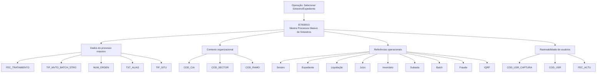

# Seleção de Sinistro/Expediente — Modelo de Dados da Tabela B7000910

## 1. Metadados do Documento
- **Arquivo de Origem:** Não identificado
- **Tipo de Documento:** Especificação Técnica
- **Domínio / Sistema:** Processos massivos de sinistros; seleção de Sinistro/Expediente
- **Público-Alvo:** Desenvolvedores, Arquitetos, Analistas Funcionais e Operação
- **Data/Versão Identificada:** Não identificada

---

## 2. Resumo Executivo & Contexto de Negócio

O documento apresenta o modelo de dados envolvido na operação de **seleção de Sinistro/Expediente**. A única tabela explicitamente identificada é a **B7000910**, descrita como a tabela mestra de processos massivos de sinistros.

A estrutura documentada registra atributos para identificar processos massivos, movimentações batch, situação de processamento, companhia, setor, ramo, sinistros, expedientes, liquidações, juízos, inventários, subastas, fraudes, IQRF e usuários responsáveis pela captura e atualização dos registros.

A maior parte dos campos possui indicação de mudança de valor igual a `S` e valor/motivo `N.A.`. O documento também classifica diversos campos como obrigatórios ou não obrigatórios. Entre os campos obrigatórios estão, por exemplo, data de tratamento, tipo de movimento batch, número de ordem, situação, companhia, setor, ramo, sinistro, expediente, liquidação, usuário de captura, usuário atualizador e data de atualização.

**Nota de Análise:** o conteúdo fornecido não detalha regras de persistência, chaves primárias, relacionamentos entre tabelas, tipos físicos de banco de dados, métodos HTTP, contratos de API, valores permitidos além de `TIP_SITU = 1-Sin Procesar`, nem comportamento de processamento batch.

---

## 3. Arquitetura, Componentes & Tecnologias Envolvidas

### Componentes e estruturas identificados

| Componente / Elemento | Descrição sustentada pelo documento |
| :--- | :--- |
| Selecionar Siniestro/Expediente | Operação cujo modelo de dados é apresentado. |
| B7000910 | Tabela mestra de processos massivos de sinistros. |
| Processo masivo | Processo associado à tabela B7000910 e a campos como `FEC_TRATAMIENTO`, `NUM_ORDEN` e `TXT_ALIAS`. |
| Batch | Conceito referenciado por campos de tipo de movimento batch, código batch de referência, identificador batch e sequência de validação. |
| Sinistro | Entidade identificada por campos de sinistro de referência e sinistro. |
| Expediente | Entidade identificada pelo campo `NUM_EXP`. |
| Liquidação | Entidade identificada por campos de liquidação de referência e liquidação. |
| Juízo | Entidade identificada por campos de juízo de referência e juízo. |
| Inventário | Entidade identificada por campos de inventário de referência e inventário. |
| Subasta | Entidade identificada por campos de subasta de referência e subasta. |
| Fraude | Entidade identificada por identificador de fraude e referência de identificador de fraude. |
| IQRF | Entidade identificada por identificador IQRF e referência de identificador IQRF. |



---

## 4. Regras de Negócio, Especificações Funcionais & Processos

### Operação documentada
- A operação é identificada como **“Seleccionar Siniestro/Expediente”**.
- O modelo de dados envolvido na operação contém a tabela **B7000910**.
- A tabela B7000910 é descrita como **“MAESTRA PROCESOS MASIVO DE SINIESTROS”**.

### Regras explícitas de obrigatoriedade
- `FEC_TRATAMIENTO` é obrigatório e representa a data em que o processo massivo é realizado.
- `TIP_MVTO_BATCH_STRO` é obrigatório e representa o tipo de movimento batch.
- `NUM_ORDEN` é obrigatório e representa o número do processo massivo.
- `TXT_ALIAS` não é obrigatório e representa o nome atribuído ao processo.
- `TIP_SITU` é obrigatório; o valor apresentado é `1-Sin Procesar`, indicando a situação em que a fila se encontra.
- `COD_CIA`, `COD_SECTOR` e `COD_RAMO` são obrigatórios.
- `NUM_SINI_REF`, `NUM_SINI`, `NUM_EXP`, `NUM_LIQ_REF` e `NUM_LIQ` são obrigatórios.
- `SUB_TIP_TRAMITE` é obrigatório.
- Os atributos relacionados a juízo, inventário, subasta, batch de referência, identificador batch, sequência, fraude e IQRF são apresentados como não obrigatórios.
- `COD_USR_CAPTURA`, `COD_USR` e `FEC_ACTU` são obrigatórios para rastrear a captura, o usuário atual da fila e a atualização do registro.

### Situação de processamento
| Campo | Regra documentada |
| :--- | :--- |
| `TIP_SITU` | Obrigatório. O documento apresenta o valor `1-Sin Procesar`. |
| Situação da fila | O campo `TIP_SITU` representa a situação em que a fila se encontra. |

### Referências funcionais
- Os campos com sufixo `_REF` são descritos como referências para entidades como sinistro, liquidação, juízo, inventário, subasta, fraude e IQRF.
- O documento não explica a distinção funcional completa entre cada campo principal e o respectivo campo de referência.
- O documento não especifica uma ordem de execução, critérios de seleção, transições de situação ou tratamento de erros.

---

## 5. Tabelas de Parâmetros, Ambientes e Estruturas de Dados

### Tabela identificada

| Item / Parâmetro | Descrição / Função | Tipo / Valores / Formato | Ambiente / Observações |
| :--- | :--- | :--- | :--- |
| `B7000910` | Tabela mestra de processos massivos de sinistros. | Não especificado. | Associada à operação Selecionar Siniestro/Expediente. |

### Campos da tabela B7000910

| Item / Parâmetro | Descrição / Função | Tipo / Valores / Formato | Ambiente / Observações |
| :--- | :--- | :--- | :--- |
| `FEC_TRATAMIENTO` | Data em que o processo massivo é realizado. | Cambia valor: `S`; motivo/valor: `N.A.` | Obrigatório: Sim. |
| `TIP_MVTO_BATCH_STRO` | Tipo de movimento batch. | Cambia valor: `S`; motivo/valor: `N.A.` | Obrigatório: Sim. |
| `NUM_ORDEN` | Número do processo massivo. | Cambia valor: `S`; motivo/valor: `N.A.` | Obrigatório: Sim. |
| `TXT_ALIAS` | Nome atribuído ao processo. | Cambia valor: `S`; motivo/valor: `N.A.` | Obrigatório: Não. |
| `TIP_SITU` | Situação em que a fila se encontra. | Cambia valor: `S`; valor: `1-Sin Procesar` | Obrigatório: Sim. |
| `COD_CIA` | Companhia. | Cambia valor: `S`; motivo/valor: `N.A.` | Obrigatório: Sim. |
| `COD_SECTOR` | Setor. | Cambia valor: `S`; motivo/valor: `N.A.` | Obrigatório: Sim. |
| `COD_RAMO` | Ramo. | Cambia valor: `S`; motivo/valor: `N.A.` | Obrigatório: Sim. |
| `NUM_SINI_REF` | Sinistro de referência de outro sistema. | Cambia valor: `S`; motivo/valor: `N.A.` | Obrigatório: Sim. |
| `NUM_SINI` | Sinistro. | Cambia valor: `S`; motivo/valor: `N.A.` | Obrigatório: Sim. |
| `NUM_EXP` | Número de expediente. | Cambia valor: `S`; motivo/valor: `N.A.` | Obrigatório: Sim. |
| `NUM_LIQ_REF` | Número de liquidação de referência. | Cambia valor: `S`; motivo/valor: `N.A.` | Obrigatório: Sim. |
| `NUM_LIQ` | Número de liquidação. | Cambia valor: `S`; motivo/valor: `N.A.` | Obrigatório: Sim. |
| `SUB_TIP_TRAMITE` | Tipo de trâmite. | Cambia valor: `S`; motivo/valor: `N.A.` | Obrigatório: Sim. |
| `NUM_JUICIO_REF` | Número de juízo de referência. | Cambia valor: `S`; motivo/valor: `N.A.` | Obrigatório: Não. |
| `NUM_JUICIO` | Número de juízo. | Cambia valor: `S`; motivo/valor: `N.A.` | Obrigatório: Não. |
| `COD_INVENTARIO_REF` | Inventário de referência. | Cambia valor: `S`; motivo/valor: `N.A.` | Obrigatório: Não. |
| `COD_INVENTARIO` | Número de inventário. | Cambia valor: `S`; motivo/valor: `N.A.` | Obrigatório: Não. |
| `COD_SUBASTA_REF` | Código de subasta de referência. | Cambia valor: `S`; motivo/valor: `N.A.` | Obrigatório: Não. |
| `COD_SUBASTA` | Campo relacionado à subasta. | Cambia valor: `S`; motivo/valor: `N.A.` | Obrigatório: Não. A descrição está truncada no conteúdo original. |
| `COD_BATCH_REF` | Código de referência para processo batch. | Cambia valor: `S`; motivo/valor: `N.A.` | Obrigatório: Não. |
| `IDN_BATCH` | Identificador batch. | Cambia valor: `S`; motivo/valor: `N.A.` | Obrigatório: Não. |
| `NUM_SQN_VAL` | Número de sequência. | Cambia valor: `S`; motivo/valor: `N.A.` | Obrigatório: Não. |
| `IDN_FRAUDE` | Identificador de fraude. | Cambia valor: `S`; motivo/valor: `N.A.` | Obrigatório: Não. |
| `IDN_FRAUDE_REF` | Referência de identificador de fraude. | Cambia valor: `S`; motivo/valor: `N.A.` | Obrigatório: Não. |
| `IDN_IQRF` | Identificador IQRF. | Cambia valor: `S`; motivo/valor: `N.A.` | Obrigatório: Não. |
| `IDN_IQRF_REF` | Referência de identificador IQRF. | Cambia valor: `S`; motivo/valor: `N.A.` | Obrigatório: Não. |
| `COD_USR_CAPTURA` | Usuário que realiza ou simula a captura. | Cambia valor: `S`; motivo/valor: `N.A.` | Obrigatório: Sim. A descrição aparece truncada. |
| `COD_USR` | Usuário atual da fila. | Cambia valor: `S`; motivo/valor: `N.A.` | Obrigatório: Sim. |
| `FEC_ACTU` | Data de atualização da fila. | Cambia valor: `S`; motivo/valor: `N.A.` | Obrigatório: Sim. |

---

## 6. Bateria de Perguntas & Respostas para RAG (FAQ Sintético)

### P1: Qual tabela participa da operação Selecionar Siniestro/Expediente?
**R:** A tabela identificada é a `B7000910`, descrita no documento como a tabela mestra de processos massivos de sinistros.

### P2: Qual é o valor documentado para a situação inicial de processamento?
**R:** O campo `TIP_SITU` apresenta o valor `1-Sin Procesar`. O documento informa que `TIP_SITU` representa a situação em que a fila se encontra e que o campo é obrigatório.

### P3: Quais campos obrigatórios identificam o contexto organizacional do sinistro?
**R:** Os campos obrigatórios de contexto organizacional são `COD_CIA`, descrito como companhia; `COD_SECTOR`, descrito como setor; e `COD_RAMO`, descrito como ramo.

### P4: Quais campos registram o sinistro e o expediente?
**R:** O documento registra `NUM_SINI_REF` como sinistro de referência de outro sistema, `NUM_SINI` como sinistro e `NUM_EXP` como número de expediente. Os três campos são marcados como obrigatórios.

### P5: Quais atributos da tabela B7000910 estão associados ao processo massivo?
**R:** Os atributos associados ao processo massivo incluem `FEC_TRATAMIENTO`, para a data de realização do processo massivo; `TIP_MVTO_BATCH_STRO`, para o tipo de movimento batch; `NUM_ORDEN`, para o número do processo massivo; e `TXT_ALIAS`, para o nome associado ao processo.

### P6: O campo TXT_ALIAS é obrigatório?
**R:** Não. O campo `TXT_ALIAS` é descrito como o nome atribuído ao processo e está marcado como não obrigatório.

### P7: Quais campos de liquidação são obrigatórios?
**R:** `NUM_LIQ_REF`, descrito como número de liquidação de referência, e `NUM_LIQ`, descrito como número de liquidação, são ambos obrigatórios.

### P8: Os números de juízo são obrigatórios na tabela B7000910?
**R:** Não. `NUM_JUICIO_REF`, referente ao número de juízo de referência, e `NUM_JUICIO`, referente ao número de juízo, são marcados como não obrigatórios.

### P9: Como a tabela identifica dados de fraude e IQRF?
**R:** A tabela contém os campos não obrigatórios `IDN_FRAUDE`, `IDN_FRAUDE_REF`, `IDN_IQRF` e `IDN_IQRF_REF`. O documento os descreve, respectivamente, como identificador de fraude, referência de identificador de fraude, identificador IQRF e referência de identificador IQRF.

### P10: Quais campos fornecem rastreabilidade de usuários e atualização da fila?
**R:** `COD_USR_CAPTURA` representa o usuário associado à captura, `COD_USR` representa o usuário atual da fila e `FEC_ACTU` representa a data de atualização da fila. Os três campos são obrigatórios.

---

## 7. Glossário de Termos, Siglas & Conceitos-Chave

- **B7000910:** Tabela mestra de processos massivos de sinistros.
- **Batch:** Termo usado para movimentação, processo, código e identificador batch.
- **COD_CIA:** Código de companhia.
- **COD_SECTOR:** Código de setor.
- **COD_RAMO:** Código de ramo.
- **COD_USR:** Código do usuário atual da fila.
- **COD_USR_CAPTURA:** Código do usuário associado à captura.
- **EXP / Expediente:** Entidade representada pelo campo `NUM_EXP`.
- **FEC_ACTU:** Data de atualização da fila.
- **FEC_TRATAMIENTO:** Data de realização do processo massivo.
- **IDN_BATCH:** Identificador batch.
- **IDN_FRAUDE:** Identificador de fraude.
- **IDN_IQRF:** Identificador IQRF; o documento não expande a sigla.
- **IQRF:** Sigla citada nos campos `IDN_IQRF` e `IDN_IQRF_REF`; significado não detalhado no conteúdo.
- **LIQ / Liquidação:** Entidade identificada por `NUM_LIQ` e `NUM_LIQ_REF`.
- **NUM_SQN_VAL:** Número de sequência.
- **REF:** Referência, conforme uso nos sufixos `_REF`.
- **Siniestro:** Sinistro.
- **Subasta:** Termo usado para os campos `COD_SUBASTA` e `COD_SUBASTA_REF`; não possui definição adicional.
- **TIP_MVTO_BATCH_STRO:** Tipo de movimento batch.
- **TIP_SITU:** Tipo de situação da fila.
- **Trámite:** Trâmite, representado pelo campo `SUB_TIP_TRAMITE`.

---

## 8. Notas Críticas, Riscos & Limitações

- O documento apresenta somente uma tabela: `B7000910`. Não há diagrama lógico ou físico de banco de dados, definição de chaves, índices ou relacionamentos.
- As descrições de diversos campos estão truncadas na extração original, incluindo `COD_SUBASTA`, `COD_USR_CAPTURA` e partes de outras descrições.
- Não são informados tipos de dados físicos, tamanhos, formatos de data, domínio de valores, regras de integridade ou mensagens de validação.
- O único valor de situação explicitamente documentado é `1-Sin Procesar`; não há catálogo completo de situações.
- Não há URLs, ambientes, servidores, tecnologias, APIs, logs, rotinas de execução, tratamento de erro ou critérios de reprocessamento descritos.
- **Nota de Análise:** embora existam referências a batch, fraude, IQRF, inventário, juízo e subasta, o documento não detalha os processos de negócio nem os contratos de integração relacionados a essas entidades.

---

## 9. Conteúdo Bruto Estruturado (Referência Fiel)

```text
--- [PÁGINA 1 DE 4] ---

EN CONSTRUCCIÓN
SELECCIONAR Siniestro/Expediente
Modelo de datos involucrado
Las tablas que intervienen en esta operación son:
B7000910
TABLA DESCRIPCIÓN
B7000910 MAESTRA PROCESOS MASIVO DE SINIESTROS
COLUMNA CAMBIA
VALOR
MOTIVO/VALOR OBLIGATORIA COMENT
FEC_TRATAMIENTO S N.A. SI FECHA E
QUE SE
REALIZA
PROCES
MASIVO
TIP_MVTO_BATCH_STRO S N.A. SI TIPO DE
MOVIMIE
 / 
 CF
Home Solutions APIs Documentation Zeus
EN


--- [PÁGINA 2 DE 4] ---

COLUMNA CAMBIA
VALOR
MOTIVO/VALOR OBLIGATORIA COMENT
BATCH
NUM_ORDEN S N.A. SI NUMERO
PROCES
MASIVO
TXT_ALIAS S N.A. NO NOMBRE
SE QUIE
AL PROC
TIP_SITU S 1-Sin Procesar SI SITUACI
LA QUE 
ENCUEN
FILA
COD_CIA S N.A. SI COMPAN
COD_SECTOR S N.A. SI SECTOR
COD_RAMO S N.A. SI RAMO
NUM_SINI_REF S N.A. SI SINIEST
REFERE
DE OTRO
SISTEMA
NUM_SINI S N.A. SI SINIEST
NUM_EXP S N.A. SI NUMERO
EXPEDIE
NUM_LIQ_REF S N.A. SI NUMERO
LIQUIDA
DE
REFERE


--- [PÁGINA 3 DE 4] ---

COLUMNA CAMBIA
VALOR
MOTIVO/VALOR OBLIGATORIA COMENT
NUM_LIQ S N.A. SI NUMERO
LIQUIDA
SUB_TIP_TRAMITE S N.A. SI TIPO DE
TRAMITE
NUM_JUICIO_REF S N.A. NO NUMERO
JUICIO D
REFERE
NUM_JUICIO S N.A. NO NUMERO
JUICIO
COD_INVENTARIO_REF S N.A. NO INVENTA
REFERE
COD_INVENTARIO S N.A. NO NUMERO
INVENTA
COD_SUBASTA_REF S N.A. NO CODIGO
SUBAST
REFERE
COD_SUBASTA S N.A. NO SUBAST
COD_BATCH_REF S N.A. NO CODIGO
REFERE
PARA
PROCES
BATCH
IDN_BATCH S N.A. NO IDENTIF
BATCH
NUM_SQN_VAL S N.A. NO SECUEN


--- [PÁGINA 4 DE 4] ---

COLUMNA CAMBIA
VALOR
MOTIVO/VALOR OBLIGATORIA COMENT
IDN_FRAUDE S N.A. NO IDENTIF
DE FRAU
IDN_FRAUDE_REF S N.A. NO REFERE
DE
IDENTIF
DE FRAU
IDN_IQRF S N.A. NO IDENTIF
IQRF
IDN_IQRF_REF S N.A. NO REFERE
DE
IDENTIF
IQRF
COD_USR_CAPTURA S N.A. SI USUARIO
SIMULA 
CAPTUR
COD_USR S N.A. SI USUARIO
ACTUAL
FILA
FEC_ACTU S N.A. SI FECHA D
ACTUAL
DE LA FI
```
