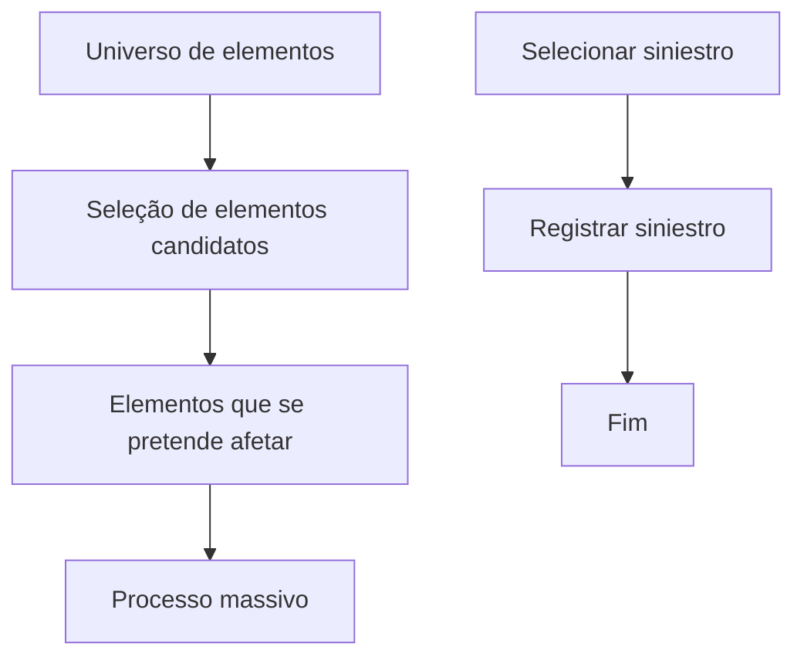

# Seleção e Registro de Elementos Candidatos no Processo Massivo de Sinistros

## 1. Metadados do Documento
- **Arquivo de Origem:** Não identificado
- **Tipo de Documento:** Procedimento
- **Domínio / Sistema:** Siniestros / Processo Massivo
- **Público-Alvo:** Negócio, Operação, Desenvolvedores
- **Data/Versão Identificada:** Não identificada

---

## 2. Resumo Executivo & Contexto de Negócio

O documento descreve a etapa de seleção de elementos candidatos no domínio de **Siniestros**, vinculada a uma visão técnica. O objetivo é incluir no processo massivo os elementos que inicialmente se pretende afetar.

O processo parte de um universo de elementos, que pode conter sinistros, expedientes e liquidações. Desse universo, são extraídos os elementos específicos que deverão ser processados pelo movimento massivo.

O procedimento apresentado possui duas ações sequenciais: primeiro, selecionar o sinistro; depois, registrar o sinistro. O fluxo é encerrado após o registro.

O documento cita “Home Solutions APIs Documentation Zeus” e a sigla “CF”, mas não fornece detalhamento sobre integração, responsabilidades, contratos, métodos HTTP, URLs, tecnologias, campos ou comportamentos técnicos associados.

---

## 3. Arquitetura, Componentes & Tecnologias Envolvidas

Os componentes e conceitos explicitamente citados são:

- **Siniestros:** domínio no qual ocorre a seleção e o registro do elemento candidato.
- **Proceso masivo:** processo que tratará os elementos selecionados.
- **Elemento:** entidade genérica candidata à inclusão no processo massivo.
- **Siniestro:** elemento tratado diretamente nas etapas do procedimento.
- **Expediente:** exemplo de elemento pertencente ao universo de elementos.
- **Liquidación:** exemplo de elemento pertencente ao universo de elementos.
- **Home Solutions APIs Documentation Zeus:** referência textual presente no documento, sem detalhamento adicional.
- **CF:** sigla apresentada no rodapé, sem definição no conteúdo fornecido.



> **Nota de Análise:** O documento não descreve uma arquitetura de software, microsserviços, APIs, bancos de dados, ambientes ou mecanismos de integração. O diagrama representa exclusivamente o fluxo funcional explicitado no conteúdo.

---

## 4. Regras de Negócio, Especificações Funcionais & Processos

### Objetivo funcional

A seleção de elementos candidatos consiste em incluir os elementos que inicialmente se pretende afetar no processo massivo.

### Regra de seleção

1. Existe um universo de elementos disponíveis.
2. O universo de elementos pode conter, entre outros exemplos:
   - Sinistros;
   - Expedientes;
   - Liquidações.
3. Devem ser extraídos do universo somente os elementos que se deseja processar.
4. Os elementos extraídos passam a compor o movimento no processo massivo.

### Processo operacional apresentado

1. **Selecionar siniestro:** identificar ou selecionar o sinistro que será incluído no processo.
2. **Registrar siniestro:** registrar o sinistro selecionado.
3. **Fim:** o processo é concluído após o registro do sinistro.

> **Nota de Análise:** O documento não especifica critérios de elegibilidade, filtros de seleção, validações, exceções, responsáveis, telas, campos obrigatórios ou regras de registro do sinistro.

---

## 5. Tabelas de Parâmetros, Ambientes e Estruturas de Dados

| Item / Parâmetro | Descrição / Função | Tipo / Valores / Formato | Ambiente / Observações |
| :--- | :--- | :--- | :--- |
| Elemento | Entidade candidata à inclusão no processo massivo. | Conceito funcional. | Pode representar sinistros, expedientes ou liquidações. |
| Universo de elementos | Conjunto total de elementos disponíveis para extração e seleção. | Coleção conceitual. | O documento não define origem, armazenamento ou volume. |
| Elementos a processar | Subconjunto extraído do universo de elementos para processamento massivo. | Coleção conceitual. | São os elementos que se pretende afetar inicialmente. |
| Siniestro | Elemento selecionado e registrado no fluxo apresentado. | Entidade de negócio. | O documento não detalha atributos nem identificadores. |
| Expediente | Exemplo de elemento que pode existir no universo de elementos. | Entidade de negócio. | Sem detalhamento adicional. |
| Liquidación | Exemplo de elemento que pode existir no universo de elementos. | Entidade de negócio. | Sem detalhamento adicional. |
| Proceso masivo | Processo que recebe os elementos previamente selecionados. | Processo funcional. | Não detalha execução, agendamento ou resultado. |
| Home Solutions APIs Documentation Zeus | Referência textual presente no documento. | Referência não especificada. | Não são fornecidos URL, contrato de API ou finalidade. |
| CF | Sigla apresentada no rodapé. | Sigla não definida. | Não há expansão ou contexto adicional. |

---

## 6. Bateria de Perguntas & Respostas para RAG (FAQ Sintético)

### P1: Qual é o objetivo da seleção de elementos candidatos no processo massivo?
**R:** O objetivo é incluir no processo massivo os elementos que inicialmente se pretende afetar. A seleção identifica, dentro do universo disponível, quais elementos deverão fazer parte do movimento do processo massivo.

### P2: O que representa o universo de elementos mencionado no documento?
**R:** O universo de elementos representa o conjunto de entidades disponíveis para seleção. O documento cita sinistros, expedientes e liquidações como exemplos de elementos que podem compor esse universo.

### P3: Quais tipos de elementos podem ser selecionados para o processo massivo?
**R:** O documento apresenta sinistros, expedientes e liquidações como exemplos de elementos que podem existir no universo de elementos e, portanto, podem ser candidatos à seleção.

### P4: Qual é a primeira etapa do procedimento descrito para sinistros?
**R:** A primeira etapa é **SELECCIONAR Siniestro**, ou seja, selecionar o sinistro que será tratado pelo processo.

### P5: O que acontece após selecionar um sinistro?
**R:** Após selecionar o sinistro, o procedimento indica a etapa **REGISTRAR Siniestro**, que registra o sinistro selecionado. Depois do registro, o fluxo é encerrado.

### P6: Quando o processo apresentado é concluído?
**R:** O processo é concluído após a execução da etapa de registro do sinistro, indicada no fluxo como “REGISTRAR siniestros (2) FIN”.

### P7: O documento define critérios ou validações para selecionar um elemento candidato?
**R:** Não. O documento explica que os elementos desejados são extraídos do universo de elementos, mas não detalha critérios de elegibilidade, filtros, validações ou regras de exclusão.

### P8: O documento especifica APIs ou contratos técnicos para o processo de seleção?
**R:** Não. Apesar de citar “Home Solutions APIs Documentation Zeus”, o conteúdo não apresenta métodos HTTP, endpoints, contratos JSON, URLs, autenticação ou outros detalhes de integração.

### P9: O documento explica o significado da sigla CF?
**R:** Não. A sigla “CF” aparece no conteúdo bruto, mas não possui definição ou explicação adicional no texto fornecido.

### P10: O documento informa como os elementos selecionados são processados posteriormente?
**R:** Não. O documento informa que os elementos selecionados formam parte do movimento no processo massivo, mas não descreve a execução posterior, o mecanismo de processamento, resultados ou tratamento de erros.

---

## 7. Glossário de Termos, Siglas & Conceitos-Chave

- **Elemento:** entidade pertencente ao universo de elementos e potencialmente incluída no processo massivo.
- **Expediente:** exemplo de elemento mencionado no universo de elementos; não detalhado adicionalmente.
- **Liquidación:** exemplo de elemento mencionado no universo de elementos; não detalhado adicionalmente.
- **Proceso masivo / Processo massivo:** processo que tratará os elementos previamente selecionados.
- **Registrar siniestro:** etapa posterior à seleção, na qual o sinistro selecionado é registrado.
- **Seleccionar siniestro:** primeira etapa do fluxo, destinada à seleção do sinistro.
- **Siniestro:** sinistro; entidade principal do procedimento apresentado.
- **CF:** sigla não definida no documento.
- **Home Solutions APIs Documentation Zeus:** referência não detalhada no documento.

---

## 8. Notas Críticas, Riscos & Limitações

- O documento está marcado como **“EN CONSTRUCCIÓN”**, indicando que o conteúdo pode estar incompleto ou em elaboração.
- Não há identificação de arquivo, autor, data, versão, sistema proprietário ou ambiente.
- Não foram documentados critérios de seleção, regras de validação, permissões, campos, mensagens de erro ou cenários de exceção.
- A referência a “Home Solutions APIs Documentation Zeus” não contém contratos, URLs, rotas, métodos HTTP ou responsabilidades técnicas.
- A sigla “CF” não possui definição no conteúdo disponível.
- O documento não explica como ocorre o processamento massivo após o registro dos sinistros.
- Não há detalhamento adicional sobre os elementos “expedientes” e “liquidaciones”.

---

## 9. Conteúdo Bruto Estruturado (Referência Fiel)

```text
--- [PÁGINA 1 DE 1] ---

EN CONSTRUCCIÓN
SELECCIONAR elemento candidato en
Siniestros (enlace con visión técnica)
¿En que consiste?
Es la inclusión de aquellos [elementos][Elemento] que inicialmente se pretende afectar en el proceso
masivo. Es decir, del universo de [elementos][Elemento] (como pueden ser siniestros,expedientes,
liquidaciones..), se extraen aquellos que se quieren procesar.
Objetivo
Conocer las formas en las que se puede incluir [elementos][Elemento] para que estos formen parte
del movimiento en el proceso masivo.
Proceso a seguir
SELECCIONAR
siniestros (1)
REGISTRAR
siniestros (2) FIN
1. SELECCIONAR Siniestro
2. REGISTRAR Siniestro
 / 
 CF
Home Solutions APIs Documentation Zeus
EN
```
