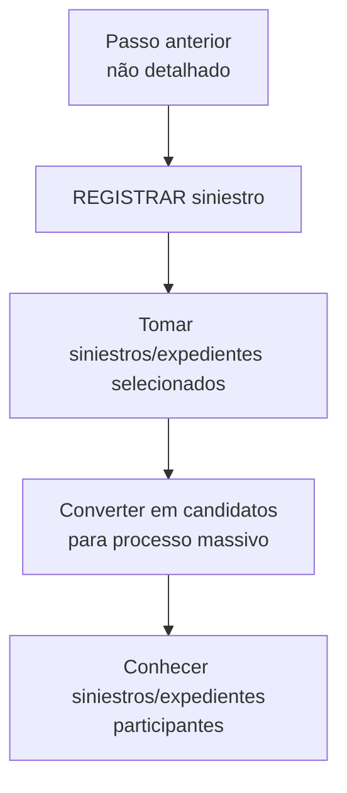

# Processo “REGISTRAR siniestro” — Conversão para Candidatos de Processo Massivo

## 1. Metadados do Documento
- **Arquivo de Origem:** `Não identificado`
- **Tipo de Documento:** `Procedimento`
- **Domínio / Sistema:** `Home Solutions APIs Documentation Zeus`
- **Público-Alvo:** `Não identificado`
- **Data/Versão Identificada:** `Não identificada`

---

## 2. Resumo Executivo & Contexto de Negócio

O documento descreve a funcionalidade ou etapa denominada **“REGISTRAR siniestro”**, marcada como **“EN CONSTRUCCIÓN”**. O propósito declarado consiste em tomar sinistros ou expedientes selecionados para um processo massivo e convertê-los em candidatos para esse processo.

O objetivo operacional é permitir o conhecimento dos sinistros ou expedientes que participarão do processo massivo. O texto não descreve critérios de seleção, regras de elegibilidade, estados dos candidatos, responsáveis pela execução ou resultados posteriores da conversão.

O procedimento não exige ação adicional nesta etapa. Segundo o documento, “REGISTRAR siniestro” é consequência direta do passo anterior, embora o passo anterior não esteja presente no conteúdo fornecido.

---

## 3. Arquitetura, Componentes & Tecnologias Envolvidas

O conteúdo menciona os termos **Home Solutions APIs Documentation Zeus**, **CF** e **EN**, mas não detalha componentes de software, APIs, métodos HTTP, contratos de integração, tecnologias, ambientes ou responsabilidades técnicas.



> **Nota de Análise:** O documento não detalha se “REGISTRAR siniestro” é uma tela, serviço, API, processo batch ou atividade manual.

---

## 4. Regras de Negócio, Especificações Funcionais & Processos

1. O processo trata **siniestros/expedientes** previamente selecionados.
2. Os sinistros ou expedientes selecionados devem ser convertidos em **candidatos** para um processo massivo.
3. O objetivo da etapa é conhecer quais sinistros ou expedientes participarão do processo massivo.
4. Não é necessário executar um passo adicional especificamente para “REGISTRAR siniestro”.
5. A etapa “REGISTRAR siniestro” ocorre como consequência do passo anterior.
6. O documento não apresenta:
   - Critérios usados para selecionar sinistros ou expedientes.
   - Regras de exclusão ou validação.
   - Campos ou dados necessários para registrar um sinistro.
   - Métodos de execução do processo massivo.
   - Detalhes sobre aprovação, erro, reprocessamento ou cancelamento.
   - Métodos HTTP, contratos JSON ou endpoints de APIs.

---

## 5. Tabelas de Parâmetros, Ambientes e Estruturas de Dados

| Item / Parâmetro | Descrição / Função | Tipo / Valores / Formato | Ambiente / Observações |
| :--- | :--- | :--- | :--- |
| REGISTRAR siniestro | Etapa que converte sinistros ou expedientes selecionados em candidatos para um processo massivo. | Processo ou funcionalidade; classificação técnica não detalhada. | Marcada como “EN CONSTRUCCIÓN”. |
| Siniestros / expedientes | Itens selecionados que serão considerados no processo massivo. | Não detalhado. | Os critérios de seleção não são informados. |
| Candidatos | Resultado da conversão dos sinistros ou expedientes selecionados. | Não detalhado. | Candidatos ao processo massivo. |
| Processo masivo | Processo para o qual os sinistros ou expedientes são convertidos em candidatos. | Não detalhado. | Sem descrição de execução, tecnologia ou resultado. |
| Passo anterior | Etapa que antecede “REGISTRAR siniestro”. | Não detalhado. | “REGISTRAR siniestro” é consequência desse passo. |
| Home Solutions APIs Documentation Zeus | Texto presente no rodapé ou identificação documental. | Não detalhado. | Não há descrição de arquitetura ou APIs. |
| CF | Sigla presente no conteúdo. | Não detalhado. | Sem expansão ou função documentada. |
| EN | Sigla presente no conteúdo. | Não detalhado. | Sem expansão ou função documentada. |

---

## 6. Bateria de Perguntas & Respostas para RAG (FAQ Sintético)

### P1: Em que consiste a etapa “REGISTRAR siniestro”?
**R:** A etapa “REGISTRAR siniestro” consiste em tomar os sinistros ou expedientes selecionados para um processo massivo e convertê-los em candidatos para esse processo massivo.

### P2: Qual é o objetivo de “REGISTRAR siniestro”?
**R:** O objetivo é conhecer quais sinistros ou expedientes participarão do processo massivo.

### P3: É necessário executar alguma ação manual específica na etapa “REGISTRAR siniestro”?
**R:** Não. O documento informa que não é necessário seguir nenhum passo adicional, porque “REGISTRAR siniestro” é consequência do passo anterior.

### P4: Quais registros participam do processo massivo?
**R:** Participam os sinistros ou expedientes que tenham sido selecionados para o processo massivo. O documento não informa os critérios dessa seleção.

### P5: O documento informa como os sinistros ou expedientes são selecionados?
**R:** Não. O conteúdo apenas afirma que os sinistros ou expedientes são selecionados para o processo massivo; não descreve critérios, validações ou responsáveis pela seleção.

### P6: O documento detalha APIs, endpoints ou métodos HTTP para “REGISTRAR siniestro”?
**R:** Não. Embora o texto mencione “Home Solutions APIs Documentation Zeus”, não há detalhes sobre métodos HTTP, URLs, endpoints, contratos JSON, autenticação ou integração técnica.

### P7: “REGISTRAR siniestro” está concluído ou em desenvolvimento?
**R:** O conteúdo está identificado como “EN CONSTRUCCIÓN”, indicando que o material ou a funcionalidade está em construção. O documento não fornece detalhes adicionais sobre o status.

### P8: Qual é a relação entre “REGISTRAR siniestro” e a etapa anterior?
**R:** “REGISTRAR siniestro” é apresentada como consequência do passo anterior. Contudo, o passo anterior não foi descrito no conteúdo fornecido.

---

## 7. Glossário de Termos, Siglas & Conceitos-Chave

- **Siniestro:** Termo usado no documento para designar um item que pode ser selecionado para participação no processo massivo. O significado operacional detalhado não é apresentado.
- **Expediente:** Termo usado em conjunto com “siniestro” para designar um item selecionável para o processo massivo. O documento não define sua estrutura ou diferença em relação a “siniestro”.
- **Processo masivo:** Processo para o qual sinistros ou expedientes selecionados são convertidos em candidatos.
- **Candidato:** Resultado da conversão de um sinistro ou expediente selecionado para participação no processo massivo.
- **CF:** Sigla mencionada no documento sem definição.
- **EN:** Sigla mencionada no documento sem definição.
- **Home Solutions APIs Documentation Zeus:** Identificação textual presente no conteúdo; não há explicação de seu significado ou função.

---

## 8. Notas Críticas, Riscos & Limitações

- O conteúdo é resumido e não descreve a implementação técnica da funcionalidade.
- Não há critérios documentados para seleção de sinistros ou expedientes.
- Não há regras de validação, tratamento de erros, auditoria, reprocessamento ou cancelamento.
- Não são informados métodos HTTP, contratos JSON, URLs, ambientes, credenciais, logs ou mecanismos de integração.
- O passo anterior, do qual “REGISTRAR siniestro” é consequência, não está disponível.
- As siglas **CF** e **EN** não possuem definição no conteúdo.
- A indicação **“EN CONSTRUCCIÓN”** sugere que o conteúdo pode estar incompleto.

---

## 9. Conteúdo Bruto Estruturado (Referência Fiel)

```text
--- [PÁGINA 1 DE 1] ---

EN CONSTRUCCIÓN
REGISTRAR siniestro
¿En que consiste?
Tomar los siniestros/expedientes seleccionadas para un proceso masivo y convertirlas en candidatos
para este proceso.
Objetivo
Conocer aquellos siniestros/expedientes que participarían en el proceso masivo.
Proceso a seguir
No es necesario seguir paso alguno, ya que es consecuencia del paso anterior.
 / 
 CF
Home Solutions APIs Documentation Zeus
EN
```
