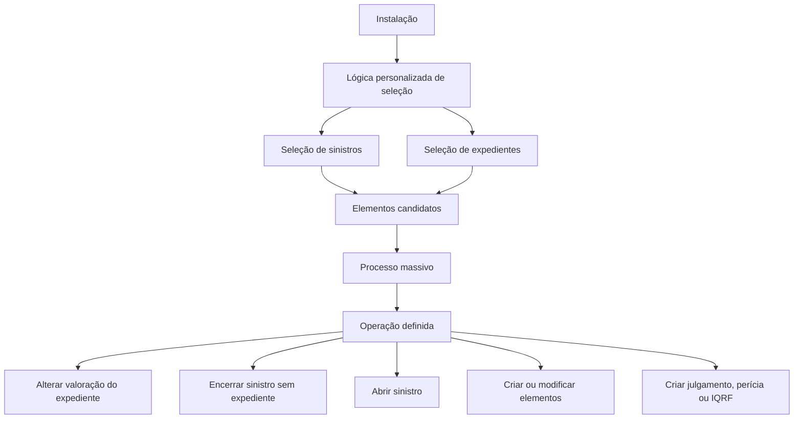

# Seleção de Sinistros e Expedientes para Processos Massivos

## 1. Metadados do Documento
- **Arquivo de Origem:** Não identificado
- **Tipo de Documento:** Procedimento
- **Domínio / Sistema:** Gestão de sinistros, expedientes e processos massivos
- **Público-Alvo:** Negócio, Operação, Desenvolvedores
- **Data/Versão Identificada:** Não identificada

---

## 2. Resumo Executivo & Contexto de Negócio

O documento descreve a etapa de **seleção de sinistros e expedientes** candidatos à participação em um processo massivo. Essa seleção determina quais registros serão submetidos à operação definida para o processamento em lote.

O objetivo declarado é extrair os sinistros ou expedientes sobre os quais se pretende executar uma operação específica. O processo de seleção antecede a execução operacional, permitindo que cada instalação identifique o conjunto de elementos aplicável à sua própria necessidade.

Cada instalação deve implementar um processo personalizado de seleção. O documento estabelece que as instalações precisam criar lógicas próprias para selecionar sinistros e expedientes destinados a criação, modificação, criação de julgamento, perícia ou IQRF.

São apresentados exemplos de critérios de seleção associados a operações massivas: alteração de valoração de expedientes, encerramento de sinistros sem expedientes, abertura de sinistros comunicados por Centro Telefónico e outras operações personalizadas. O documento não detalha implementações técnicas, interfaces, contratos de integração, métodos HTTP, fontes de dados ou mecanismos de execução dos processos massivos.

---

## 3. Arquitetura, Componentes & Tecnologias Envolvidas

Os componentes e conceitos explicitamente citados são:

- **Instalação:** unidade responsável por criar a lógica personalizada de seleção.
- **Processo de seleção:** lógica que identifica sinistros e expedientes candidatos.
- **Sinistro:** entidade que pode ser selecionada para operações massivas.
- **Expediente:** entidade que pode ser associada a um sinistro e selecionada para operações massivas.
- **Processo massivo:** processo que recebe os elementos candidatos e executa a operação definida.
- **Operação:** ação a ser aplicada aos elementos selecionados, como alterar valoração, encerrar sinistro ou abrir sinistro.
- **Centro Telefónico:** origem citada para sinistros comunicados que poderão ser selecionados para abertura.
- **Julgamento, perícia e IQRF:** tipos de ações ou artefatos citados como possíveis objetivos do processamento.



> **Nota de Análise:** O documento descreve a relação funcional entre instalações, lógicas de seleção e processos massivos, mas não informa produtos, tecnologias, bancos de dados, APIs, protocolos, ambientes ou contratos técnicos.

---

## 4. Regras de Negócio, Especificações Funcionais & Processos

### 4.1 Objetivo da seleção

1. Determinar quais sinistros ou expedientes serão candidatos a participar de um processo massivo.
2. Extrair os sinistros ou expedientes sobre os quais será realizada a operação que está sendo definida.
3. Encaminhar os elementos candidatos ao processo massivo correspondente.

### 4.2 Responsabilidade por instalação

1. Cada instalação terá um processo personalizado.
2. Cada instalação realizará seus próprios processos de seleção de sinistros e expedientes.
3. Cada instalação deve criar lógicas próprias para selecionar os sinistros e expedientes a processar.
4. As lógicas podem selecionar elementos para:
   - Criar.
   - Modificar.
   - Criar um julgamento.
   - Criar uma perícia.
   - Criar uma IQRF.

### 4.3 Exemplo: alteração de valoração de expediente

O documento apresenta um processo para extrair sinistros ou expedientes que atendam simultaneamente aos seguintes critérios:

1. Foram abertos com a reserva média.
2. Não sofreram nenhuma alteração de valoração.

A operação definida para os elementos selecionados é alterar a valoração do expediente para aumentar a reserva em **15%**.

### 4.4 Exemplo: encerramento de sinistro sem expediente

O documento apresenta um processo para extrair sinistros que atendam simultaneamente aos seguintes critérios:

1. Não possuem expedientes.
2. Foram abertos há mais de 15 anos.

A operação definida é **terminar/encerrar o sinistro sem expedientes**.

### 4.5 Exemplo: abertura de sinistro comunicado por Centro Telefónico

O documento apresenta um processo para carregar ou direcionar sinistros comunicados em um Centro Telefónico. A operação definida para esses sinistros é **aperturar/abrir sinistro**.

### 4.6 Restrições de detalhamento

O documento não especifica:

- Como a reserva média é calculada.
- Como uma alteração de valoração é identificada.
- Qual unidade temporal é usada para verificar sinistros abertos há mais de 15 anos.
- Como é determinada a inexistência de expedientes em um sinistro.
- O significado expandido da sigla IQRF.
- Os critérios de seleção para sinistros comunicados pelo Centro Telefónico.
- O mecanismo técnico que transfere os candidatos ao processo massivo.
- Os efeitos transacionais, validações, autorizações ou tratamento de erros das operações.

---

## 5. Tabelas de Parâmetros, Ambientes e Estruturas de Dados

| Item / Parâmetro | Descrição / Função | Tipo / Valores / Formato | Ambiente / Observações |
| :--- | :--- | :--- | :--- |
| Sinistro | Entidade candidata ao processamento massivo | Registro de negócio | Pode possuir ou não expedientes |
| Expediente | Entidade candidata ao processamento massivo | Registro de negócio | Pode receber alteração de valoração |
| Processo de seleção | Lógica que identifica elementos candidatos | Processo personalizado | Cada instalação deve criar sua própria lógica |
| Processo massivo | Processo que recebe candidatos para executar uma operação | Processo operacional | Não há detalhamento técnico |
| Reserva média | Condição de seleção de sinistros ou expedientes | Critério de negócio | Método de cálculo não informado |
| Alteração de valoração | Mudança de valoração de um expediente | Evento ou condição de negócio | Ausência de alteração é um critério de seleção |
| Aumento de reserva | Alteração aplicada à valoração de expediente | 15% | Associado ao exemplo de expedientes com reserva média |
| Sinistro sem expediente | Sinistro que não possui expedientes | Critério de negócio | Utilizado no exemplo de encerramento |
| Idade do sinistro | Tempo transcorrido desde a abertura do sinistro | Mais de 15 anos | Unidade de cálculo e data de referência não informadas |
| Centro Telefónico | Origem de comunicação de sinistros | Canal operacional | Sinistros comunicados podem ser selecionados para abertura |
| Abertura de sinistro | Operação aplicada a sinistros comunicados | Operação massiva | O documento utiliza o termo “APERTURAR Siniestro” |
| Encerramento de sinistro | Operação aplicada a sinistros sem expedientes | Operação massiva | O documento utiliza o termo “TERMINAR Siniestro sin Expedientes” |
| Julgamento | Elemento ou ação possível no processamento | Não detalhado | Citado como possível objetivo de seleção |
| Perícia | Elemento ou ação possível no processamento | Não detalhado | Citado como possível objetivo de seleção |
| IQRF | Elemento ou ação possível no processamento | Sigla não expandida | Não detalhado no documento |

---

## 6. Bateria de Perguntas & Respostas para RAG (FAQ Sintético)

### P1: Qual é o objetivo do processo de seleção de sinistros e expedientes?
**R:** O processo de seleção tem o objetivo de determinar quais sinistros ou expedientes serão candidatos a participar de um processo massivo. Os elementos selecionados são aqueles sobre os quais será executada a operação definida para o processamento em lote.

### P2: Quem é responsável por criar a lógica de seleção dos candidatos?
**R:** Cada instalação é responsável por realizar os processos de seleção de sinistros e expedientes e deve criar suas próprias lógicas para identificar os elementos que serão processados.

### P3: Quais operações podem ser executadas sobre sinistros e expedientes selecionados?
**R:** O documento cita operações para criar, modificar, criar um julgamento, criar uma perícia e criar uma IQRF. Também apresenta exemplos de alterar a valoração de um expediente, encerrar um sinistro sem expedientes e abrir um sinistro comunicado por Centro Telefónico.

### P4: Quais critérios selecionam expedientes para aumento de reserva?
**R:** O exemplo apresentado seleciona sinistros ou expedientes que foram abertos com a reserva média e que não receberam nenhuma mudança de valoração. A operação definida é alterar a valoração do expediente para aumentar a reserva em 15%.

### P5: Qual percentual de aumento de reserva é definido no exemplo de alteração de valoração?
**R:** O exemplo define aumento de 15% da reserva mediante alteração da valoração do expediente selecionado.

### P6: Quando um sinistro pode ser selecionado para encerramento?
**R:** Um sinistro pode ser selecionado para a operação de encerramento quando não possui expedientes e foi aberto há mais de 15 anos. O documento denomina a operação como “TERMINAR Siniestro sin Expedientes”.

### P7: Como são tratados os sinistros comunicados por um Centro Telefónico?
**R:** O documento descreve um processo para carregar os sinistros comunicados em um Centro Telefónico. Para esses elementos, a operação definida é a abertura do sinistro, indicada no texto como “APERTURAR Siniestro”.

### P8: O documento define uma única lógica de seleção para todas as instalações?
**R:** Não. O documento afirma que cada instalação terá um processo personalizado e deverá criar suas próprias lógicas para selecionar sinistros e expedientes a processar.

### P9: O documento explica como calcular a reserva média?
**R:** Não. A reserva média é citada como critério para selecionar sinistros ou expedientes, mas o documento não informa fórmula, fonte de dados, período de cálculo ou regras de arredondamento.

### P10: O documento especifica APIs, métodos HTTP ou contratos JSON para o processo massivo?
**R:** Não. O documento descreve apenas o objetivo funcional da seleção e exemplos de operações massivas. Não há detalhamento de APIs, métodos HTTP, contratos JSON, tecnologias ou mecanismos de integração.

### P11: O que significa a sigla IQRF no processo de seleção?
**R:** O documento cita IQRF como uma possível ação ou elemento a ser criado pelo processamento, mas não expande a sigla nem detalha seu significado funcional ou técnico.

### P12: Qual é a relação entre o processo de seleção e o processo massivo?
**R:** O processo de seleção identifica e extrai sinistros ou expedientes candidatos. Esses elementos candidatos são então encaminhados ao processo massivo, no qual a operação definida é aplicada.

---

## 7. Glossário de Termos, Siglas & Conceitos-Chave

- **Centro Telefónico:** canal citado como origem de comunicação de sinistros que podem ser submetidos à operação de abertura.
- **Expediente:** entidade de negócio relacionada ao processamento de sinistros; o documento indica que pode receber alteração de valoração.
- **IQRF:** sigla citada como possível elemento ou ação de criação; o significado não é definido no documento.
- **Instalação:** unidade que deve implementar seu próprio processo personalizado e lógica de seleção.
- **Perícia:** item citado como possível elemento a ser criado; não há detalhamento adicional.
- **Processo massivo:** processo operacional que recebe os sinistros ou expedientes candidatos para executar uma operação definida.
- **Processo de seleção:** lógica responsável por identificar e extrair os elementos candidatos ao processo massivo.
- **Reserva média:** condição de seleção mencionada para sinistros ou expedientes; o método de cálculo não foi informado.
- **Sinistro:** entidade de negócio que pode ser selecionada para operações como encerramento ou abertura.
- **Valoração:** atributo ou processo de avaliação de um expediente que pode ser alterado; o documento apresenta um caso de aumento de reserva em 15%.

---

## 8. Notas Críticas, Riscos & Limitações

- O documento está identificado como **“EN CONSTRUCCIÓN”**, indicando que o conteúdo pode estar incompleto ou em elaboração.
- Não há detalhamento técnico sobre tecnologias, sistemas, bancos de dados, APIs, serviços, rotas, logs, autenticação ou ambientes.
- Não há definição de critérios operacionais para evitar que um mesmo sinistro ou expediente seja selecionado mais de uma vez.
- Não há descrição de validações, aprovações, permissões, auditoria, reversão ou tratamento de falhas nas operações massivas.
- O cálculo da reserva média não é explicado.
- A definição de “mais de 15 anos” não informa data de referência, calendário aplicável, timezone ou regra de contagem.
- A sigla IQRF não é expandida.
- Os conceitos de julgamento e perícia são apenas citados, sem regras de negócio ou atributos associados.
- **Nota de Análise:** O documento apresenta exemplos funcionais de seleção, mas não detalha como cada instalação implementa, executa, monitora ou integra sua lógica personalizada ao processo massivo.

---

## 9. Conteúdo Bruto Estruturado (Referência Fiel)

```text
--- [PÁGINA 1 DE 2] ---

EN CONSTRUCCIÓN
SELECCIONAR siniestros
¿En que consiste?
Determinar qué siniestro/expediente serán candidatos a participar en el proceso masivo que se está
definiendo.
Objetivo
Extraer aquellos siniestros/expedientes con los que se pretende realizar la operación que se está
definiendo
Proceso a seguir
Para que los elementos candidatos lleguen al proceso masivo, cada instalación tendrá un proceso
personalizado.
Ejemplos de Procesos de Selección:
Proceso para extraer todos aquellos siniestros/expedientes que se abrieron con la reserva
promedio y no se ha realizado sobre ellos ningún cambio de valoración. La operación que se
estaría definiendo para aplicar sobre estos elementos sería CAMBIAR valoración del Expediente
para subir la reserva un 15%.
Proceso para extraer todos aquellos siniestros que no tengan expedientes, y que se hayan
abierto hace más de 15 años. La operación que se estaría definiendo sería TERMINAR Siniestro
 / 
 CF
Home Solutions APIs Documentation Zeus
EN


--- [PÁGINA 2 DE 2] ---

sin Expedientes.
Proceso para volcar los siniestros comunicados en un Centro Telefónico. La operación que se
estaría definiendo sería APERTURAR Siniestro.
Proceso personalizado de la instalación
Cada instalación realizará los procesos de selección de siniestros, expedientes y para ello, debe
crear sus propias lógicas que seleccionen los siniestros y expedientes a procesar para crear, para
modificar, para crear un juicio, una peritación, una iqrf...
```
