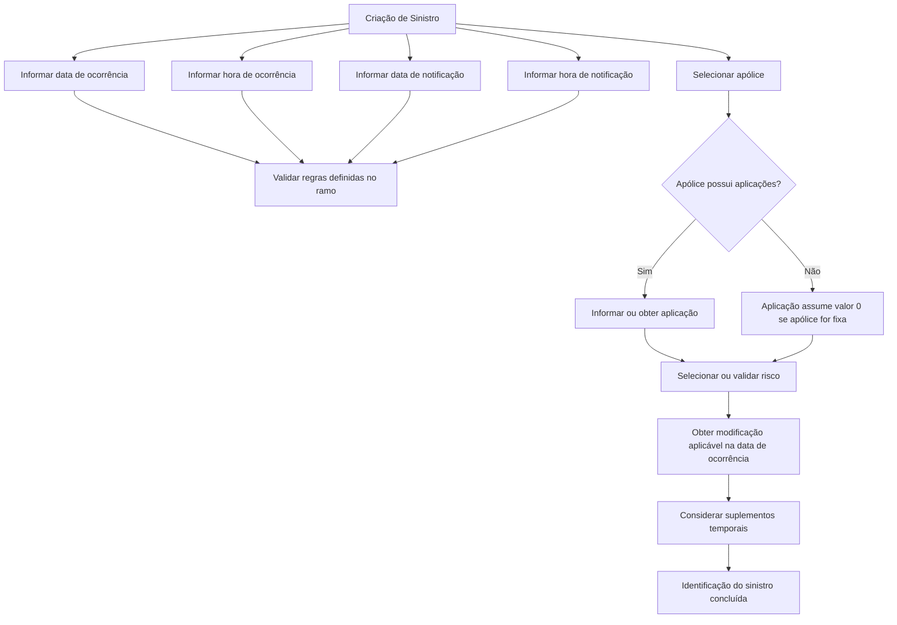

# Identificação do Sinistro — Regras para Criação de Sinistro, Validação de Apólice, Aplicação e Risco

## 1. Metadados do Documento
- **Arquivo de Origem:** Não informado
- **Tipo de Documento:** Especificação Técnica / Documentação Funcional
- **Domínio / Sistema:** Gestão de Siniestros — operação de criação de sinistro; documentação Zeus / Soluciones APIs
- **Público-Alvo:** Analistas funcionais, desenvolvedores, arquitetos e operação de seguros
- **Data/Versão Identificada:** Não identificada

---

## 2. Resumo Executivo & Contexto de Negócio

O documento descreve a identificação de um sinistro durante a operação de criação de sinistro. O objetivo é apresentar e validar as informações requeridas no nível do sinistro quando a operação é executada.

A especificação define propriedades relacionadas à ocorrência e à notificação do sinistro, incluindo datas e horas. As validações dependem da data atual, de definições configuradas no ramo e, em alguns casos, de regras de extemporaneidade.

A identificação também exige a associação do sinistro a uma apólice, podendo envolver uma aplicação e um risco. A vigência desses elementos deve ser avaliada em relação à data de ocorrência do sinistro, salvo exceções configuráveis mencionadas para apólices fixas, apólices com aplicações e apólices sem aplicações.

O documento estabelece ainda que a obtenção da modificação de apólice, aplicação e risco correspondente à data de ocorrência pode considerar suplementos temporais, exceto se a definição determinar o contrário. Não há detalhamento de APIs, métodos HTTP, contratos JSON, persistência ou integrações técnicas.

---

## 3. Arquitetura, Componentes & Tecnologias Envolvidas

Os componentes funcionais identificados são:

- Operação de **criação de sinistro**.
- Entidade de **sinistro**.
- **Ramo**, usado para definir comportamentos, valores iniciais, obrigatoriedades, validação de extemporaneidade e exceções de vigência.
- **Apólice** ou contrato.
- **Aplicação**, quando existente na apólice.
- **Risco** afetado pelo sinistro.
- **Suplementos temporais** de apólice, aplicação e risco.
- Referências textuais a **Soluciones APIs**, **Documentación Zeus** e **RS**, sem detalhamento adicional.



> **Nota de Análise:** O documento menciona “Soluciones APIs”, “Documentación Zeus”, “RS” e a operação de criação de sinistro, mas não detalha a arquitetura de software, endpoints, métodos HTTP, contratos JSON, autenticação, persistência ou integrações entre sistemas.

---

## 4. Regras de Negócio, Especificações Funcionais & Processos

### 4.1 Finalidade da identificação do sinistro

A identificação do sinistro consiste em mostrar as informações requeridas no nível de sinistro quando é realizada a operação de criação de sinistro.

### 4.2 Data de ocorrência

- A data de ocorrência indica a data em que o sinistro foi produzido.
- A data de ocorrência não pode ser superior à data atual.
- A restrição de data futura pode ser excepcionalmente alterada quando a definição do ramo especificar o contrário.
- É possível definir um valor inicial para a data de ocorrência.

### 4.3 Hora de ocorrência

- A hora de ocorrência indica a hora em que o sinistro foi produzido.
- Se a definição do ramo determinar que a hora e os minutos da data de efeito da apólice são obrigatórios, na abertura do sinistro será obrigatório informar a hora e os minutos de ocorrência.
- É possível definir uma hora inicial de ocorrência.

### 4.4 Data de notificação

- A data de notificação indica a data em que o sinistro foi informado à empresa.
- A data de notificação pode assumir um valor inicial quando essa configuração estiver definida no ramo.
- Ao informar a data de notificação, deve ser validado que ela não seja superior à data atual.
- Se o ramo tiver configurada a validação de extemporaneidade, a validação deve ser executada usando os dias máximos definidos.
- Quando a extemporaneidade for validada, é necessário definir a extemporaneidade.

### 4.5 Hora de notificação

- A hora de notificação indica a hora em que a companhia tomou conhecimento do sinistro.
- Se a data de notificação for a data atual, a hora de notificação não poderá ser superior ao momento em que o sinistro está sendo informado.
- A hora de notificação pode assumir um valor inicial quando essa configuração estiver definida no ramo.

### 4.6 Apólice

- A apólice corresponde ao número de contrato afetado pelo sinistro.
- A apólice deve estar vigente na data de ocorrência do sinistro.
- A definição pode prever exceções para apólices fixas sem aplicações, permitindo que a apólice não esteja vigente.
- Também deve ser verificado que a apólice não esteja retida por controle técnico.

### 4.7 Aplicação

- A aplicação indica a aplicação afetada pelo sinistro.
- O atributo aplicação só deve ser solicitado se a apólice possuir aplicações.
- Se a apólice for fixa, a aplicação assume o valor `0`.
- A aplicação pode assumir um valor inicial quando assim definido no ramo.
- A aplicação deve estar vigente na data de ocorrência do sinistro.
- A definição pode prever exceções que permitam que a aplicação não esteja vigente para apólices com aplicações.

### 4.8 Risco

- O risco indica o risco afetado pelo sinistro.
- Quando a apólice possuir somente um risco, o risco existente será apresentado por padrão.
- O risco pode assumir um valor inicial quando assim definido no ramo.
- O risco deve estar vigente na data de ocorrência do sinistro.
- A definição pode prever exceções que permitam que o risco não esteja vigente para:
  - Apólices sem aplicações.
  - Apólices com aplicações.

### 4.9 Suplementos e modificações contratuais

- Ao obter a modificação da apólice correspondente à data de ocorrência do sinistro, devem ser considerados suplementos temporais, exceto se a definição indicar o contrário.
- Ao obter a modificação da aplicação correspondente à data de ocorrência do sinistro, devem ser considerados suplementos temporais, exceto se a definição indicar o contrário.
- Ao obter a modificação do risco correspondente à data de ocorrência do sinistro, devem ser considerados suplementos temporais, exceto se a definição indicar o contrário.

### 4.10 Nome do risco

- O nome do objeto segurado é configurado por definição.

---

## 5. Tabelas de Parâmetros, Ambientes e Estruturas de Dados

| Item / Parâmetro | Descrição / Função | Tipo / Valores / Formato | Ambiente / Observações |
| :--- | :--- | :--- | :--- |
| Data de ocorrência | Data em que o sinistro foi produzido | Data | Não pode ser superior à data atual, salvo definição contrária no ramo; pode possuir valor inicial |
| Hora de ocorrência | Hora em que o sinistro foi produzido | Hora e minutos | Pode possuir hora inicial; pode ser obrigatória conforme definição do ramo |
| Data de notificação | Data em que o sinistro foi informado à empresa | Data | Pode possuir valor inicial; não pode ser superior à data atual |
| Hora de notificação | Hora em que a companhia tomou conhecimento do sinistro | Hora | Se a data de notificação for a data atual, não pode ser superior ao momento do registro |
| Apólice | Número de contrato afetado pelo sinistro | Número de contrato / apólice | Deve estar vigente na data de ocorrência; não pode estar retida por controle técnico; há exceções definíveis para apólices fixas sem aplicações |
| Aplicação | Aplicação afetada pelo sinistro | Atributo de aplicação | Solicitada somente quando a apólice possui aplicações; para apólice fixa, valor `0`; deve estar vigente, salvo exceções configuradas |
| Risco | Risco afetado pelo sinistro | Atributo de risco | Se houver somente um risco na apólice, será selecionado por padrão; deve estar vigente, salvo exceções configuradas |
| Extemporaneidade | Validação do prazo de notificação do sinistro | Dias máximos definidos | Executada somente se o ramo estiver configurado para validar extemporaneidade |
| Suplemento da apólice | Suplemento temporal associado à modificação da apólice | Suplemento temporal | Considerado para a data de ocorrência, salvo definição contrária |
| Suplemento da aplicação | Suplemento temporal associado à modificação da aplicação | Suplemento temporal | Considerado para a data de ocorrência, salvo definição contrária |
| Suplemento do risco | Suplemento temporal associado à modificação do risco | Suplemento temporal | Considerado para a data de ocorrência, salvo definição contrária |
| Nome do risco | Nome do objeto segurado | Configurado por definição | O documento não detalha a estrutura ou origem da configuração |
| Ramo | Fonte de definições e regras de comportamento | Configuração de ramo | Controla exceções, valores iniciais, obrigatoriedade de hora e minutos e validação de extemporaneidade |

---

## 6. Bateria de Perguntas & Respostas para RAG (FAQ Sintético)

### P1: Qual é a finalidade da identificação do sinistro na operação de criação de sinistro?
**R:** A identificação do sinistro tem como finalidade apresentar as informações requeridas no nível de sinistro quando a operação de criação de sinistro é realizada. As informações abrangem ocorrência, notificação, apólice, aplicação, risco e regras derivadas das definições do ramo.

### P2: A data de ocorrência do sinistro pode ser posterior à data atual?
**R:** Não. A data de ocorrência não pode ser superior à data atual, exceto quando a definição do ramo especificar o contrário. O documento também informa que a data de ocorrência pode receber um valor inicial definido previamente.

### P3: Quando a hora e os minutos de ocorrência são obrigatórios na abertura do sinistro?
**R:** A hora e os minutos de ocorrência são obrigatórios na abertura do sinistro quando a definição do ramo determinar que a hora e os minutos da data de efeito da apólice são obrigatórios.

### P4: Como deve ser validada a data de notificação do sinistro?
**R:** Ao informar a data de notificação, deve ser validado que ela não seja superior à data atual. A data de notificação pode assumir um valor inicial se essa possibilidade estiver definida no ramo.

### P5: Como funciona a validação de extemporaneidade para um sinistro?
**R:** Se o ramo tiver configurada a validação de extemporaneidade, a validação será realizada com base nos dias máximos definidos. Quando a validação de extemporaneidade for aplicada, a extemporaneidade deverá ser definida.

### P6: Existe restrição para a hora de notificação quando o sinistro é notificado no mesmo dia?
**R:** Sim. Se a data de notificação for a data atual, a hora de notificação não poderá ser superior ao momento em que o sinistro está sendo informado.

### P7: Quais validações são aplicadas à apólice associada ao sinistro?
**R:** A apólice, correspondente ao número de contrato afetado pelo sinistro, deve estar vigente na data de ocorrência. Também deve ser validado que a apólice não esteja retida por controle técnico. A definição pode prever exceções para apólices fixas sem aplicações, permitindo que a apólice não esteja vigente.

### P8: Em que situação o atributo aplicação é solicitado e qual valor recebe em uma apólice fixa?
**R:** A aplicação só é solicitada quando a apólice possui aplicações. Se a apólice for fixa, a aplicação assume o valor `0`.

### P9: A aplicação precisa estar vigente na data de ocorrência do sinistro?
**R:** Sim. A aplicação deve estar vigente na data de ocorrência do sinistro. Entretanto, a definição pode estabelecer exceções que permitam a não vigência da aplicação para apólices com aplicações.

### P10: Como o risco é selecionado quando a apólice possui apenas um risco?
**R:** Se a apólice tiver apenas um risco, o risco existente será apresentado ou selecionado por padrão. O risco ainda pode receber um valor inicial quando essa configuração estiver definida no ramo.

### P11: Quais exceções de vigência podem ser configuradas para o risco?
**R:** A definição pode permitir que o risco não esteja vigente na data de ocorrência para apólices sem aplicações e para apólices com aplicações.

### P12: Como suplementos temporais influenciam a identificação de apólice, aplicação e risco?
**R:** Ao obter a modificação da apólice, da aplicação ou do risco correspondente à data de ocorrência do sinistro, devem ser considerados os suplementos temporais, exceto quando a definição determinar o contrário.

---

## 7. Glossário de Termos, Siglas & Conceitos-Chave

- **Aplicação:** Atributo que identifica a aplicação afetada pelo sinistro, solicitado apenas quando a apólice possui aplicações.
- **Apólice:** Número de contrato afetado pelo sinistro.
- **Controle técnico:** Condição de retenção da apólice que deve ser verificada durante a identificação do sinistro.
- **Data de ocorrência:** Data em que o sinistro foi produzido.
- **Data de notificação:** Data em que o sinistro foi informado à empresa.
- **Extemporaneidade:** Validação baseada em dias máximos definidos no ramo, aplicável quando o ramo está configurado para essa verificação.
- **Ramo:** Elemento de definição que controla regras, exceções, obrigatoriedades, valores iniciais e validações aplicáveis ao sinistro.
- **Risco:** Risco afetado pelo sinistro.
- **RS:** Sigla exibida no conteúdo bruto, sem expansão ou explicação no documento.
- **Sinistro:** Evento objeto da operação de criação e identificação descrita no documento.
- **Suplemento temporal:** Suplemento considerado na obtenção da modificação de apólice, aplicação ou risco correspondente à data de ocorrência.
- **Zeus:** Referência presente no texto como “Documentación Zeus”, sem detalhamento funcional ou técnico.

---

## 8. Notas Críticas, Riscos & Limitações

- O documento não informa o nome do arquivo de origem, autor, data, versão ou histórico de revisões.
- O conteúdo não detalha métodos HTTP, APIs, endpoints, contratos JSON, mecanismos de autenticação, banco de dados, mensagens de erro ou integrações externas.
- As regras mencionam configurações de ramo, mas não especificam onde essas configurações são mantidas, quais são seus valores possíveis ou quem pode alterá-las.
- As exceções de vigência para apólice, aplicação e risco são citadas, mas os critérios completos de configuração não são detalhados.
- A validação de extemporaneidade depende de “dias máximos fixados”, mas o documento não informa a fórmula, a origem desses dias nem o comportamento esperado quando a validação falha.
- A condição de apólice retida por controle técnico é obrigatória, porém o documento não define o que caracteriza a retenção nem a ação operacional em caso de retenção.
- O texto apresenta sinais de extração documental, incluindo fragmentos de navegação como “Inicio Soluciones APIs Documentación Zeus” e “ES”, sem contexto funcional adicional.

---

## 9. Conteúdo Bruto Estruturado (Referência Fiel)

```text
--- [PÁGINA 1 DE 3] ---

Identificación del Siniestro
¿En que consiste?
Mostrar la información requerida a nivel de siniestro cuando se realiza la operación que CREAR
Siniestro.
Proceso a seguir
A continuación detallan las propiedades que pueden participar en esta operación
Identificación del siniestro
Fecha de ocurrencia ( )
Indica la fecha en la que se produjo el siniestro.
Esta fecha no puede ser superior a la del día, excepto que en la definición del ramo se especifique lo
 / 
 RS
Inicio Soluciones APIs Documentación Zeus
ES


--- [PÁGINA 2 DE 3] ---

contrario.
Se puede definir un valor inicial
Hora de ocurrencia( )
Indica la hora en la que se produjo el siniestro.
Si en la definición del ramo la fecha de efecto de la póliza la hora y minutos es obligatoria, en la
apertura del siniestro será obligatorio introducir hora y minutos de ocurrencia.
Se puede definir una hora de ocurrencia inicial
Fecha de Notificación( )
Indica la fecha en la que el siniestro ha sido informado a la empresa.
Esta fecha puede tomar un valor inicial, si así se ha definido en el ramo.
Cuando se introduzca la fecha de notificación, se validará que no sea superior a la del día.
Si el ramo tiene definido que se valide la extemporaneidad, realizará dicha validación con los días
máximos fijados. Si se valida hay que definir la extemporaneidad
Hora de Notificación ( )
Indica la hora en la que la compañía tiene conocimiento del siniestro.
Si la fecha es la del día no podrá ser una hora superior a la del momento que se está ingresando el
siniestro.
Esta hora puede tomar un valor inicial, si así se ha definido en el ramo.
Póliza( )
Número de contrato (póliza) a la que afecta el siniestro.
Tiene que estar vigente a la fecha de ocurrencia del siniestro. Mediante la definición, se puede haber
excepciones en Pólizas fijas, sin aplicaciones en el que se puede permitir que la póliza no esté
vigente . También se verifica que la póliza no esté retenida por control técnico.
Aplicación ( )
Indica la aplicación a la que afecta el siniestro. Sólo pedirá este atributo, si la póliza tiene
aplicaciones. Si la póliza es fija, tomará el valor 0.
La aplicación puede tomar un valor inicial, si así se ha definido en el ramo.
La aplicación tiene que estar vigente a la fecha de ocurrencia del siniestro.
Mediante la definición, se pueden hacer excepciones en las que se puede permitir que la aplicación
no esté vigente:
Pólizas con aplicaciones.
Riesgo( )


--- [PÁGINA 3 DE 3] ---

Indica el riesgo que se ve afectado por el siniestro. Si la póliza tiene sólo un riesgo, saldrá por
defecto el riesgo existente.
El riesgo puede tomar un valor inicial, si así se ha definido en el ramo. El riesgo tiene que estar
vigente a la fecha de ocurrencia del siniestro.
Mediante la definición, se pueden hacer excepciones en las que se puede permitir que el riesgo no
esté vigente:
Pólizas sin aplicaciones.
Pólizas con aplicaciones.
Suplemento de la póliza
Al obtener la modificación de la póliza, que corresponde a la fecha de ocurrencia del siniestro, se
tendrá en cuenta los suplementos temporales, a no ser que la definición no diga lo contrario.
Suplemento de la Aplicación
Al obtener la modificación de la aplicación, que corresponde a la fecha de ocurrencia del siniestro, se
tendrá en cuenta los suplementos temporales, a no ser que la definición no diga lo contrario.
Suplemento del Riesgo
Al obtener la modificación del riesgo, que corresponde a la fecha de ocurrencia del siniestro, se
tendrá en cuenta los suplementos temporales, a no ser que la definición no diga lo contrario.
Nombre del Riesgo
El Nombre del objeto asegurado se configura por definición.
```
