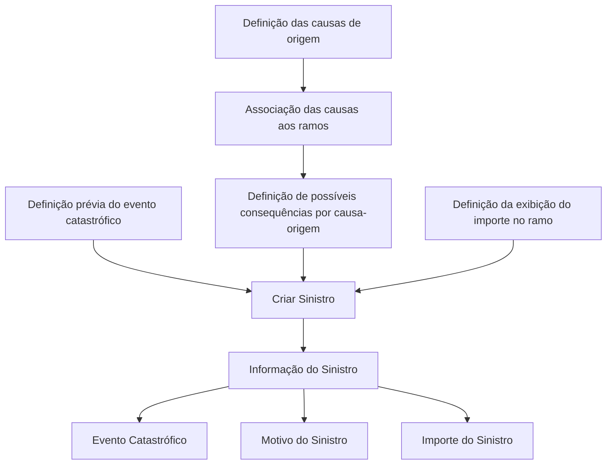

# Informação do Sinistro — Operação Criar Sinistro (Documento em Construção)

## 1. Metadados do Documento
- **Arquivo de Origem:** Não identificado
- **Tipo de Documento:** Especificação Técnica
- **Domínio / Sistema:** Soluciones APIs / Zeus
- **Público-Alvo:** Desenvolvedores, Arquitetos, Operação, Negócio
- **Data/Versão Identificada:** Não identificada

---

## 2. Resumo Executivo & Contexto de Negócio

O documento descreve, em estado **“EN CONSTRUCCIÓN”**, a funcionalidade de apresentação de informações no nível de sinistro durante a operação de **criar sinistro**. O conteúdo indica que determinadas propriedades podem participar dessa operação.

As informações identificadas incluem o indicador de evento catastrófico, o motivo do sinistro e o importe do sinistro. Cada atributo possui condições e pré-requisitos de configuração que devem existir antes da operação de criação.

O **Evento Catastrófico** indica se o sinistro ocorreu como consequência de um evento dessa natureza. O documento estabelece que o evento deve ter sido definido previamente antes da realização da operação.

O **Motivo do Sinistro** representa a origem ou causa que desencadeou o sinistro. As causas de origem devem ser previamente definidas, associadas aos ramos e relacionadas às possíveis consequências de cada causa-origem.

O **Importe do Sinistro** contém a estimativa do sinistro e somente deve ser apresentado quando essa exibição tiver sido definida no ramo aplicável.

---

## 3. Arquitetura, Componentes & Tecnologias Envolvidas

Os elementos explicitamente citados são:

- Operação **Crear Siniestro**.
- Área funcional **Información del Siniestro**.
- **Soluciones APIs**.
- **Zeus**.
- Configurações prévias de eventos, causas de origem, ramos e consequências.
- Atributos de sinistro: Evento Catastrófico, Motivo do Sinistro e Importe do Sinistro.



> **Nota de Análise:** O documento não detalha métodos HTTP, contratos JSON, endpoints, persistência, autenticação, tecnologias de implementação ou interfaces entre Soluciones APIs e Zeus.

---

## 4. Regras de Negócio, Especificações Funcionais & Processos

1. A operação **Crear Siniestro** deve mostrar as informações requeridas no nível de sinistro.
2. O documento informa que há propriedades que podem participar da operação de criação de sinistro.
3. O atributo **Evento Catastrófico** indica se o sinistro ocorreu como consequência de um evento catastrófico.
4. Antes da operação de criação do sinistro, o evento catastrófico precisa ter sido definido.
5. O atributo **Motivo do Sinistro** indica a origem do sinistro e a causa que o desencadeou.
6. As causas de origem do sinistro devem ser definidas previamente.
7. As causas de origem devem ser associadas aos ramos.
8. Para cada causa-origem, devem ser definidas as possíveis consequências.
9. O atributo **Importe do Sinistro** deve conter a estimativa do sinistro.
10. O **Importe do Sinistro** somente deve ser mostrado quando sua apresentação tiver sido definida no ramo.

> **Nota de Análise:** O documento não informa valores permitidos, obrigatoriedade, formato, tipo de dado ou comportamento de validação para os atributos identificados.

---

## 5. Tabelas de Parâmetros, Ambientes e Estruturas de Dados

| Item / Parâmetro | Descrição / Função | Tipo / Valores / Formato | Ambiente / Observações |
| :--- | :--- | :--- | :--- |
| Operação Criar Sinistro | Operação durante a qual são mostradas informações requeridas no nível de sinistro. | Não detalhado. | Referenciada no contexto de Soluciones APIs / Zeus. |
| Informação do Sinistro | Conjunto de informações apresentadas no nível de sinistro. | Não detalhado. | O documento informa que determinadas propriedades podem participar. |
| Evento Catastrófico | Indica se o sinistro ocorreu como consequência de evento catastrófico. | Não detalhado; apresentado como `Evento Catastrófico ( )`. | O evento deve estar definido antes da operação. |
| Motivo do Sinistro | Indica a origem do sinistro e a causa que o desencadeou. | Não detalhado; apresentado como `Motivo del siniestro( )`. | Causas devem ser definidas previamente, associadas aos ramos e possuir consequências definidas. |
| Causa-origem | Causa que origina ou desencadeia o sinistro. | Não detalhado. | Deve ser previamente definida e associada aos ramos. |
| Ramo | Elemento ao qual as causas de origem devem ser associadas e no qual pode ser definida a exibição do importe. | Não detalhado. | Condiciona a apresentação do importe do sinistro. |
| Consequência | Possível consequência definida para cada causa-origem. | Não detalhado. | Deve ser definida após a associação das causas aos ramos. |
| Importe do Sinistro | Contém a estimativa do sinistro. | Não detalhado; apresentado como `Importe del Siniestro( )`. | Mostrado somente quando definido no ramo. |
| Soluciones APIs | Referência de navegação ou contexto presente no documento. | Não detalhado. | Sem detalhamento técnico adicional. |
| Zeus | Referência de navegação ou contexto presente no documento. | Não detalhado. | Sem detalhamento técnico adicional. |

---

## 6. Bateria de Perguntas & Respostas para RAG (FAQ Sintético)

### P1: Qual é o objetivo da operação Criar Sinistro descrita no documento?
**R:** A operação Criar Sinistro deve mostrar as informações requeridas no nível de sinistro. O documento apresenta propriedades que podem participar dessa operação, incluindo Evento Catastrófico, Motivo do Sinistro e Importe do Sinistro.

### P2: O que informa o atributo Evento Catastrófico?
**R:** O atributo Evento Catastrófico indica se o sinistro ocorreu como consequência de um evento catastrófico.

### P3: Existe algum pré-requisito para informar Evento Catastrófico durante a criação do sinistro?
**R:** Sim. Antes de realizar a operação de criação do sinistro, o evento catastrófico deve ter sido definido previamente.

### P4: O que é o Motivo do Sinistro?
**R:** O Motivo do Sinistro indica a origem do sinistro, ou seja, a causa que desencadeou o sinistro.

### P5: Quais configurações devem existir para usar causas de origem do sinistro?
**R:** As causas de origem devem ser definidas previamente, associadas aos ramos e complementadas pela definição das possíveis consequências para cada causa-origem.

### P6: Qual é o conteúdo do atributo Importe do Sinistro?
**R:** O atributo Importe do Sinistro contém a estimativa do sinistro.

### P7: Em que condição o Importe do Sinistro deve ser mostrado?
**R:** O Importe do Sinistro deve ser mostrado somente quando essa apresentação tiver sido definida no ramo.

### P8: O documento especifica o tipo de dado ou o formato dos atributos de sinistro?
**R:** Não. O documento cita os atributos Evento Catastrófico, Motivo do Sinistro e Importe do Sinistro, mas não especifica tipos de dado, formatos, valores permitidos ou contratos de integração.

### P9: O documento detalha endpoints ou métodos HTTP para a operação Criar Sinistro?
**R:** Não. Embora o material mencione Soluciones APIs e a operação Criar Sinistro, não apresenta endpoints, métodos HTTP, payloads JSON ou códigos de resposta.

### P10: Qual é a relação entre ramos e as causas de origem do sinistro?
**R:** As causas de origem do sinistro devem ser associadas aos ramos. Além disso, para cada causa-origem, devem ser definidas as possíveis consequências.

---

## 7. Glossário de Termos, Siglas & Conceitos-Chave

- **Sinistro:** Entidade ou ocorrência cuja informação é apresentada durante a operação Criar Sinistro.
- **Evento Catastrófico:** Evento cuja consequência pode ser a ocorrência de um sinistro.
- **Motivo do Sinistro:** Origem ou causa que desencadeou o sinistro.
- **Causa-origem:** Causa previamente definida que deve ser associada aos ramos e possuir possíveis consequências.
- **Ramo:** Elemento ao qual as causas de origem são associadas e no qual pode ser definida a exibição do importe do sinistro.
- **Importe do Sinistro:** Estimativa do sinistro.
- **Soluciones APIs:** Termo exibido no rodapé/navegação do documento, sem detalhamento técnico.
- **Zeus:** Termo exibido no rodapé/navegação do documento, sem detalhamento técnico.

---

## 8. Notas Críticas, Riscos & Limitações

- O documento está identificado como **“EN CONSTRUCCIÓN”**, indicando conteúdo em construção.
- Não há identificação de arquivo, autoria, data, versão ou ambiente.
- Não são detalhados tipos de dados, campos obrigatórios, formatos, domínios de valores ou regras de validação.
- Não há especificação de endpoints, métodos HTTP, contratos JSON, códigos de erro ou mecanismos de autenticação.
- Não há detalhamento adicional sobre Soluciones APIs ou Zeus.
- Não há explicação sobre como eventos catastróficos, causas, ramos e consequências são administrados ou persistidos.
- O documento condiciona a exibição do Importe do Sinistro a uma definição no ramo, mas não especifica onde ou como essa definição é configurada.

---

## 9. Conteúdo Bruto Estruturado (Referência Fiel)

```text
--- [PÁGINA 1 DE 2] ---

EN CONSTRUCCIÓN
Información del Siniestro
¿En que consiste?
Mostrar la información requerida a nivel de siniestro cuando se realiza la operación que CREAR
Siniestro.
Proceso a seguir
A continuación detallan las propiedades que pueden participar en esta operación
Imagen IDENTIFICACIÓN
Información del siniestro
Evento Catastrófico ( )
Indica si el siniestro ha sucedido como consecuencia de un evento catastrófico. Previo a realizar la
operación, se ha tenido que definir el evento
Motivo del siniestro( )
Indica el origen del siniestro, la causa que desencadenó el siniestro. Las causas origen del siniestro
deben definirse previamente, asociarse a los ramos y posteriormente definir las posibles
consecuencias para cada causa-origen.
 / 
 RS
Inicio Soluciones APIs Documentación Zeus
ES


--- [PÁGINA 2 DE 2] ---

Importe del Siniestro( )
Este atributo contendrá la estimación del siniestro. Se mostrará sólo cuando así se haya definido en
el ramo
```
