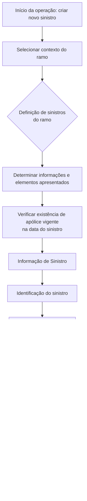

# EN CONSTRUCCIÓN — Criar Sinistro no REEF.core

## 1. Metadados do Documento
- **Arquivo de Origem:** Não identificado no conteúdo fornecido
- **Tipo de Documento:** Procedimento
- **Domínio / Sistema:** REEF.core — criação de sinistro
- **Público-Alvo:** Operação, Negócio e equipes funcionais
- **Data/Versão Identificada:** Não identificada

---

## 2. Resumo Executivo & Contexto de Negócio

O documento descreve a operação de criação de um novo sinistro no sistema REEF.core. O objetivo declarado é identificar a informação mínima necessária para executar a criação do sinistro.

A criação de sinistro depende de uma definição prévia do ramo. O documento estabelece que a informação solicitada durante a operação varia conforme a configuração de sinistros definida para o ramo aplicável.

Como premissa operacional, deve existir uma apólice vigente na data do sinistro. O documento não detalha como a vigência é validada, quais atributos compõem a apólice ou quais regras determinam a elegibilidade da apólice.

O processo organiza os elementos da operação em uma sequência apresentada sob a seção “INFORMAÇÃO DE SINISTRO”. A ordem e a presença efetiva dos elementos permanecem condicionadas à definição de sinistros configurada para o ramo.

---

## 3. Arquitetura, Componentes & Tecnologias Envolvidas

O único sistema explicitamente citado é o **REEF.core**, onde ocorre a operação de criação de sinistro. O documento também contém referências textuais a “Home Solutions APIs Documentation Zeus”, porém não descreve integração, responsabilidade, interface, contrato ou relação arquitetural dessas referências com a criação de sinistros.

Componentes e conceitos identificados:

| Componente / Conceito | Papel identificado |
| :--- | :--- |
| REEF.core | Sistema no qual é criado um novo sinistro |
| Ramo | Definição que condiciona as informações solicitadas e os elementos apresentados no processo |
| Apólice | Deve estar vigente na data do sinistro |
| Informação de Sinistro | Seção que organiza os elementos do processo de criação |
| Intervenção Externa (Pessoa de Contacto) | Elemento listado no fluxo de informação de sinistro |
| Atributos antes das Consequências | Elemento listado no fluxo de informação de sinistro |
| Consequências | Elemento listado no fluxo de informação de sinistro |
| Atributos depois das Consequências | Elemento listado no fluxo de informação de sinistro |



> **Nota de Análise:** O documento não detalha interfaces, APIs, métodos HTTP, contratos JSON, persistência de dados, autenticação, ambientes ou tecnologias de implementação do REEF.core.

---

## 4. Regras de Negócio, Especificações Funcionais & Processos

### Objetivo da operação
A operação permite criar um novo sinistro no REEF.core. O objetivo documental é conhecer a informação mínima necessária para realizar essa operação.

### Premissas obrigatórias
1. O ramo deve estar definido.
2. As informações solicitadas dependem da definição realizada para o ramo.
3. Deve existir uma apólice vigente na data do sinistro.

### Processo de informação de sinistro
O documento apresenta os elementos na seção “INFORMAÇÃO DE SINISTRO”. Os elementos e a ordem em que aparecem dependem da definição de sinistros configurada para o ramo.

A sequência exibida é:

1. Identificação do sinistro.
2. Informação do sinistro.
3. Intervenção Externa (Pessoa de Contacto).
4. Atributos antes das Consequências.
5. Consequências.
6. Atributos depois das Consequências.

> **Nota de Análise:** O documento menciona que a ordem dos elementos depende da definição de sinistros para o ramo, mas não informa configurações concretas de ramo, condições de exibição, obrigatoriedade de campos, formatos de dados, validações ou comportamentos em caso de erro.

---

## 5. Tabelas de Parâmetros, Ambientes e Estruturas de Dados

| Item / Parâmetro | Descrição / Função | Tipo / Valores / Formato | Ambiente / Observações |
| :--- | :--- | :--- | :--- |
| Operação | Criação de um novo sinistro | Operação funcional | Executada no REEF.core |
| Ramo | Definição que condiciona informações e estrutura da operação | Não especificado | Deve estar definido |
| Definição de sinistros do ramo | Determina as informações solicitadas e os elementos apresentados | Não especificado | Condiciona conteúdo e ordem do processo |
| Apólice | Apólice associada ao sinistro | Não especificado | Deve estar vigente na data do sinistro |
| Data do sinistro | Data usada para verificar a vigência da apólice | Não especificado | Necessária para a premissa de vigência |
| Identificação do sinistro | Elemento da seção de informação de sinistro | Não especificado | Apresentado conforme a definição do ramo |
| Informação do sinistro | Elemento da seção de informação de sinistro | Não especificado | Apresentado conforme a definição do ramo |
| Intervenção Externa | Elemento associado a “Pessoa de Contacto” | Não especificado | Apresentado conforme a definição do ramo |
| Pessoa de Contacto | Referência presente em Intervenção Externa | Não especificado | Não há campos ou regras detalhados |
| Atributos antes das Consequências | Elemento do processo | Não especificado | Precede Consequências na sequência apresentada |
| Consequências | Elemento do processo | Não especificado | Posicionado após atributos anteriores |
| Atributos depois das Consequências | Elemento do processo | Não especificado | Posicionado após Consequências |

---

## 6. Bateria de Perguntas & Respostas para RAG (FAQ Sintético)

### P1: Qual operação é descrita no documento?
**R:** O documento descreve a operação de criar um novo sinistro no sistema REEF.core.

### P2: Qual é o objetivo declarado para a operação de criação de sinistro?
**R:** O objetivo é conhecer a informação mínima necessária para realizar a criação de um novo sinistro no REEF.core.

### P3: Qual é a principal premissa relacionada ao ramo?
**R:** Para realizar a operação de criação de sinistro, o ramo deve estar definido. As informações solicitadas dependem da definição de sinistros realizada para esse ramo.

### P4: A apólice precisa atender a qual condição para que um sinistro seja criado?
**R:** É necessária uma apólice vigente na data do sinistro.

### P5: A informação solicitada na criação de sinistro é sempre igual para todos os ramos?
**R:** Não. O documento estabelece que a informação solicitada depende da definição configurada para o ramo.

### P6: Quais são os primeiros elementos apresentados na seção “INFORMAÇÃO DE SINISTRO”?
**R:** Os primeiros elementos listados são “Identificação do sinistro” e “Informação do sinistro”.

### P7: O documento inclui intervenção externa no processo de criação de sinistro?
**R:** Sim. O fluxo lista “Intervención Externa (Persona de Contacto)” como um dos elementos da informação de sinistro. O documento não fornece detalhes adicionais sobre essa intervenção ou sobre a pessoa de contacto.

### P8: Em que posição aparecem as consequências no fluxo apresentado?
**R:** As consequências aparecem após “Atributos antes de las Consecuencias” e antes de “Atributos después de Consecuencias”.

### P9: A ordem dos elementos do processo é fixa?
**R:** O documento informa que os elementos e a ordem em que aparecem dependem da definição de sinistros para o ramo. Portanto, a sequência listada não é apresentada como universal para todos os ramos.

### P10: O documento especifica APIs, métodos HTTP ou contratos de integração para criação de sinistro?
**R:** Não. Embora o conteúdo inclua a referência “Home Solutions APIs Documentation Zeus”, não há detalhamento de APIs, métodos HTTP, URLs, payloads, contratos JSON ou mecanismos de integração.

---

## 7. Glossário de Termos, Siglas & Conceitos-Chave

- **REEF.core:** Sistema no qual a operação de criação de um novo sinistro é realizada.
- **Sinistro:** Entidade ou ocorrência criada por meio da operação descrita no documento.
- **Ramo:** Definição que condiciona as informações solicitadas e a apresentação dos elementos no processo de criação de sinistro.
- **Apólice:** Apólice que deve estar vigente na data do sinistro.
- **Informação de Sinistro:** Seção que reúne os elementos apresentados durante o processo de criação.
- **Intervenção Externa:** Elemento listado no fluxo de informação de sinistro, associado a “Pessoa de Contacto”.
- **Pessoa de Contacto:** Referência apresentada entre parênteses junto à Intervenção Externa.
- **Consequências:** Elemento do fluxo de criação de sinistro, posicionado entre atributos anteriores e posteriores às consequências.

---

## 8. Notas Críticas, Riscos & Limitações

- O documento está identificado como “EN CONSTRUCCIÓN”, indicando conteúdo em construção.
- Não há detalhamento dos campos necessários para identificação do sinistro, informação do sinistro, intervenção externa, atributos ou consequências.
- Não são especificadas regras de validação da vigência da apólice.
- Não são informados os critérios para determinar o ramo aplicável.
- Não há descrição de mensagens de erro, exceções, permissões, perfis de acesso ou auditoria.
- Não há informações sobre APIs, contratos de integração, formatos de dados, ambientes, URLs, logs ou mecanismos de persistência.
- A referência a “Home Solutions APIs Documentation Zeus” não possui contexto técnico adicional no conteúdo fornecido.
- A presença, o conteúdo e a ordem dos elementos dependem da configuração de sinistros do ramo, mas as configurações não são documentadas.

---

## 9. Conteúdo Bruto Estruturado (Referência Fiel)

```text
--- [PÁGINA 1 DE 2] ---

EN CONSTRUCCIÓN
CREAR siniestro
¿En que consiste?
Esta operación permite crear un nuevo siniestro en Reef.core.
Objetivo
Conocer la información mínima necesaria con la que poder realizar la operación.
Premisas
Para poder realizar esta operación es necesario que se haya definido el ramo,la información
solicitada depende de la definición que se haya realizado del ramo. Se necesita una póliza vigente a
la fecha del siniestro.
Proceso a seguir
En este apartado se enumeran los elementos y el orden en el que aparecerán (siempre dependiendo
de la definición de siniestros para el ramo del ramo).
INFORMACIÓN DE SINIESTRO
 Identificación del siniestro( )
 Información del siniestro( )
 / 
 CF
Home Solutions APIs Documentation Zeus
EN


--- [PÁGINA 2 DE 2] ---

[  Intervención Externa (Persona de Contacto)] ( )
[  Atributos antes de las Consecuencias] ( )
[  Consecuencias] ( )
[  Atributos después de Consecuencias] ( )
```
