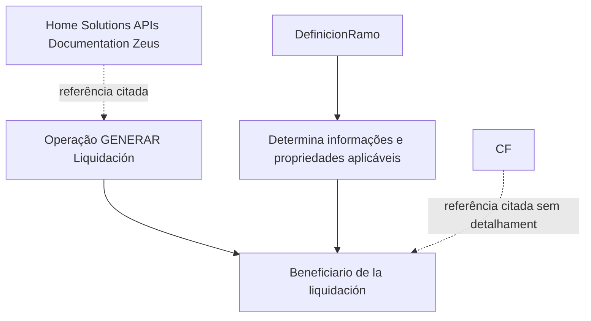
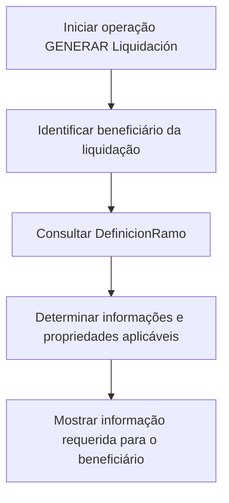

# Generar Liquidación - Beneficiario: Información Requerida por Definición de Ramo

## 1. Metadados do Documento
- **Arquivo de Origem:** Não identificado
- **Tipo de Documento:** Especificação Técnica
- **Domínio / Sistema:** Liquidación / Beneficiario / Home Solutions APIs Documentation Zeus
- **Público-Alvo:** Desenvolvedores, Analistas Funcionais e Operação
- **Data/Versão Identificada:** Não identificada

---

## 2. Resumo Executivo & Contexto de Negócio

O documento descreve a operação **“GENERAR Liquidación - Beneficiario”**, relacionada à geração de uma liquidação para um beneficiário. O objetivo declarado é apresentar as informações requeridas para o beneficiário quando a operação de geração de liquidação é executada.

A seleção das informações aplicáveis depende da definição do ramo, identificada no texto como **`[DefinicionRamo]`**. O documento indica que, conforme essa definição, diferentes propriedades podem participar da operação.

O conteúdo disponível é resumido e não descreve contratos de integração, métodos HTTP, campos, formatos de mensagens, regras de elegibilidade ou mecanismos de tratamento de erro. Também há referências a **CF** e **Home Solutions APIs Documentation Zeus**, sem explicação adicional.

---

## 3. Arquitetura, Componentes & Tecnologias Envolvidas

Os elementos explicitamente citados são:

- Operação **GENERAR Liquidación**.
- Entidade **Beneficiario de la liquidación**.
- Parâmetro ou definição **`[DefinicionRamo]`**.
- Referência **CF**.
- Referência documental ou plataforma **Home Solutions APIs Documentation Zeus**.



> **Nota de Análise:** O documento não detalha camadas de software, APIs, microsserviços, bancos de dados, protocolos, URLs, ambientes ou tecnologias de implementação.

---

## 4. Regras de Negócio, Especificações Funcionais & Processos

1. A operação analisada é denominada **GENERAR Liquidación**.
2. Durante a execução de **GENERAR Liquidación**, deve ser mostrada a informação requerida para o **beneficiário da liquidação**.
3. A informação que pode ser solicitada nesse nível depende da definição do ramo, indicada como **`[DefinicionRamo]`**.
4. O documento informa que existem propriedades que podem participar da operação, mas não enumera essas propriedades.
5. O conteúdo cita **Beneficiario de la liquidación**, **CF** e **Home Solutions APIs Documentation Zeus**, sem apresentar definição funcional ou técnica desses termos.

### Fluxo funcional identificado



> **Nota de Análise:** O documento não detalha os critérios usados por `DefinicionRamo`, as propriedades disponíveis, validações, cálculos, estados da liquidação ou resultados da operação.

---

## 5. Tabelas de Parâmetros, Ambientes e Estruturas de Dados

| Item / Parâmetro | Descrição / Função | Tipo / Valores / Formato | Ambiente / Observações |
| :--- | :--- | :--- | :--- |
| `GENERAR Liquidación` | Operação que gera uma liquidação. | Não informado | Associada à apresentação de informações do beneficiário. |
| Beneficiario de la liquidación | Beneficiário relacionado à operação de liquidação. | Não informado | O documento afirma que informações requeridas devem ser mostradas para essa entidade. |
| `[DefinicionRamo]` | Definição do ramo que influencia quais informações podem ser solicitadas. | Não informado | Regras, valores aceitos e estrutura não detalhados. |
| Propriedades participantes | Propriedades que podem participar da operação. | Não informado | O documento informa sua existência, mas não lista nomes, tipos ou obrigatoriedade. |
| CF | Termo ou referência citada no conteúdo. | Não informado | Sem detalhamento adicional. |
| Home Solutions APIs Documentation Zeus | Referência citada no conteúdo. | Não informado | Não há URL, versão, escopo ou descrição. |

---

## 6. Bateria de Perguntas & Respostas para RAG (FAQ Sintético)

### P1: Qual é o objetivo da operação GENERAR Liquidación - Beneficiario?
**R:** O objetivo é mostrar a informação requerida para o beneficiário quando a operação **GENERAR Liquidación** é realizada.

### P2: Quais informações devem ser apresentadas ao beneficiário da liquidação?
**R:** O documento informa que devem ser apresentadas as informações requeridas para o beneficiário. Entretanto, não especifica quais campos, propriedades ou estruturas de dados compõem essas informações.

### P3: O que determina quais informações podem ser solicitadas para o beneficiário?
**R:** As informações que podem ser solicitadas dependem da definição do ramo, referenciada no documento como **`[DefinicionRamo]`**.

### P4: O documento lista as propriedades participantes da operação GENERAR Liquidación?
**R:** Não. O documento declara que existem propriedades que podem participar da operação, mas não apresenta a lista dessas propriedades, seus formatos ou regras de preenchimento.

### P5: Quais regras de validação existem para GENERAR Liquidación?
**R:** Não foram identificadas regras de validação no conteúdo fornecido. O documento não informa validações de entrada, obrigatoriedade, condições de erro ou critérios de aceitação.

### P6: Quais APIs ou métodos HTTP são usados pela operação GENERAR Liquidación?
**R:** O documento cita **Home Solutions APIs Documentation Zeus**, mas não descreve métodos HTTP, endpoints, URLs, autenticação, contratos JSON ou códigos de resposta.

### P7: O que significa CF no contexto da liquidação?
**R:** O termo **CF** é citado no conteúdo, mas não possui definição, expansão ou contexto técnico adicional no documento.

### P8: A definição de ramo contém valores ou formatos documentados?
**R:** Não. O documento menciona apenas a referência **`[DefinicionRamo]`** como elemento que influencia as informações solicitáveis, sem documentar valores, formato ou estrutura.

### P9: Existem ambientes, servidores ou URLs documentados para a operação?
**R:** Não. O conteúdo não fornece ambientes, servidores, URLs, portas, credenciais, rotas de logs ou parâmetros de infraestrutura.

### P10: O documento descreve o processo completo de geração de liquidação?
**R:** Não integralmente. O fluxo inferível é identificar a operação, considerar o beneficiário e usar a definição do ramo para determinar informações aplicáveis. As etapas internas, integrações e resultados não são detalhados.

---

## 7. Glossário de Termos, Siglas & Conceitos-Chave

- **GENERAR Liquidación:** Nome da operação de geração de liquidação mencionada no documento.
- **Beneficiario de la liquidación:** Beneficiário associado à operação de liquidação.
- **`[DefinicionRamo]`:** Referência à definição de ramo que determina quais informações podem ser solicitadas na operação.
- **CF:** Termo citado sem definição no conteúdo.
- **Home Solutions APIs Documentation Zeus:** Referência mencionada sem descrição adicional, URL ou escopo documentado.
- **Ramo:** Classificação ou definição utilizada como critério para determinar informações aplicáveis à operação, conforme o texto.

---

## 8. Notas Críticas, Riscos & Limitações

- O documento está identificado como **“EN CONSTRUCCIÓN”**, indicando conteúdo possivelmente incompleto.
- Não há identificação de arquivo, autor, versão ou data.
- Não há detalhamento das propriedades participantes da operação.
- Não há contratos de API, endpoints, métodos HTTP, estruturas JSON, códigos de erro ou autenticação.
- Não há definição para **CF**.
- Não há explicação detalhada para **Home Solutions APIs Documentation Zeus**.
- Não há regras explícitas de validação, cálculo, persistência, auditoria ou tratamento de exceções.
- A relação entre `DefinicionRamo` e as informações requeridas é declarada, mas seus critérios não são especificados.

---

## 9. Conteúdo Bruto Estruturado (Referência Fiel)

```text
--- [PÁGINA 1 DE 1] ---

EN CONSTRUCCIÓN
GENERAR Liquidación - Beneficiario
¿En que consiste?
Mostrar la información requerida para el Beneficiario,cuando se realiza la operación que GENERAR
Liquidacion.
Objetivo
Conocer que información puede solicitarse en este nivel dependiendo de la [definición]
[DefinicionRamo] del ramo.
Proceso a seguir
A continuación detallan las propiedades que pueden participar en esta operación
Beneficiario de la liquidación
 /
 CF
Home Solutions APIs Documentation Zeus
EN
```
