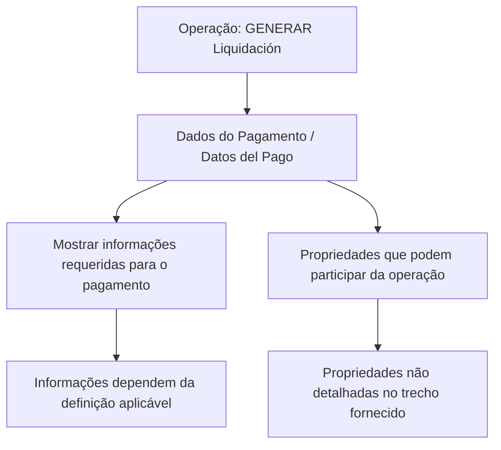

# GENERAR Liquidación — Dados do Pagamento (Documento em Construção)

## 1. Metadados do Documento
- **Arquivo de Origem:** Não identificado; conteúdo bruto fornecido no prompt.
- **Tipo de Documento:** Especificação Funcional.
- **Domínio / Sistema:** GENERAR Liquidación; Home Solutions APIs Documentation Zeus.
- **Público-Alvo:** Desenvolvedores, analistas funcionais e equipes de operação.
- **Data/Versão Identificada:** Não identificada.

---

## 2. Resumo Executivo & Contexto de Negócio

O documento descreve a operação **GENERAR Liquidación**, especificamente o nível funcional denominado **Datos del Pago**. O conteúdo está identificado como **“EN CONSTRUCCIÓN”**, indicando que a especificação ainda está em elaboração.

O objetivo declarado é mostrar as informações requeridas para os dados de pagamento quando a operação **GENERAR Liquidación** é realizada. O documento também indica que esse nível pode solicitar informações diferentes conforme uma definição aplicável, embora não detalhe qual definição controla essas variações.

O processo apresentado informa que, na sequência, são detalhadas as propriedades que podem participar da operação. Contudo, o trecho fornecido não contém a relação dessas propriedades, seus tipos, valores aceitos, obrigatoriedade, regras de validação ou contratos de integração.

O conteúdo menciona **Home Solutions APIs Documentation Zeus** e a sigla **CF**, mas não fornece definição funcional, técnica ou operacional adicional para esses termos.

---

## 3. Arquitetura, Componentes & Tecnologias Envolvidas

Os elementos explicitamente mencionados são:

- Operação: **GENERAR Liquidación**.
- Nível ou seção funcional: **Datos del Pago**.
- Referência documental/sistema: **Home Solutions APIs Documentation Zeus**.
- Sigla/termo citado: **CF**.
- Estado documental: **EN CONSTRUCCIÓN**.



> **Nota de Análise:** O conteúdo não descreve componentes de software, microsserviços, endpoints, métodos HTTP, contratos JSON, bancos de dados, ambientes, tecnologias, protocolos ou integrações.

---

## 4. Regras de Negócio, Especificações Funcionais & Processos

### Objetivo funcional identificado

A operação **GENERAR Liquidación** deve apresentar a informação requerida para os dados de pagamento durante a execução da liquidação.

### Regra de contextualização da informação

As informações que podem ser solicitadas no nível **Datos del Pago** dependem de uma definição. O documento não identifica:

- Qual definição é utilizada.
- Onde a definição é configurada.
- Quais condições determinam quais dados de pagamento são solicitados.
- Quais propriedades são obrigatórias, opcionais ou condicionais.
- Quais validações devem ser executadas.
- Quais são os resultados esperados em caso de ausência ou inconsistência de dados.

### Processo extraído

1. A operação **GENERAR Liquidación** é realizada.
2. O nível **Datos del Pago** apresenta as informações requeridas para os dados de pagamento.
3. As informações potencialmente solicitadas dependem de uma definição não detalhada.
4. O documento anuncia que detalhará as propriedades participantes da operação.
5. O trecho fornecido não apresenta as propriedades anunciadas.

---

## 5. Tabelas de Parâmetros, Ambientes e Estruturas de Dados

| Item / Parâmetro | Descrição / Função | Tipo / Valores / Formato | Ambiente / Observações |
| :--- | :--- | :--- | :--- |
| GENERAR Liquidación | Operação na qual os dados de pagamento são apresentados. | Não informado. | O documento não detalha interface, API ou fluxo técnico. |
| Datos del Pago | Nível que mostra a informação requerida para os dados de pagamento. | Não informado. | As informações dependem de uma definição não especificada. |
| Propriedades participantes | Propriedades que podem participar da operação GENERAR Liquidación. | Não informado. | O documento afirma que serão detalhadas, mas não as lista no trecho fornecido. |
| CF | Termo/sigla exibido no conteúdo. | Não informado. | Não há definição contextual disponível. |
| Home Solutions APIs Documentation Zeus | Referência exibida no rodapé ou navegação documental. | Não informado. | Não há detalhamento da plataforma, serviço ou versão. |
| EN CONSTRUCCIÓN | Estado informado para o conteúdo. | Texto de status. | Indica documentação em construção. |

---

## 6. Bateria de Perguntas & Respostas para RAG (FAQ Sintético)

### P1: O que é a operação GENERAR Liquidación?
**R:** A operação **GENERAR Liquidación** é a operação citada no documento como o contexto em que devem ser mostradas as informações requeridas para os dados de pagamento. O trecho fornecido não descreve o fluxo completo, regras de cálculo ou interfaces dessa operação.

### P2: Qual é o objetivo da seção Datos del Pago?
**R:** A seção **Datos del Pago** tem como objetivo permitir conhecer quais informações podem ser solicitadas nesse nível quando a operação **GENERAR Liquidación** é realizada, dependendo da definição aplicável.

### P3: Quais dados de pagamento são obrigatórios em GENERAR Liquidación?
**R:** O conteúdo não lista campos, propriedades ou dados de pagamento obrigatórios. Ele apenas informa que existem propriedades que podem participar da operação e que tais propriedades seriam detalhadas posteriormente.

### P4: De que depende a informação solicitada em Datos del Pago?
**R:** Segundo o documento, a informação que pode ser solicitada no nível **Datos del Pago** depende de uma definição. A definição, suas regras, sua localização e seus critérios de seleção não são detalhados no trecho fornecido.

### P5: Quais propriedades participam da operação GENERAR Liquidación?
**R:** O documento afirma que detalhará as propriedades que podem participar da operação **GENERAR Liquidación**, mas o trecho disponível não contém a relação dessas propriedades.

### P6: O documento define tipos ou formatos dos campos de pagamento?
**R:** Não. Não há tipos de dados, formatos, tamanhos, valores permitidos, exemplos ou regras de validação para campos de pagamento no conteúdo fornecido.

### P7: Há endpoints, métodos HTTP ou contratos JSON para GENERAR Liquidación?
**R:** Não há endpoints, métodos HTTP, URLs de serviço, contratos JSON, exemplos de requisição ou exemplos de resposta no trecho fornecido.

### P8: O que significa CF no documento?
**R:** O termo **CF** aparece no conteúdo, mas não possui definição, expansão ou explicação contextual no trecho fornecido.

### P9: O que é Home Solutions APIs Documentation Zeus?
**R:** **Home Solutions APIs Documentation Zeus** aparece como referência textual no documento. O trecho não explica se representa uma plataforma, portal de documentação, produto, sistema ou ambiente.

### P10: Qual é o estado da documentação de Dados do Pagamento?
**R:** O documento está marcado como **EN CONSTRUCCIÓN**, indicando que o conteúdo se encontra em construção. A ausência da lista de propriedades e dos detalhes de validação é compatível com esse estado informado.

---

## 7. Glossário de Termos, Siglas & Conceitos-Chave

- **GENERAR Liquidación:** Operação mencionada como contexto para exibição das informações requeridas de dados de pagamento.
- **Datos del Pago:** Seção ou nível funcional relacionado à apresentação de informações requeridas para pagamento durante a operação GENERAR Liquidación.
- **CF:** Sigla ou termo citado sem definição no trecho fornecido.
- **Home Solutions APIs Documentation Zeus:** Referência documental exibida sem explicação adicional.
- **EN CONSTRUCCIÓN:** Indicação de que o documento está em construção.

---

## 8. Notas Críticas, Riscos & Limitações

- O documento está explicitamente marcado como **EN CONSTRUCCIÓN**.
- Não há identificação do arquivo de origem, data, versão, autor ou responsável.
- Não são fornecidas propriedades de pagamento, tipos, formatos, obrigatoriedade ou validações.
- Não há detalhamento da definição que determina quais informações podem ser solicitadas.
- Não há especificação de API, endpoints, contratos de mensagem, autenticação, integrações ou ambientes.
- **Nota de Análise:** O documento cita propriedades que podem participar da operação **GENERAR Liquidación**, porém não detalha quais são essas propriedades.
- **Nota de Análise:** O documento menciona **CF** e **Home Solutions APIs Documentation Zeus**, mas não apresenta significado ou contexto técnico adicional.

---

## 9. Conteúdo Bruto Estruturado (Referência Fiel)

```text
--- [PÁGINA 1 DE 1] ---

EN CONSTRUCCIÓN
GENERAR Liquidación - Datos del Pago
¿En que consiste?
Mostrar la información requerida para los datos del Pago,cuando se realiza la operación que
GENERAR Liquidación.
Objetivo
Conocer que información puede solicitarse en este nivel dependiendo de la definición.
Proceso a seguir
A continuación detallan las propiedades que pueden participar en esta operación
Datos del Pago
 / 
 CF
Home Solutions APIs Documentation Zeus
EN
```
