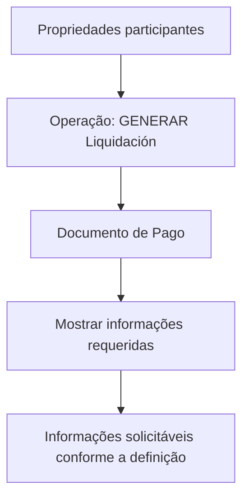

# Gerar Liquidação — Documento de Pagamento

## 1. Metadados do Documento
- **Arquivo de Origem:** `Não identificado`
- **Tipo de Documento:** `Especificação Técnica`
- **Domínio / Sistema:** `Home Solutions APIs Documentation Zeus`
- **Público-Alvo:** `Desenvolvedores, Arquitetos, Negócio`
- **Data/Versão Identificada:** `Não identificada`

---

## 2. Resumo Executivo & Contexto de Negócio

O documento descreve a operação **“GENERAR Liquidación”** no contexto de um **Documento de Pagamento**. O propósito declarado é exibir as informações requeridas para o Documento de Pagamento quando a operação de geração de liquidação é executada.

A especificação também indica que o objetivo é permitir o entendimento das informações que podem ser solicitadas nesse nível, de acordo com uma definição aplicável. O conteúdo aponta que determinadas propriedades podem participar da operação.

O material possui caráter resumido e não apresenta contratos de API, métodos HTTP, campos detalhados, regras de validação, integrações externas, ambientes ou critérios de cálculo. A referência ao sistema aparece como **Home Solutions APIs Documentation Zeus**.

---

## 3. Arquitetura, Componentes & Tecnologias Envolvidas

| Componente / Termo | Papel identificado no documento | Detalhamento disponível |
| :--- | :--- | :--- |
| `GENERAR Liquidación` | Operação que desencadeia a exibição de informações do Documento de Pagamento. | Não detalhado. |
| `Documento de Pago` | Documento para o qual devem ser apresentadas informações requeridas durante a operação de geração de liquidação. | Não detalhado. |
| `CF` | Termo apresentado junto de Documento de Pago. | Significado não definido. |
| `Home Solutions APIs Documentation Zeus` | Referência de documentação ou contexto de APIs. | Não detalhado. |



> **Nota de Análise:** O documento não especifica serviços, endpoints, protocolos, tecnologias, bancos de dados, contratos JSON ou mecanismos de integração associados à operação `GENERAR Liquidación`.

---

## 4. Regras de Negócio, Especificações Funcionais & Processos

1. A operação identificada como **GENERAR Liquidación** está relacionada à geração de um Documento de Pagamento.
2. Quando a operação **GENERAR Liquidación** é realizada, devem ser mostradas as informações requeridas para o **Documento de Pago**.
3. As informações que podem ser solicitadas nesse nível dependem de uma definição, embora o documento não detalhe qual definição é utilizada nem seus critérios.
4. Existem propriedades que podem participar da operação **GENERAR Liquidación**.
5. O documento anuncia que essas propriedades seriam detalhadas a seguir, porém o trecho fornecido não contém a lista dessas propriedades.
6. O termo **CF** aparece associado visualmente a **Documento de Pago**, sem definição funcional, técnica ou de negócio.

---

## 5. Tabelas de Parâmetros, Ambientes e Estruturas de Dados

| Item / Parâmetro | Descrição / Função | Tipo / Valores / Formato | Ambiente / Observações |
| :--- | :--- | :--- | :--- |
| `GENERAR Liquidación` | Operação que realiza a geração de liquidação e aciona a apresentação das informações requeridas do Documento de Pagamento. | Nome de operação. | Não informado. |
| `Documento de Pago` | Documento cuja informação requerida deve ser exibida durante a operação de geração de liquidação. | Entidade ou documento de negócio. | Não informado. |
| `CF` | Termo apresentado no conteúdo original. | Não informado. | O documento não define o significado. |
| Propriedades participantes | Propriedades que podem participar da operação de geração de liquidação. | Não listadas. | O detalhamento não está presente no trecho fornecido. |
| Definição | Referência que determina quais informações podem ser solicitadas nesse nível. | Não informado. | Critérios e origem não informados. |
| `Home Solutions APIs Documentation Zeus` | Referência de documentação ou sistema associada ao conteúdo. | Nome textual. | Sem detalhes adicionais. |

---

## 6. Bateria de Perguntas & Respostas para RAG (FAQ Sintético)

### P1: Em que consiste a operação `GENERAR Liquidación`?
**R:** A operação `GENERAR Liquidación` consiste em uma operação na qual devem ser mostradas as informações requeridas para o `Documento de Pago`.

### P2: Qual é o objetivo descrito para `GENERAR Liquidación`?
**R:** O objetivo é conhecer quais informações podem ser solicitadas nesse nível, dependendo da definição aplicável.

### P3: Quando as informações do Documento de Pagamento devem ser exibidas?
**R:** As informações requeridas para o `Documento de Pago` devem ser exibidas quando a operação `GENERAR Liquidación` é realizada.

### P4: O documento lista quais propriedades participam da operação `GENERAR Liquidación`?
**R:** Não. O documento informa que detalhará as propriedades que podem participar da operação, mas o trecho fornecido não contém essa lista.

### P5: Quais regras de validação são aplicadas ao Documento de Pagamento?
**R:** O conteúdo fornecido não descreve regras de validação para o `Documento de Pago`.

### P6: Quais campos ou dados devem compor o Documento de Pagamento?
**R:** O documento afirma que informações requeridas devem ser mostradas, mas não identifica campos, atributos, formatos ou estruturas de dados específicas.

### P7: O que determina as informações que podem ser solicitadas durante a geração de liquidação?
**R:** As informações que podem ser solicitadas dependem de uma definição. O documento não detalha essa definição nem seus critérios.

### P8: O que significa a sigla `CF` no contexto do Documento de Pagamento?
**R:** O documento apresenta o termo `CF`, mas não fornece uma expansão, definição ou função para ele.

### P9: Há endpoints, métodos HTTP ou contratos de API documentados para `GENERAR Liquidación`?
**R:** Não. O trecho menciona `Home Solutions APIs Documentation Zeus`, porém não documenta endpoints, métodos HTTP, URLs, payloads, respostas ou contratos JSON.

### P10: Quais ambientes técnicos são citados para a operação?
**R:** Nenhum ambiente técnico, servidor, URL, porta ou configuração é identificado no conteúdo fornecido.

---

## 7. Glossário de Termos, Siglas & Conceitos-Chave

- **GENERAR Liquidación:** Operação mencionada como responsável por gerar uma liquidação e apresentar informações requeridas do Documento de Pagamento.
- **Documento de Pago:** Documento de Pagamento associado à operação `GENERAR Liquidación`.
- **CF:** Termo não definido no conteúdo fornecido.
- **Home Solutions APIs Documentation Zeus:** Referência textual de documentação ou contexto de APIs, sem detalhamento adicional.
- **Propriedades participantes:** Propriedades que podem participar da operação `GENERAR Liquidación`, embora não estejam listadas no trecho.

---

## 8. Notas Críticas, Riscos & Limitações

- O documento está identificado com a indicação **“EN CONSTRUCCIÓN”**, sugerindo conteúdo em elaboração.
- Não há definição para a sigla ou termo `CF`.
- Não são especificadas as propriedades que participam da operação `GENERAR Liquidación`.
- Não são apresentados contratos de API, endpoints, métodos HTTP, payloads, respostas, códigos de erro ou autenticação.
- Não há parâmetros técnicos, URLs, servidores, ambientes, logs ou mecanismos de observabilidade.
- Não são descritas regras de cálculo, condições de validação, exceções ou critérios de elegibilidade.
- A dependência da “definição” para determinar informações solicitáveis é mencionada, mas essa definição não é caracterizada.

---

## 9. Conteúdo Bruto Estruturado (Referência Fiel)

```text
--- [PÁGINA 1 DE 1] ---

EN CONSTRUCCIÓN
GENERAR Liquidación - Documento de Pago
¿En que consiste?
Mostrar la información requerida para el Documento de Pago,cuando se realiza la operación que
GENERAR Liquidación.
Objetivo
Conocer que información puede solicitarse en este nivel dependiendo de la definición.
Proceso a seguir
A continuación detallan las propiedades que pueden participar en esta operación
Documento de Pago
 /
 CF
Home Solutions APIs Documentation Zeus
EN
```
