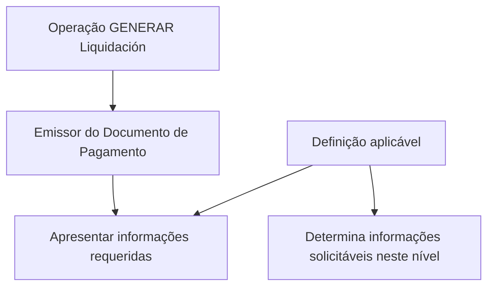

# Gerar Liquidação — Emissor do Documento de Pagamento

## 1. Metadados do Documento
- **Arquivo de Origem:** Não identificado
- **Tipo de Documento:** Especificação Técnica
- **Domínio / Sistema:** Home Solutions APIs Documentation Zeus
- **Público-Alvo:** Desenvolvedores, Arquitetos, Analistas Funcionais
- **Data/Versão Identificada:** Não identificada

---

## 2. Resumo Executivo & Contexto de Negócio

O documento descreve a operação **“GENERAR Liquidación”** e seu tratamento para o **Emissor do Documento de Pagamento**. O objetivo explícito é apresentar as informações requeridas para esse emissor quando a operação de geração de liquidação é executada.

A especificação indica que as informações solicitadas nesse nível dependem de uma definição prévia. Portanto, a operação não estabelece, no conteúdo fornecido, uma lista fixa de propriedades obrigatórias, tipos de dados, contratos de API ou regras de validação detalhadas.

O material parece pertencer à documentação de APIs **Home Solutions**, no contexto identificado como **Zeus**. A referência a “Emisor del Documento de Pago” sugere que o escopo funcional trata da entidade responsável pela emissão de um documento associado a pagamento durante uma liquidação.

**Nota de Análise:** o documento menciona propriedades que podem participar da operação, mas não apresenta os nomes dessas propriedades, os valores permitidos, os métodos HTTP, os endpoints, os contratos JSON ou critérios de obrigatoriedade.

---

## 3. Arquitetura, Componentes & Tecnologias Envolvidas

Os elementos explicitamente mencionados são:

| Componente / Termo | Papel identificado no documento |
| :--- | :--- |
| Home Solutions APIs Documentation | Fonte documental associada à operação. |
| Zeus | Contexto ou sistema indicado no cabeçalho documental. |
| GENERAR Liquidación | Operação executada para gerar uma liquidação. |
| Emisor del Documento de Pago | Entidade ou nível funcional para o qual informações podem ser solicitadas durante a operação. |



**Nota de Análise:** não há descrição de microsserviços, banco de dados, protocolos, ambientes, endpoints, autenticação, filas, logs ou tecnologias de implementação.

---

## 4. Regras de Negócio, Especificações Funcionais & Processos

1. A operação descrita é **GENERAR Liquidación**.
2. Durante a operação **GENERAR Liquidación**, devem ser exibidas ou disponibilizadas as informações requeridas para o **Emissor do Documento de Pagamento**.
3. As informações que podem ser solicitadas no nível do **Emissor do Documento de Pagamento** dependem de uma definição.
4. O documento informa que existem propriedades que podem participar da operação.
5. O conteúdo fornecido não identifica quais propriedades participam da operação.
6. O conteúdo fornecido não define:
   - campos obrigatórios;
   - campos opcionais;
   - tipos de dados;
   - valores permitidos;
   - regras de cálculo;
   - mensagens de erro;
   - etapas de aprovação;
   - regras de validação;
   - contratos de entrada ou saída.

### Fluxo funcional identificado

1. Iniciar a operação **GENERAR Liquidación**.
2. Considerar a definição aplicável à operação.
3. Identificar as informações que podem ser solicitadas no nível do **Emissor do Documento de Pagamento**.
4. Mostrar as informações requeridas para o emissor.

**Nota de Análise:** o documento não detalha como a definição é criada, mantida, consultada ou associada à operação de liquidação.

---

## 5. Tabelas de Parâmetros, Ambientes e Estruturas de Dados

| Item / Parâmetro | Descrição / Função | Tipo / Valores / Formato | Ambiente / Observações |
| :--- | :--- | :--- | :--- |
| GENERAR Liquidación | Operação mencionada para geração de liquidação. | Não informado | O documento não apresenta endpoint, método HTTP ou contrato. |
| Emissor do Documento de Pagamento | Entidade ou nível para o qual informações requeridas devem ser mostradas. | Não informado | Denominado no texto original como “Emisor del Documento de Pago”. |
| Propriedades participantes | Propriedades que podem participar da operação. | Não informado | Os nomes, formatos e obrigatoriedades não são detalhados. |
| Definição | Elemento que condiciona quais informações podem ser solicitadas no nível do emissor. | Não informado | Não há descrição da estrutura ou origem da definição. |
| Home Solutions APIs Documentation | Referência documental ou contexto de APIs. | Não informado | Associado ao termo “Zeus” no conteúdo bruto. |
| Zeus | Sistema ou contexto documental citado. | Não informado | O papel técnico ou funcional não é detalhado. |
| CF | Sigla exibida no conteúdo bruto. | Não informado | Sem expansão ou contexto adicional. |
| EN | Indicador exibido no conteúdo bruto. | Não informado | Sem explicação adicional. |

---

## 6. Bateria de Perguntas & Respostas para RAG (FAQ Sintético)

### P1: Qual é o objetivo da operação GENERAR Liquidación?
**R:** O objetivo informado é mostrar as informações requeridas para o Emissor do Documento de Pagamento quando a operação GENERAR Liquidación é realizada.

### P2: Qual entidade é tratada pela documentação da operação GENERAR Liquidación?
**R:** A documentação trata do **Emissor do Documento de Pagamento**, denominado no conteúdo original como “Emisor del Documento de Pago”.

### P3: O que determina quais informações podem ser solicitadas para o Emissor do Documento de Pagamento?
**R:** As informações que podem ser solicitadas nesse nível dependem de uma definição. O documento não detalha a estrutura, a origem ou os critérios dessa definição.

### P4: Quais propriedades participam da operação GENERAR Liquidación?
**R:** O documento afirma que existem propriedades que podem participar da operação, mas não relaciona os nomes das propriedades, seus tipos, formatos ou regras de obrigatoriedade.

### P5: A documentação informa quais campos são obrigatórios para o Emissor do Documento de Pagamento?
**R:** Não. O conteúdo fornecido não lista campos obrigatórios, opcionais ou condicionais para o Emissor do Documento de Pagamento.

### P6: Existem endpoints, métodos HTTP ou contratos JSON definidos para GENERAR Liquidación?
**R:** Não. O documento não apresenta URLs, endpoints, métodos HTTP, exemplos de requisição, exemplos de resposta ou contratos JSON.

### P7: Qual é o processo básico descrito para a operação GENERAR Liquidación?
**R:** O processo descrito consiste em realizar a operação GENERAR Liquidación e mostrar as informações requeridas para o Emissor do Documento de Pagamento, conforme a definição aplicável.

### P8: O documento identifica o sistema ou contexto associado à operação?
**R:** Sim. O conteúdo menciona “Home Solutions APIs Documentation Zeus”, mas não detalha a função técnica ou funcional de Zeus.

### P9: Há regras de validação ou mensagens de erro documentadas?
**R:** Não. O documento não descreve regras de validação, códigos de erro, mensagens de rejeição ou comportamentos para dados ausentes ou inválidos.

### P10: A documentação detalha como a definição das informações é configurada?
**R:** Não. O documento apenas afirma que as informações solicitáveis dependem de uma definição, sem explicar como essa definição é criada, consultada ou administrada.

---

## 7. Glossário de Termos, Siglas & Conceitos-Chave

- **GENERAR Liquidación:** operação citada para geração de liquidação.
- **Emissor do Documento de Pagamento / Emisor del Documento de Pago:** entidade para a qual informações requeridas devem ser mostradas durante a operação de geração de liquidação.
- **Liquidação / Liquidación:** termo associado à operação descrita; o documento não fornece definição adicional.
- **Home Solutions APIs Documentation:** referência documental relacionada ao conteúdo.
- **Zeus:** sistema ou contexto mencionado no cabeçalho do conteúdo, sem detalhamento adicional.
- **CF:** sigla presente no conteúdo bruto, sem significado definido.
- **EN:** indicador presente no conteúdo bruto, sem significado definido.

---

## 8. Notas Críticas, Riscos & Limitações

- O documento está marcado como **“EN CONSTRUCCIÓN”**, indicando conteúdo em construção.
- Não há identificação do arquivo original, versão, data, autor ou responsável.
- Não há propriedades concretas para o Emissor do Documento de Pagamento.
- Não há contrato técnico de integração, incluindo endpoint, método HTTP, autenticação, payload ou resposta.
- Não há ambiente, URL, servidor, rota de log, banco de dados ou parâmetro operacional documentado.
- Não há detalhamento de exceções, validações, segurança, auditoria ou rastreabilidade.
- **Nota de Análise:** qualquer implementação baseada apenas neste conteúdo exigirá definições adicionais sobre as propriedades aplicáveis e a regra que determina sua solicitação.

---

## 9. Conteúdo Bruto Estruturado (Referência Fiel)

```text
--- [PÁGINA 1 DE 1] ---

EN CONSTRUCCIÓN
GENERAR Liquidación - Emisor Documento de
Pago
¿En que consiste?
Mostrar la información requerida para el Emisor del Documento de Pago,cuando se realiza la
operación que GENERAR Liquidación.
Objetivo
Conocer que información puede solicitarse en este nivel dependiendo de la definición.
Proceso a seguir
A continuación detallan las propiedades que pueden participar en esta operación
Emisor del Documento de Pago
 / 
 CF
Home Solutions APIs Documentation Zeus
EN
```
