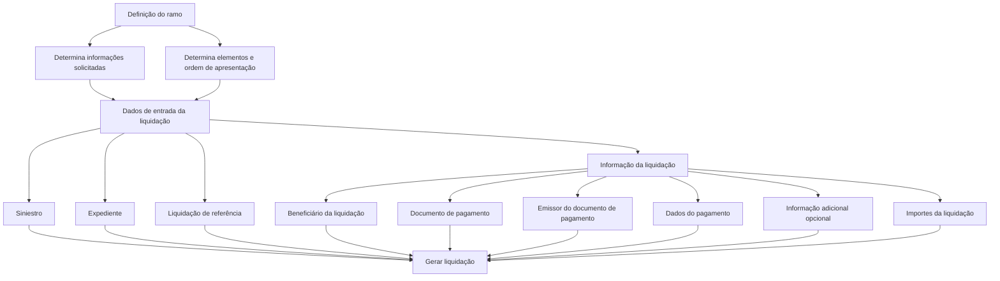

# Geração de Liquidação para Expediente — Documento em Construção

## 1. Metadados do Documento
- **Arquivo de Origem:** `Não identificado`
- **Tipo de Documento:** `Procedimento`
- **Domínio / Sistema:** `Home Solutions APIs Documentation Zeus`
- **Público-Alvo:** `Negócio, Operação e Desenvolvedores`
- **Data/Versão Identificada:** `Não identificada`

---

## 2. Resumo Executivo & Contexto de Negócio

O documento descreve, em estado de construção, a operação **“GENERAR Liquidación”**. A operação permite criar ou gerar uma liquidação associada a um expediente de sinistro.

O objetivo declarado é conhecer a informação mínima necessária para executar a operação de geração de liquidação. A informação solicitada não é fixa: ela depende da definição realizada para o ramo.

O processo organiza os elementos que aparecerão durante a geração da liquidação e a ordem em que esses elementos serão apresentados. Essa composição também depende da definição do ramo.

O conteúdo disponível lista grupos de dados de entrada e de informação da liquidação, incluindo expediente de sinistro, liquidação de referência, beneficiário, documento de pagamento, emissor, dados de pagamento, informação adicional opcional e importes.

---

## 3. Arquitetura, Componentes & Tecnologias Envolvidas

O conteúdo não apresenta uma arquitetura técnica detalhada, componentes de software, interfaces, contratos HTTP, tecnologias de implementação, URLs de ambiente ou fluxos de integração. O termo **Home Solutions APIs Documentation Zeus** aparece no rodapé do conteúdo, mas o documento não explica sua função arquitetural.

O fluxo funcional explicitamente apresentado é a preparação de dados para gerar uma liquidação de um expediente, condicionada pela definição do ramo.



> **Nota de Análise:** O documento não detalha métodos HTTP, contratos JSON, persistência de dados, autenticação, tecnologias, servidores ou integrações associadas à operação de geração de liquidação.

---

## 4. Regras de Negócio, Especificações Funcionais & Processos

1. A operação denominada **“GENERAR Liquidación”** permite criar ou gerar uma liquidação para um expediente.
2. A operação exige conhecer a informação mínima necessária para realizar a geração da liquidação.
3. A informação solicitada para a geração da liquidação depende da definição realizada para o ramo.
4. Os elementos apresentados no processo e a ordem em que aparecem também dependem da definição do ramo.
5. Os dados de entrada identificados incluem:
   - Siniestro;
   - Expediente;
   - Liquidação de referência.
6. A informação da liquidação identificada inclui:
   - Beneficiário da liquidação;
   - Documento de pagamento da liquidação;
   - Emissor do documento de pagamento da liquidação;
   - Dados do pagamento da liquidação;
   - Informação adicional da liquidação, identificada como opcional;
   - Importes da liquidação.

> **Nota de Análise:** O documento não define regras de obrigatoriedade individuais para cada campo, exceto a indicação explícita de que a informação adicional da liquidação é opcional. Também não detalha critérios de validação, fórmulas de cálculo, estados da liquidação ou condições de erro.

---

## 5. Tabelas de Parâmetros, Ambientes e Estruturas de Dados

| Item / Parâmetro | Descrição / Função | Tipo / Valores / Formato | Ambiente / Observações |
| :--- | :--- | :--- | :--- |
| GENERAR Liquidación | Operação para criar ou gerar uma liquidação para um expediente. | Operação funcional. | Documento identificado como “EN CONSTRUCCIÓN”. |
| Definición del ramo | Definição do ramo que condiciona as informações solicitadas e a ordem dos elementos. | Não detalhado. | Não são especificados ramos, valores ou estrutura da definição. |
| Siniestro | Elemento listado nos dados de entrada da liquidação. | Não detalhado. | Sem formato, regra de preenchimento ou obrigatoriedade informada. |
| Expediente | Elemento listado nos dados de entrada da liquidação. | Não detalhado. | A liquidação é criada para um expediente. |
| Liquidación de Referencia | Elemento listado nos dados de entrada da liquidação. | Não detalhado. | Não é explicado como a liquidação de referência é utilizada. |
| Beneficiario de la Liquidación | Informação da liquidação. | Não detalhado. | Sem regras de elegibilidade ou formato. |
| Documento de Pago de la Liquidación | Informação da liquidação relacionada ao documento de pagamento. | Não detalhado. | Sem estrutura ou validação definida. |
| Emisor del Documento de Pago | Informação sobre o emissor do documento de pagamento da liquidação. | Não detalhado. | Sem formato ou catálogo de emissores. |
| Datos del Pago | Informação sobre os dados de pagamento da liquidação. | Não detalhado. | Sem detalhamento de método, conta, moeda ou prazo. |
| Información Adicional | Informação adicional da liquidação. | Opcional. | Único item explicitamente identificado como opcional. |
| Importes de la Liquidación | Informação sobre os valores da liquidação. | Não detalhado. | Não há fórmulas, moeda, limites ou critérios de cálculo. |
| Home Solutions APIs Documentation Zeus | Texto exibido no conteúdo de origem. | Não detalhado. | O documento não define se é sistema, portal ou produto. |

---

## 6. Bateria de Perguntas & Respostas para RAG (FAQ Sintético)

### P1: Qual é o objetivo da operação “GENERAR Liquidación”?
**R:** A operação “GENERAR Liquidación” permite criar ou gerar uma liquidação para um expediente. O objetivo do documento é indicar a informação mínima necessária para executar essa operação.

### P2: A informação necessária para gerar uma liquidação é sempre a mesma?
**R:** Não. O documento informa que a informação solicitada depende da definição realizada para o ramo.

### P3: O que determina a ordem dos elementos exibidos na geração da liquidação?
**R:** A ordem dos elementos exibidos depende da definição do ramo, assim como as informações solicitadas para a operação.

### P4: Quais são os dados de entrada da liquidação identificados no documento?
**R:** Os dados de entrada listados são: siniestro, expediente e liquidação de referência.

### P5: Quais informações de liquidação são listadas no procedimento?
**R:** O documento lista beneficiário da liquidação, documento de pagamento da liquidação, emissor do documento de pagamento, dados do pagamento, informação adicional e importes da liquidação.

### P6: Existe alguma informação explicitamente marcada como opcional?
**R:** Sim. A informação adicional da liquidação é identificada explicitamente como opcional.

### P7: O documento detalha os métodos HTTP ou contratos JSON da operação de geração de liquidação?
**R:** Não. O conteúdo disponível não apresenta métodos HTTP, endpoints, contratos JSON, exemplos de requisição ou exemplos de resposta.

### P8: O documento informa como calcular os importes da liquidação?
**R:** Não. O documento apenas lista os importes da liquidação como uma informação do processo, sem fornecer fórmulas, moedas, limites ou regras de cálculo.

### P9: O documento define quais campos são obrigatórios para a geração da liquidação?
**R:** Não de forma individual. O documento afirma que existe informação mínima necessária e que ela depende da definição do ramo. Apenas a informação adicional é explicitamente marcada como opcional.

### P10: O que é “Liquidación de Referencia” no contexto apresentado?
**R:** “Liquidación de Referencia” é um elemento listado entre os dados de entrada da liquidação. O documento não explica sua finalidade, formato ou relação com a liquidação gerada.

### P11: O documento descreve ambientes, URLs ou servidores para a operação?
**R:** Não. Não foram identificados ambientes, URLs, portas, servidores ou parâmetros de implantação no conteúdo fornecido.

### P12: O que significa “Home Solutions APIs Documentation Zeus” no documento?
**R:** O texto aparece no conteúdo de origem, mas não há explicação sobre seu significado, responsabilidade ou relação técnica com a operação de geração de liquidação.

---

## 7. Glossário de Termos, Siglas & Conceitos-Chave

- **GENERAR Liquidación:** Operação que permite criar ou gerar uma liquidação para um expediente.
- **Liquidación:** Liquidação criada no contexto de um expediente.
- **Expediente:** Entidade para a qual a liquidação é criada.
- **Siniestro:** Elemento listado como dado de entrada da liquidação.
- **Liquidación de Referencia:** Elemento listado como dado de entrada; sua finalidade não é detalhada.
- **Ramo:** Contexto cuja definição determina as informações solicitadas e a ordem dos elementos no processo.
- **Beneficiario de la Liquidación:** Informação referente ao beneficiário da liquidação.
- **Documento de Pago:** Documento de pagamento associado à liquidação.
- **Emisor del Documento de Pago:** Emissor do documento de pagamento da liquidação.
- **Datos del Pago:** Dados de pagamento da liquidação.
- **Importes de la Liquidación:** Valores associados à liquidação.
- **Home Solutions APIs Documentation Zeus:** Texto citado no documento sem definição adicional.

---

## 8. Notas Críticas, Riscos & Limitações

- O documento está identificado como **“EN CONSTRUCCIÓN”**, indicando conteúdo potencialmente incompleto.
- Não há detalhamento técnico sobre APIs, endpoints, métodos HTTP, payloads, códigos de retorno, autenticação ou autorização.
- Não há definição de estruturas de dados, tipos de campo, formatos, valores permitidos ou exemplos de preenchimento.
- Não há regras de cálculo, moeda, arredondamento, validação ou consistência para os importes da liquidação.
- Não há descrição do ciclo de vida, estados, aprovação, cancelamento ou reversão de liquidações.
- A dependência da definição do ramo é central, mas o documento não descreve como essa definição é configurada, consultada ou validada.
- O termo **Home Solutions APIs Documentation Zeus** não possui contextualização suficiente para identificar seu papel no processo.
- Não há detalhamento adicional para os tópicos listados além da enumeração dos elementos do processo.

---

## 9. Conteúdo Bruto Estruturado (Referência Fiel)

```text
--- [PÁGINA 1 DE 2] ---

EN CONSTRUCCIÓN
GENERAR Liquidación
¿En que consiste?
Esta operación permite crear, generar una liquidación para un expediente.
Objetivo
Conocer la información mínima necesaria con la que poder realizar la operación. La información
solicitada depende de la [definición][DefinicionRamo] que se haya realizado del ramo.
Proceso a seguir
En este apartado se enumeran los elementos y el orden en el que aparecerán (siempre dependiendo
de la [definición] del ramo).
DATOS DE ENTRADA DE LA LIQUIDACIÓN
Siniestro Expediente Liquidación de Referencia
INFORMACIÓN DE LA LIQUIDACIÓN
Beneficiario de la Liquidación
Documento de Pago de la Liquidación
 /
 CF
Home Solutions APIs Documentation Zeus
EN


--- [PÁGINA 2 DE 2] ---

Emisor del Documento de Pago de la liquidación
Datos del Pago de la liquidación
Información Adicional de la liquidación-Opcional
Importes de la liquidación
```
