# Documento de Construção — Informações de Sinistro, Risco e Referências Técnicas

## 1. Metadados do Documento
- **Arquivo de Origem:** Não identificado no conteúdo extraído
- **Tipo de Documento:** Apresentação Executiva
- **Domínio / Sistema:** Informação de Sinistro, Informação de Risco, Home Solutions APIs Documentation e Zeus
- **Público-Alvo:** Negócio, Arquitetos, Desenvolvedores e Operação
- **Data/Versão Identificada:** Não identificada

---

## 2. Resumo Executivo & Contexto de Negócio

O conteúdo extraído apresenta um material em construção, identificado pela expressão `EN CONSTRUCCI?N`, organizado em torno de três tópicos principais: a explicação do que consiste a iniciativa, suas premissas e o processo a seguir. O documento não fornece detalhamento narrativo adicional para esses tópicos.

O escopo funcional citado abrange a gestão ou organização de informações de sinistro, incluindo identificação do sinistro, informações gerais de apólice, tomador, agentes, atributos, coasseguro e intervenções de cliente. A presença de campos sinalizados com `(    )` indica itens mencionados sem conteúdo adicional disponível na extração.

Também é citada uma seção de informação de risco, contendo intervenções de cliente, atributos, coberturas e cláusulas. O texto não explica regras de associação entre informação de sinistro e informação de risco, nem especifica operações, integrações ou contratos de dados.

Como referências técnicas ou de navegação, o documento menciona `CF`, `Home Solutions APIs Documentation` e `Zeus`, além do marcador `EN`. Não há URLs, versões, métodos HTTP, responsabilidades técnicas ou instruções operacionais detalhadas para esses elementos.

> **Nota de Análise:** O documento apresenta tópicos e categorias funcionais, mas não detalha processos, métodos HTTP, contratos JSON, regras de cálculo, URLs, ambientes, tecnologias implementadas ou fluxos de integração.

---

## 3. Arquitetura, Componentes & Tecnologias Envolvidas

### Componentes e referências identificados

| Componente / Termo | Classificação possível baseada no texto | Evidência disponível |
| :--- | :--- | :--- |
| Información de Siniestro (Inicial) | Área funcional / conjunto de informações | Identificação do sinistro, apólice, tomador, agentes, atributos, coasseguro e intervenções de cliente |
| Información de Riesgo | Área funcional / conjunto de informações | Intervenções de cliente, atributos, coberturas e cláusulas |
| Home Solutions APIs Documentation | Referência de documentação de APIs | Nome listado no conteúdo bruto; sem URL ou descrição funcional |
| Zeus | Sistema, ferramenta ou referência técnica | Nome listado no conteúdo bruto; sem detalhamento adicional |
| CF | Sigla ou referência técnica | Citada isoladamente, sem expansão ou contexto |
| EN | Marcador textual / idioma ou referência | Citado isoladamente, sem detalhamento adicional |
| Imagen LOGO | Elemento visual | Indica a presença de uma imagem ou logotipo no documento original |

### Organização conceitual extraída

```mermaid
graph TD
  Documento["Documento em construção"]
  Contexto["¿En qué consiste?"]
  Premissas["Premisas"]
  Processo["Proceso a seguir"]

  Sinistro["INFORMACIÓN DE SINIESTRO (INICIAL)"]
  Risco["INFORMACIÓN DE RIESGO"]

  Identificacao["Identificación del siniestro"]
  Apolice["Información general de la póliza"]
  Coaseguro["Coaseguro"]
  Tomador["Tomador"]
  Agentes["Agentes"]
  AtributosSinistro["Atributos"]
  IntervencoesSinistro["Intervenciones de cliente"]

  IntervencoesRisco["Intervenciones de cliente"]
  AtributosRisco["Atributos"]
  Coberturas["Coberturas"]
  Clausulas["Cláusulas"]

  Referencias["Referências citadas"]
  CF["CF"]
  APIs["Home Solutions APIs Documentation"]
  Zeus["Zeus"]
  EN["EN"]

  Documento --> Contexto
  Documento --> Premissas
  Documento --> Processo
  Documento --> Sinistro
  Documento --> Risco
  Documento --> Referencias

  Sinistro --> Identificacao
  Sinistro --> Apolice
  Sinistro --> Coaseguro
  Sinistro --> Tomador
  Sinistro --> Agentes
  Sinistro --> AtributosSinistro
  Sinistro --> IntervencoesSinistro

  Risco --> IntervencoesRisco
  Risco --> AtributosRisco
  Risco --> Coberturas
  Risco --> Clausulas

  Referencias --> CF
  Referencias --> APIs
  Referencias --> Zeus
  Referencias --> EN
```



> **Nota de Análise:** O diagrama representa apenas a organização conceitual dos tópicos extraídos. O documento não confirma fluxos de dados, dependências técnicas, integrações ou relações transacionais entre os elementos.

---

## 4. Regras de Negócio, Especificações Funcionais & Processos

### Estrutura de informação de sinistro inicial

A seção `INFORMACIÓN DE SINIESTRO (INICIAL)` lista os seguintes elementos:

1. `Identificación del siniestro`
2. `Información general de la póliza`
3. `Coaseguro (    )`
4. `Tomador`
5. `Intervenciones de cliente (    )`
6. `Agentes (    )`
7. `Atributos`

O documento não estabelece:

- Campos obrigatórios ou opcionais.
- Formatos de identificação do sinistro.
- Regras de elegibilidade ou cálculo para coasseguro.
- Critérios para registrar tomador ou agentes.
- Tipos de intervenções de cliente.
- Estrutura, taxonomia ou validação de atributos.
- Sequência operacional entre os itens listados.

### Estrutura de informação de risco

A seção `INFORMACIÓN DE RIESGO` lista os seguintes elementos:

1. `Intervenciones de cliente (    )`
2. `Atributos`
3. `Intervenciones de cliente (    )`
4. `Coberturas`
5. `Cláusulas`

A repetição de `Intervenciones de cliente (    )` foi preservada porque aparece duas vezes no conteúdo extraído. O documento não informa se a repetição representa duas categorias distintas, um erro de edição, uma duplicidade visual ou uma associação a diferentes subdomínios.

O documento não detalha:

- Relação entre coberturas e cláusulas.
- Regras de vigência de coberturas.
- Regras de exclusão ou validação de cláusulas.
- Processo de consulta, criação, alteração ou exclusão de informações de risco.
- Relação entre intervenções de cliente e atributos de risco.

### Processo citado

O documento contém o título `Proceso a seguir`, mas não apresenta etapas, responsáveis, condições de entrada, condições de saída, aprovações, exceções ou indicadores do processo.

> **Nota de Análise:** Não há regras de negócio executáveis ou critérios de validação explícitos no conteúdo disponibilizado. Portanto, qualquer implementação de campos, APIs ou processos exigiria uma fonte adicional de requisitos.

---

## 5. Tabelas de Parâmetros, Ambientes e Estruturas de Dados

| Item / Parâmetro | Descrição / Função | Tipo / Valores / Formato | Ambiente / Observações |
| :--- | :--- | :--- | :--- |
| Identificación del siniestro | Item de informação do sinistro inicial | Não especificado | Sem regras de preenchimento ou formato |
| Información general de la póliza | Item de informação do sinistro inicial | Não especificado | Não há detalhamento de campos de apólice |
| Coaseguro | Item de informação do sinistro inicial | Marcado como `(    )` | Sem valores, cálculo ou regra de participação |
| Tomador | Item de informação do sinistro inicial | Não especificado | Sem detalhamento de identificação ou relacionamento |
| Intervenciones de cliente — sinistro | Item de informação do sinistro inicial | Marcado como `(    )` | Sem tipos, estados ou fluxo descritos |
| Agentes | Item de informação do sinistro inicial | Marcado como `(    )` | Sem definição de papéis ou dados associados |
| Atributos — sinistro | Item de informação do sinistro inicial | Não especificado | Sem catálogo ou estrutura de atributos |
| Intervenciones de cliente — risco | Item de informação de risco | Marcado como `(    )`; aparece duas vezes | O documento não diferencia as duas ocorrências |
| Atributos — risco | Item de informação de risco | Não especificado | Sem catálogo ou estrutura de atributos |
| Coberturas | Item de informação de risco | Não especificado | Sem regras de vigência, valores ou elegibilidade |
| Cláusulas | Item de informação de risco | Não especificado | Sem regras de associação com coberturas |
| CF | Referência citada | Não especificado | Sigla sem expansão |
| Home Solutions APIs Documentation | Referência de documentação | Não especificado | Nenhuma URL, versão ou contrato de API foi informado |
| Zeus | Referência de sistema, ferramenta ou componente | Não especificado | Sem função, ambiente ou integração descritos |
| EN | Marcador citado | Não especificado | Sem contexto adicional |

---

## 6. Bateria de Perguntas & Respostas para RAG (FAQ Sintético)

### P1: Quais informações compõem a seção inicial de informação de sinistro?
**R:** A seção `INFORMACIÓN DE SINIESTRO (INICIAL)` lista: identificação do sinistro, informação geral da apólice, coasseguro, tomador, intervenções de cliente, agentes e atributos. O documento não fornece estrutura de campos, formatos ou regras de preenchimento para esses itens.

### P2: O documento define como calcular ou validar o coasseguro?
**R:** Não. O documento apenas lista `Coaseguro (    )` como parte da informação inicial de sinistro. Não há percentuais, participantes, fórmulas, critérios de elegibilidade ou validações descritas.

### P3: Quais elementos estão presentes na informação de risco?
**R:** A seção `INFORMACIÓN DE RIESGO` apresenta intervenções de cliente, atributos, coberturas e cláusulas. A expressão `Intervenciones de cliente (    )` aparece duas vezes no texto extraído, sem explicação sobre eventual diferença entre as ocorrências.

### P4: Quais regras relacionam coberturas e cláusulas?
**R:** Nenhuma regra é apresentada. O documento lista `Coberturas` e `Cláusulas` como elementos da informação de risco, mas não informa associação, precedência, vigência, exclusões ou critérios de validação.

### P5: Existe um processo detalhado para tratamento das informações de sinistro e risco?
**R:** Não. O título `Proceso a seguir` aparece no conteúdo, mas não contém etapas, responsáveis, entradas, saídas, exceções ou critérios de conclusão.

### P6: O que é Home Solutions APIs Documentation no contexto do documento?
**R:** `Home Solutions APIs Documentation` é citado como uma referência no conteúdo bruto. O documento não apresenta URL, escopo, endpoints, autenticação, contratos de API, versões ou instruções de uso.

### P7: Qual é a função do componente ou sistema Zeus?
**R:** O texto menciona `Zeus`, mas não descreve sua função, integração, tecnologia, ambiente ou relação com as informações de sinistro e risco.

### P8: O documento informa ambientes, servidores ou URLs de acesso?
**R:** Não. Não há ambientes identificados, nomes de servidores, endereços, portas, URLs, credenciais ou parâmetros operacionais no conteúdo extraído.

### P9: Quais dados de apólice são especificados?
**R:** O documento cita `Información general de la póliza` dentro da informação inicial de sinistro. Não especifica número de apólice, vigência, produto, segurado, coberturas ou outros campos.

### P10: Há definição para a sigla CF?
**R:** Não. `CF` aparece isoladamente no conteúdo bruto e não possui expansão, descrição ou relacionamento técnico explicitado.

### P11: O documento está finalizado?
**R:** Não há confirmação de finalização. A expressão `EN CONSTRUCCI?N` indica que o material está em construção, considerando a fidelidade ao texto extraído.

### P12: Existem métodos HTTP ou contratos JSON definidos para os sistemas citados?
**R:** Não. Embora `Home Solutions APIs Documentation` seja mencionado, o documento não detalha métodos HTTP, endpoints, payloads JSON, códigos de resposta ou mecanismos de autenticação.

---

## 7. Glossário de Termos, Siglas & Conceitos-Chave

- **Atributos:** Elemento listado tanto em `INFORMACIÓN DE SINIESTRO (INICIAL)` quanto em `INFORMACIÓN DE RIESGO`; sua estrutura não é detalhada.
- **CF:** Sigla citada isoladamente; significado não identificado no conteúdo.
- **Cláusulas:** Elemento listado na seção de informação de risco; sem definição funcional adicional.
- **Coberturas:** Elemento listado na seção de informação de risco; sem detalhamento de regras ou estrutura.
- **Coaseguro:** Elemento listado na seção de informação inicial de sinistro; sem cálculo, participantes ou condições descritas.
- **Home Solutions APIs Documentation:** Referência citada para documentação de APIs; sem URL ou conteúdo técnico disponível.
- **Información de Riesgo:** Seção que reúne intervenções de cliente, atributos, coberturas e cláusulas.
- **Información de Siniestro (Inicial):** Seção que reúne identificação do sinistro, apólice, coasseguro, tomador, intervenções de cliente, agentes e atributos.
- **Intervenciones de cliente:** Elemento citado nas seções de sinistro e risco; sem definição de tipos, fluxo ou estados.
- **Tomador:** Elemento listado na informação inicial de sinistro; sem detalhamento adicional.
- **Zeus:** Nome citado no documento sem definição de função, tecnologia ou responsabilidade.
- **EN:** Marcador textual citado isoladamente; sem significado identificável no conteúdo.

---

## 8. Notas Críticas, Riscos & Limitações

- O documento indica estar em construção por meio da expressão `EN CONSTRUCCI?N`.
- Não há arquivo de origem, data, versão, autor ou responsável identificável no conteúdo disponível.
- Não foram identificados métodos HTTP, endpoints, contratos JSON, URLs, ambientes, servidores, portas ou credenciais.
- Não foram identificadas regras de negócio executáveis, critérios de cálculo, validações, obrigatoriedades ou tratamento de exceções.
- O título `Proceso a seguir` não contém etapas operacionais.
- A expressão `Intervenciones de cliente (    )` aparece repetida na informação de risco sem explicação.
- As marcações `(    )` associadas a coasseguro, intervenções de cliente e agentes não possuem valores ou significado explicitado.
- `CF`, `Zeus` e `EN` são citados sem definição.
- `Home Solutions APIs Documentation` é mencionado sem URL, conteúdo de referência ou contrato técnico associado.
- Há caracteres potencialmente corrompidos na extração, como `CONSTRUCCI?N`, `Informaci?n` e `¿En qué consiste?`; a transcrição foi preservada fielmente na seção de conteúdo bruto.

---

## 9. Conteúdo Bruto Estruturado (Referência Fiel)

```text
--- [PÁGINA 1 DE 1] ---

Imagen LOGO
EN CONSTRUCCI?N
{#titulo}
¿En qué consiste?
Premisas
Proceso a seguir
INFORMACIÓN DE SINIESTRO (INICIAL)
 Identificación del siniestro  Informaci?n general de la p?liza  Coaseguro (    )
 Tomador  Intervenciones de cliente (    )
 Agentes (    )
 Atributos
INFORMACIÓN DE RIESGO ]
 Intervenciones de cliente (    )
 Atributos  Intervenciones de cliente (    )
 Coberturas  Cláusulas
 / 
 CF
Home Solutions APIs Documentation Zeus
EN
```
