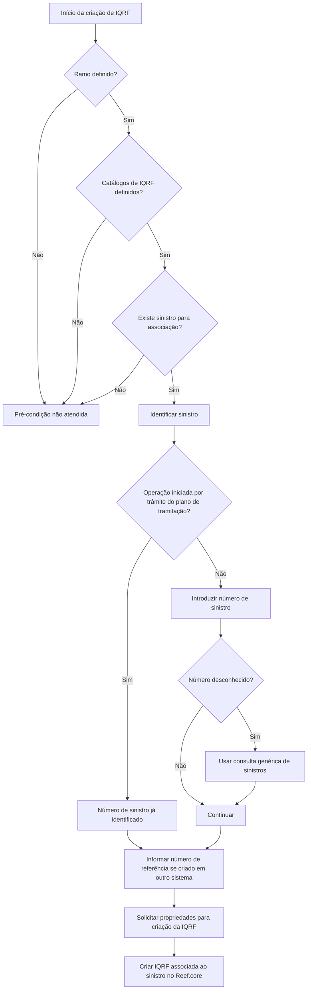

# Criação de IQRF para Sinistro no Reef.core

## 1. Metadados do Documento
- **Arquivo de Origem:** Não informado
- **Tipo de Documento:** Procedimento
- **Domínio / Sistema:** Reef.core — gestão de sinistros e IQRF
- **Público-Alvo:** Operação, analistas funcionais e utilizadores responsáveis pelo registo de IQRF
- **Data/Versão Identificada:** Não identificada

---

## 2. Resumo Executivo & Contexto de Negócio

O documento descreve a operação de criação de uma IQRF associada a um sinistro no sistema Reef.core. IQRF significa Incidência, Queixa, Reclamação e Felicitação, representando um registo vinculado ao contexto de um sinistro.

O objetivo declarado é identificar a informação mínima necessária para executar o registo da IQRF. A operação requer a identificação do sinistro que receberá a associação e a disponibilização das propriedades necessárias para a criação da IQRF.

Antes do registo, devem estar definidos o ramo, todos os catálogos de IQRF e um sinistro ao qual a IQRF possa ser associada. Essas pré-condições indicam dependências de dados mestres e de existência prévia de sinistro.

O processo permite informar tanto o número de sinistro no Reef.core quanto, quando aplicável, o número de referência do sinistro no sistema de origem. Se a operação for executada a partir de um trâmite do plano de tramitação, o número de sinistro já estará identificado.

---

## 3. Arquitetura, Componentes & Tecnologias Envolvidas

| Componente / Conceito | Papel identificado |
| :--- | :--- |
| **Reef.core** | Sistema no qual a IQRF é criada e associada ao sinistro. |
| **IQRF** | Registo de Incidência, Queixa, Reclamação e Felicitação associado a um sinistro. |
| **Sinistro** | Entidade à qual a IQRF será associada. |
| **Ramo** | Pré-condição que deve estar definida antes do registo da IQRF. |
| **Catálogos de IQRF** | Pré-condição; todos os catálogos devem estar definidos. |
| **Consulta genérica de sinistros** | Ajuda disponível para localizar um sinistro quando o número é desconhecido. |
| **Plano de tramitação** | Contexto no qual o número de sinistro pode já estar identificado. |
| **Sistema original** | Sistema externo ou anterior onde o sinistro pode ter sido criado. |



> **Nota de Análise:** O conteúdo não detalha interfaces, métodos HTTP, contratos JSON, persistência, autenticação ou integrações técnicas entre o Reef.core e o sistema original.

---

## 4. Regras de Negócio, Especificações Funcionais & Processos

### Objetivo da operação

A operação permite criar uma IQRF para um sinistro no Reef.core. O objetivo é conhecer a informação mínima necessária para realizar o registo.

### Pré-condições

1. O ramo deve estar definido antes do registo da IQRF.
2. Todos os catálogos de IQRF devem estar definidos antes do registo.
3. Deve existir um sinistro ao qual a IQRF possa ser associada.

### Processo de identificação do sinistro

1. Identificar o sinistro no qual a IQRF será registada.
2. Informar o número de sinistro ao qual a IQRF será associada.
3. Caso o número de sinistro seja desconhecido, utilizar a ajuda de consulta genérica de sinistros para localizar o sinistro.
4. Quando a operação for realizada a partir de um trâmite do plano de tramitação, o número de sinistro já estará identificado.
5. Caso o sinistro associado à IQRF tenha sido criado em outro sistema, pode ser informado o número de sinistro do sistema original como número de referência.
6. Solicitar as propriedades de criação da IQRF, conforme detalhadas no documento de propriedades referido pelo conteúdo.

### Restrições e limites de detalhe

- O documento informa que existem propriedades solicitadas para o registo da IQRF, mas não apresenta a lista dessas propriedades.
- O documento não especifica campos obrigatórios, formatos, regras de validação ou valores permitidos para os números de sinistro.
- O documento não detalha o comportamento em caso de sinistro inexistente, catálogos ausentes ou ramo não definido.

---

## 5. Tabelas de Parâmetros, Ambientes e Estruturas de Dados

| Item / Parâmetro | Descrição / Função | Tipo / Valores / Formato | Ambiente / Observações |
| :--- | :--- | :--- | :--- |
| IQRF | Registo de Incidência, Queixa, Reclamação e Felicitação. | Não especificado. | Criada para um sinistro no Reef.core. |
| Número de sinistro | Identifica o sinistro ao qual a IQRF será associada. | Não especificado. | Pode ser localizado por consulta genérica de sinistros. |
| Número de sinistro de referência | Identifica o sinistro no sistema original quando o sinistro foi criado em outro sistema. | Não especificado. | Preenchimento possível quando houver sistema original. |
| Ramo | Pré-condição necessária antes do registo da IQRF. | Não especificado. | Deve estar definido previamente. |
| Catálogos de IQRF | Dados de catálogo requeridos para registar uma IQRF. | Não especificado. | Todos devem estar definidos previamente. |
| Sinistro | Entidade à qual a IQRF será associada. | Não especificado. | Deve existir previamente. |
| Consulta genérica de sinistros | Ajuda para localizar um sinistro quando o utilizador desconhece o número. | Não especificado. | Disponível durante a identificação do sinistro. |
| Plano de tramitação | Contexto processual que pode fornecer o número de sinistro previamente identificado. | Não especificado. | Aplicável quando a operação é executada a partir de um trâmite. |
| Propriedades de criação da IQRF | Propriedades solicitadas para registar a IQRF. | Não detalhado no conteúdo fornecido. | O documento afirma que essas propriedades são detalhadas, mas não as lista. |

---

## 6. Bateria de Perguntas & Respostas para RAG (FAQ Sintético)

### P1: O que é uma IQRF no contexto do Reef.core?
**R:** IQRF significa Incidência, Queixa, Reclamação e Felicitação. No Reef.core, a operação descrita permite criar uma IQRF associada a um sinistro.

### P2: Qual é o objetivo do procedimento de criação de IQRF?
**R:** O objetivo é conhecer a informação mínima necessária para realizar a criação de uma IQRF associada a um sinistro no Reef.core.

### P3: Quais são as pré-condições para registar uma IQRF?
**R:** Antes do registo da IQRF, devem estar definidos o ramo, todos os catálogos de IQRF e um sinistro ao qual a IQRF possa ser associada.

### P4: Como o sinistro é identificado para associar uma IQRF?
**R:** Deve ser informado o número de sinistro ao qual a IQRF será associada. Quando o número for desconhecido, pode ser utilizada a ajuda de consulta genérica de sinistros para localizar o sinistro.

### P5: O que acontece se a criação da IQRF for iniciada a partir de um trâmite do plano de tramitação?
**R:** Quando a operação é realizada a partir de um trâmite do plano de tramitação, o número de sinistro já estará identificado.

### P6: Para que serve o número de sinistro de referência?
**R:** O número de sinistro de referência pode ser informado se o sinistro ao qual a IQRF será associada tiver sido criado em outro sistema. Nesse caso, representa o número do sinistro no sistema original.

### P7: É obrigatório informar o número de referência do sistema original?
**R:** O documento informa que o número de sinistro do sistema original poderá ser introduzido quando o sinistro tiver sido criado em outro sistema. Não são apresentados critérios adicionais de obrigatoriedade.

### P8: Quais propriedades devem ser fornecidas para criar uma IQRF?
**R:** O documento afirma que existem propriedades solicitadas para registar a IQRF, mas o conteúdo fornecido não apresenta os nomes, tipos, formatos ou obrigatoriedades dessas propriedades.

### P9: O documento especifica validações para o número de sinistro?
**R:** Não. O conteúdo informa que o número de sinistro deve ser introduzido e que há uma consulta genérica de sinistros, mas não especifica formato, validações ou tratamento para sinistro inexistente.

### P10: O procedimento descreve contratos técnicos ou APIs para criação de IQRF?
**R:** Não. O conteúdo não detalha métodos HTTP, endpoints, contratos JSON, tecnologias de integração ou interfaces técnicas para criação da IQRF.

---

## 7. Glossário de Termos, Siglas & Conceitos-Chave

- **IQRF:** Incidência, Queixa, Reclamação e Felicitação.
- **Reef.core:** Sistema no qual a IQRF é criada para um sinistro.
- **Sinistro:** Entidade associada à ocorrência tratada pela IQRF.
- **Ramo:** Elemento que deve estar definido antes do registo da IQRF.
- **Catálogos de IQRF:** Conjunto de catálogos que deve estar previamente definido para permitir o registo.
- **Plano de tramitação:** Contexto de tramitação no qual o número de sinistro pode estar previamente identificado.
- **Sistema original:** Sistema no qual o sinistro pode ter sido criado antes da associação da IQRF no Reef.core.

---

## 8. Notas Críticas, Riscos & Limitações

- O nome do arquivo, a versão e a data do documento não foram informados.
- O conteúdo não apresenta as propriedades necessárias para a criação da IQRF, apesar de afirmar que elas são detalhadas no documento.
- Não há especificação de formatos, tamanhos, obrigatoriedade ou regras de validação para o número de sinistro e o número de sinistro de referência.
- Não foram descritos critérios de erro, mensagens operacionais, perfis de acesso ou fluxos de exceção.
- Não há detalhamento técnico sobre APIs, endpoints, contratos de dados, bases de dados, logs ou integrações.
- Não é possível determinar, a partir do conteúdo, se o número de sinistro de referência é obrigatório em cenários de integração com outro sistema.

---

## 9. Conteúdo Bruto Estruturado (Referência Fiel)

```text
--- [PÁGINA 1 DE 2] ---

CREAR I.Q.R.F. Siniestro
¿En que consiste?
Esta operación permite crear una IQRF (Incidencia, Queja, Reclamación y Felicitación) para un
siniestro en Reef.core.
Objetivo
Conocer la información mínima necesaria con la que poder realizar la operación.
Premisas
Previo al registro de la IQRF, es necesario que se haya definido el ramo, todos los catálogos de IQRF
y un siniestro al que poder asociarle dicha IQRF.
Proceso a seguir
Se identifica el siniestro al que se le va a registrar la IQRF.
 /
 CF
Home Solutions APIs Documentation Zeus
EN


--- [PÁGINA 2 DE 2] ---

Identificar Siniestro
Número de siniestro (  )
Se deberá introducir el número de siniestro al que se le va a asociar la IQRF.
Tendrá una ayuda a la consulta genérica de siniestros para poder ubicar el siniestro en caso de
desconocerlo.
Si esta operación se realiza desde un trámite del plan de tramitación, el número de siniestro ya
estará identificado.
Número de siniestro de referencia( )
Si el siniestro al que vamos a asociar una IQRF, se creó en otro sistema, se podrá introducir el
número de siniestro del sistema original.
Propiedades de la creación de la IQRF
En este documento se detallan todas las propiedades que se van a solicitar para registrar una IQRF.
```
