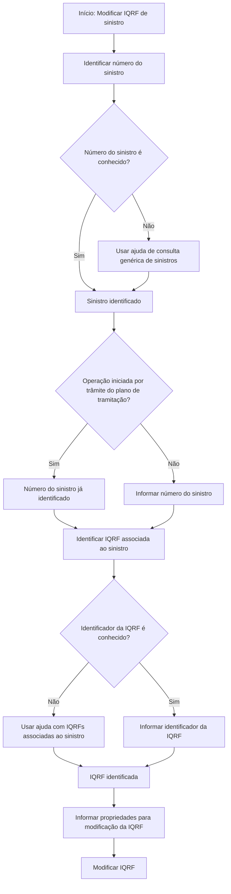

# Modificação de IQRF de Sinistro no Reef.core

## 1. Metadados do Documento
- **Arquivo de Origem:** Não identificado
- **Tipo de Documento:** Procedimento
- **Domínio / Sistema:** Reef.core — gestão de sinistros e IQRF
- **Público-Alvo:** Operação, Negócio e usuários de APIs/documentação
- **Data/Versão Identificada:** Não identificada

---

## 2. Resumo Executivo & Contexto de Negócio

O documento descreve a operação **“Modificar I.Q.R.F. Siniestro”**, destinada à modificação de uma IQRF associada a um sinistro no sistema **Reef.core**. IQRF é definida no próprio documento como **Incidência, Queja, Reclamación y Felicitación**.

O objetivo declarado é apresentar a informação mínima necessária para executar a modificação de uma IQRF. A operação depende da identificação prévia do sinistro e da IQRF que será alterada.

Como premissas operacionais, o documento exige que o ramo esteja definido, que todos os catálogos de IQRF estejam disponíveis e que exista um sinistro associado a uma IQRF. Sem esses elementos, o procedimento não é apresentado como executável.

O fluxo funcional consiste em identificar o sinistro, localizar ou informar a IQRF associada e fornecer propriedades para a modificação. O documento menciona suporte a chaves de referência quando o sinistro ou a IQRF tiverem sido criados em outro sistema.

---

## 3. Arquitetura, Componentes & Tecnologias Envolvidas

Os componentes, sistemas e elementos explicitamente citados são:

| Componente / Elemento | Papel identificado no documento |
| :--- | :--- |
| Reef.core | Sistema no qual ocorre a modificação da IQRF de um sinistro. |
| Sinistro | Entidade que deve ser identificada para localizar a IQRF a ser modificada. |
| IQRF | Entidade associada ao sinistro e objeto da operação de modificação. |
| Ramo | Elemento que deve estar definido como premissa da operação. |
| Catálogos de IQRF | Catálogos que devem estar definidos para permitir a operação. |
| Plano de tramitação | Contexto no qual o número do sinistro pode já estar identificado. |
| Outro sistema | Sistema de origem possível de um sinistro ou de uma IQRF, identificado por chave de referência. |
| Home Solutions APIs Documentation Zeus | Texto de referência exibido no conteúdo bruto; o documento não detalha a função técnica desse elemento. |



**Nota de Análise:** O documento não detalha métodos HTTP, contratos JSON, serviços, bancos de dados, autenticação, endpoints, mensagens de erro ou implementação técnica da operação.

---

## 4. Regras de Negócio, Especificações Funcionais & Processos

### Premissas para modificação de IQRF

1. O **ramo** deve estar definido.
2. Todos os **catálogos de IQRF** devem estar definidos.
3. Deve existir um **sinistro associado a uma IQRF**.
4. A IQRF a ser modificada deve ser localizada por seu identificador ou pela ajuda de IQRFs associadas ao sinistro informado.

### Processo funcional

1. Identificar o sinistro cuja IQRF será modificada.
2. Informar ou obter o **número de sinistro**.
3. Caso o número de sinistro seja desconhecido, utilizar a ajuda de consulta genérica de sinistros.
4. Se a operação for realizada a partir de um trâmite do plano de tramitação, o número de sinistro já estará identificado.
5. Informar o **número de sinistro de referência** se o sinistro associado à IQRF tiver sido criado em outro sistema.
6. Informar o **identificador da IQRF**.
7. Caso o identificador da IQRF seja desconhecido, utilizar a ajuda que lista todas as IQRFs associadas ao sinistro informado.
8. Informar o **identificador de referência da IQRF** se a IQRF tiver sido gerada em outro sistema.
9. Fornecer as propriedades necessárias para a modificação da IQRF.

### Restrições e ausência de detalhamento

- O documento declara que detalha as propriedades solicitadas para modificar uma IQRF, mas o conteúdo fornecido não lista essas propriedades.
- O documento não define validações de formato, obrigatoriedade, tamanho ou domínio de valores dos identificadores.
- O documento não descreve o comportamento esperado quando não há IQRF associada ao sinistro informado.
- O documento não especifica o resultado da modificação, persistência, auditoria ou retorno da operação.

---

## 5. Tabelas de Parâmetros, Ambientes e Estruturas de Dados

| Item / Parâmetro | Descrição / Função | Tipo / Valores / Formato | Ambiente / Observações |
| :--- | :--- | :--- | :--- |
| Número de sinistro | Identifica o sinistro cuja IQRF será modificada. | Não especificado. | Possui ajuda para consulta genérica de sinistros quando o número for desconhecido. Pode já estar identificado se a operação ocorrer a partir de um trâmite do plano de tramitação. |
| Número de sinistro de referência | Registra a chave do sistema de origem quando o sinistro associado à IQRF foi criado em outro sistema. | Não especificado. | Aplicável a sinistros criados em outro sistema. |
| Identificador da IQRF | Identifica a IQRF que será modificada. | Não especificado. | Se desconhecido, existe ajuda com todas as IQRFs associadas ao sinistro informado. |
| Identificador de referência da IQRF | Registra a chave do sistema que originou a IQRF. | Não especificado. | Aplicável quando a IQRF foi gerada em outro sistema. |
| Ramo | Premissa necessária para a execução da operação. | Não especificado. | Deve estar definido. |
| Catálogos de IQRF | Conjunto de catálogos necessário para a operação. | Não especificado. | Todos os catálogos de IQRF devem estar definidos. |
| Sinistro associado a IQRF | Relação necessária entre as entidades de sinistro e IQRF. | Não especificado. | Deve existir antes da modificação. |
| Propriedades da modificação da IQRF | Informações solicitadas para alterar uma IQRF. | Não especificado no conteúdo fornecido. | O documento afirma que essas propriedades são detalhadas, porém a listagem não está presente no extrato. |

---

## 6. Bateria de Perguntas & Respostas para RAG (FAQ Sintético)

### P1: Qual é o objetivo da operação “Modificar I.Q.R.F. Siniestro”?
**R:** A operação permite modificar uma IQRF — Incidência, Queja, Reclamación y Felicitación — associada a um sinistro no sistema Reef.core. O objetivo do documento é apresentar a informação mínima necessária para realizar essa modificação.

### P2: Quais são as premissas para modificar uma IQRF de sinistro no Reef.core?
**R:** O ramo deve estar definido, todos os catálogos de IQRF devem estar definidos e deve existir um sinistro associado a uma IQRF.

### P3: Como identificar o sinistro cuja IQRF será modificada?
**R:** Deve-se informar o número de sinistro. Caso o número seja desconhecido, a operação disponibiliza uma ajuda para consulta genérica de sinistros. Se a operação for executada a partir de um trâmite do plano de tramitação, o número do sinistro já estará identificado.

### P4: Para que serve o número de sinistro de referência?
**R:** O número de sinistro de referência permite informar a chave do sistema de origem quando o sinistro ao qual a IQRF será associada foi criado em outro sistema.

### P5: Como localizar uma IQRF quando o identificador da IQRF é desconhecido?
**R:** Quando o identificador da IQRF for desconhecido, existe uma ajuda que apresenta todas as IQRFs associadas ao sinistro informado.

### P6: Qual é a finalidade do identificador de referência da IQRF?
**R:** O identificador de referência da IQRF permite informar a chave do sistema que originou a IQRF quando a IQRF tiver sido gerada em outro sistema.

### P7: O documento define o formato do número de sinistro ou do identificador da IQRF?
**R:** Não. O conteúdo fornecido menciona o número de sinistro, o número de sinistro de referência, o identificador da IQRF e o identificador de referência da IQRF, mas não informa formatos, tipos de dados, tamanhos ou regras de validação.

### P8: Quais propriedades devem ser fornecidas para modificar uma IQRF?
**R:** O documento informa que existem propriedades solicitadas para a modificação da IQRF, mas o conteúdo fornecido não apresenta a relação dessas propriedades.

### P9: A operação pode tratar sinistros ou IQRFs originados em outros sistemas?
**R:** Sim. O documento prevê o número de sinistro de referência para sinistros criados em outro sistema e o identificador de referência da IQRF para IQRFs geradas em outro sistema.

### P10: O documento especifica endpoints, métodos HTTP ou contratos JSON para a operação de modificação?
**R:** Não. O conteúdo fornecido descreve o processo funcional e os campos de identificação, mas não detalha endpoints, métodos HTTP, contratos JSON, respostas, códigos de erro ou tecnologias de integração.

---

## 7. Glossário de Termos, Siglas & Conceitos-Chave

- **IQRF:** Incidência, Queja, Reclamación y Felicitación.
- **Sinistro:** Entidade que deve ser identificada para localizar e modificar a IQRF associada.
- **Reef.core:** Sistema citado como contexto da operação de modificação de IQRF de sinistro.
- **Ramo:** Elemento que deve estar definido como premissa para realizar a operação.
- **Catálogos de IQRF:** Catálogos que devem estar definidos para permitir a modificação de IQRF.
- **Plano de tramitação:** Contexto de trâmite no qual o número do sinistro pode estar previamente identificado.
- **Número de sinistro de referência:** Chave do sistema de origem de um sinistro criado em outro sistema.
- **Identificador de referência da IQRF:** Chave do sistema que originou uma IQRF gerada em outro sistema.

---

## 8. Notas Críticas, Riscos & Limitações

- **Nota de Análise:** O documento não identifica o arquivo de origem, versão, data, autor ou responsável pela manutenção.
- **Nota de Análise:** O documento não especifica quais propriedades efetivamente podem ser alteradas na IQRF.
- **Nota de Análise:** Não há definição dos formatos, regras de obrigatoriedade ou critérios de validação para os campos apresentados.
- **Nota de Análise:** O conteúdo não descreve comportamento de erro para sinistro inexistente, IQRF inexistente, ausência de associação entre sinistro e IQRF ou referências externas inválidas.
- **Nota de Análise:** O documento cita Reef.core e “Home Solutions APIs Documentation Zeus”, mas não detalha arquitetura técnica, integração, autenticação, endpoints ou contratos de interface.
- **Risco operacional:** A inexistência, indefinição ou indisponibilidade do ramo, dos catálogos de IQRF ou da associação entre sinistro e IQRF impede a execução da operação conforme as premissas documentadas.

---

## 9. Conteúdo Bruto Estruturado (Referência Fiel)

```text
--- [PÁGINA 1 DE 2] ---

MODIFICAR I.Q.R.F. Siniestro
¿En que consiste?
Esta operación permite modificar una IQRF (Incidencia, Queja, Reclamación y Felicitación) de un
siniestro de Reef.core.
Objetivo
Conocer la información mínima necesaria con la que poder realizar la operación.
Premisas
Para poder realizar esta operación es necesario que se haya definido el ramo, y todos los catálogos
de IQRF y un siniestro que esté asociado a una IQRF.
Proceso a seguir
Se identifica el siniestro al que se le va a modificar la IQRF para poder modificar la IQRF
posteriormente.
 /
 CF
Home Solutions APIs Documentation Zeus
EN


--- [PÁGINA 2 DE 2] ---

Identificar IQRF a Modificar
Número de siniestro (  )
Se deberá introducir el número de siniestro al que se le va a modificar la IQRF. Tendrá una ayuda a la
consulta genérica de siniestros para poder ubicar el siniestro en caso de desconocerlo. Si esta
operación se realiza desde un trámite del plan de tramitación, el número de siniestro ya estará
identificado.
Número de siniestro de referencia( )
En esta propiedad si el siniestro al que vamos a asociar una IQRF, se creó en otro sistema, se podrá
introducir la clave del sistema que original.
Identificador de la IQRF (  )
En esta propiedad se registrará el identificador de la IQRF.
Si se desconoce habrá una ayuda de todas las IQRF's asociadas al siniestro introducido.
Identificador de referencia de la IQRF
En esta propiedad si la IQRF se generó desde otro sistema, se podrá introducir la clave del sistema
que la originó.
Propiedades de la modificación de la IQRF
En este documento se detallan todas las propiedades que se van a solicitar para modificar una
IQRF.
```
