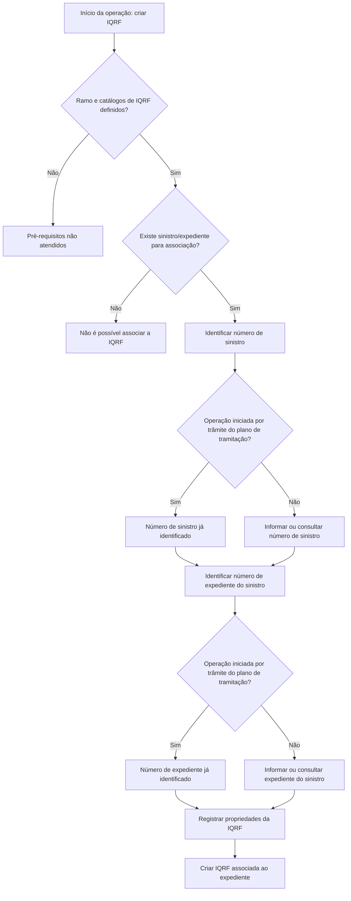

# Criação de IQRF Associada a Expediente REEF.core

## 1. Metadados do Documento
- **Arquivo de Origem:** `Não identificado`
- **Tipo de Documento:** `Procedimento`
- **Domínio / Sistema:** `REEF.core / IQRF`
- **Público-Alvo:** `Operação, Negócio, Desenvolvedores`
- **Data/Versão Identificada:** `Não identificada`

---

## 2. Resumo Executivo & Contexto de Negócio

O documento descreve a operação de criação de uma IQRF — Incidência, Queja, Reclamación y Felicitación — associada a um expediente no sistema REEF.core. A operação exige a identificação prévia de um sinistro e do expediente correspondente.

O objetivo declarado é conhecer a informação mínima necessária para realizar a operação. Para registrar uma IQRF, o ramo deve estar definido, os catálogos de IQRF devem existir e deve haver um sinistro/expediente disponível para associação.

O fluxo operacional começa pela identificação do expediente ao qual a IQRF será vinculada. O usuário informa o número do sinistro e, em seguida, o número de expediente pertencente ao sinistro previamente informado.

Quando a operação é iniciada a partir de um trâmite do plano de tramitação, os números de sinistro e expediente já estarão identificados. O procedimento também permite informar um número de sinistro de referência quando o sinistro tiver sido criado em outro sistema.

---

## 3. Arquitetura, Componentes & Tecnologias Envolvidas

Os componentes e conceitos explicitamente citados são:

- **REEF.core:** sistema no qual a IQRF é associada a um expediente.
- **IQRF:** registro de Incidência, Queja, Reclamación y Felicitación.
- **Siniestro:** sinistro a ser associado à IQRF.
- **Expediente:** expediente pertencente ao sinistro e destinatário da associação da IQRF.
- **Catálogos de IQRF:** dados de referência que devem estar definidos antes da operação.
- **Plano de tramitação:** contexto que pode fornecer previamente os identificadores de sinistro e expediente.
- **Sistema original:** sistema externo no qual o sinistro pode ter sido criado.



> **Nota de Análise:** O documento não detalha métodos HTTP, contratos JSON, interfaces, tecnologias de implementação, persistência de dados ou integrações técnicas entre REEF.core e outros sistemas.

---

## 4. Regras de Negócio, Especificações Funcionais & Processos

### Pré-requisitos para criação de IQRF

1. O **ramo** deve estar definido.
2. Todos os **catálogos de IQRF** devem estar definidos.
3. Deve existir um **sinistro/expediente** ao qual a IQRF possa ser associada.

### Processo de identificação e associação

1. Identificar o expediente ao qual a IQRF será associada.
2. Informar o número de sinistro para o qual será criada a associação.
3. Caso o número de sinistro seja desconhecido, utilizar a ajuda de consulta genérica de sinistros.
4. Se a operação for executada a partir de um trâmite do plano de tramitação, considerar que o número de sinistro já estará identificado.
5. Informar o número de expediente pertencente ao sinistro informado anteriormente.
6. Caso seja necessário localizar o expediente, utilizar a ajuda de consulta dos expedientes relacionados ao sinistro previamente informado.
7. Se a operação for executada a partir de um trâmite do plano de tramitação, considerar que o número de expediente já estará identificado.
8. Quando o sinistro associado à IQRF tiver sido criado em outro sistema, informar opcionalmente o número de sinistro do sistema original.
9. Registrar as propriedades solicitadas para a IQRF no expediente.

### Restrições e condições

- O número de expediente deve corresponder ao sinistro informado anteriormente.
- A consulta de expedientes depende da identificação prévia do sinistro.
- O número de sinistro de referência aplica-se somente quando o sinistro foi criado em outro sistema.
- O documento informa que detalhará as propriedades solicitadas para registrar a IQRF, mas o conteúdo fornecido não apresenta essas propriedades.

---

## 5. Tabelas de Parâmetros, Ambientes e Estruturas de Dados

| Item / Parâmetro | Descrição / Função | Tipo / Valores / Formato | Ambiente / Observações |
| :--- | :--- | :--- | :--- |
| IQRF | Registro de Incidência, Queja, Reclamación y Felicitación associado a um expediente. | Não detalhado. | REEF.core. |
| Ramo | Pré-requisito que deve estar definido antes da criação da IQRF. | Não detalhado. | Obrigatório como premissa. |
| Catálogos de IQRF | Catálogos necessários para suportar a criação de IQRF. | Não detalhado. | Todos devem estar definidos. |
| Número de sinistro | Identifica o sinistro ao qual a IQRF será associada. | Não detalhado. | Pode ser consultado por ajuda genérica de sinistros; já identificado quando originado em trâmite do plano de tramitação. |
| Número de expediente | Identifica o expediente do sinistro ao qual a IQRF será associada. | Não detalhado. | Deve pertencer ao sinistro informado; pode ser consultado entre os expedientes do sinistro. |
| Número de sinistro de referência | Identificador do sinistro no sistema original. | Não detalhado. | Aplicável quando o sinistro foi criado em outro sistema. |
| Plano de tramitação | Contexto de processo que pode preencher previamente identificadores. | Não detalhado. | Pode identificar previamente sinistro e expediente. |
| Propriedades da IQRF | Dados solicitados para registrar uma IQRF em um expediente. | Não detalhado no conteúdo fornecido. | O documento menciona a seção, sem apresentar a lista de propriedades. |

---

## 6. Bateria de Perguntas & Respostas para RAG (FAQ Sintético)

### P1: O que é uma IQRF no contexto do REEF.core?
**R:** IQRF significa Incidência, Queja, Reclamación y Felicitación. A operação descrita permite criar uma IQRF e associá-la a um expediente no sistema REEF.core.

### P2: Quais são os pré-requisitos para criar uma IQRF em um expediente?
**R:** É necessário que o ramo esteja definido, que todos os catálogos de IQRF estejam definidos e que exista um sinistro/expediente disponível para associação da IQRF.

### P3: Qual é o primeiro passo do processo de criação de IQRF?
**R:** O primeiro passo é identificar o expediente ao qual a IQRF será associada. Essa identificação ocorre por meio do número de sinistro e do número de expediente correspondente.

### P4: Como localizar um sinistro quando o número de sinistro é desconhecido?
**R:** O documento informa que o campo de número de sinistro possui uma ajuda para consulta genérica de sinistros, permitindo localizar o sinistro quando o identificador não é conhecido.

### P5: Como é selecionado o expediente para associação da IQRF?
**R:** Deve-se informar o número de expediente pertencente ao sinistro informado anteriormente. O campo possui ajuda de consulta dos expedientes relacionados ao sinistro previamente selecionado.

### P6: O que acontece quando a criação da IQRF é iniciada a partir de um trâmite do plano de tramitação?
**R:** Quando a operação é realizada a partir de um trâmite do plano de tramitação, o número de sinistro e o número de expediente já estarão identificados.

### P7: Para que serve o número de sinistro de referência?
**R:** O número de sinistro de referência permite registrar o identificador do sinistro no sistema original quando o sinistro ao qual a IQRF será associada foi criado em outro sistema.

### P8: O número de expediente pode ser informado sem um número de sinistro?
**R:** O processo descrito exige primeiro informar ou identificar o número de sinistro. O número de expediente deve ser do sinistro introduzido anteriormente, e sua consulta depende desse sinistro.

### P9: Quais propriedades da IQRF devem ser preenchidas no registro?
**R:** O conteúdo fornecido apenas informa que existem propriedades solicitadas para registrar uma IQRF em um expediente. A lista de propriedades, seus formatos, obrigatoriedade e regras de validação não foi apresentada.

### P10: O documento descreve APIs, URLs ou contratos de integração para criação de IQRF?
**R:** Não. O conteúdo fornecido descreve o procedimento funcional de identificação de sinistro e expediente, mas não detalha APIs, métodos HTTP, URLs, contratos JSON, autenticação ou integrações técnicas.

---

## 7. Glossário de Termos, Siglas & Conceitos-Chave

- **IQRF:** Incidência, Queja, Reclamación y Felicitación.
- **REEF.core:** Sistema no qual ocorre a associação da IQRF a um expediente.
- **Sinistro:** Entidade identificada pelo número de sinistro, utilizada para localizar e relacionar um expediente.
- **Expediente:** Registro associado a um sinistro e utilizado como destino da associação da IQRF.
- **Ramo:** Pré-requisito que deve estar definido para realizar a operação.
- **Catálogos de IQRF:** Catálogos que devem estar definidos antes da criação da IQRF.
- **Plano de tramitação:** Contexto de trâmite no qual os números de sinistro e expediente podem estar previamente identificados.
- **Sistema original:** Sistema no qual um sinistro pode ter sido criado antes de sua referência na operação de IQRF.

---

## 8. Notas Críticas, Riscos & Limitações

- O nome do arquivo de origem, a data e a versão do documento não foram identificados no conteúdo fornecido.
- O documento não especifica as propriedades necessárias para registrar a IQRF, apesar de anunciar uma seção para esse fim.
- Não há definição de obrigatoriedade, formatos, tamanhos, domínios de valores ou mensagens de validação dos campos.
- Não há detalhamento de tecnologias, APIs, métodos HTTP, contratos JSON, autenticação, URLs, ambientes, servidores ou rotas de logs.
- O documento não descreve o comportamento em caso de sinistro inexistente, expediente incompatível, catálogos ausentes ou falha na criação da IQRF.
- O número de expediente depende do sinistro previamente identificado, mas o conteúdo não explica como o sistema valida essa relação.

---

## 9. Conteúdo Bruto Estruturado (Referência Fiel)

```text
--- [PÁGINA 1 DE 2] ---

CREAR I.Q.R.F. Expediente
¿En que consiste?
Esta operación permite crear una IQRF (Incidencia, Queja, Reclamación y Felicitación) para un
expediente Reef.core.
Objetivo
Conocer la información mínima necesaria con la que poder realizar la operación.
Premisas
Para poder realizar esta operación es necesario que se haya definido el ramo, y todos los catálogos
de IQRF y un siniestro/expediente al que poder asociarle dicha IQRF.
Proceso a seguir
Se identifica el expediente al que se le va a asociar la IQRF para posteriormente crear la IQRF.
 / 
 CF
Home Solutions APIs Documentation Zeus
EN


--- [PÁGINA 2 DE 2] ---

Identificar Siniestro y Expediente
Número de siniestro (  )
Se deberá introducir el número de siniestro al que se le va a asociar la IQRF. Tendrá una ayuda a la
consulta genérica de siniestros para poder ubicar el siniestro en caso de desconocerlo. Si esta
operación se realiza desde un trámite del plan de tramitación, el número de siniestro ya estará
identificado.
Número de expediente (  )
Se deberá introducir el número de expediente del siniestro introducido anteriormente, al que se le va
a asociar la IQRF.
Tendrá como ayuda los de expedientes del siniestro que se ha ingresado previamente.
Si esta operación se realiza desde un trámite del plan de tramitación, el número de expediente ya
estará identificado.
Número de siniestro de referencia( )
Si el siniestro al que vamos a asociar una IQRF, se creó en otro sistema, se podrá introducir el
número de siniestro del sistema original.
Propiedades de la creación de la IQRF
En este documento se detallan todas las propiedades que se van a solicitar para registrar una IQRF
a un Expediente.
```
