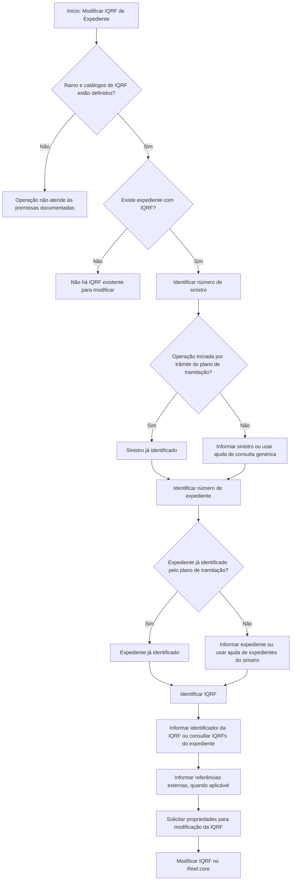

# Modificação de I.Q.R.F. em Expediente no Reef.core

## 1. Metadados do Documento
- **Arquivo de Origem:** Não identificado
- **Tipo de Documento:** Procedimento
- **Domínio / Sistema:** Reef.core — gestão de sinistros e expedientes
- **Público-Alvo:** Operação, analistas funcionais e utilizadores responsáveis por sinistros/expedientes
- **Data/Versão Identificada:** Não identificada

---

## 2. Resumo Executivo & Contexto de Negócio

O documento descreve a operação **“Modificar I.Q.R.F. Expediente”** no sistema **Reef.core**. A operação permite alterar uma IQRF associada a um expediente. IQRF é apresentada no documento como **Incidencia, Queja, Reclamación y Felicitación**.

O objetivo declarado é conhecer a informação mínima necessária para executar a modificação de uma IQRF. O processo exige a identificação prévia do sinistro e do expediente que contém a IQRF a ser alterada.

Como premissas, o documento determina que o ramo deve estar definido, que todos os catálogos de IQRF devem existir e que deve haver um expediente com uma IQRF previamente registada para que seja possível modificá-la.

A identificação pode ser facilitada quando a operação é executada a partir de um trâmite do plano de tramitação: nesse cenário, os números do sinistro e do expediente já estarão identificados. O documento também prevê referências para entidades criadas em sistemas de origem externos.

---

## 3. Arquitetura, Componentes & Tecnologias Envolvidas

Os elementos explicitamente mencionados são:

- **Reef.core:** sistema no qual a operação de modificação da IQRF é realizada.
- **Sinistro:** entidade inicial de identificação para localizar o expediente.
- **Expediente:** entidade pertencente ao sinistro e portadora da IQRF a ser modificada.
- **IQRF:** Incidencia, Queja, Reclamación y Felicitación associada ao expediente.
- **Plano de tramitação:** contexto opcional no qual sinistro e expediente já podem estar identificados.
- **Sistema original:** sistema externo no qual o sinistro ou a IQRF podem ter sido criados.
- **Catálogos de IQRF:** dados de referência que devem estar definidos antes da operação.



> **Nota de Análise:** O documento não detalha métodos HTTP, contratos JSON, APIs, tecnologias de infraestrutura, persistência de dados, mecanismos de autenticação ou os campos concretos alteráveis da IQRF.

---

## 4. Regras de Negócio, Especificações Funcionais & Processos

### 4.1 Objetivo da operação
A operação permite modificar a IQRF de um expediente no Reef.core. A finalidade documental é identificar a informação mínima necessária para realizar a operação.

### 4.2 Premissas obrigatórias
A modificação de IQRF requer simultaneamente:

1. Definição prévia do **ramo**.
2. Definição de todos os **catálogos de IQRF**.
3. Existência de um **expediente** que já possua uma **IQRF**.
4. Identificação do sinistro e do expediente aos quais a IQRF pertence.

### 4.3 Processo operacional
1. Identificar o sinistro ao qual pertence o expediente.
2. Identificar o expediente do sinistro.
3. Identificar a IQRF existente no expediente.
4. Informar referências externas do sinistro ou da IQRF, quando as entidades tiverem sido originadas em outro sistema.
5. Solicitar as propriedades necessárias para modificar a IQRF.
6. Executar a modificação da IQRF no expediente identificado.

### 4.4 Regras de identificação do sinistro
- O utilizador deve introduzir o número do sinistro cuja IQRF será modificada.
- Existe ajuda para consulta genérica de sinistros quando o número do sinistro for desconhecido.
- Quando a operação for iniciada a partir de um trâmite do plano de tramitação, o número do sinistro já estará identificado.
- Caso o sinistro tenha sido criado em outro sistema, pode ser informada a chave do sistema original no campo de número de sinistro de referência.

### 4.5 Regras de identificação do expediente
- O utilizador deve informar o número do expediente pertencente ao sinistro introduzido.
- Existe ajuda para consulta de expedientes do sinistro.
- Quando a operação for iniciada a partir de um trâmite do plano de tramitação, o número do expediente já estará identificado.

### 4.6 Regras de identificação da IQRF
- O identificador da IQRF deve ser registado para localizar a IQRF a modificar.
- Quando o identificador da IQRF for desconhecido, existe ajuda com todas as IQRFs do expediente informado.
- Caso a IQRF tenha sido gerada em outro sistema, pode ser informada a chave do sistema que originou a IQRF no identificador de referência.

### 4.7 Propriedades de modificação
O documento afirma que serão solicitadas propriedades para modificar a IQRF, mas não lista quais propriedades, formatos, obrigatoriedades, regras de validação ou valores permitidos.

> **Nota de Análise:** Não há detalhamento adicional das propriedades modificáveis da IQRF no conteúdo fornecido.

---

## 5. Tabelas de Parâmetros, Ambientes e Estruturas de Dados

| Item / Parâmetro | Descrição / Função | Tipo / Valores / Formato | Ambiente / Observações |
| :--- | :--- | :--- | :--- |
| Número de sinistro | Identifica o sinistro cuja IQRF será modificada. | Número de sinistro; formato não especificado. | Pode ser localizado por ajuda de consulta genérica de sinistros. Já estará identificado quando a operação vier de um trâmite do plano de tramitação. |
| Número de expediente | Identifica o expediente do sinistro no qual a IQRF será modificada. | Número de expediente; formato não especificado. | Possui ajuda de consulta de expedientes do sinistro. Já estará identificado quando a operação vier de um trâmite do plano de tramitação. |
| Número de sinistro de referência | Regista a chave do sistema original quando o sinistro foi criado em outro sistema. | Chave de sistema original; formato não especificado. | Aplicável somente a sinistros originados externamente. |
| Identificador da IQRF | Identifica a IQRF do expediente que será alterada. | Identificador de IQRF; formato não especificado. | Quando desconhecido, existe ajuda com todas as IQRFs do expediente informado. |
| Identificador de referência da IQRF | Regista a chave do sistema que originou a IQRF. | Chave de sistema de origem; formato não especificado. | Aplicável quando a IQRF foi gerada por outro sistema. |
| Ramo | Pré-requisito para realizar a operação de modificação. | Não especificado. | Deve estar definido antes da operação. |
| Catálogos de IQRF | Dados de referência necessários para a operação. | Não especificado. | Todos os catálogos de IQRF devem estar definidos. |
| Propriedades de modificação da IQRF | Dados solicitados para efetivar a alteração da IQRF. | Não especificado. | O documento afirma que serão solicitadas, mas não enumera os campos. |

---

## 6. Bateria de Perguntas & Respostas para RAG (FAQ Sintético)

### P1: O que é a operação “Modificar I.Q.R.F. Expediente” no Reef.core?
**R:** É uma operação do Reef.core que permite modificar a IQRF de um expediente. IQRF significa Incidencia, Queja, Reclamación y Felicitación.

### P2: Quais são as premissas para modificar uma IQRF de um expediente?
**R:** É necessário que o ramo esteja definido, que todos os catálogos de IQRF estejam definidos e que exista um expediente com uma IQRF já registada para poder ser modificada.

### P3: Quais entidades devem ser identificadas antes de modificar uma IQRF?
**R:** O processo requer a identificação do sinistro, do expediente pertencente ao sinistro e da IQRF associada ao expediente.

### P4: O que fazer quando o número do sinistro é desconhecido?
**R:** O documento informa que existe uma ajuda de consulta genérica de sinistros para localizar o sinistro quando o utilizador não conhece o seu número.

### P5: O número do sinistro precisa ser informado em operações iniciadas pelo plano de tramitação?
**R:** Não necessariamente. Quando a operação é realizada a partir de um trâmite do plano de tramitação, o número do sinistro já estará identificado.

### P6: Como localizar o expediente de um sinistro para modificar uma IQRF?
**R:** Deve ser informado o número do expediente associado ao sinistro previamente introduzido. O documento também disponibiliza uma ajuda de consulta de expedientes do sinistro.

### P7: O que ocorre com o número do expediente em um trâmite do plano de tramitação?
**R:** Quando a operação é executada a partir de um trâmite do plano de tramitação, o número do expediente já estará identificado.

### P8: Para que serve o número de sinistro de referência?
**R:** O número de sinistro de referência permite informar a chave do sistema original quando o sinistro cuja IQRF será modificada foi criado em outro sistema.

### P9: Como identificar a IQRF quando o seu identificador é desconhecido?
**R:** O documento indica que existe uma ajuda contendo todas as IQRFs do expediente informado, permitindo selecionar ou localizar a IQRF a modificar.

### P10: Para que serve o identificador de referência da IQRF?
**R:** O identificador de referência da IQRF permite informar a chave do sistema que originou a IQRF quando ela foi gerada em outro sistema.

### P11: O documento especifica quais propriedades da IQRF podem ser modificadas?
**R:** Não. O documento apenas afirma que serão solicitadas propriedades para modificar a IQRF, sem detalhar os nomes dos campos, formatos, valores permitidos ou regras de validação.

### P12: O documento descreve APIs ou contratos técnicos para a modificação de IQRF?
**R:** Não. O conteúdo fornecido não apresenta métodos HTTP, endpoints, contratos JSON, URLs, tecnologias de integração ou especificações de API.

---

## 7. Glossário de Termos, Siglas & Conceitos-Chave

- **IQRF:** Incidencia, Queja, Reclamación y Felicitación; entidade associada a um expediente e passível de modificação no Reef.core.
- **Reef.core:** sistema no qual a operação de modificação da IQRF é realizada.
- **Sinistro:** entidade que deve ser identificada para localizar o expediente cuja IQRF será modificada.
- **Expediente:** entidade associada ao sinistro que contém a IQRF a modificar.
- **Ramo:** elemento que deve estar definido como premissa da operação.
- **Catálogos de IQRF:** catálogos que devem estar definidos antes da execução da operação.
- **Plano de tramitação:** contexto de trâmite que pode fornecer previamente a identificação do sinistro e do expediente.
- **Sistema original:** sistema externo no qual o sinistro ou a IQRF podem ter sido criados.
- **Ajuda de consulta genérica de sinistros:** recurso de consulta usado para localizar um sinistro cujo número é desconhecido.
- **Ajuda de expedientes do sinistro:** recurso de consulta usado para localizar expedientes associados ao sinistro informado.

---

## 8. Notas Críticas, Riscos & Limitações

- O documento não informa quais propriedades específicas da IQRF podem ser modificadas.
- Não são descritas validações, mensagens de erro, obrigatoriedades de campos, perfis de acesso ou permissões.
- Não há definição dos formatos dos números de sinistro, números de expediente, identificadores IQRF ou chaves de referência.
- Não são apresentados endpoints, contratos de integração, APIs, URLs, ambientes, servidores, logs ou mecanismos de auditoria.
- A operação depende da existência prévia de ramo, catálogos de IQRF e expediente com IQRF registada.
- A identificação pode depender de dados de sistemas externos quando o sinistro ou a IQRF tiverem sido criados fora do Reef.core.

---

## 9. Conteúdo Bruto Estruturado (Referência Fiel)

```text
--- [PÁGINA 1 DE 2] ---

MODIFICAR I.Q.R.F. Expediente
¿En que consiste?
Esta operación permite modificar la IQRF (Incidencia, Queja, Reclamación y Felicitación) de un
expediente en Reef.core.
Objetivo
Conocer la información mínima necesaria con la que poder realizar la operación.
Premisas
Para poder realizar esta operación es necesario que se haya definido el ramo, y todos los catálogos
de IQRF y un expediente que tenga una IQRF para poder modificarla.
Proceso a seguir
Se identifica el siniestro/expediente al que se le va a modificar la IQRF, para posteriormente modificar
la IQRF.
 /
 CF
Home Solutions APIs Documentation Zeus
EN


--- [PÁGINA 2 DE 2] ---

Identificar IQRF a Modificar
Número de siniestro (  )
Se deberá introducir el número de siniestro al que se le va a modificar la IQRF.
Tendrá una ayuda a la consulta genérica de siniestros para poder ubicar el siniestro en caso de
desconocerlo.
Si esta operación se realiza desde un trámite del plan de tramitación, el número de siniestro ya
estará identificado.
Número de expediente (  )
Se deberá introducir el número de expediente del siniestro introducido, al que se le va a modificar la
IQRF. Tendrá una ayuda a la de expedientes del siniestro.
Si esta operación se realiza desde un trámite del plan de tramitación, el número de expediente ya
estará identificado.
Número de siniestro de referencia( )
En esta propiedad si el siniestro al que vamos a modificar una IQRF, se creó en otro sistema, se
podrá introducir la clave del sistema original.
Identificador de la IQRF (  )
En esta propiedad se registrará el identificador de la IQRF. Si se desconoce habrá una ayuda de
todas las IQRF's del expediente introducido.
Identificador de referencia de la IQRF
En esta propiedad si la IQRF se generó desde otro sistema, se podrá introducir la clave del sistema
que la originó.
Propiedades de la modificación de la IQRF
En este documento se detallan todas las propiedades que se van a solicitar para modificar una
IQRF.
```
