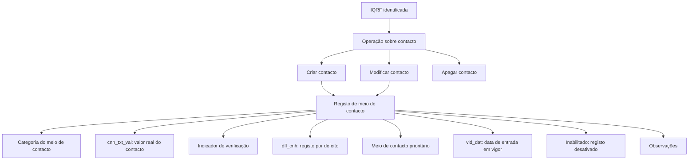

# Gestão de Contactos de Pessoas Físicas ou Jurídicas em uma IQRF

## 1. Metadados do Documento
- **Arquivo de Origem:** Não identificado no conteúdo fornecido
- **Tipo de Documento:** Especificação Funcional
- **Domínio / Sistema:** IQRF / Soluções APIs / Zeus
- **Público-Alvo:** Desenvolvedores, Analistas Funcionais, Operação
- **Data/Versão Identificada:** Não identificada

---

## 2. Resumo Executivo & Contexto de Negócio

O documento descreve a funcionalidade de gestão de contactos associados a pessoas físicas ou jurídicas vinculadas a uma IQRF. O objetivo é permitir a recolha ou modificação de meios de contacto pertencentes a uma entidade identificada no sistema.

As ações explicitamente previstas são **criar**, **modificar** e **apagar** contactos. O documento não detalha interfaces, endpoints, métodos HTTP, contratos JSON, regras de autorização ou fluxos de aprovação para essas operações.

Cada contacto possui uma categoria de meio de contacto, um valor efetivo, indicadores de verificação, prioridade, registo por defeito, data de entrada em vigor, estado de inativação e observações complementares. As categorias incluem meios digitais, telefónicos, postais e categorias alternativas.

A informação de contactos pode ser usada para identificar o canal correto de comunicação com uma pessoa ou organização: e-mail, telefone fixo, mensagem SMS, correio postal, portal de clientes, aplicações de mensagens ou outros meios não previamente catalogados.

---

## 3. Arquitetura, Componentes & Tecnologias Envolvidas

O conteúdo identifica referências a **IQRF**, **Soluções APIs**, **Documentação** e **Zeus**, mas não apresenta uma arquitetura técnica detalhada, componentes internos, serviços, bases de dados, tecnologias de implementação, ambientes ou integrações externas.

O elemento funcional central é o registo de contacto associado a um identificador de IQRF. As operações permitidas atuam sobre os dados do meio de contacto.



> **Nota de Análise:** O documento não detalha o formato do identificador da IQRF, as regras de obrigatoriedade dos campos, a persistência dos dados, nem a ordem operacional entre criação, modificação e apagamento.

---

## 4. Regras de Negócio, Especificações Funcionais & Processos

### 4.1 Objetivo funcional

A funcionalidade permite **recolher ou modificar contactos** de pessoas físicas ou jurídicas pertencentes a uma IQRF.

### 4.2 Operações possíveis

As ações listadas para os contactos de uma IQRF são:

1. **Criar:** criar um novo registo de contacto.
2. **Modificar:** alterar propriedades de um registo de contacto existente.
3. **Apagar:** remover um registo de contacto.

> **Nota de Análise:** O documento lista as ações, mas não especifica os critérios para identificar univocamente um contacto durante as operações de modificação ou apagamento.

### 4.3 Identificador de IQRF

A propriedade de identificador de IQRF apresenta o identificador da IQRF à qual os contactos estão associados.

### 4.4 Categoria do meio de contacto

O campo de tipo ou categoria de meio de contacto classifica a forma pela qual é possível contactar a pessoa física ou jurídica. As categorias apresentadas são:

- Correio eletrónico.
- Telefone.
- Telemóvel — SMS.
- Correio postal.
- Fax.
- Página web.
- WhatsApp.
- Messenger.
- Notificações — app.
- Busca.
- Outros.

### 4.5 Definições das categorias de contacto

- **Correio eletrónico:** o contacto é realizado por meio de um endereço de correio eletrónico.
- **Telefone:** o contacto é realizado através de chamada para telefone fixo; o documento diferencia este meio de telefone móvel.
- **Telemóvel — SMS:** o contacto é realizado através do envio de uma mensagem para o telemóvel.
- **Correio postal:** o contacto é realizado através de carta por correspondência.
- **Fax:** o contacto é realizado através de fax.
- **Página web:** o contacto é realizado através do portal de clientes.
- **WhatsApp:** o contacto é realizado através de mensagem na aplicação WhatsApp.
- **Messenger:** o contacto é realizado através de mensagem na aplicação Messenger.
- **Busca:** o contacto é realizado através de mensagem enviada ao busca.
- **Outros:** o contacto não corresponde a nenhum dos meios anteriormente nomeados.

> **Nota de Análise:** A categoria **Notificações — app** é listada, porém o documento não fornece uma descrição funcional adicional para esse meio de contacto.

### 4.6 Valor efetivo do meio de contacto

O campo `cnh_txt_val` representa o valor real do meio de contacto, de acordo com a respetiva categoria. Por exemplo, a categoria determina o tipo de meio; `cnh_txt_val` armazena o valor concreto desse meio.

> **Nota de Análise:** O documento não define formatos de validação para `cnh_txt_val`, como padrão de e-mail, estrutura de número telefónico, URL, tamanho máximo ou codificação.

### 4.7 Verificação do meio de contacto

O campo **“meio de contacto verificado?”** indica se o meio de contacto foi comprovado e verificado ou se ainda não passou por essa confirmação.

> **Nota de Análise:** O documento não define o processo, responsável, evidência ou condição necessária para alterar o estado de verificação.

### 4.8 Registo por defeito

O campo `dfl_cnh` identifica o registo que deve ser considerado como contacto por defeito para uma determinada categoria de meio de contacto.

### 4.9 Contacto prioritário

O campo **“meio de contacto prioritário”** identifica o contacto prioritário.

> **Nota de Análise:** O documento não especifica se pode existir mais de um contacto prioritário por IQRF, por categoria ou por pessoa/organização.

### 4.10 Observações

O campo **Observações** armazena informação complementar sobre o contacto.

### 4.11 Data de entrada em vigor

O campo `vld_dat` representa a data de entrada em vigor do registo de contacto.

### 4.12 Estado de inativação

O campo **inhabilitado** indica que o registo está desativado.

> **Nota de Análise:** O documento não esclarece se um contacto inabilitado pode ser modificado, reativado, definido como prioritário ou usado como contacto por defeito.

---

## 5. Tabelas de Parâmetros, Ambientes e Estruturas de Dados

| Item / Parâmetro | Descrição / Função | Tipo / Valores / Formato | Ambiente / Observações |
| :--- | :--- | :--- | :--- |
| Identificador de IQRF | Apresenta o identificador da IQRF à qual os contactos pertencem. | Não especificado. | O documento não informa formato, obrigatoriedade ou regra de geração. |
| Ação: Criar | Cria um contacto de pessoa física ou jurídica de uma IQRF. | Operação funcional. | Sem detalhamento de pré-condições ou resultado. |
| Ação: Modificar | Modifica propriedades de um contacto de pessoa física ou jurídica de uma IQRF. | Operação funcional. | Sem detalhamento de critérios de localização do contacto. |
| Ação: Apagar | Apaga um contacto de pessoa física ou jurídica de uma IQRF. | Operação funcional. | Sem detalhamento de exclusão lógica ou física. |
| Tipo de meio de contacto | Classifica a categoria do meio de contacto. | Correio eletrónico, telefone, telemóvel — SMS, correio postal, fax, página web, WhatsApp, Messenger, notificações — app, busca, outros. | A descrição de notificações — app não está presente no conteúdo. |
| Correio eletrónico | Permite contacto mediante correio eletrónico. | Categoria de meio de contacto. | O formato do endereço não é definido. |
| Telefone | Permite contacto por chamada para telefone fixo, não móvel. | Categoria de meio de contacto. | O formato do número não é definido. |
| Telemóvel — SMS | Permite contacto por envio de mensagem ao telemóvel. | Categoria de meio de contacto. | O formato do número não é definido. |
| Correio postal | Permite contacto através de carta por correspondência. | Categoria de meio de contacto. | A estrutura do endereço postal não é definida. |
| Fax | Permite contacto através de fax. | Categoria de meio de contacto. | O formato do número de fax não é definido. |
| Página web | Permite contacto através do portal de clientes. | Categoria de meio de contacto. | Não são fornecidos URL, portal ou regras de acesso. |
| WhatsApp | Permite contacto por mensagem através da aplicação WhatsApp. | Categoria de meio de contacto. | Não são descritos requisitos de número, consentimento ou integração. |
| Messenger | Permite contacto por mensagem através da aplicação Messenger. | Categoria de meio de contacto. | Não são descritos identificadores nem integração. |
| Notificações — app | Categoria listada para meio de contacto. | Categoria de meio de contacto. | Sem descrição complementar no documento. |
| Busca | Permite contacto por mensagem ao busca. | Categoria de meio de contacto. | Não é detalhado o formato ou sistema do busca. |
| Outros | Identifica um meio de contacto não incluído nas categorias previamente nomeadas. | Categoria de meio de contacto. | Não há regras de classificação ou validação. |
| `cnh_txt_val` | Armazena o valor real do meio de contacto conforme a categoria selecionada. | Não especificado. | Não há validações de formato documentadas. |
| Meio de contacto verificado? | Distingue se o meio de contacto foi comprovado e verificado. | Indicador booleano implícito; valores não especificados. | Sem processo de verificação descrito. |
| `dfl_cnh` | Indica o registo por defeito por categoria do meio de contacto. | Indicador; valores não especificados. | Não há regra de exclusividade documentada. |
| Meio de contacto prioritário | Indica o contacto prioritário. | Indicador; valores não especificados. | Não há regra de exclusividade documentada. |
| Observações | Armazena informação complementar sobre o contacto. | Texto não especificado. | Sem tamanho, formato ou obrigatoriedade definidos. |
| `vld_dat` | Representa a data de entrada em vigor do contacto. | Data; formato não especificado. | Sem regra de vigência ou expiração definida. |
| Inabilitado | Indica que o registo está desativado. | Indicador; valores não especificados. | Sem regra de reativação ou impacto operacional definida. |
| Soluções APIs | Referência de navegação ou contexto presente no conteúdo. | Não especificado. | Sem detalhes técnicos. |
| Documentação | Referência de navegação ou contexto presente no conteúdo. | Não especificado. | Sem detalhes técnicos. |
| Zeus | Referência de navegação ou contexto presente no conteúdo. | Não especificado. | Sem detalhes técnicos. |

---

## 6. Bateria de Perguntas & Respostas para RAG (FAQ Sintético)

### P1: Qual é o objetivo da funcionalidade de contactos da IQRF?
**R:** A funcionalidade permite recolher ou modificar contactos de pessoas físicas ou jurídicas associados a uma IQRF. O documento prevê as ações de criar, modificar e apagar registos de contacto.

### P2: Quais operações podem ser realizadas sobre os contactos de uma IQRF?
**R:** As operações listadas são criar, modificar e apagar contactos. O documento não descreve endpoints, métodos HTTP, contratos de integração ou regras de autorização para essas operações.

### P3: Para que serve o identificador de IQRF?
**R:** O identificador de IQRF é apresentado numa propriedade que mostra o identificador da IQRF à qual o contacto está associado. O formato e as regras de validação desse identificador não são especificados.

### P4: Quais categorias de meio de contacto estão previstas?
**R:** As categorias listadas são correio eletrónico, telefone, telemóvel — SMS, correio postal, fax, página web, WhatsApp, Messenger, notificações — app, busca e outros.

### P5: Qual é a diferença entre telefone e telemóvel — SMS?
**R:** A categoria telefone é destinada ao contacto através de chamada para telefone fixo, não móvel. A categoria telemóvel — SMS é destinada ao contacto através do envio de uma mensagem para o telemóvel.

### P6: O que representa o campo `cnh_txt_val`?
**R:** O campo `cnh_txt_val` contém o valor real do meio de contacto de acordo com a respetiva categoria. O documento não define os formatos de validação aplicáveis a esse valor.

### P7: Como o sistema identifica um meio de contacto verificado?
**R:** O campo “meio de contacto verificado?” distingue se o meio de contacto foi ou não comprovado e verificado. O documento não especifica o processo de verificação nem os valores técnicos usados pelo campo.

### P8: Qual é a função de `dfl_cnh`?
**R:** O campo `dfl_cnh` identifica o registo por defeito dentro de uma categoria de meio de contacto. O documento não informa se pode existir mais de um registo por defeito na mesma categoria.

### P9: O que significa que um meio de contacto é prioritário?
**R:** O campo “meio de contacto prioritário” indica qual contacto deve ser tratado como prioritário. O documento não define regras de prioridade entre diferentes categorias ou a quantidade permitida de contactos prioritários.

### P10: Para que serve o campo `vld_dat`?
**R:** O campo `vld_dat` representa a data de entrada em vigor do registo de contacto. O documento não descreve formato da data, data de fim de vigência ou regras para contactos futuros.

### P11: O que indica o campo inabilitado?
**R:** O campo inabilitado indica que o registo de contacto está desativado. O conteúdo não esclarece se o registo inabilitado pode ser reutilizado, reativado ou escolhido como contacto prioritário.

### P12: Quando deve ser usada a categoria Outros?
**R:** A categoria Outros deve ser utilizada quando o meio de contacto não corresponder a nenhum dos meios anteriormente nomeados no documento.

---

## 7. Glossário de Termos, Siglas & Conceitos-Chave

- **IQRF:** Entidade identificada no documento à qual estão associados contactos de pessoas físicas ou jurídicas. O significado expandido da sigla não é fornecido.
- **`cnh_txt_val`:** Campo que contém o valor real do meio de contacto de acordo com a categoria selecionada.
- **`dfl_cnh`:** Campo que indica o registo por defeito por categoria do meio de contacto.
- **`vld_dat`:** Campo que representa a data de entrada em vigor do registo de contacto.
- **Meio de contacto:** Canal ou mecanismo utilizado para comunicar com uma pessoa física ou jurídica.
- **Meio de contacto verificado:** Meio de contacto que foi comprovado e verificado, segundo o indicador correspondente.
- **Meio de contacto prioritário:** Contacto marcado como prioritário.
- **Inabilitado:** Estado que indica que o registo está desativado.
- **Busca:** Meio de contacto realizado mediante envio de mensagem a um busca.
- **Soluções APIs:** Referência textual presente na navegação do conteúdo; não há detalhamento adicional.
- **Zeus:** Referência textual presente no conteúdo; não há detalhamento adicional.

---

## 8. Notas Críticas, Riscos & Limitações

- O documento não informa o nome do arquivo de origem, data, versão, autor, sistema proprietário ou histórico de alterações.
- Não são descritos métodos HTTP, APIs, payloads JSON, esquemas de dados, códigos de resposta, autenticação, autorização ou mecanismos de auditoria.
- Não há definição de campos obrigatórios, tipos técnicos, tamanhos máximos, formatos de data ou regras de validação para e-mail, telefone, telemóvel, fax, endereço postal e página web.
- A categoria **Notificações — app** é listada sem descrição do respetivo comportamento.
- Não são apresentadas regras de unicidade para contacto por defeito (`dfl_cnh`) ou para contacto prioritário.
- Não são definidas regras de convivência entre registos prioritários, verificados, por defeito e inabilitados.
- O tratamento de contactos apagados não é especificado; o documento não esclarece se a ação corresponde a exclusão lógica ou exclusão física.
- Não existe detalhamento sobre o processo de verificação do meio de contacto, incluindo responsável, evidência, evento disparador ou reversão de estado.
- Não são apresentados ambientes, URLs, servidores, credenciais, rotas de log, mecanismos de monitorização ou dependências entre equipas.

---

## 9. Conteúdo Bruto Estruturado (Referência Fiel)

```text
--- [PÁGINA 1 DE 3] ---

Contactos de la IQRF
¿En que consiste?
Recoger o modificar contactos de personas físicas o jurídicas de una I.Q.R.F.
Posibles acciones
 CREAR ( )
 MODIFICAR ( )
 BORRAR ( )
Proceso a seguir
A continuación detallan las propiedades que pueden participar en estas operaciones
Identificador de IQRF
En esta propiedad se mostrará el identificador de la IQRF.
 / 
 RS
Inicio Soluciones APIs Documentación Zeus
ES


--- [PÁGINA 2 DE 3] ---

tipo de medio contacto (   )
categoría del medio de contacto (email, teléfono, móvil, correo,...)
Correo electrónico
Teléfono
Móvil - sms
Correo postal
Fax
Página web
Whatsapp
Messenger
Notificaciones - app
Busca
Otros
Correo electrónico
El medio para poder contactar es mediante un correo electrónico.
Teléfono
El medio para poder contactar es llamándole a un teléfono fijo, no móvil.
Móvil - SMS
El medio para poder contactar es enviando un mensaje a su móvil.
Correo postal
El medio para poder contactar es mediante una carta por correspondencia.
Fax
El medio para poder contactar a través de un fax.
Página Web
El medio para poder contactar es mediante el portal de clientes.
Whatsapp
El medio para poder contactar es mediante un mensaje a través de la aplicación whatsapp
Messenger
El medio para poder contactar es mediante un mensaje a través de la aplicación Messenger


--- [PÁGINA 3 DE 3] ---

Busca
El medio para poder contactar es mediante un mensaje al busca.
Otros
El medio para poder contactar no es ningún medio anteriormente nombrado.
cnh_txt_val (   )
valor real del medio de contacto de acuerdo con la categoria de este
medio de contacto verificado? (   )
distingue si el medio de contacto ha sido o no comprobado y verificado
dfl_cnh (   )
registro por defecto por categoría del medio de contacto
medio de contacto prioritario (   )
medio de contacto prioritario
Observaciones (   )
información complementaria
vld_dat (   )
fecha entrada en vigor
inhabilitado (   )
registro desactivado
```
