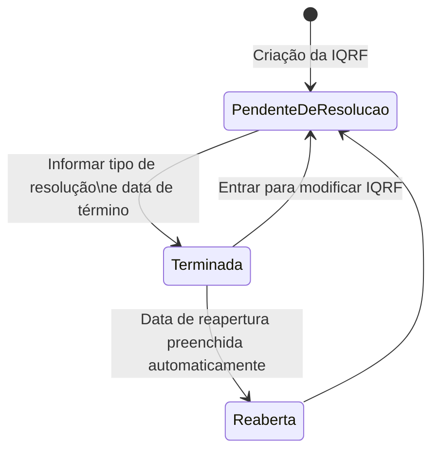

# Gestão de Dados Gerais de IQRF — Especificação Funcional

## 1. Metadados do Documento
- **Arquivo de Origem:** Não identificado no conteúdo fornecido
- **Tipo de Documento:** Especificação Técnica / Manual Funcional
- **Domínio / Sistema:** Gestão de IQRF
- **Público-Alvo:** Analistas funcionais, desenvolvedores, operação e equipes de atendimento/gestão de expedientes
- **Data/Versão Identificada:** Não identificada

---

## 2. Resumo Executivo & Contexto de Negócio

O documento descreve os dados gerais de uma IQRF e as propriedades que podem participar da operação de recolher ou modificar essas informações. IQRF é classificada por tipo, impacto, estado, descrição, origem da comunicação, informante, afetado e dados de resolução.

A IQRF está associada a um número de siniestro e a um número de expediente, ambos já informados previamente. Quando a IQRF está no nível de siniestro, o número de expediente contém o valor `0`. O identificador da IQRF é gerado automaticamente no momento da criação, conforme definição prévia.

A especificação estabelece regras relevantes de imutabilidade e transição de estado. O tipo de IQRF só pode ser informado durante a criação e não pode ser alterado posteriormente. O estado também não pode ser modificado diretamente, pois é calculado pelas operações a partir das informações registradas.

O encerramento de uma IQRF depende do preenchimento simultâneo do tipo de resolução e da data de término. Uma IQRF encerrada, quando acessada para modificação, retorna ao estado de pendente de resolução e recebe automaticamente uma data de reabertura.

---

## 3. Arquitetura, Componentes & Tecnologias Envolvidas

O conteúdo fornecido não descreve arquitetura de software, APIs, microsserviços, bancos de dados, protocolos, contratos HTTP, ambientes técnicos ou tecnologias de implementação.

O documento identifica uma operação funcional de gestão de IQRF, composta por propriedades de identificação, classificação, comunicação, pessoas envolvidas, abertura, resolução, encerramento e reabertura.



> **Nota de Análise:** O documento não detalha quais operações, telas, APIs ou serviços executam o cálculo do estado da IQRF.

---

## 4. Regras de Negócio, Especificações Funcionais & Processos

### 4.1 Operação coberta

A operação consiste em recolher ou modificar os dados gerais de uma IQRF. As propriedades que participam da operação são descritas no documento.

### 4.2 Identificação e vínculo com siniestro/expediente

1. O número de siniestro identifica o siniestro afetado pela IQRF.
2. O número de siniestro já vem informado.
3. O número de expediente identifica o expediente afetado pela IQRF.
4. Quando a IQRF estiver no nível de siniestro, o número de expediente deve conter `0`.
5. O número de expediente já vem informado.
6. O identificador de IQRF é gerado automaticamente na criação da IQRF, conforme definição prévia.

### 4.3 Classificação por tipo de IQRF

O tipo de IQRF só pode ser informado ao criar a IQRF. Após a criação, essa propriedade não pode ser modificada.

Os tipos disponíveis são:

- **Incidencia:** Suceso não grato ocorrido durante a tramitação do expediente, como falta de peças de reposição ou indisponibilidade de fornecedor.
- **Queja:** Protesto sobre algo ocorrido durante a tramitação do expediente, como mau tratamento pelo tramitador, pouca informação ou atrasos.
- **Reclamación:** Exigência apresentada por agente, segurado ou fornecedor sobre um serviço não finalizado, fornecedor que não compareceu ou atraso na reparação.
- **Felicitación:** Elogio recebido pelo serviço prestado ou pelo atendimento.

### 4.4 Classificação por impacto

O impacto da IQRF deve ser informado para refletir seu impacto na companhia. O impacto é codificado e pode assumir os valores Alto, Medio ou Bajo.

- **Alto:** IQRF que impacta fortemente a reputação da companhia ou é realizada por cliente VIP.
- **Medio:** IQRF que pode impactar a reputação da companhia ou quando foram registradas várias IQRF sobre o mesmo afetado.
- **Bajo:** IQRF sem impacto na reputação da companhia, ou cuja solução/tramitação é simples.

### 4.5 Estado da IQRF

O estado indica a situação atual da IQRF e não pode ser modificado diretamente. As operações calculam o estado conforme as informações introduzidas.

#### Regras de estado

1. Na criação, a IQRF recebe o estado **Pendiente de resolución**.
2. A IQRF permanece em **Pendiente de resolución** enquanto não houver valor informado para:
   - tipo de resolução;
   - data de término.
3. A IQRF passa para o estado **Terminada** quando forem introduzidos valores para:
   - tipo de resolução;
   - data de término.
4. Quando uma IQRF terminada for acessada para modificação, ela retorna ao estado **Pendiente de resolución**.
5. Quando uma IQRF finalizada for acessada para modificação, a data de reabertura é preenchida automaticamente.

### 4.6 Pessoas e entidades envolvidas

- **Informante:** pessoa que informou a IQRF. Os tipos de informantes são definidos previamente antes da realização de qualquer operação.
- **Nome Completo do Informante:** nome e sobrenomes da pessoa física ou jurídica que informa a IQRF.
- **Afectado:** pessoa afetada pela IQRF. A propriedade possui ajuda baseada em tipos de afetados previamente definidos.
- **Actividad del afectado:** atividade da pessoa física ou jurídica afetada pela IQRF. A propriedade possui ajuda baseada nas atividades definidas na companhia.
- **Tipo de Documento:** tipo de documento que identifica a pessoa física ou jurídica, tratada como terceiro.
- **Código del documento:** número ou código do documento que identifica a pessoa física ou jurídica. A propriedade possui ajuda por meio de consulta de terceiros.

### 4.7 Canal de entrada

O canal de entrada indica como a comunicação da IQRF chegou à companhia. Os valores previstos são:

1. Correo electrónico;
2. SMS;
3. Autoservicio clientes;
4. Autoservicio proveedores;
5. Call center;
6. Correo ordinario;
7. Fax;
8. Otros.

### 4.8 Datas, horários e resolução

- A data de abertura pode receber um valor inicial na abertura da IQRF e pode ser configurada como modificável.
- A hora de abertura pode receber um valor inicial na abertura da IQRF e pode ser configurada como modificável.
- O tipo de resolução indica como a IQRF foi resolvida.
- Os tipos de resolução possíveis são **Procedente** e **Improcedente**.
- **Procedente** indica que a IQRF era adequada.
- **Improcedente** indica que a IQRF não era adequada.
- A data de fechamento registra a data de encerramento da IQRF.
- A hora de fechamento registra a hora de encerramento da IQRF.
- A data de reabertura registra a data de reabertura da IQRF e é preenchida automaticamente quando uma IQRF finalizada entra em modificação.

---

## 5. Tabelas de Parâmetros, Ambientes e Estruturas de Dados

| Item / Parâmetro | Descrição / Função | Tipo / Valores / Formato | Ambiente / Observações |
| :--- | :--- | :--- | :--- |
| Número de Siniestro | Número do siniestro afetado pela IQRF | Número não especificado | Já vem informado |
| Número de expediente | Número do expediente afetado pela IQRF | Número não especificado; `0` quando a IQRF está no nível de siniestro | Já vem informado |
| Identificador de IQRF | Identificador da IQRF | Não especificado | Gerado automaticamente na criação, conforme definição prévia |
| Tipo de IQRF | Classifica a natureza da IQRF | Incidencia, Queja, Reclamación, Felicitación | Só pode ser informado na criação; não pode ser modificado |
| Impacto | Registra o impacto da IQRF na companhia | Alto, Medio, Bajo | Impacto codificado |
| Estado | Situação atual da IQRF | Pendiente de resolución, Terminada | Calculado pelas operações; não pode ser modificado diretamente |
| Descripción IQRF | Detalhamento ou informação adicional sobre a IQRF | Texto | Sem formato adicional especificado |
| Informante | Pessoa que informou a IQRF | Tipos definidos previamente | Tipos de informantes devem existir antes das operações |
| Nombre Completo del Informante | Nome e sobrenomes da pessoa física ou jurídica informante | Texto | Sem formato adicional especificado |
| Canal de Entrada | Meio pelo qual a IQRF chegou à companhia | Correo electrónico, SMS, Autoservicio clientes, Autoservicio proveedores, Call center, Correo ordinario, Fax, Otros | Valores listados explicitamente |
| Afectado | Pessoa afetada pela IQRF | Tipos de afetados definidos previamente | Possui ajuda dos tipos previamente definidos |
| Actividad del afectado | Atividade da pessoa física ou jurídica afetada | Atividades definidas na companhia | Possui ajuda das atividades corporativas definidas |
| Tipo de Documento | Tipo de documento do terceiro | Documentos definidos na companhia | Possui ajuda dos documentos definidos |
| Código del documento | Número ou código do documento do terceiro | Não especificado | Possui ajuda por consulta de terceiros |
| Fecha de apertura de la IQRF | Data de abertura da IQRF | Data | Pode ter valor inicial; pode ser configurada como modificável |
| Hora de apertura de la IQRF | Hora de abertura da IQRF | Hora | Pode ter valor inicial; pode ser configurada como modificável |
| Tipo de resolución | Forma pela qual a IQRF foi resolvida | Procedente, Improcedente | Necessária, juntamente com a data de término, para estado Terminada |
| Fecha de cierre | Data de encerramento da IQRF | Data | Sem regra adicional detalhada |
| Hora de cierre | Hora de encerramento da IQRF | Hora | Sem regra adicional detalhada |
| Fecha de reapertura | Data de reabertura da IQRF | Data | Preenchida automaticamente ao modificar IQRF finalizada |

| Valor de Impacto | Critério descrito |
| :--- | :--- |
| Alto | IQRF que impacta duramente a reputação da companhia ou realizada por cliente VIP |
| Medio | IQRF que pode impactar a reputação da companhia ou quando há várias IQRF sobre o mesmo afetado |
| Bajo | IQRF sem impacto na reputação da companhia ou com solução/tramitação simples |

| Canal de Entrada | Descrição |
| :--- | :--- |
| Correo electrónico | Comunicação da IQRF notificada por e-mail |
| SMS | Comunicação da IQRF notificada por mensagem móvel |
| Autoservicio clientes | Comunicação recebida pelo portal de clientes |
| Autoservicio proveedores | Comunicação recebida pelo portal de fornecedores |
| Call center | Comunicação recebida pelo centro telefônico |
| Correo ordinario | Comunicação recebida por carta/correspondência |
| Fax | Comunicação recebida por fax |
| Otros | Comunicação não notificada por nenhum dos meios anteriores |

| Tipo de Resolução | Significado |
| :--- | :--- |
| Procedente | A IQRF era adequada |
| Improcedente | A IQRF não era adequada |

---

## 6. Bateria de Perguntas & Respostas para RAG (FAQ Sintético)

### P1: Qual é o objetivo da operação de dados gerais de IQRF?
**R:** A operação tem como objetivo recolher ou modificar os dados gerais de uma IQRF. O documento descreve propriedades relacionadas ao siniestro, expediente, identificação, classificação, estado, pessoas envolvidas, canal de entrada, abertura, resolução, fechamento e reabertura.

### P2: Quando o número de expediente de uma IQRF deve ser igual a zero?
**R:** O número de expediente deve conter o valor `0` quando a IQRF estiver no nível de siniestro. O número de expediente já vem informado na operação.

### P3: Como é criado o identificador de IQRF?
**R:** O identificador de IQRF é gerado automaticamente durante a criação da IQRF, de acordo com uma definição prévia. O documento não detalha o algoritmo, formato ou sistema responsável por essa geração.

### P4: O tipo de IQRF pode ser alterado depois que a IQRF é criada?
**R:** Não. O tipo de IQRF só pode ser introduzido durante a criação da IQRF. Após a criação, essa propriedade não pode ser modificada.

### P5: Quais tipos de IQRF podem ser selecionados?
**R:** Os tipos permitidos são Incidencia, Queja, Reclamación e Felicitación. Incidencia representa um evento desagradável na tramitação; Queja representa um protesto; Reclamación representa uma exigência sobre um serviço não finalizado ou com falha; Felicitación representa um elogio pelo serviço ou atendimento.

### P6: Como a IQRF passa para o estado Terminada?
**R:** A IQRF passa para o estado Terminada quando forem informados valores para o tipo de resolução e para a data de término. Enquanto um desses elementos não estiver preenchido, a IQRF permanece em Pendiente de resolución.

### P7: O estado da IQRF pode ser atualizado manualmente?
**R:** Não. A propriedade de estado não pode ser modificada diretamente. As operações calculam o estado conforme as informações introduzidas na IQRF.

### P8: O que acontece ao modificar uma IQRF que já está terminada?
**R:** Quando uma IQRF terminada é acessada para modificação, ela volta ao estado Pendiente de resolución. Além disso, a data de reapertura é preenchida automaticamente quando uma IQRF finalizada entra em modificação.

### P9: Quais critérios classificam uma IQRF como impacto Alto?
**R:** Uma IQRF é classificada com impacto Alto quando impacta fortemente a reputação da companhia ou quando é realizada por um cliente VIP.

### P10: Quais são os canais de entrada previstos para uma IQRF?
**R:** Os canais previstos são Correo electrónico, SMS, Autoservicio clientes, Autoservicio proveedores, Call center, Correo ordinario, Fax e Otros. Otros deve ser usado quando a comunicação não ocorreu por nenhum dos meios previamente nomeados.

### P11: Qual é a diferença entre um informante e um afetado?
**R:** O informante é a pessoa que comunicou a IQRF. O afetado é a pessoa que sofre o impacto da IQRF. Para ambos, o documento indica o uso de tipos previamente definidos, sendo que o afetado também possui atividade associada.

### P12: Quais são os tipos de resolução de IQRF?
**R:** Os tipos de resolução são Procedente e Improcedente. Procedente indica que a IQRF era adequada; Improcedente indica que a IQRF não era adequada.

---

## 7. Glossário de Termos, Siglas & Conceitos-Chave

- **IQRF:** Termo utilizado pelo documento para o registro cujos dados gerais são criados ou modificados. A expansão da sigla não é informada.
- **Siniestro:** Evento de sinistro ao qual a IQRF pode estar vinculada.
- **Expediente:** Processo ou expediente afetado pela IQRF.
- **Incidencia:** Evento não grato ocorrido ao longo da tramitação do expediente.
- **Queja:** Protesto relativo a uma situação ocorrida durante a tramitação do expediente.
- **Reclamación:** Exigência de agente, segurado ou fornecedor sobre serviço não finalizado ou com falha.
- **Felicitación:** Elogio pelo serviço prestado ou atendimento.
- **Informante:** Pessoa que comunica ou informa a IQRF.
- **Afectado:** Pessoa afetada pela IQRF.
- **Tercero:** Pessoa física ou jurídica identificada por tipo e código de documento.
- **Pendiente de resolución:** Estado inicial da IQRF, mantido enquanto não existirem tipo de resolução e data de término.
- **Terminada:** Estado de IQRF com tipo de resolução e data de término informados.
- **Procedente:** Tipo de resolução que indica que a IQRF era adequada.
- **Improcedente:** Tipo de resolução que indica que a IQRF não era adequada.

---

## 8. Notas Críticas, Riscos & Limitações

- O documento não informa a expansão da sigla IQRF.
- O documento não detalha sistemas, telas, APIs, bancos de dados, integrações, tecnologias, URLs, ambientes ou contratos de dados.
- Não são especificados formatos, obrigatoriedade, validações técnicas, máscaras ou domínios completos para números, documentos, datas e horários.
- A regra menciona “data de término” como requisito para o estado Terminada, enquanto a lista de propriedades apresenta “Fecha de cierre”; a relação exata entre os dois termos não é detalhada.
- O identificador da IQRF é gerado automaticamente, mas o documento não descreve formato, unicidade, origem ou regra de geração.
- Os tipos de informantes, afetados, atividades, documentos e a consulta de terceiros dependem de definições prévias na companhia, não detalhadas no conteúdo.
- Não há detalhamento adicional para o exemplo anunciado após a descrição de resolução Procedente.

---

## 9. Conteúdo Bruto Estruturado (Referência Fiel)

```text
--- [PÁGINA 1 DE 6] ---

Datos Generales de la IQRF
¿En que consiste?
Recoger o modificar los datos generales de una I.Q.R.F.
Proceso a seguir
A continuación detallan las propiedades que pueden participar en esta operación.
Número de Siniestro
Número de siniestro al que afecta la IQRF. Ya vendrá informado.
Número de expediente
Número de expediente al que afecta la IQRF. En el caso de que la IQRF, sea a nivel de siniestro
contendrá un 0. Ya vendrá informado.
 /
 RS
Inicio Soluciones APIs Documentación Zeus
ES


--- [PÁGINA 2 DE 6] ---

Identificador de IQRF
Esta propiedad contendrá el Identificador de IQRF.
Este identificador se generará automáticamente en la Creación de la IQRF, según se haya definido
previamente
Tipo de IQRF (  )
Esta propiedad indicará que tipo de IQRF se va a tratar. Sólo se podrá introducir el tipo de IQRF al
CREAR la IQRF. Esta propiedad no se podrá modificar.
Incidencia
Queja
Reclamación
Felicitación
Incidencia
Suceso no grato que se haya dado a lo largo de la tramitación del expediente, como por ejemplo,
no llegan los repuestos, no está disponible el proveedor...
Queja
Protesta que se realiza por algo que se ha producido durante la tramitación del expediente, mal
trato del tramitador, poca información, retrasos...
Reclamación
Exigencia que realizar un agente, un asegurado, un proveedor sobre un servicio no finalizado, un
proveedor que no ha se ha presentado, retardo en la reparación...
Felicitación
Alabanza recibida por el servicio prestado, por la atención...etc.
Impacto (   )
En esta propiedad se tiene que ingresar el impacto de la IQRF en la compañía.
El impacto ya está codificado y se podrá elegir entre los siguientes valores:
Alto
Medio
Bajo
Alto


--- [PÁGINA 3 DE 6] ---

Se cataloga como Impacto Alto, cuando una IQRF impacta duramente en la reputación de la
compañía, cuando la realiza un cliente VIP, etc.
Medio
Se cataloga como Impacto Medio, cuando una IQRF puede impactar en la reputación de la
compañía, cuando se han hecho varias IQRF, sobre el mismo afectado.
Bajo
Se cataloga como Impacto Bajo, cuando una IQRF no impacta en la reputación de la compañía,
cuando la solución o la tramitación de la misma es sencilla, etc.
Estado
Esta propiedad indica el estado en el se encuentra la IQRF. No se puede modificar, las operaciones
calculan el estado dependiendo de la información introducida.
En la creación de la IQRF, tomará el valor de Pendiente de Resolución.
Pendiente de resolución
Terminada
Pendiente de resolución
En este estado se encuentra la IQRF al ser registrada y mientras no se le haya introducido valor
a las propiedades: tipo de resolución y la fecha de terminación, seguirá en este estado.
Cuando una IQRF está terminada y se entra a modificar, vuelve al estado de pendiente de
resolución.
Terminada
En este estado se encuentra la IQRF, cuando se introduce valor al tipo de resolución y la fecha
de terminación.
Descripción IQRF (  )
Texto para detallar la IQRF o incluir información adicional.
Informante (   )
Esta propiedad contiene la persona que ha informado de la IQRF.
Los distintos tipos de informantes se definen previamente a realizar cualquier operación.
Nombre Completo del Informante (   )
Esta propiedad contiene el nombre y apellidos de la persona física o jurídica que informa de la IQRF.


--- [PÁGINA 4 DE 6] ---

Canal de Entrada (   )
Esta propiedad indica cómo ha llegado la IQRF a la compañía.
Los posibles valores son:
Correo electrónico
SMS
Autoservicio clientes
Autoservicio proveedores
Call center
Correo ordinario
Fax
Otros
Correo electrónico
La comunicación de la IQRF, se notificó mediante un correo electrónico.
SMS
La comunicación de la IQRF, se notificó mediante un mensaje de móvil.
Autoservicio clientes
La comunicación de la IQRF, se notificó mediante el portal de clientes.
Autoservicio proveedores
La comunicación de la IQRF, se notificó mediante el portal de proveedores.
Call center
La comunicación de la IQRF, se notificó desde el centro telefónico.
Correo ordinario
La comunicación de la IQRF, se notificó mediante una carta por correspondencia.
Fax
La comunicación de la IQRF, se notificó a través de un fax.
Otros
La comunicación de la IQRF, no se notificó a través de ningún medio anteriormente nombrado.
Afectado (   )


--- [PÁGINA 5 DE 6] ---

Esta propiedad contiene la persona que se ve afectado por la IQRF.
Tendrá como ayuda, los distintos tipos de afectados que se han definido previamente.
Actividad del afectado (   )
Esta propiedad contendrá la actividad de la persona física o jurídica que está afectado por la IQRF.
Tendrá una ayuda de las actividades definidas en la compañía.
Tipo de Documento (   )
En esta propiedad se informará el tipo documento que identifica a la persona física o jurídica
(tercero).
Tendrá una ayuda de los documentos definidos en la compañía.
Código del documento (   )
Esta propiedad contendrá el número o código del documento que identifica a la persona física o
jurídica (tercero).
Tendrá como ayuda la consulta de terceros.
Fecha de apertura de la IQRF (   )
Esta propiedad contendrá la Fecha de apertura de la IQRF.
Se le podrá definir un valor inicial cuando se abra la IQRF.
También se definirá si la fecha puede ser modificada.
Hora de apertura de la IQRF (   )
Esta propiedad contendrá la hora de apertura de la IQRF.
Esta hora podrá tener un valor inicial cuando se abra la IQRF, si así se define.
También se podrá definir, si esta puede ser modificada.
Tipo de resolución (   )
Esta propiedad indica el tipo de resolución, como se ha resuelto la IQRF.
Los valores posibles son:
Procedente
Improcedente
Procedente
Indica que la IQRF, era adecuada.
Ejemplo:


--- [PÁGINA 6 DE 6] ---

Improcedente
Indica que la IQRF, no era adecuada.
Fecha de cierre (   )
Esta propiedad contendrá la fecha en la que se cierra la IQRF.
Hora de cierre (   )
Esta propiedad contiene la hora en la que se cierra la IQRF.
Fecha de reapertura (  )
Esta propiedad contiene la fecha de la reapertura de la IQRF.
Cuando se ha finalizado una IQRF, y se entra a modificar, esta fecha se pondrá automáticamente.
```
