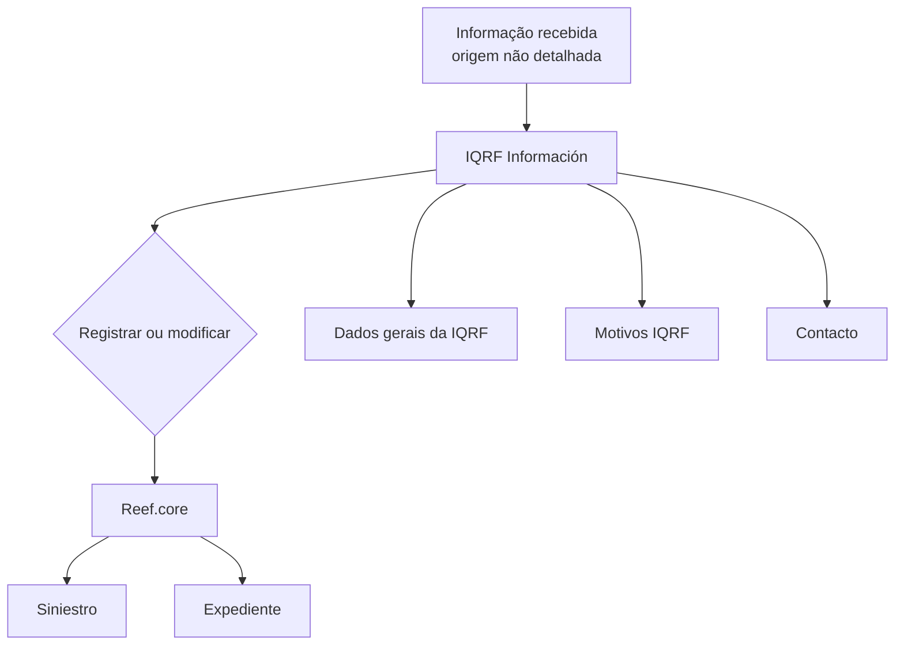

# IQRF Información — Registro ou Modificação de Informação em Reef.core

## 1. Metadados do Documento
- **Arquivo de Origem:** `Não informado`
- **Tipo de Documento:** `Procedimento`
- **Domínio / Sistema:** `IQRF / Reef.core`
- **Público-Alvo:** `Não identificado`
- **Data/Versão Identificada:** `Não identificada`

---

## 2. Resumo Executivo & Contexto de Negócio

O documento descreve a funcionalidade **IQRF Información**, destinada a registrar ou modificar informações de uma IQRF associada a um sinistro ou expediente no sistema **Reef.core**. A atualização depende das informações recebidas pelo processo, mas o documento não especifica a origem dessas informações, os canais de integração ou os formatos de entrada.

No contexto apresentado, IQRF representa os tipos **Incidencia, Queja, Reclamación y Felicitación**. A funcionalidade concentra-se na manutenção de dados relacionados a esses registros, preservando a associação com um sinistro ou expediente.

O objetivo declarado é identificar a informação mínima necessária nos blocos informacionais para registrar ou modificar uma IQRF. O documento também indica que esses blocos possuem uma ordem de apresentação no processo.

O conteúdo fornecido enumera três blocos de informação: **Dados gerais da IQRF**, **Motivos IQRF** e **Contacto**. Não há detalhamento dos campos de cada bloco, critérios de validação, regras de obrigatoriedade, telas, APIs, contratos ou tratamento de erros.

---

## 3. Arquitetura, Componentes & Tecnologias Envolvidas

| Componente / Sistema | Papel identificado | Detalhamento disponível |
| :--- | :--- | :--- |
| IQRF Información | Funcionalidade para registrar ou modificar informações de IQRF. | Não detalha interface, API, persistência ou tecnologia. |
| Reef.core | Sistema no qual a IQRF é registrada ou modificada em relação a um sinistro ou expediente. | Não detalha arquitetura, módulos ou integrações. |
| Siniestro | Entidade à qual uma IQRF pode ser associada. | Não detalhada. |
| Expediente | Entidade à qual uma IQRF pode ser associada. | Não detalhada. |
| Dados gerais da IQRF | Bloco de informação do processo IQRF. | Campos não informados. |
| Motivos IQRF | Bloco de informação do processo IQRF. | Campos não informados. |
| Contacto | Bloco de informação do processo IQRF. | Campos não informados. |



**Nota de Análise:** O documento cita Reef.core, sinistro, expediente e os blocos IQRF, mas não descreve tecnologias, serviços, métodos HTTP, contratos JSON, bancos de dados, autenticação ou mecanismos de integração.

---

## 4. Regras de Negócio, Especificações Funcionais & Processos

1. A funcionalidade IQRF Información permite **registrar** ou **modificar** informações de uma IQRF.
2. Uma IQRF pode corresponder a uma das seguintes categorias:
   - Incidencia;
   - Queja;
   - Reclamación;
   - Felicitación.
3. O registro ou a modificação ocorre no sistema **Reef.core**.
4. A IQRF é vinculada a um **siniestro** ou a um **expediente**.
5. A ação de registrar ou modificar depende da informação que chegar ao processo; a origem, o conteúdo mínimo e a lógica de decisão não são especificados.
6. O objetivo é conhecer a informação mínima necessária dos blocos informacionais para realizar o registro ou a modificação de uma IQRF.
7. O processo apresenta blocos de informação em uma ordem indicada pelo documento:
   1. Dados gerais da IQRF;
   2. Motivos IQRF;
   3. Contacto.

**Nota de Análise:** O documento não informa se todos os blocos são obrigatórios, quais campos pertencem a cada bloco, nem quais validações determinam a criação versus a atualização de uma IQRF.

---

## 5. Tabelas de Parâmetros, Ambientes e Estruturas de Dados

| Item / Parâmetro | Descrição / Função | Tipo / Valores / Formato | Ambiente / Observações |
| :--- | :--- | :--- | :--- |
| IQRF | Registro que pode ser criado ou modificado. | Incidencia, Queja, Reclamación ou Felicitación. | Associada a um sinistro ou expediente em Reef.core. |
| Acción sobre IQRF | Operação suportada pela funcionalidade. | Registrar ou modificar. | A decisão depende da informação recebida; critério não detalhado. |
| Reef.core | Sistema de destino para o registro ou modificação. | Sistema citado no documento. | Ambiente não informado. |
| Siniestro | Entidade de associação da IQRF. | Não informado. | Não detalhado. |
| Expediente | Entidade de associação da IQRF. | Não informado. | Não detalhado. |
| Datos generales de la IQRF | Primeiro bloco informacional apresentado. | Campos não informados. | Ordem 1 no processo. |
| Motivos IQRF | Segundo bloco informacional apresentado. | Campos não informados. | Ordem 2 no processo. |
| Contacto | Terceiro bloco informacional apresentado. | Campos não informados. | Ordem 3 no processo. |

---

## 6. Bateria de Perguntas & Respostas para RAG (FAQ Sintético)

### P1: Qual é a finalidade da funcionalidade IQRF Información?
**R:** IQRF Información permite registrar ou modificar informações de uma IQRF no sistema Reef.core, vinculando a IQRF a um sinistro ou expediente.

### P2: Quais tipos de registro são abrangidos por IQRF?
**R:** O documento identifica quatro tipos: Incidencia, Queja, Reclamación e Felicitación.

### P3: Em qual sistema a IQRF é registrada ou modificada?
**R:** A IQRF é registrada ou modificada em Reef.core.

### P4: A qual entidade uma IQRF pode estar associada?
**R:** Uma IQRF pode estar associada a um sinistro ou a um expediente.

### P5: Quais operações a funcionalidade IQRF Información suporta?
**R:** A funcionalidade suporta duas operações: registrar uma IQRF ou modificar uma IQRF existente.

### P6: O que determina se uma IQRF será registrada ou modificada?
**R:** O documento informa que a operação depende das informações recebidas. Contudo, não especifica os critérios, regras ou campos usados para decidir entre registro e modificação.

### P7: Qual é o objetivo declarado do documento IQRF Información?
**R:** O objetivo é conhecer a informação mínima necessária nos blocos de informação para registrar ou modificar uma IQRF.

### P8: Qual é a ordem dos blocos de informação no processo IQRF?
**R:** A ordem apresentada é: Dados gerais da IQRF, Motivos IQRF e Contacto.

### P9: Quais campos compõem o bloco Dados gerais da IQRF?
**R:** O documento apenas menciona o bloco Dados gerais da IQRF; não apresenta seus campos, formatos, obrigatoriedades ou validações.

### P10: O documento descreve APIs ou contratos de integração de IQRF Información?
**R:** Não. O conteúdo não detalha métodos HTTP, endpoints, contratos JSON, origem das mensagens, autenticação ou tecnologia de integração.

---

## 7. Glossário de Termos, Siglas & Conceitos-Chave

- **IQRF:** Conjunto de registros composto por **Incidencia, Queja, Reclamación y Felicitación**.
- **Incidencia:** Tipo de IQRF citado no documento; não possui definição adicional no conteúdo.
- **Queja:** Tipo de IQRF citado no documento; não possui definição adicional no conteúdo.
- **Reclamación:** Tipo de IQRF citado no documento; não possui definição adicional no conteúdo.
- **Felicitación:** Tipo de IQRF citado no documento; não possui definição adicional no conteúdo.
- **Reef.core:** Sistema em que a informação da IQRF é registrada ou modificada.
- **Siniestro:** Entidade à qual uma IQRF pode ser associada.
- **Expediente:** Entidade à qual uma IQRF pode ser associada.
- **Contacto:** Bloco de informação do processo IQRF.

---

## 8. Notas Críticas, Riscos & Limitações

- O documento não identifica o nome do arquivo, autor, data, versão ou público-alvo.
- Não há detalhamento dos campos mínimos que compõem os blocos Dados gerais da IQRF, Motivos IQRF e Contacto.
- Não foram especificados critérios para decidir entre registrar uma nova IQRF e modificar uma IQRF existente.
- Não há informações sobre validações, obrigatoriedades, regras de negócio específicas, mensagens de erro ou tratamento de exceções.
- O conteúdo não descreve endpoints, métodos HTTP, contratos de entrada e saída, integrações, autenticação, ambientes ou logs.
- O diagrama Mermaid representa exclusivamente relações explicitamente sustentadas pelo texto; não deve ser interpretado como arquitetura técnica detalhada.

---

## 9. Conteúdo Bruto Estruturado (Referência Fiel)

```text
--- [PÁGINA 1 DE 2] ---

I.Q.R.F INFORMACIÓN
¿En que consiste?
Permite registrar o modificar la información de una (Incidencia, Queja, Reclamación y Felicitación) a
un siniestro o expediente en Reef.core, dependiendo de la información que le llegue.
Objetivo
Conocer la información mínima necesaria de los bloques de información para poder registrar o
modificar una IQRF.
Proceso a seguir
En este apartado se enumeran los bloques de información y el orden en el que aparecerán.
INFORMACIÓN DE LA IQRF
 Datos generales de la IQRF( )
 Motivos IQRF( )
 / 
 RS
Inicio Soluciones APIs Documentación Zeus
ES


--- [PÁGINA 2 DE 2] ---

Contacto( )
```
