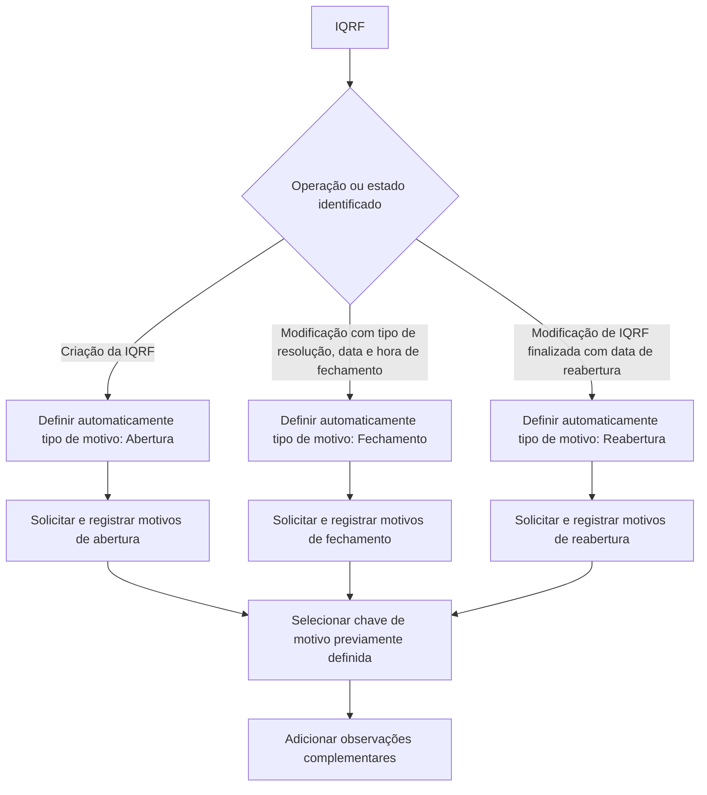

# Gestão de Motivos da IQRF: Criação, Fechamento e Reabertura

## 1. Metadados do Documento
- **Arquivo de Origem:** `Não identificado`
- **Tipo de Documento:** Especificação Funcional
- **Domínio / Sistema:** IQRF — gestão de motivos por tipo de operação
- **Público-Alvo:** Desenvolvedores, Analistas Funcionais e Operação
- **Data/Versão Identificada:** Não identificada

---

## 2. Resumo Executivo & Contexto de Negócio

O documento descreve a funcionalidade de recolhimento e registro de motivos associados a uma IQRF. Os motivos são classificados conforme o tipo de operação executada sobre a IQRF: abertura, fechamento ou reabertura.

A gestão de motivos é orientada pelo estado operacional da IQRF e pelos dados informados nos dados gerais. Ao criar uma IQRF, o sistema atribui automaticamente o tipo de motivo de abertura. Ao encerrar uma IQRF, o sistema identifica o encerramento pela inclusão de tipo de resolução, data e hora de fechamento e solicita os motivos correspondentes.

Quando uma IQRF já finalizada é modificada e recebe uma data de reabertura, o sistema atribui automaticamente o tipo de motivo de reabertura e solicita os respectivos motivos. Para cada tipo de operação, os motivos disponíveis devem estar previamente definidos.

Cada registro de motivo inclui o identificador da IQRF, o tipo de motivo, uma chave que identifica o motivo selecionado e um campo de observações para informações complementares. O documento não detalha contratos de API, persistência, métodos HTTP, validações de formato ou a definição expandida da sigla IQRF.

---

## 3. Arquitetura, Componentes & Tecnologias Envolvidas

O conteúdo apresenta uma funcionalidade de negócio para registrar motivos vinculados a uma IQRF. São citados os componentes conceituais abaixo:

| Componente / Conceito | Papel identificado |
| :--- | :--- |
| IQRF | Entidade para a qual são registrados motivos de abertura, fechamento ou reabertura. |
| Dados gerais da IQRF | Origem das informações usadas para identificar fechamento ou reabertura. |
| Tipo de motivo | Classificação automática entre abertura, fechamento e reabertura. |
| Chave do motivo | Identificador do motivo selecionado. |
| Motivos previamente definidos | Catálogo de motivos disponível para cada tipo de operação. |
| Observações | Campo para inserir informações complementares que esclareçam a IQRF. |



**Nota de Análise:** O documento não descreve tecnologias, microsserviços, bancos de dados, ambientes, URLs, integrações externas ou interfaces de programação associados à gestão de motivos da IQRF.

---

## 4. Regras de Negócio, Especificações Funcionais & Processos

### Operações possíveis

O documento lista as seguintes ações possíveis para a gestão de motivos da IQRF:

- Criar.
- Modificar.
- Apagar.
- Inabilitar.

O detalhamento funcional fornecido concentra-se na criação e modificação de IQRF para registro de motivos de abertura, fechamento e reabertura. Não há detalhamento adicional sobre o comportamento de apagar ou inabilitar motivos.

### Propriedades registradas nos motivos da IQRF

Para os motivos vinculados à IQRF, o documento descreve as propriedades:

1. Identificador da IQRF.
2. Tipo de motivo.
3. Chave do motivo.
4. Observações.

### Regra de identificação do tipo de motivo

O tipo de motivo deve indicar a natureza do evento registrado na IQRF. Os valores identificados são:

- Abertura.
- Fechamento.
- Reabertura.

### Fluxo de abertura

1. Uma IQRF é criada.
2. O sistema define automaticamente o tipo de motivo como **abertura**.
3. O sistema solicita o registro dos motivos de abertura da IQRF.
4. O motivo selecionado deve ser identificado por uma chave pertencente aos motivos previamente definidos para abertura.
5. Podem ser incluídas observações para complementar ou esclarecer a IQRF.

### Fluxo de fechamento

1. Uma IQRF é modificada.
2. Nos dados gerais, são informados o tipo de resolução, a data de fechamento e a hora de fechamento.
3. A presença dessas informações significa que a IQRF está terminada.
4. Quando os motivos são solicitados, o sistema apresenta automaticamente o tipo de motivo como **fechamento**.
5. O sistema solicita os motivos de fechamento da IQRF.
6. O motivo selecionado deve pertencer aos motivos previamente definidos para fechamento.
7. Podem ser incluídas observações complementares.

### Fluxo de reabertura

1. Uma IQRF terminada é modificada.
2. Nos dados gerais, é informada a data de reabertura.
3. Quando os motivos são solicitados, o sistema define automaticamente o tipo de motivo como **reabertura**.
4. O sistema solicita os motivos de reabertura da IQRF.
5. O motivo selecionado deve pertencer aos motivos previamente definidos para reabertura.
6. Podem ser incluídas observações complementares.

### Restrições e dependências funcionais

- Os motivos de abertura, fechamento e reabertura devem estar previamente definidos.
- A chave do motivo deve identificar o motivo registrado.
- O tipo de motivo não é descrito como seleção manual nos fluxos apresentados; ele é automaticamente determinado conforme a criação, o fechamento ou a reabertura da IQRF.
- O documento não informa se há obrigatoriedade para a chave do motivo ou para observações, embora ambos sejam apresentados entre parênteses no conteúdo original.
- O documento não define regras de exclusividade, quantidade máxima de motivos por IQRF, critérios de edição posterior ou validações de data e hora.

---

## 5. Tabelas de Parâmetros, Ambientes e Estruturas de Dados

| Item / Parâmetro | Descrição / Função | Tipo / Valores / Formato | Ambiente / Observações |
| :--- | :--- | :--- | :--- |
| Identificador da IQRF | Contém o identificador da IQRF associada ao motivo. | Não especificado. | O texto original apresenta também “RS” próximo a essa propriedade, sem detalhar seu significado. |
| Tipo de motivo | Indica se o motivo registrado é relativo à abertura, ao fechamento ou à reabertura da IQRF. | Abertura, Fechamento, Reabertura. | Definido automaticamente conforme a operação ou o estado da IQRF. |
| Chave do motivo | Identifica o motivo registrado. | Não especificado. | Os motivos para abertura, fechamento e reabertura devem estar previamente definidos. |
| Observações | Permite inserir informação complementar para esclarecer a IQRF. | Texto; formato não especificado. | Não há detalhamento sobre obrigatoriedade, tamanho ou validação. |
| Tipo de resolução | Dado geral cuja introdução, juntamente com data e hora de fechamento, indica encerramento da IQRF. | Não especificado. | Aplicável ao fluxo de fechamento. |
| Data de fechamento | Dado geral que participa da identificação de uma IQRF terminada. | Data; formato não especificado. | Aplicável ao fluxo de fechamento. |
| Hora de fechamento | Dado geral que participa da identificação de uma IQRF terminada. | Hora; formato não especificado. | Aplicável ao fluxo de fechamento. |
| Data de reabertura | Dado geral cuja introdução em uma IQRF terminada aciona o fluxo de reabertura. | Data; formato não especificado. | Aplicável ao fluxo de reabertura. |
| Ações possíveis | Operações listadas para a gestão de motivos da IQRF. | Criar, Modificar, Apagar, Inabilitar. | Apenas criar e modificar possuem fluxo detalhado no documento. |

---

## 6. Bateria de Perguntas & Respostas para RAG (FAQ Sintético)

### P1: Quais tipos de motivo podem ser registrados para uma IQRF?
**R:** Uma IQRF pode ter motivos dos tipos abertura, fechamento e reabertura. O tipo de motivo é definido automaticamente de acordo com a criação da IQRF, o seu fechamento ou a sua reabertura.

### P2: Quando o sistema atribui automaticamente o tipo de motivo de abertura?
**R:** O sistema atribui automaticamente o tipo de motivo de abertura quando uma IQRF está sendo criada. Nesse momento, o sistema solicita o registro dos motivos de abertura da IQRF.

### P3: Quais informações indicam que uma IQRF foi finalizada?
**R:** Uma IQRF é considerada terminada quando, durante sua modificação, são informados nos dados gerais o tipo de resolução, a data de fechamento e a hora de fechamento.

### P4: Como são solicitados os motivos de fechamento de uma IQRF?
**R:** Quando a IQRF é modificada e recebe tipo de resolução, data de fechamento e hora de fechamento nos dados gerais, a IQRF passa a ser considerada terminada. Ao solicitar os motivos, o sistema apresenta automaticamente o tipo de motivo de fechamento e solicita os motivos de fechamento da IQRF.

### P5: O que desencadeia o registro de motivos de reabertura?
**R:** O registro de motivos de reabertura é desencadeado quando uma IQRF terminada é modificada e recebe uma data de reabertura nos dados gerais. Ao solicitar os motivos, o sistema define automaticamente o tipo de motivo de reabertura.

### P6: O que representa a chave do motivo em uma IQRF?
**R:** A chave do motivo é a propriedade que identifica o motivo registrado. Os motivos disponíveis para cada tipo de operação — abertura, fechamento e reabertura — devem estar previamente definidos.

### P7: Para que serve o campo de observações no motivo da IQRF?
**R:** O campo de observações permite inserir informações complementares que esclareçam melhor a IQRF. O documento não define formato, limite de tamanho ou obrigatoriedade para esse campo.

### P8: Quais são as ações possíveis listadas para os motivos da IQRF?
**R:** O documento lista as ações criar, modificar, apagar e inabilitar. Entretanto, o conteúdo detalha somente os comportamentos de criação e modificação relacionados aos motivos de abertura, fechamento e reabertura.

### P9: O usuário escolhe manualmente o tipo de motivo da IQRF?
**R:** Nos fluxos descritos, o tipo de motivo é atribuído automaticamente pelo sistema. Na criação da IQRF, é definido como abertura; no fechamento, como fechamento; e na reabertura de uma IQRF terminada, como reabertura.

### P10: O documento descreve APIs ou contratos técnicos para a gestão de motivos da IQRF?
**R:** Não. O documento descreve propriedades e regras funcionais para os motivos da IQRF, mas não especifica métodos HTTP, endpoints, contratos JSON, tecnologias, persistência ou integrações.

---

## 7. Glossário de Termos, Siglas & Conceitos-Chave

- **IQRF:** Entidade mencionada no documento para a qual são registrados motivos de abertura, fechamento e reabertura. O significado expandido da sigla não é informado.
- **Tipo de motivo:** Classificação do motivo como abertura, fechamento ou reabertura.
- **Motivo de abertura:** Motivo solicitado automaticamente quando uma IQRF é criada.
- **Motivo de fechamento:** Motivo solicitado automaticamente quando uma IQRF é modificada com tipo de resolução, data de fechamento e hora de fechamento.
- **Motivo de reabertura:** Motivo solicitado automaticamente quando uma IQRF terminada é modificada com data de reabertura.
- **Chave do motivo:** Propriedade que identifica o motivo registrado.
- **Dados gerais:** Conjunto de informações da IQRF onde são introduzidos tipo de resolução, data e hora de fechamento ou data de reabertura.
- **Tipo de resolução:** Informação introduzida nos dados gerais durante o fluxo de fechamento.
- **IQRF terminada:** IQRF que possui tipo de resolução, data de fechamento e hora de fechamento informados nos dados gerais.

---

## 8. Notas Críticas, Riscos & Limitações

- A sigla **IQRF** não possui definição expandida no conteúdo fornecido.
- O documento não detalha o comportamento funcional das ações de apagar e inabilitar.
- Não são especificados formatos, obrigatoriedade, tamanhos máximos ou regras de validação para identificador da IQRF, chave do motivo, observações, datas e horas.
- Não são descritos critérios para alteração de motivos já registrados, exclusão lógica, inabilitação, auditoria ou histórico de mudanças.
- Não há informação sobre tecnologias, APIs, serviços, banco de dados, autenticação, autorização, ambientes ou URLs.
- O texto cita “RS” junto ao identificador da IQRF, mas não explica o significado ou a finalidade desse termo.
- **Nota de Análise:** O documento descreve regras funcionais de seleção automática do tipo de motivo, mas não especifica como o catálogo de motivos previamente definidos é mantido ou administrado.

---

## 9. Conteúdo Bruto Estruturado (Referência Fiel)

```text
--- [PÁGINA 1 DE 2] ---

Motivos de la IQRF
¿En que consiste?
Recoger los motivos por tipo de operación.
Posibles acciones
 CREAR ( )
 MODIFICAR ( )
 BORRAR ( )
 INHABILITAR ( )
Proceso a seguir
A continuación detallan las propiedades que se recogen en los motivos de la IQRF
identificador de la IQRF
 / 
 RS
Inicio Soluciones APIs Documentación Zeus
ES


--- [PÁGINA 2 DE 2] ---

En esta propiedad contendrá el identificador de la IQRF.
Tipo de Motivo
En esta propiedad contendrá el tipo de Motivo, si se está registrando el motivo de la Apertura de la
IQRF, el motivo del Cierre o de la Reapertura de la IQRF.
Apertura
Cierre
Reapertura
Apertura
Cuando se está creando la IQRF, se pondrá automáticamente el tipo de motivo de apertura y
registrar motivos de apertura de la IQRF.
Cierre
Cuando se modifica la IQRF y en los datos generales se introduce el tipo de resolución,la fecha y
hora de cierre, significa que la IQRF ya está terminada. Cuando se pidan los motivos se mostrará
automáticamente el tipo de motivo de cierre y pedirá los motivos del cierre de la IQRF.
Reapertura
Cuando se modifica una IQRF terminada y en los datos generales se introduce la fecha de
reapertura, cuando se soliciten los motivos, automáticamente se pondrá el tipo de motivo de
reapertura y pedirá motivos de reapertura IQRF..
Clave del Motivo (   )
Esta propiedad contendrá la clave que identifica el motivo. Los motivos para cada tipo de operación
(apertura, cierre y reapertura), estarán previamente definidos
Observaciones (   )
En esta propiedad se podrá introducir información complementaria que aclare más la IQRF.
```
