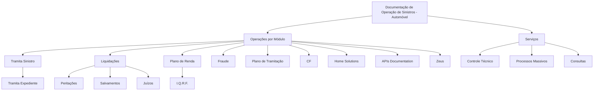

# Documentação de Operação de Sinistros (Automóvel): Módulos, Serviços e Operações

## 1. Metadados do Documento
- **Arquivo de Origem:** Não identificado
- **Tipo de Documento:** Apresentação Executiva / Formação Operacional
- **Domínio / Sistema:** Operação de Sinistros — Automóvel
- **Público-Alvo:** Operação de sinistros e usuários de negócio
- **Data/Versão Identificada:** Não identificada

---

## 2. Resumo Executivo & Contexto de Negócio

O documento apresenta uma visão resumida da documentação de operação de sinistros para o segmento de Automóvel. O conteúdo é orientado à formação operacional e à classificação das operações por módulo e por tipo de negócio.

A estrutura lista operações relacionadas ao tratamento de sinistros, expedientes, liquidações, peritações, salvamentos, juízos, plano de renda, fraude, plano de tramitação e outros itens identificados como `I.Q.R.F.`, `CF`, `Home Solutions`, `APIs Documentation` e `Zeus`.

O documento também relaciona serviços de controle técnico, processos massivos e consultas. Não há descrição detalhada dos fluxos operacionais, regras de negócio, contratos de APIs, responsabilidades por módulo ou critérios de execução.

> **Nota de Análise:** O documento fornece uma taxonomia de operações e serviços de sinistros, mas não detalha integrações, métodos HTTP, estruturas de dados, parâmetros de ambiente ou procedimentos operacionais.

---

## 3. Arquitetura, Componentes & Tecnologias Envolvidas

Os componentes e termos identificados no documento são:

- Operação de Sinistros — Automóvel
- Tramita Sinistro
- Tramita Expediente
- Liquidações
- Peritações
- Salvamentos
- Juízos
- Plano de Renda
- I.Q.R.F.
- Fraude
- Plano de Tramitação
- CF
- Home Solutions
- APIs Documentation
- Zeus
- Serviços
- Controle Técnico
- Processos Massivos
- Consultas



> **Nota de Análise:** O diagrama representa exclusivamente a organização hierárquica aparente do conteúdo. O documento não confirma dependências técnicas, comunicação entre sistemas ou sequência operacional entre os módulos.

---

## 4. Regras de Negócio, Especificações Funcionais & Processos

O documento não apresenta regras de negócio explícitas, fórmulas de cálculo, validações, condições de aprovação, critérios de liquidação ou procedimentos passo a passo.

As informações funcionais disponíveis limitam-se à enumeração das seguintes áreas operacionais:

1. **Tramita Sinistro:** operação listada como módulo de tratamento de sinistros.
2. **Tramita Expediente:** operação apresentada como item associado a Tramita Sinistro.
3. **Liquidações:** área operacional que contém Peritações, Salvamentos e Juízos.
4. **Peritações:** item listado sob Liquidações.
5. **Salvamentos:** item listado sob Liquidações.
6. **Juízos:** item listado sob Liquidações.
7. **Plano de Renda:** área que contém o item I.Q.R.F.
8. **I.Q.R.F.:** sigla listada sob Plano de Renda, sem expansão ou definição.
9. **Fraude:** operação ou módulo listado sem detalhamento.
10. **Plano de Tramitação:** operação ou módulo listado sem detalhamento.
11. **CF:** sigla ou módulo listado sem definição.
12. **Home Solutions:** termo ou componente listado sem detalhamento funcional.
13. **APIs Documentation:** referência a documentação de APIs, sem indicar endpoints, autenticação ou contratos.
14. **Zeus:** sistema, módulo ou ferramenta listada sem descrição.
15. **Controle Técnico:** serviço listado sem procedimentos ou indicadores.
16. **Processos Massivos:** serviço listado sem definição de cargas, periodicidade ou processamento.
17. **Consultas:** serviço listado sem detalhamento de consultas disponíveis.

---

## 5. Tabelas de Parâmetros, Ambientes e Estruturas de Dados

| Item / Parâmetro | Descrição / Função | Tipo / Valores / Formato | Ambiente / Observações |
| :--- | :--- | :--- | :--- |
| Operação de Sinistros | Domínio principal apresentado pelo documento. | Operação de negócio | Segmento: Automóvel |
| Tramita Sinistro | Módulo ou operação listada para tratamento de sinistros. | Módulo operacional | Sem detalhamento adicional |
| Tramita Expediente | Item apresentado sob Tramita Sinistro. | Operação ou submódulo | Sem detalhamento adicional |
| Liquidações | Área operacional que agrupa Peritações, Salvamentos e Juízos. | Módulo operacional | Sem detalhamento adicional |
| Peritações | Item listado sob Liquidações. | Operação ou submódulo | Sem detalhamento adicional |
| Salvamentos | Item listado sob Liquidações. | Operação ou submódulo | Sem detalhamento adicional |
| Juízos | Item listado sob Liquidações. | Operação ou submódulo | Sem detalhamento adicional |
| Plano de Renda | Área que agrupa I.Q.R.F. | Módulo operacional | Sem detalhamento adicional |
| I.Q.R.F. | Sigla listada sob Plano de Renda. | Sigla / item funcional | Significado não informado |
| Fraude | Operação ou módulo listado. | Módulo operacional | Sem detalhamento adicional |
| Plano de Tramitação | Operação ou módulo listado. | Módulo operacional | Sem detalhamento adicional |
| CF | Sigla ou módulo listado. | Sigla / componente | Significado não informado |
| Home Solutions | Termo listado no documento. | Sistema, módulo ou referência | Sem detalhamento adicional |
| APIs Documentation | Referência à documentação de APIs. | Documentação técnica | Não informa APIs, endpoints ou contratos |
| Zeus | Termo listado no documento. | Sistema, módulo ou ferramenta | Sem detalhamento adicional |
| Controle Técnico | Serviço listado. | Serviço operacional | Sem detalhamento adicional |
| Processos Massivos | Serviço listado. | Serviço operacional | Não informa periodicidade ou processamento |
| Consultas | Serviço listado. | Serviço operacional | Não informa consultas disponíveis |

---

## 6. Bateria de Perguntas & Respostas para RAG (FAQ Sintético)

### P1: Qual é o domínio de negócio abordado pelo documento?
**R:** O documento aborda a operação de sinistros no segmento de Automóvel, apresentando módulos operacionais e serviços associados à documentação de operação de sinistros.

### P2: Quais operações estão listadas no módulo de Liquidações?
**R:** O módulo de Liquidações contém os itens Peritações, Salvamentos e Juízos. O documento não detalha o objetivo, fluxo ou regras de cada item.

### P3: Tramita Expediente pertence a qual área operacional?
**R:** Tramita Expediente é apresentado como um item associado a Tramita Sinistro. O documento não informa se a relação é de submódulo, etapa de processo ou funcionalidade.

### P4: Quais serviços são mencionados para a operação de sinistros?
**R:** O documento menciona os serviços Controle Técnico, Processos Massivos e Consultas. Não há descrição de responsabilidades, entradas, saídas ou procedimentos para esses serviços.

### P5: O documento descreve APIs, endpoints ou contratos de integração?
**R:** Não. O documento contém o termo `APIs Documentation`, mas não apresenta URLs, métodos HTTP, autenticação, payloads, contratos JSON ou especificações de integração.

### P6: O que significa a sigla I.Q.R.F.?
**R:** A sigla I.Q.R.F. aparece sob Plano de Renda, mas o documento não fornece sua expansão, definição funcional ou regras relacionadas.

### P7: Qual é a relação entre Plano de Renda e I.Q.R.F.?
**R:** O conteúdo posiciona I.Q.R.F. como item relacionado a Plano de Renda. Não há detalhamento sobre o processo, cálculo, validação ou finalidade operacional dessa relação.

### P8: O documento apresenta regras para detecção ou tratamento de fraude?
**R:** Não. Fraude é apenas listada como operação ou módulo. Não são fornecidas regras, indicadores, etapas de investigação, integrações ou critérios de decisão.

### P9: Zeus é identificado como qual tipo de componente?
**R:** Zeus é apenas citado no documento. Não há informação suficiente para classificá-lo com certeza como sistema, módulo, ferramenta, serviço ou ambiente.

### P10: Existem informações sobre ambientes, servidores, URLs ou configurações técnicas?
**R:** Não. O documento não informa ambientes, servidores, endereços, portas, variáveis de configuração, caminhos de log ou credenciais.

---

## 7. Glossário de Termos, Siglas & Conceitos-Chave

- **APIs Documentation:** Referência textual à documentação de APIs; o documento não apresenta detalhes técnicos adicionais.
- **CF:** Sigla listada no conteúdo, sem expansão ou definição.
- **Controle Técnico:** Serviço mencionado na seção de serviços, sem detalhamento operacional.
- **Consultas:** Serviço mencionado na seção de serviços, sem detalhamento das consultas disponíveis.
- **Fraude:** Operação ou módulo relacionado ao domínio de sinistros, sem regras especificadas.
- **Home Solutions:** Termo citado sem descrição funcional ou técnica.
- **I.Q.R.F.:** Sigla listada sob Plano de Renda, sem significado definido.
- **Juízos:** Item listado sob Liquidações, sem detalhamento.
- **Liquidações:** Área operacional que agrupa Peritações, Salvamentos e Juízos.
- **Peritações:** Item listado sob Liquidações, sem detalhamento.
- **Plano de Renda:** Área operacional relacionada a I.Q.R.F.
- **Plano de Tramitação:** Operação ou módulo listado sem especificação.
- **Processos Massivos:** Serviço listado sem informações sobre processamento ou agendamento.
- **Salvamentos:** Item listado sob Liquidações, sem detalhamento.
- **Tramita Expediente:** Item apresentado sob Tramita Sinistro.
- **Tramita Sinistro:** Módulo ou operação de tratamento de sinistros.
- **Zeus:** Termo listado sem definição.

---

## 8. Notas Críticas, Riscos & Limitações

- O conteúdo disponível é predominantemente uma lista de módulos, operações e serviços, sem descrição funcional detalhada.
- Não foram identificadas regras de negócio, critérios de validação, contratos de integração, estruturas de dados ou parâmetros técnicos.
- Não há informação sobre versões, responsáveis, ambientes, servidores, URLs, logs ou procedimentos de suporte.
- As siglas `I.Q.R.F.` e `CF` não são expandidas nem contextualizadas.
- Os termos `Home Solutions` e `Zeus` são citados sem classificação ou relacionamento técnico explícito.
- O diagrama Mermaid é uma representação estrutural inferida pela hierarquia visual do conteúdo, não um diagrama técnico original.
- A ausência de detalhamento impede confirmar fluxos de ponta a ponta entre Tramita Sinistro, Liquidações, Plano de Renda, Fraude e Serviços.

---

## 9. Conteúdo Bruto Estruturado (Referência Fiel)

```text
--- [PÁGINA 1 DE 2] ---

DOCUMENTACIÓN de OPERACIÓN de
SINIESTROS (Automóvil)
Imagen Operación Siniestros Común Formación orientada a la operación y tipo de negocio
OPERACIONES por MÓDULO
 TRAMITA SINIESTRO
  TRAMITA EXPEDIENTE
 LIQUIDACIONES
  PERITACIONES
 SALVAMENTOS
  JUICIOS
 PLAN DE RENTA
  I.Q.R.F.
 FRAUDE
  PLAN DE TRAMITACIÓN
 / 
 CF
Home Solutions APIs Documentation Zeus
EN


--- [PÁGINA 2 DE 2] ---

SERVICIOS
  CONTROL TÉCNICO
 PROCESOS MASIVOS
  CONSULTAS
```
