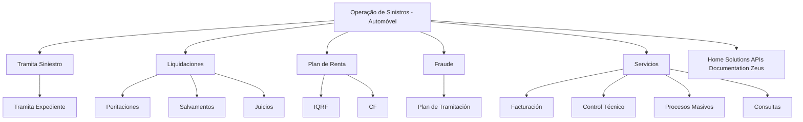

# Documentação de Operação de Sinistros (Automóvel)

## 1. Metadados do Documento
- **Arquivo de Origem:** Não identificado
- **Tipo de Documento:** Manual Operacional / Material de Formação
- **Domínio / Sistema:** Operação de Sinistros de Automóvel
- **Público-Alvo:** Operação, analistas funcionais e equipes de negócio
- **Data/Versão Identificada:** Não identificada

---

## 2. Resumo Executivo & Contexto de Negócio

O documento apresenta uma visão de formação orientada à operação de **Sinistros (Automóvel)** e aos tipos de negócio tratados nesse domínio. O conteúdo organiza os principais módulos, processos e áreas funcionais associados à tramitação e gestão operacional de sinistros.

A estrutura apresentada abrange a tramitação de sinistros e expedientes, liquidações, peritações, salvamentos, juízos, plano de renda, fraude, faturação, controlo técnico, processos massivos e consultas. Esses itens representam os temas ou capacidades operacionais explicitamente listados no material.

O documento também referencia elementos denominados **Home Solutions APIs Documentation Zeus** e as siglas **IQRF** e **CF**. Entretanto, o conteúdo disponível não descreve responsabilidades, integrações, APIs, contratos, tecnologias, ambientes ou fluxos técnicos para esses elementos.

> **Nota de Análise:** O material é predominantemente uma enumeração de módulos e tópicos. Não há detalhamento adicional sobre regras de negócio, passos operacionais, critérios de validação, responsabilidades, URLs, logs, versões ou contratos de serviço.

---

## 3. Arquitetura, Componentes & Tecnologias Envolvidas

Os componentes ou áreas explicitamente mencionados são:

- Tramita Siniestro
- Tramita Expediente
- Liquidaciones
- Peritaciones
- Salvamentos
- Juicios
- Plan de Renta
- IQRF
- CF
- Fraude
- Plan de Tramitación
- Servicios
- Facturación
- Control Técnico
- Procesos Masivos
- Consultas
- Home Solutions APIs Documentation Zeus

O texto não apresenta arquitetura técnica, camadas de aplicação, protocolos de comunicação, dependências entre sistemas ou tecnologias implementadas. O diagrama abaixo representa somente a organização conceitual dos tópicos listados.



> **Nota de Análise:** As relações hierárquicas do diagrama foram inferidas exclusivamente da disposição visual do conteúdo bruto. O documento não confirma fluxos transacionais, chamadas entre sistemas ou dependências técnicas entre os módulos.

---

## 4. Regras de Negócio, Especificações Funcionais & Processos

O documento estabelece que a formação é orientada à **operação** e ao **tipo de negócio** no contexto de sinistros de automóvel.

Os tipos de operação e áreas citadas são:

1. **Tramita Siniestro**
   - O documento lista a tramitação de sinistro como um tipo de operação.
   - Não são apresentados estados, regras de transição, campos obrigatórios ou critérios de encerramento.

2. **Tramita Expediente**
   - O documento associa a tramitação de expediente ao contexto de tramitação de sinistro.
   - Não há definição de expediente, fluxo operacional ou relação detalhada com outros módulos.

3. **Liquidaciones**
   - Liquidaciones é apresentada como área de operação.
   - Não são especificados cálculos, critérios de elegibilidade, valores, moedas, aprovações ou integrações.

4. **Peritaciones**
   - Peritaciones é listada no material.
   - Não são descritos processos de perícia, participantes, evidências, laudos ou decisões.

5. **Salvamentos**
   - Salvamentos é citado como tópico de operação.
   - Não há detalhamento sobre gestão, avaliação, venda, retenção ou destino de salvados.

6. **Juicios**
   - Juicios é listado no documento.
   - Não são informados eventos jurídicos, prazos, responsáveis ou integrações associadas.

7. **Plan de Renta**
   - Plan de Renta é apresentado juntamente com IQRF e CF.
   - O texto não define a finalidade do plano, nem o significado ou a função de IQRF e CF.

8. **Fraude**
   - Fraude é apresentada como área ou tema operacional.
   - O documento não descreve indicadores, regras de detecção, investigação, bloqueio ou tratamento de suspeitas.

9. **Plan de Tramitación**
   - Plan de Tramitación é listado sob Fraude.
   - Não há explicação sobre etapas, regras, responsáveis ou condições de execução.

10. **Servicios**
    - Servicios é apresentado como uma categoria que inclui Facturación, Control Técnico, Procesos Masivos e Consultas.
    - Não são descritos contratos, níveis de serviço, interfaces ou mecanismos de execução.

11. **Facturación**
    - Facturación é citada como tópico de serviços.
    - Não há regras de emissão, validação, impostos, documentos ou integrações financeiras.

12. **Control Técnico**
    - Control Técnico é listado no documento.
    - Não são detalhados critérios técnicos, controles, métricas ou evidências requeridas.

13. **Procesos Masivos**
    - Procesos Masivos é apresentado como tópico operacional.
    - Não há informação sobre agendamento, entrada, saída, volumes, exceções ou monitoramento.

14. **Consultas**
    - Consultas é listada como capacidade funcional.
    - Não são descritas consultas disponíveis, filtros, perfis de acesso, fontes de dados ou resultados.

---

## 5. Tabelas de Parâmetros, Ambientes e Estruturas de Dados

| Item / Parâmetro | Descrição / Função | Tipo / Valores / Formato | Ambiente / Observações |
| :--- | :--- | :--- | :--- |
| Domínio | Operação de sinistros de automóvel | Tema de negócio | Explicitamente citado no título |
| Formação | Formação orientada à operação e ao tipo de negócio | Material de formação | Não há duração, público detalhado ou trilha descritos |
| Tramita Siniestro | Tipo de operação listado | Módulo ou processo operacional | Sem detalhamento adicional |
| Tramita Expediente | Tópico associado à tramitação | Módulo ou processo operacional | Sem detalhamento adicional |
| Liquidaciones | Área de operação listada | Módulo ou processo operacional | Sem regras de cálculo ou liquidação |
| Peritaciones | Área de operação listada | Módulo ou processo operacional | Sem detalhamento adicional |
| Salvamentos | Área de operação listada | Módulo ou processo operacional | Sem detalhamento adicional |
| Juicios | Área de operação listada | Módulo ou processo operacional | Sem detalhamento adicional |
| Plan de Renta | Tópico listado | Plano, módulo ou processo não especificado | Relacionado visualmente a IQRF e CF |
| IQRF | Sigla listada | Sigla não expandida | Significado não informado |
| CF | Sigla listada | Sigla não expandida | Significado não informado |
| Fraude | Área ou tema operacional | Módulo, processo ou domínio não especificado | Associado visualmente a Plan de Tramitación |
| Plan de Tramitación | Tópico de tramitação listado | Plano ou processo não especificado | Sem etapas descritas |
| Servicios | Categoria funcional listada | Área funcional | Relacionada visualmente a Facturación, Control Técnico, Procesos Masivos e Consultas |
| Facturación | Tópico de serviços listado | Processo funcional | Sem detalhamento adicional |
| Control Técnico | Tópico de serviços listado | Processo funcional | Sem detalhamento adicional |
| Procesos Masivos | Tópico de serviços listado | Processo operacional | Sem detalhamento adicional |
| Consultas | Tópico de serviços listado | Capacidade funcional | Sem catálogo de consultas |
| Home Solutions APIs Documentation Zeus | Elemento textual citado | Sistema, documentação ou referência não especificada | O documento não detalha sua função |

> **Nota de Análise:** O conteúdo não apresenta parâmetros técnicos, rotas de log, servidores, ambientes, URLs, variáveis, campos de dados ou estruturas de payload.

---

## 6. Bateria de Perguntas & Respostas para RAG (FAQ Sintético)

### P1: Qual é o domínio de negócio abordado pela documentação?
**R:** A documentação aborda a operação de **Sinistros (Automóvel)**. O material declara que a formação é orientada à operação e ao tipo de negócio desse domínio.

### P2: Quais tipos de operação são explicitamente citados no documento?
**R:** O documento cita Tramita Siniestro, Tramita Expediente, Liquidaciones, Peritaciones, Salvamentos, Juicios, Plan de Renta, Fraude, Plan de Tramitación, Servicios, Facturación, Control Técnico, Procesos Masivos e Consultas.

### P3: O documento descreve o fluxo detalhado de tramitação de um sinistro?
**R:** Não. O conteúdo apenas lista **Tramita Siniestro** e **Tramita Expediente**, sem apresentar etapas, estados, critérios de decisão, responsáveis ou regras de transição.

### P4: Quais informações o documento fornece sobre liquidações?
**R:** O documento lista **Liquidaciones** como uma área de operação. Não apresenta regras de cálculo, valores, aprovações, critérios de elegibilidade, documentos ou integração com sistemas financeiros.

### P5: O que é descrito sobre peritações e salvamentos?
**R:** **Peritaciones** e **Salvamentos** são mencionados como tópicos operacionais. O conteúdo não detalha processos de perícia, laudos, avaliação de salvados, tratamento de bens ou responsáveis.

### P6: O documento explica o significado das siglas IQRF e CF?
**R:** Não. As siglas **IQRF** e **CF** são listadas junto a **Plan de Renta**, mas não possuem expansão ou definição no conteúdo fornecido.

### P7: Existe uma especificação técnica das APIs ou do componente Zeus?
**R:** Não. O material contém a referência textual **Home Solutions APIs Documentation Zeus**, mas não apresenta endpoints, métodos HTTP, contratos JSON, autenticação, ambientes, URLs, logs ou tecnologias relacionadas.

### P8: Quais capacidades são apresentadas sob a categoria Servicios?
**R:** O documento apresenta **Facturación**, **Control Técnico**, **Procesos Masivos** e **Consultas** como tópicos associados visualmente a **Servicios**.

### P9: Quais regras de prevenção ou tratamento de fraude estão documentadas?
**R:** Nenhuma regra é detalhada. O documento lista **Fraude** e **Plan de Tramitación**, mas não fornece critérios de detecção, indicadores, etapas de investigação, bloqueios ou procedimentos de resolução.

### P10: O documento contém informações sobre ambientes, servidores ou URLs?
**R:** Não. O conteúdo fornecido não informa ambientes, endereços de servidores, URLs, portas, variáveis de configuração ou rotas de logs.

### P11: O documento especifica como funcionam os processos massivos?
**R:** Não. **Procesos Masivos** é apenas citado como tópico associado a Servicios; não há descrição de agendamentos, cargas de entrada, resultados, erros, reprocessamento ou monitoramento.

### P12: Há descrição das consultas disponíveis para a operação de sinistros?
**R:** Não. **Consultas** é listada como uma capacidade, mas o documento não apresenta consultas específicas, filtros, campos retornados, fontes de dados ou perfis autorizados.

---

## 7. Glossário de Termos, Siglas & Conceitos-Chave

- **Sinistros (Automóvel):** Domínio de negócio identificado no título do documento, relacionado à operação de sinistros de automóvel.
- **Tramita Siniestro:** Operação ou módulo listado para tramitação de sinistro; o documento não detalha seu funcionamento.
- **Tramita Expediente:** Operação ou módulo listado para tramitação de expediente; o documento não detalha seu funcionamento.
- **Liquidaciones:** Área operacional listada; não há regras de liquidação descritas.
- **Peritaciones:** Área operacional listada; não há definição adicional no documento.
- **Salvamentos:** Área operacional listada; não há definição adicional no documento.
- **Juicios:** Área operacional listada; não há definição adicional no documento.
- **Plan de Renta:** Tópico listado; sua finalidade não é especificada.
- **IQRF:** Sigla citada no documento; significado não informado.
- **CF:** Sigla citada no documento; significado não informado.
- **Fraude:** Tema ou área operacional listada; não há regras de negócio descritas.
- **Plan de Tramitación:** Tópico associado visualmente a Fraude; sem detalhamento de processo.
- **Servicios:** Categoria funcional que inclui Facturación, Control Técnico, Procesos Masivos e Consultas.
- **Facturación:** Tópico de serviços relacionado a faturação; sem detalhamento adicional.
- **Control Técnico:** Tópico de serviços; sem critérios ou definições adicionais.
- **Procesos Masivos:** Tópico de serviços; sem definição de execução em lote.
- **Consultas:** Capacidade funcional listada; sem catálogo ou regras de acesso.
- **Home Solutions APIs Documentation Zeus:** Referência textual a Home Solutions, APIs, documentação e Zeus; sem contexto técnico adicional.

---

## 8. Notas Críticas, Riscos & Limitações

- O conteúdo disponível é resumido e não contém especificações funcionais detalhadas.
- Não foram identificados fluxos operacionais passo a passo, máquinas de estado ou critérios de validação.
- Não foram identificados contratos de integração, APIs, métodos HTTP, payloads, autenticação ou tecnologias.
- Não foram identificados dados de ambiente, URLs, servidores, portas, logs, variáveis de configuração ou versões.
- As siglas **IQRF** e **CF** não são expandidas no documento.
- A referência **Home Solutions APIs Documentation Zeus** não possui descrição de propósito, responsabilidades ou integração.
- As associações entre tópicos no diagrama são representações da estrutura visual do texto, não comprovações de dependência técnica ou transacional.

---

## 9. Conteúdo Bruto Estruturado (Referência Fiel)

```text
--- [PÁGINA 1 DE 2] ---

DOCUMENTACIÓN de OPERACIÓN de
SINIESTROS (Automóvil)
 Formación orientada a la operación y tipo de negocio
TIPOS DE OPERACIÓN por MÓDULO
 TRAMITA SINIESTRO
  TRAMITA EXPEDIENTE
 LIQUIDACIONES
  PERITACIONES
 SALVAMENTOS
  JUICIOS
 PLAN DE RENTA
  IQRF
 / 
 CF
Home Solutions APIs Documentation Zeus
EN


--- [PÁGINA 2 DE 2] ---

FRAUDE
  PLAN DE TRAMITACIÓN
 SERVICIOS
  FACTURACIÓN
 CONTROL TÉCNICO
  PROCESOS MASIVOS
 CONSULTAS
```
