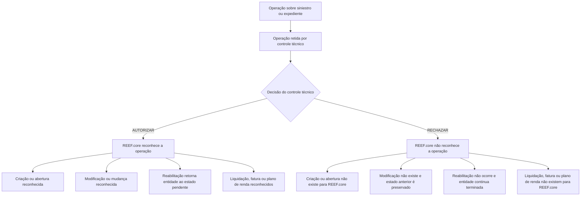

# Operações de Controle Técnico de Sinistros e Expedientes no REEF.core

## 1. Metadados do Documento
- **Arquivo de Origem:** `Não identificado no conteúdo fornecido`
- **Tipo de Documento:** Manual Operacional / Documentação de Operações
- **Domínio / Sistema:** Sinistros — Controle Técnico (Automóvel) — REEF.core
- **Público-Alvo:** Operação, Analistas Funcionais, Negócio e Desenvolvedores
- **Data/Versão Identificada:** Não identificada

---

## 2. Resumo Executivo & Contexto de Negócio

O documento descreve operações de **autorização** e **rejeição** aplicadas a entidades de sinistros que foram retidas por controle técnico de auditoria. O escopo explícito é o domínio de **Siniestros Control Técnico (Automóvil)**, integrado ao sistema **REEF.core**.

O controle técnico atua como uma etapa de retenção para alterações relacionadas a sinistros, expedientes, valorações, liquidações, faturamento e planos de renda. Enquanto uma operação permanece retida, seus efeitos não são reconhecidos pelo restante do REEF.core até que ocorra uma autorização.

A autorização faz com que o REEF.core reconheça a criação, alteração, reabilitação ou efeito financeiro correspondente. A rejeição impede o reconhecimento da operação retida e, dependendo da natureza da operação, mantém o estado anterior, preserva uma valoração prévia ou mantém a entidade como terminada.

O documento apresenta efeitos funcionais, mas não descreve interfaces técnicas, métodos HTTP, contratos JSON, persistência, perfis de acesso, responsáveis pela auditoria ou critérios usados para decidir entre autorização e rejeição.

---

## 3. Arquitetura, Componentes & Tecnologias Envolvidas

### Componentes e conceitos identificados

| Componente / Conceito | Papel identificado no documento |
| :--- | :--- |
| REEF.core | Sistema que reconhece ou deixa de reconhecer operações após autorização ou rejeição pelo controle técnico. |
| Controle técnico | Etapa de retenção e auditoria de operações de sinistros e expedientes. |
| Siniestro | Sinistro sujeito a abertura, modificação e reabilitação. |
| Expediente | Entidade associada ao sinistro, sujeita a abertura, mudança de valoração, reabilitação, liquidação, faturamento e plano de renda. |
| Factura | Fatura vinculada a um expediente. Pode ser criada ou modificada sob controle técnico. |
| Plan de Renta | Plano de renda criado para um expediente e submetido ao controle técnico. |
| Liquidación | Liquidação de um expediente, incluindo o reconhecimento de nova liquidação e ordem de pagamento quando autorizada. |
| Home Solutions APIs Documentation Zeus | Termo listado no conteúdo bruto, sem explicação de função ou relação técnica com o fluxo. |
| CF | Termo listado no conteúdo bruto, sem detalhamento adicional. |



> **Nota de Análise:** o documento não especifica os componentes responsáveis por reter, autorizar ou rejeitar as operações, nem os mecanismos técnicos de integração com REEF.core.

---

## 4. Regras de Negócio, Especificações Funcionais & Processos

### 4.1 Princípio geral do controle técnico

1. Uma operação pode ficar retida por controle técnico.
2. Uma operação retida pode ser autorizada ou rejeitada.
3. A autorização permite que o restante do REEF.core reconheça o resultado da operação.
4. A rejeição impede que o restante do REEF.core reconheça a operação.
5. Para modificações rejeitadas, o estado anterior permanece válido para o REEF.core.
6. Para reabilitações rejeitadas, a entidade permanece terminada.
7. Para aberturas rejeitadas, a entidade não existe — nem existiu — para o REEF.core, conforme descrito para abertura de sinistro.

### 4.2 Operações sobre sinistros

#### AUTORIZAR Apertura Siniestro
- Um sinistro retido por controle técnico passa a estar aprovado.
- O restante do REEF.core reconhece o sinistro.

#### AUTORIZAR Modificación siniestro
- Uma modificação de sinistro retida por controle técnico passa a estar aprovada.
- O restante do REEF.core reconhece a modificação do sinistro.

#### AUTORIZAR Rehabilitación siniestro
- Uma reabilitação de sinistro retida por controle técnico passa a estar aprovada.
- O restante do REEF.core reconhece que o sinistro volta a estar pendente.

#### RECHAZAR Apertura siniestro
- Um sinistro retido por controle técnico não é autorizado.
- Para o REEF.core, o sinistro não existe e não existiu.

#### RECHAZAR Modificación siniestro
- Uma modificação de sinistro retida por controle técnico não é autorizada.
- O documento informa que a operação não existe para o restante do REEF.core.

#### RECHAZAR Rehabilitación siniestro
- Uma reabilitação de sinistro retida por controle técnico não é autorizada.
- Para o restante do REEF.core, o sinistro continua terminado.

### 4.3 Operações sobre expedientes

#### AUTORIZAR Apertura expediente
- Um expediente retido por controle técnico passa a estar aprovado.
- O restante do REEF.core reconhece o expediente.

#### AUTORIZAR Cambio valoración
- Uma modificação de valoração de expediente retida por controle técnico passa a estar aprovada.
- O restante do REEF.core reconhece a nova valoração do expediente.

#### AUTORIZAR Rehabilitación expediente
- Uma reabilitação de expediente retida por controle técnico passa a estar aprovada.
- O restante do REEF.core reconhece que o expediente volta a estar pendente.

#### AUTORIZAR Liquidación
- Uma liquidação de expediente retida por controle técnico passa a estar aprovada.
- O restante do REEF.core reconhece a nova liquidação.
- O restante do REEF.core reconhece a ordem de pagamento do expediente.

#### RECHAZAR Apertura expediente
- Um expediente retido por controle técnico não é autorizado.
- Para o restante do REEF.core, o expediente não existe.

#### RECHAZAR Cambio valoración
- Uma modificação de valoração retida por controle técnico não é autorizada.
- O restante do REEF.core preserva a valoração anterior à mudança rejeitada.

#### RECHAZAR Rehabilitación expediente
- Uma reabilitação de expediente retida por controle técnico não é autorizada.
- Para o restante do REEF.core, o expediente continua terminado.

#### RECHAZAR Liquidación
- Uma liquidação retida por controle técnico não é autorizada.
- Para o restante do REEF.core, a liquidação não existe.

### 4.4 Operações de faturamento e plano de renda

#### AUTORIZAR creación facturación
- Uma fatura criada para um expediente e retida por controle técnico é autorizada e validada.
- O restante do REEF.core reconhece a nova fatura.

#### AUTORIZAR modificación facturación
- Uma modificação de fatura realizada para um expediente e retida por controle técnico é aceita.
- O restante do REEF.core reconhece a modificação da fatura.

#### AUTORIZAR plan renta
- Um plano de renda criado para um expediente e retido por controle técnico é autorizado.
- O restante do REEF.core reconhece o plano de renda.

#### RECHAZAR creación facturación
- Uma fatura criada para um expediente e retida por controle técnico não é autorizada.
- A fatura não existe para o REEF.core.

#### RECHAZAR modificación facturación
- Uma modificação de fatura retida por controle técnico não é autorizada.
- Para o restante do REEF.core, a modificação não existe.
- O REEF.core permanece com a situação anterior à modificação.

#### RECHAZAR plan renta
- Um plano de renda criado para um expediente e retido por controle técnico não é autorizado.
- Para o restante do REEF.core, o plano de renda não existe.

---

## 5. Tabelas de Parâmetros, Ambientes e Estruturas de Dados

| Item / Parâmetro | Descrição / Função | Tipo / Valores / Formato | Ambiente / Observações |
| :--- | :--- | :--- | :--- |
| Decisão de controle técnico | Define o tratamento de uma operação retida. | `AUTORIZAR` ou `RECHAZAR` | Não são informados critérios de decisão. |
| Apertura siniestro | Criação ou abertura de sinistro. | Operação de sinistro | Autorizada: sinistro reconhecido. Rejeitada: sinistro não existe para REEF.core. |
| Modificación siniestro | Alteração realizada em sinistro. | Operação de sinistro | Autorizada: modificação reconhecida. Rejeitada: operação não reconhecida. |
| Rehabilitación siniestro | Reabilitação de sinistro terminado. | Operação de sinistro | Autorizada: sinistro volta a estar pendente. Rejeitada: sinistro continua terminado. |
| Apertura expediente | Criação ou abertura de expediente. | Operação de expediente | Autorizada: expediente reconhecido. Rejeitada: expediente não existe para REEF.core. |
| Cambio valoración | Alteração da valoração de um expediente. | Operação de expediente | Autorizada: nova valoração reconhecida. Rejeitada: valoração anterior é preservada. |
| Rehabilitación expediente | Reabilitação de expediente terminado. | Operação de expediente | Autorizada: expediente volta a estar pendente. Rejeitada: expediente continua terminado. |
| Liquidación | Liquidação de expediente. | Operação financeira de expediente | Autorizada: nova liquidação e ordem de pagamento reconhecidas. Rejeitada: liquidação não existe para REEF.core. |
| Creación facturación | Criação de fatura de expediente. | Operação de faturamento | Autorizada e validada: nova fatura reconhecida. Rejeitada: fatura não existe. |
| Modificación facturación | Modificação de fatura de expediente. | Operação de faturamento | Autorizada: alteração reconhecida. Rejeitada: situação anterior da fatura é mantida. |
| Plan renta | Plano de renda criado para expediente. | Operação vinculada a expediente | Autorizada: plano reconhecido. Rejeitada: plano não existe para REEF.core. |
| Ambientes | Não há ambientes identificados. | Não informado | Não há URLs, servidores, portas ou rotas de log no conteúdo. |

---

## 6. Bateria de Perguntas & Respostas para RAG (FAQ Sintético)

### P1: O que acontece quando a abertura de um sinistro retido por controle técnico é autorizada?
**R:** O sinistro passa a estar aprovado e o restante do REEF.core passa a reconhecê-lo como sinistro.

### P2: Qual é o efeito de rejeitar a abertura de um sinistro no REEF.core?
**R:** O sinistro não é autorizado e, para o REEF.core, o sinistro não existe nem existiu.

### P3: Como o REEF.core trata uma modificação de sinistro autorizada pelo controle técnico?
**R:** A modificação retida passa a estar aprovada, e o restante do REEF.core reconhece a modificação realizada no sinistro.

### P4: O que ocorre se a reabilitação de um sinistro for rejeitada?
**R:** A reabilitação não é autorizada e o sinistro continua terminado para o restante do REEF.core.

### P5: Qual é o resultado da autorização de uma mudança de valoração de expediente?
**R:** A modificação de valoração passa a estar aprovada e o restante do REEF.core reconhece a nova valoração do expediente.

### P6: Qual valoração é mantida quando uma mudança de valoração é rejeitada?
**R:** O REEF.core permanece com a valoração anterior à mudança rejeitada.

### P7: O que a autorização de uma liquidação de expediente produz no REEF.core?
**R:** A nova liquidação é reconhecida pelo restante do REEF.core, assim como a ordem de pagamento do expediente.

### P8: Qual é o efeito da rejeição de uma liquidação retida por controle técnico?
**R:** A liquidação não é autorizada e, para o restante do REEF.core, essa liquidação não existe.

### P9: Como é tratada uma criação de fatura autorizada?
**R:** A fatura criada para o expediente, após ser autorizada e validada, é reconhecida pelo restante do REEF.core como uma nova fatura.

### P10: O que ocorre quando uma modificação de fatura é rejeitada?
**R:** A modificação não existe para o restante do REEF.core, que permanece com a situação anterior à modificação da fatura.

### P11: O que acontece quando um plano de renda é autorizado?
**R:** O plano de renda criado para o expediente e retido por controle técnico é autorizado, fazendo com que o restante do REEF.core reconheça o plano de renda.

### P12: O documento define métodos HTTP, contratos JSON ou APIs para as operações de controle técnico?
**R:** Não. O documento descreve apenas os efeitos funcionais das autorizações e rejeições. Métodos HTTP, contratos JSON, endpoints e mecanismos de integração não são detalhados.

---

## 7. Glossário de Termos, Siglas & Conceitos-Chave

- **REEF.core:** Sistema que reconhece ou deixa de reconhecer as operações após a decisão de controle técnico.
- **Controle técnico:** Processo de auditoria no qual operações ficam retidas antes de serem autorizadas ou rejeitadas.
- **Siniestro:** Sinistro; entidade sujeita a abertura, modificação e reabilitação.
- **Expediente:** Entidade vinculada ao sinistro, sujeita a abertura, valoração, reabilitação, liquidação, faturamento e plano de renda.
- **Apertura:** Operação de abertura ou criação de sinistro ou expediente.
- **Modificación:** Alteração realizada em uma entidade existente.
- **Rehabilitación:** Operação que faz um sinistro ou expediente voltar a estar pendente quando autorizada.
- **Valoración:** Valoração associada a um expediente.
- **Liquidación:** Liquidação de expediente, associada no documento ao reconhecimento de ordem de pagamento.
- **Facturación:** Processo de criação ou modificação de faturas vinculadas a expedientes.
- **Plan de Renta:** Plano de renda criado para um expediente.
- **CF:** Termo apresentado no conteúdo bruto sem definição.
- **Zeus:** Termo apresentado em “Home Solutions APIs Documentation Zeus”, sem detalhamento adicional.

---

## 8. Notas Críticas, Riscos & Limitações

- O documento não identifica o arquivo de origem, autor, versão, data, ambiente ou responsáveis operacionais.
- Não há definição dos critérios de auditoria que levam uma operação a ser autorizada ou rejeitada.
- Não há detalhes sobre interfaces, APIs, endpoints, métodos HTTP, autenticação, eventos, filas, banco de dados ou contratos de integração.
- Não são apresentados perfis de acesso, segregação de funções ou trilha de auditoria para autorizações e rejeições.
- A descrição da rejeição de **Modificación siniestro** informa que “hace que el resto de Reef.core no existe”, mas não detalha explicitamente se o REEF.core preserva o estado anterior do sinistro, como ocorre nas modificações de valoração e faturamento.
- O documento cita “Home Solutions APIs Documentation Zeus” e “CF”, mas não explica seu papel no processo.
- Não há detalhamento adicional sobre exceções, reversões, reprocessamento, concorrência ou tratamento de falhas.

---

## 9. Conteúdo Bruto Estruturado (Referência Fiel)

```text
--- [PÁGINA 1 DE 3] ---

DOCUMENTACIÓN OPERACIONES de
SINIESTROS CONTROL TÉCNICO (Automóvil)
CONTROL TÉCNICO
CONTROL TÉCNICO
Distintas operaciones de autorización y rechazo de controles técnicos de auditoría
AUTORIZAR Apertura Siniestro
Un siniestro que está retenido por control
técnico pasa a estar aprobado y por
consiguiente, hace que el resto de Reef.core
lo reconozca como siniestro
AUTORIZAR Modificación siniestro
Una modificación realizada a un siniestro que
se quedó retenida por control técnico, pasa a
estar aprobada y por consiguiente, hace que
el resto de Reef.core reconozca la
modificación del siniestro
AUTORIZAR Rehabilitación siniestro
 AUTORIZAR Apertura expediente
 / 
 CF
Home Solutions APIs Documentation Zeus
EN


--- [PÁGINA 2 DE 3] ---

La rehabilitación realizada a un siniestro que
se quedó retenida por control técnico, pasa a
estar aprobada y por consiguiente, hace que
el resto de Reef.core reconozca que el
siniestro vuelve a estar pendiente
Un expediente que está retenido por control
técnico pasa a estar aprobado y por
consiguiente, hace que el resto de Reef.core
lo reconozca como expediente
AUTORIZAR Cambio valoración
La modificación de valoración realizada a un
expediente que se quedó retenida por control
técnico, pasa a estar aprobada y por
consiguiente, hace que el resto de Reef.core
reconozca la nueva valoración del expediente
AUTORIZAR Rehabilitación expediente
La rehabilitación realizada a un expediente
que se quedó retenida por control técnico,
pasa a estar aprobada y por consiguiente,
hace que el resto de Reef.core reconozca que
el expediente vuelva a estar pendiente
AUTORIZAR Liquidación
Una Liquidación realizada a un expediente
que se quedó retenida por control técnico,
pasa a estar aprobada y por consiguiente,
hace que el resto de Reef.core reconozca la
nueva liquidación, orden de pago del
expediente
RECHAZAR Apertura siniestro
Un siniestro que está retenido por control
técnico no es autorizado y por consiguiente
para el Reef.core no existe, ni ha existido
RECHAZAR Modificación siniestro
Una modificación realizada a un siniestro que
se quedó retenida por control técnico, no es
autorizada y por consiguiente, hace que el
resto de Reef.core no existe
RECHAZAR Rehabilitación siniestro
La rehabilitación realizada a un siniestro que
se quedó retenida por control técnico, no es
autorizada y por consiguiente, hace que el
resto de Reef.core el siniestro sigue
terminado
RECHAZAR Apertura expediente
Un expediente que está retenido por control
técnico,no es autorizado y por consiguiente,
hace que el resto de Reef.core ese
expediente no existe
RECHAZAR Cambio valoración
La modificación de valoración realizada a un
expediente que se quedó retenida por control
técnico, no es autorizada y por consiguiente,
hace que el resto de Reef.core se quede con
la valoración anterior a este cambio
RECHAZAR Rehabilitación expediente
 RECHAZAR Liquidación


--- [PÁGINA 3 DE 3] ---

La rehabilitación realizada a un expediente
que se quedó retenida por control técnico, no
es autorizada y por consiguiente, hace que el
resto de Reef.core el expediente sigue
terminado
Una Liquidación realizada a un expediente
que se quedó retenida por control técnico,
no es autorizada y por consiguiente, hace que
para el resto de Reef.core esta liquidación no
exista
AUTORIZAR creación facturación
La creación de una factura de un expediente
que se quedó retenida por control técnico, y
es autorizada, validada y por consiguiente,
hace que el resto de Reef.core reconozca la
nueva factura
AUTORIZAR modificación facturación
La modificación de una factura realizada a un
expediente que se quedó retenida por control
técnico, es aceptada y por consiguiente, hace
que el resto de Reef.core reconozca la
modificación de dicha factura
AUTORIZAR plan renta
Un Plan de Renta creado a un expediente que
se quedó retenida por control técnico, es
autorizada y por consiguiente, hace que el
resto de Reef.core reconozca el plan de renta
RECHAZAR creación facturación
La creación de una factura de un expediente
que se quedó retenida por control técnico,no
es autorizada y por consiguiente hace que
esta factura no exista
RECHAZAR modificación facturación
La modificación de una factura se quedó
retenida por control técnico,no es autorizada y
por consiguiente, hace que para el resto de
Reef.core la modificación de la factura no
exista, se queda con la situación anterior a la
modificación
RECHAZAR plan renta
Un Plan de Renta creado a un expediente que
se quedó retenida por control técnico, no es
autorizada y por consiguiente, hace que para
el resto de Reef.core plan de renta no exista
```
