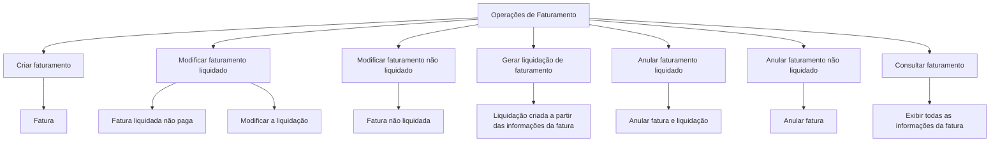
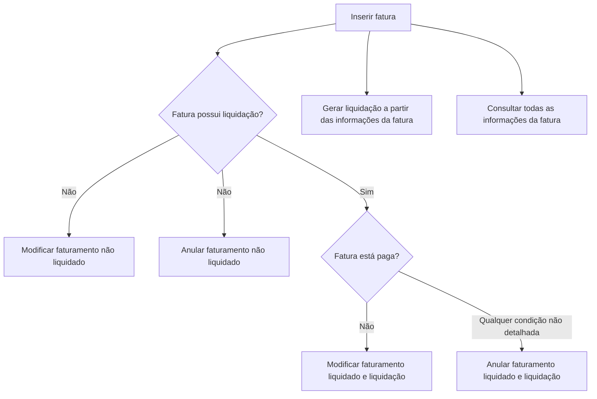

# Documentação de Operações de Sinistros (Automóvel) — Faturamento

## 1. Metadados do Documento
- **Arquivo de Origem:** Não identificado
- **Tipo de Documento:** Manual Operacional
- **Domínio / Sistema:** Operações de Sinistros (Automóvel) — Faturamento
- **Público-Alvo:** Operação, Negócio e equipes de suporte
- **Data/Versão Identificada:** Não identificada

---

## 2. Resumo Executivo & Contexto de Negócio

O documento descreve operações disponíveis para faturamento no contexto de sinistros de automóveis. As operações podem ser realizadas tanto **em linha** quanto **de forma diferida**, conforme indicado no conteúdo-fonte.

O escopo funcional abrange o ciclo de vida de uma fatura: criação, modificação, geração de liquidação, anulação e consulta. O documento diferencia explicitamente faturas liquidadas e não liquidadas, além de estabelecer que uma fatura liquidada precisa estar **não paga** para ser modificada.

A geração de liquidação é apresentada como uma operação que cria uma liquidação a partir das informações registradas na fatura. A anulação possui comportamentos distintos: para faturamento liquidado, a operação anula simultaneamente a fatura e sua liquidação; para faturamento não liquidado, a operação anula somente a fatura.

O material não especifica contratos de API, métodos HTTP, URLs operacionais, campos de entrada, regras de autorização, tecnologias, ambientes ou detalhes técnicos de integração. As referências a “Home Solutions APIs Documentation Zeus” e “CF” aparecem no conteúdo bruto, sem explicação adicional.

---

## 3. Arquitetura, Componentes & Tecnologias Envolvidas

### Componentes e referências identificadas

| Componente / Termo | Descrição sustentada pelo documento |
| :--- | :--- |
| Operações de Fatura | Conjunto de ações que podem ser executadas sobre faturas. |
| Faturamento | Domínio funcional que permite criar, modificar, liquidar, anular e consultar faturas. |
| Fatura liquidada | Fatura com liquidação associada; pode ser modificada se estiver não paga. |
| Fatura não liquidada | Fatura sem liquidação associada; pode ser modificada e anulada. |
| Liquidação | Registro que pode ser gerado a partir das informações introduzidas na fatura. |
| Sinistros (Automóvel) | Contexto de negócio identificado no título do documento. |
| Home Solutions APIs Documentation Zeus | Referência textual presente no documento, sem detalhamento funcional ou técnico. |
| CF | Sigla presente no conteúdo, sem definição contextual. |



> **Nota de Análise:** O documento descreve operações funcionais de faturamento, mas não detalha a arquitetura de software, os sistemas responsáveis, APIs, métodos HTTP, contratos JSON, persistência ou integrações.

---

## 4. Regras de Negócio, Especificações Funcionais & Processos

### Operações disponíveis

1. As operações sobre faturas podem ser realizadas **em linha** ou **de forma diferida**.
2. A operação **Criar faturamento** permite inserir uma fatura.
3. A operação **Modificar faturamento liquidado** permite alterar informações de uma fatura liquidada que ainda não tenha sido paga.
4. A modificação de uma fatura liquidada não paga envolve a modificação da respectiva liquidação.
5. A operação **Modificar faturamento não liquidado** permite alterar informações de uma fatura não liquidada.
6. A operação **Gerar liquidação de faturamento** permite criar uma liquidação com base nas informações introduzidas na fatura.
7. A operação **Anular faturamento liquidado** anula a fatura e a liquidação associada.
8. A operação **Anular faturamento não liquidado** anula a fatura.
9. A operação **Consultar faturamento** apresenta todas as informações da fatura.

### Fluxo funcional inferido estritamente das operações descritas



> **Nota de Análise:** O documento não informa se a geração de liquidação altera formalmente o estado da fatura para “liquidada”, nem define condições de pagamento, validações, permissões ou transições de estado além das descritas.

---

## 5. Tabelas de Parâmetros, Ambientes e Estruturas de Dados

| Item / Parâmetro | Descrição / Função | Tipo / Valores / Formato | Ambiente / Observações |
| :--- | :--- | :--- | :--- |
| Modalidade de execução | Forma de realizar as operações de fatura. | Em linha ou diferido. | Não há ambientes identificados. |
| Criar faturamento | Permite inserir uma fatura. | Operação funcional. | Não há campos de entrada detalhados. |
| Modificar faturamento liquidado | Permite alterar informações de fatura liquidada não paga. | Operação funcional. | Também modifica a liquidação. |
| Condição para modificação liquidada | A fatura liquidada deve estar não paga. | Regra de negócio. | O documento não define como o pagamento é identificado. |
| Modificar faturamento não liquidado | Permite alterar informações de uma fatura não liquidada. | Operação funcional. | Não há critérios adicionais descritos. |
| Gerar liquidação de faturamento | Cria uma liquidação a partir das informações introduzidas na fatura. | Operação funcional. | Não há estrutura da liquidação detalhada. |
| Anular faturamento liquidado | Anula a fatura e sua liquidação. | Operação funcional. | Não há pré-condições especificadas. |
| Anular faturamento não liquidado | Anula uma fatura sem liquidação. | Operação funcional. | Não há pré-condições especificadas. |
| Consultar faturamento | Mostra todas as informações da fatura. | Operação funcional. | Não são listados os atributos retornados. |
| Home Solutions APIs Documentation Zeus | Referência textual apresentada no documento. | Não identificado. | Sem explicação adicional. |
| CF | Sigla apresentada no documento. | Não identificado. | Sem definição adicional. |

---

## 6. Bateria de Perguntas & Respostas para RAG (FAQ Sintético)

### P1: Quais operações podem ser realizadas sobre as faturas de sinistros de automóveis?
**R:** O documento lista as operações de criar faturamento, modificar faturamento liquidado, modificar faturamento não liquidado, gerar liquidação de faturamento, anular faturamento liquidado, anular faturamento não liquidado e consultar faturamento.

### P2: As operações de faturamento são executadas somente em tempo real?
**R:** Não. O documento informa que as operações que podem ser realizadas com faturas podem ser executadas tanto em linha quanto de forma diferida.

### P3: O que permite a operação de criar faturamento?
**R:** A operação de criar faturamento permite inserir uma fatura.

### P4: Quando uma fatura liquidada pode ser modificada?
**R:** Uma fatura liquidada pode ser modificada quando estiver não paga. A operação também implica modificar a liquidação associada.

### P5: O que ocorre ao modificar uma fatura liquidada não paga?
**R:** A operação permite alterar as informações da fatura liquidada não paga, modificando também a liquidação correspondente.

### P6: O que permite a operação de modificar faturamento não liquidado?
**R:** A operação permite alterar as informações de uma fatura que não está liquidada.

### P7: Como é gerada uma liquidação de faturamento?
**R:** A liquidação é criada a partir das informações introduzidas na fatura, conforme descrito pela operação de gerar liquidação de faturamento.

### P8: Qual é o efeito de anular um faturamento liquidado?
**R:** A anulação de faturamento liquidado anula tanto a fatura quanto sua liquidação.

### P9: Qual é o efeito de anular um faturamento não liquidado?
**R:** A anulação de faturamento não liquidado anula a fatura. O documento não menciona liquidação associada nesse caso.

### P10: O que é apresentado na consulta de faturamento?
**R:** A consulta de faturamento mostra todas as informações da fatura. O documento não detalha quais campos ou atributos compõem essas informações.

### P11: O documento define APIs, métodos HTTP ou contratos de integração para operações de faturamento?
**R:** Não. Embora o conteúdo mencione “Home Solutions APIs Documentation Zeus”, não são especificados métodos HTTP, URLs, contratos JSON, autenticação, payloads ou códigos de resposta.

---

## 7. Glossário de Termos, Siglas & Conceitos-Chave

- **Faturamento:** Conjunto de operações associadas à gestão de faturas no contexto de sinistros de automóveis.
- **Fatura:** Entidade que pode ser criada, modificada, liquidada, anulada e consultada.
- **Fatura liquidada:** Fatura que possui uma liquidação associada.
- **Fatura não liquidada:** Fatura sem liquidação associada.
- **Liquidação:** Registro criado a partir das informações introduzidas na fatura.
- **Em linha:** Modalidade de execução mencionada no documento, sem detalhamento adicional.
- **Diferido:** Modalidade de execução mencionada no documento, sem detalhamento adicional.
- **CF:** Sigla presente no documento sem definição explícita.
- **Home Solutions APIs Documentation Zeus:** Referência textual presente no documento sem descrição funcional ou técnica.

---

## 8. Notas Críticas, Riscos & Limitações

- O documento não identifica o arquivo de origem, versão, data, autor ou responsável funcional.
- Não há detalhamento de sistemas, serviços, bancos de dados, APIs, URLs, ambientes, tecnologias ou mecanismos de integração.
- Não são apresentados campos de fatura, atributos de liquidação, regras de cálculo, critérios de validação, perfis de acesso ou trilhas de auditoria.
- O documento não define formalmente os estados possíveis de uma fatura nem as transições entre “não liquidada”, “liquidada”, “paga” e “anulada”.
- A condição “fatura liquidada não paga” é apresentada para modificação, mas o documento não esclarece se uma fatura liquidada paga pode ser anulada.
- As referências “CF” e “Home Solutions APIs Documentation Zeus” não possuem detalhamento adicional.

---

## 9. Conteúdo Bruto Estruturado (Referência Fiel)

```text
--- [PÁGINA 1 DE 2] ---

DOCUMENTACIÓN OPERACIONES de
SINIESTROS (Automóvil) - Facturación
Operaciones de Factura
FACTURA
Operaciones que se pueden realizar con las facturas, se pueden realizar
tanto en línea como diferido
CREAR facturación
Permite ingresar una factura
MODIFICAR facturación liquidada
Permite cambiar información de factura
liquidada no pagada, modificando la
liquidación
MODIFICAR facturación no liquidada
 GENERAR liquidación facturación
 /
 CF
Home Solutions APIs Documentation Zeus
EN


--- [PÁGINA 2 DE 2] ---

Permite cambiar información de una factura
 Permite crear una liquidación a partir de la
información introducida en la factura
ANULAR facturación liquidada
Permite anular una factura y su liquidación
ANULAR facturación no liquidada
Permite anular una factura
CONSULTAR facturación
Se muestra toda la información de la factura
```
