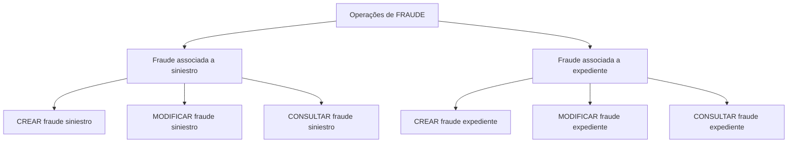

# Documentação de Operações de Sinistros (Automóvel) — Fraude

## 1. Metadados do Documento
- **Arquivo de Origem:** Não identificado
- **Tipo de Documento:** Especificação Técnica
- **Domínio / Sistema:** Operações de Fraude em Sinistros de Automóvel
- **Público-Alvo:** Desenvolvedores, Operação e Analistas Funcionais
- **Data/Versão Identificada:** Não identificada

---

## 2. Resumo Executivo & Contexto de Negócio

O documento descreve operações de fraude aplicáveis ao domínio de sinistros de automóvel. As operações permitem criar, modificar e consultar informações de fraude associadas a um sinistro ou a um expediente.

A documentação separa explicitamente o tratamento de fraude em duas entidades de negócio: **siniestro** e **expediente**. Para ambas, existem operações de criação, modificação e consulta.

O conteúdo menciona “Home Solutions APIs Documentation Zeus” e o idioma “EN”, mas não detalha integrações, métodos HTTP, contratos de API, autenticação, URLs, ambientes ou estruturas de payload.

---

## 3. Arquitetura, Componentes & Tecnologias Envolvidas

Os elementos citados são:

- Operações de **FRAUDE**.
- Entidade de negócio **siniestro**.
- Entidade de negócio **expediente**.
- Referência a **Home Solutions APIs Documentation Zeus**.
- Referência a **CF**.



> **Nota de Análise:** O documento não detalha a arquitetura técnica, protocolos, tecnologias de implementação, microsserviços, bancos de dados ou fluxos de integração das operações de fraude.

---

## 4. Regras de Negócio, Especificações Funcionais & Processos

### Operações para fraude em sinistro

1. **CREAR fraude siniestro**
   - Permite registrar uma fraude em um sinistro.

2. **MODIFICAR fraude siniestro**
   - Permite modificar as informações de fraude de um sinistro.

3. **CONSULTAR fraude siniestro**
   - Mostra toda a informação de uma fraude associada a um sinistro.

### Operações para fraude em expediente

1. **CREAR fraude expediente**
   - Permite registrar uma fraude em um expediente.

2. **MODIFICAR fraude expediente**
   - Permite modificar as informações de fraude de um expediente.

3. **CONSULTAR fraude expediente**
   - Mostra toda a informação de uma fraude associada a um expediente.

> **Nota de Análise:** O documento não informa critérios de validação, campos obrigatórios, regras de autorização, transições de estado, códigos de erro ou efeitos das operações de criação e modificação.

---

## 5. Tabelas de Parâmetros, Ambientes e Estruturas de Dados

| Item / Parâmetro | Descrição / Função | Tipo / Valores / Formato | Ambiente / Observações |
| :--- | :--- | :--- | :--- |
| CREAR fraude siniestro | Registra uma fraude em um sinistro. | Operação funcional | Não detalhado |
| MODIFICAR fraude siniestro | Modifica informações de fraude de um sinistro. | Operação funcional | Não detalhado |
| CONSULTAR fraude siniestro | Exibe todas as informações de uma fraude associada a um sinistro. | Operação funcional | Não detalhado |
| CREAR fraude expediente | Registra uma fraude em um expediente. | Operação funcional | Não detalhado |
| MODIFICAR fraude expediente | Modifica informações de fraude de um expediente. | Operação funcional | Não detalhado |
| CONSULTAR fraude expediente | Exibe todas as informações de uma fraude associada a um expediente. | Operação funcional | Não detalhado |
| Home Solutions APIs Documentation Zeus | Referência textual a uma documentação de APIs. | Referência documental | Sem URL, versão ou detalhes técnicos |
| CF | Sigla exibida no documento. | Não especificado | Significado não detalhado |
| EN | Identificador exibido no documento. | Não especificado | Possível indicação de idioma, sem confirmação textual adicional |

---

## 6. Bateria de Perguntas & Respostas para RAG (FAQ Sintético)

### P1: Quais operações de fraude estão disponíveis para um sinistro?
**R:** O documento lista três operações para fraude em sinistro: **CREAR fraude siniestro**, para registrar uma fraude; **MODIFICAR fraude siniestro**, para modificar informações de fraude; e **CONSULTAR fraude siniestro**, para mostrar toda a informação de uma fraude associada a um sinistro.

### P2: Qual operação registra uma fraude associada a um sinistro?
**R:** A operação **CREAR fraude siniestro** permite registrar uma fraude em um sinistro.

### P3: Qual operação altera informações de fraude de um sinistro?
**R:** A operação **MODIFICAR fraude siniestro** permite modificar a informação de fraude de um sinistro.

### P4: O que a operação CONSULTAR fraude siniestro apresenta?
**R:** A operação **CONSULTAR fraude siniestro** mostra toda a informação de uma fraude associada a um sinistro.

### P5: Quais operações de fraude estão disponíveis para um expediente?
**R:** O documento lista três operações para fraude em expediente: **CREAR fraude expediente**, **MODIFICAR fraude expediente** e **CONSULTAR fraude expediente**.

### P6: Como registrar uma fraude em um expediente?
**R:** O registro de fraude em um expediente é realizado pela operação **CREAR fraude expediente**.

### P7: Como modificar uma fraude registrada em um expediente?
**R:** A operação **MODIFICAR fraude expediente** permite modificar a informação de fraude de um expediente.

### P8: O que a operação CONSULTAR fraude expediente apresenta?
**R:** A operação **CONSULTAR fraude expediente** mostra toda a informação de uma fraude associada a um expediente.

### P9: O documento especifica métodos HTTP ou contratos JSON para as operações de fraude?
**R:** Não. O documento apenas apresenta os nomes e as finalidades funcionais das operações. Não há detalhamento de métodos HTTP, contratos JSON, parâmetros, respostas ou códigos de erro.

### P10: O documento identifica uma documentação de APIs relacionada às operações?
**R:** Sim. O texto menciona **“Home Solutions APIs Documentation Zeus”**, mas não fornece URL, versão, contratos ou detalhes adicionais sobre essa documentação.

---

## 7. Glossário de Termos, Siglas & Conceitos-Chave

- **FRAUDE:** Domínio funcional abordado pelas operações de criação, modificação e consulta.
- **Siniestro:** Entidade de negócio à qual uma fraude pode ser registrada, modificada ou consultada.
- **Expediente:** Entidade de negócio à qual uma fraude pode ser registrada, modificada ou consultada.
- **CF:** Sigla presente no documento, sem expansão ou definição fornecida.
- **EN:** Identificador presente no documento, sem explicação adicional.
- **Zeus:** Termo citado em “Home Solutions APIs Documentation Zeus”, sem definição adicional no conteúdo.

---

## 8. Notas Críticas, Riscos & Limitações

- O documento não identifica o arquivo de origem, autor, data, versão ou responsável.
- Não há detalhamento técnico sobre métodos HTTP, endpoints, payloads, contratos JSON, autenticação ou tratamento de erros.
- Não são apresentados parâmetros de entrada, campos de saída, regras de validação ou matrizes de permissão.
- Os significados de **CF**, **EN** e **Zeus** não são definidos no conteúdo disponível.
- Não há informação sobre ambientes, URLs, servidores, logs, dependências ou integrações externas.

---

## 9. Conteúdo Bruto Estruturado (Referência Fiel)

```text
--- [PÁGINA 1 DE 2] ---

DOCUMENTACIÓN OPERACIONES de
SINIESTROS (Automóvil) - FRAUDE
FRAUDE
Operaciones de FRAUDE
CREAR fraude siniestro
Permite registrar un Fraude en un siniestro
MODIFICAR fraude siniestro
Permite modificar la información de Fraude de
un siniestro
CREAR fraude expediente
Permite registrar un Fraude en un expediente
MODIFICAR fraude expediente
Permite modificar la información de Fraude de
un expediente
CONSULTAR fraude siniestro
 CONSULTAR fraude expediente
 / 
 CF
Home Solutions APIs Documentation Zeus
EN


--- [PÁGINA 2 DE 2] ---

Muestra toda la información de un Fraude
asociado a un siniestro
Muestra toda la información de un Fraude
asociado a un expediente
```
